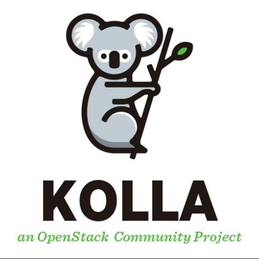
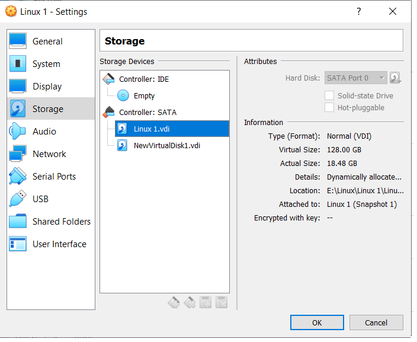
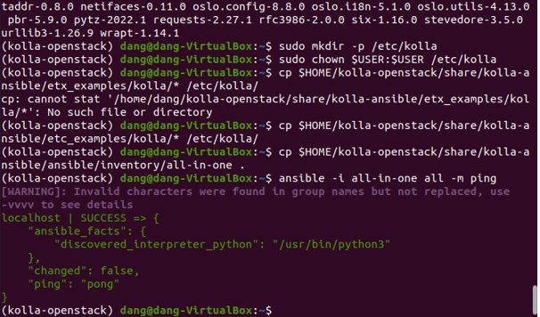
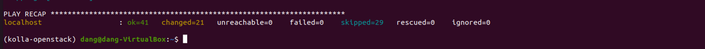
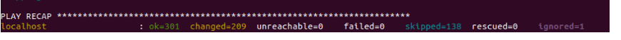
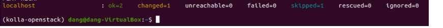
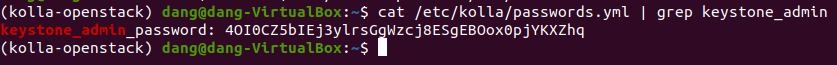
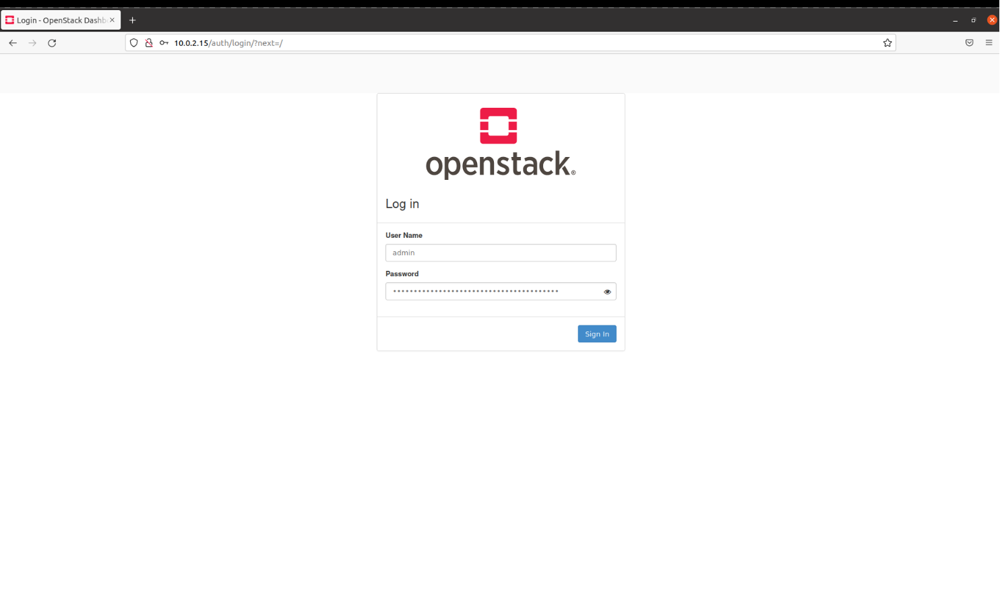
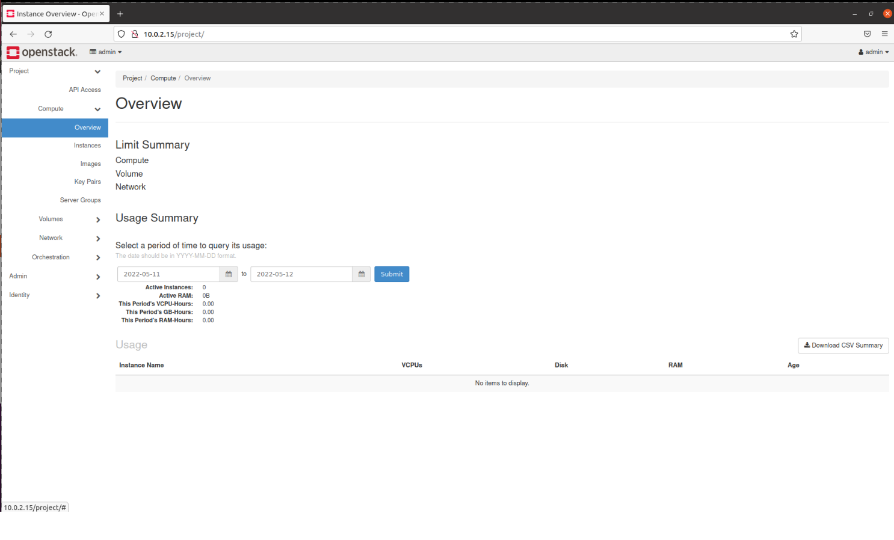

# Cài đặt OpenStack trong môi trường ảo 

## Content

- [Cài đặt OpenStack trong môi trường ảo ](#Cài-đặt-OpenStack-trong-môi-trường-ảo)
  - [Content](#content)
  - [OpenStack](#OpenStack)
  - [Cài đặt](#cài-đặt)
  - [Nguồn tham khảo](#nguồn-tham-khảo)

---

## OpenStack

### OpenStack là gì?
OpenStack là một platform điện toán đám mây nguồn mở hỗ trợ cả public clouds và private clouds. Nó cung cấp giải pháp xây dựng hạ tầng điện toán đám mây đơn giản, có khả năng mở rộng và nhiều tính năng phong phú.

Openstack cung cấp bảng điều khiển sẵn có, cung cấp cho quản trị viên quyền kiểm soát tạo ra các quyền thứ cấp cho người dùng nhằm mục đích cung cấp tài nguyên thông qua giao diện web.

### Các thành phần trong OpenStack

#### OpenStack compute-Nova:
- Module này quản lý và cung cấp máy ảo.
- Compute có thể thực h networking, CPU, storage, memory, tạo, điều khiển và xóa bỏ máy ảo, security, access control.
#### OpenStack Glance:
- OpenStack Image Service, quản lý các disk image ảo.
- Glance hỗ trợ các ảnh Raw, Hyper-V (VHD), VirtualBox (VDI), Qemu (qcow2) và VMWare (VMDK, OVF).
- Có thể tạo, xóa, cập nhật thêm các virtual disk images, cấu hình các public và private image và điều khiển việc truy cập vào chúng.
#### OpenStack Object Storage:
- Dùng để quản lý lưu trữ.
- Lưu trữ phân tán cho quản lý tất cả các dạng của lưu trữ như: archives, user data, virtual machine image.
- nhiều lớp redundancy và sự nhân bản được thực hiện tự động =>  tránh mất mát dữ liệu.
#### Identity Server:
- Dịch vụ xác thực và ủy quyền trong OpenStack.
- Quản lý xác thực cho user và projects.
#### OpenStack Netwok:
- Thành phần quản lý network cho các máy ảo.
- Cung cấp chức năng network as a service.
- Đây là hệ thống có các tính chất pluggable, scalable và API-driven.
#### OpenStack Dashboard:
- Cung cấp cho người quản trị cũng như người dùng giao diện đồ họa để truy cập, cung cấp và tự động tài nguyên cloud.
- Giúp việc thiết kế có thể mở rộng giúp dễ dàng.


### OpenStack Kolla:
Openstack Kolla là Project hay công cụ sử dụng để triển khai, vận hành Openstack. Kolla được phát hành từ phiên bản Kilo và chính thức trở thành Project Openstack.

Với ý tưởng của Project Kolla là triển khai Openstack trong môi trường Container, tự động triển khai Openstack bằng Kolla Ansible. Qua đó chỉ với 1 vài thao tác, chúng ta đã có môi trường Openstack để sử dụng. Hơn nữa, Project Kolla cũng cung cấp sẵn các giải pháp về giám sát, HA, Rolling Upgrades … cho Openstack





---

## Cài đặt
### Yêu cầu:
#### Kiến thức cơ bản:
  - [Ansible]([(https://devdocs.io/ansible~2.11/))
  - [Docker]([(https://docs.docker.com/))
#### Cấu hình máy:
 Cấu hình
  - Chuẩn bị máy ảo với hệ điều hành Ubuntu, CentOS hoặc Debian
  - CPU: 4 Core
  - RAM: 8 GB
  - Vì máy yếu nên mình chỉ cài: CPU: 2 Core, RAM: 4G.
  - Disk: 2 ổ
    - OS (sda): 128 GB
    - Data VM (sdb): 64 GB
 Tạo ổ cứng rồi mout vào máy ảo
 
 


- Cài đặt mạng với 2 network interface: enp0s3 và enp0s8

## Tiến hành cài đặt:
### Cài đặt các package cần thiết:
- Trước tiên ta update hệ điều hành 
```
sudo apt update
sudo apt upgrade
```
- Cài đặt package cần thiết 
```
sudo apt install python3-dev libffi-dev gcc libssl-dev
```
- Cài đặt môi trường ảo, ta sử virtual environment. Để cài đặt ta chạy các dòng lệnh
 ```
sudo apt install python3-venv

python3 -m venv $HOME/kolla-openstack
source $HOME/kolla-openstack/bin/activate
```
Lưu ý: Có thể cài đặt không cần môi trường ảo

- Cài đặt gói pip

```
pip install -U pip
```

- Cài đặt Ansible, Kolla Ansible ở đây mình sử dụng xena vì vậy phiên bản ansbile phù hờn là từ 2.10 đến 4 

```
pip install 'ansible<5.0'
```

- Tiếp đến ta tạo file ansible configuration

```
vim $HOME/ansible.cfg
```

    ---
    [defaults]
    host_key_checking=False
    pipelining=True
    forks=100
---

### Cài đặt Kollla-ansible:  


- Ta clone Kolla-Ansible Xena từ trên git về 

```
pip install git+https://opendev.org/openstack/kolla-ansible@stable/xena
```

- Tạo thư mục /etc/kolla

```
sudo mkdir -p /etc/kolla
sudo chown $USER:$USER /etc/kolla
```

- Copy globals.yml và passwords.yml tới đường dẫn /etc/kolla
  
```
cp $HOME/kolla-openstack/share/kolla-ansible/etc_examples/kolla/* /etc/kolla/
```
Copy inventory file all-in-one tới thư mục hiện tại
```
cp $HOME/kolla-openstack/share/kolla-ansible/ansible/inventory/all-in-one .
```

- Chạy thử 

```
ansible -i all-in-one all -m ping
```



---

### Cài đặt cấu hình Kolla-ansible: 
- Thiết lập phần vùng LVM dành cho Cinder ở ổ đĩa sdb 

```
pvcreate /dev/sdb
vgcreate cinder-volumes /dev/sdb
```

- Tạo mật khẩu mặc định 

```
kolla-genpwd
```


- Cấu hình tuỳ chọn triển khai Kolla-Ansible

```
nano /etc/kolla/globals.yml

---
kolla_base_distro: "ubuntu"
kolla_install_type: "source"
openstack_release: "xena"
kolla_internal_vip_address: 10.0.2.15
network_interface: enp0s3
neutron_external_interface: enp0s8
nova_compute_virt_type: "qemu"
enable_haproxy: "no"
enable_cinder: "yes"
enable_cinder_backup: "no"
enable_cinder_backend_lvm: "yes"
```


### Deploymet: 
*Thành công hay thất bại phụ thuộc hết vào bước này =))"

- Khởi tạo môi trường dành cho Openstack Kolla

```
kolla-ansible -i all-in-one bootstrap-servers
```



- Kiểm tra thiết lập Kolla Ansible

```
kolla-ansible -i all-in-one prechecks
```
*bước này chạy được code vui quá quên mất chụp ảnh kết quả ạ :((*

- Tải các Image Openstack

```
kolla-ansible -i all-in-one pull
```


- Cài đặt Openstack

*Bước final tiến đến thành công =))*

```
kolla-ansible -i all-in-one deploy
```




- Thiết lập File Environment Openstack

```
kolla-ansible -i all-in-one post-deploy
```



Lưu ý: Sau khi hoàn thành mỗi bước các bạn nên snapshot để tránh trường hợp lỗi có thể sảy ra 
---
### Cài  Openstack CLI

- Truy cập môi trường và cài đặt gói Openstack Client

```
pip install python-openstackclient python-glanceclient python-neutronclient
source /etc/kolla/admin-openrc.sh
```
- kiểm tra dịch vụ

```
source /etc/kolla/admin-openrc.sh
openstack token issue
```

### Đăng nhập vào Horizon

- Lấy mật khẩu tài khoản Admin

```
cat /etc/kolla/passwords.yml | grep keystone_admin
```

- Kết quả

```
keystone_admin_password: 4OI0CZ5bIEj3ylrsGgWzcj8ESgEBOox0pjYKXZhq
```



- Truy cập địa chỉ: <http://10.0.2.15/auth/login/?next=/>. Nhập các thông tin đăng nhập: Admin / 4OI0CZ5bIEj3ylrsGgWzcj8ESgEBOox0pjYKXZhq



Nhập thông tin rồi nhấn đăng nhập:



## Nguồn tham khảo
- [Tìm hiểu về OpeStack](https://viettelidc.com.vn/tin-tuc/tim-hieu-ve-openstack-nen-tang-dich-vu-may-chu-ao-viettel-start-cloud-cua-viettel-idc)
- [Hướng dẫn cài đặt OpenStack Xena bằng Kolla Ansible](https://docs.openstack.org/kolla-ansible/xena/user/quickstart.html)
- [Quick Start - Kolla Ansible](https://docs.openstack.org/devstack/pike/guides/single-vm.html)
- [Hướng dẫn cài đặt OpenStack Train bằng Kolla Ansible](https://news.cloud365.vn/openstack-kolla-phan-1-huong-dan-cai-dat-openstack-train-all-in-one-bang-kolla-ansible/)
- [LeMinhTan-OpenStack](https://github.com/vietstacker/Viettel-Digital-Talent-Program-2021/tree/main/Phase-1-Practices/Week-3/LeMinhTan/openStack)
- [TranDucLuong-OpenStack](https://github.com/vietstacker/Viettel-Digital-Talent-Program-2021/blob/main/Phase-1-Practices/Week-3/Tran-Duc-Luong/IaaS-OpenStack.md)
