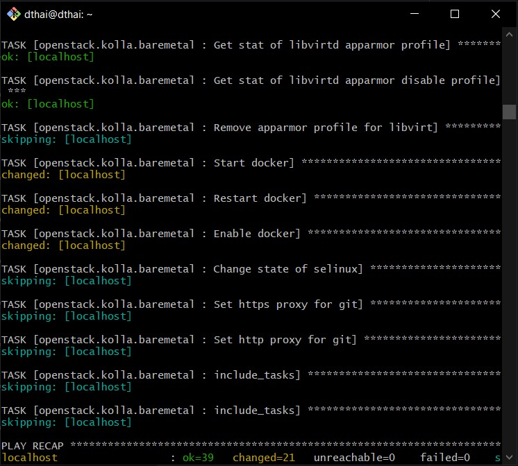
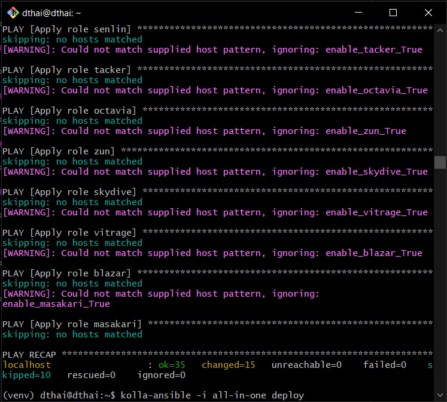
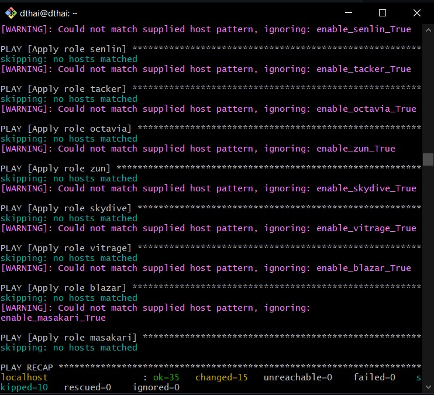
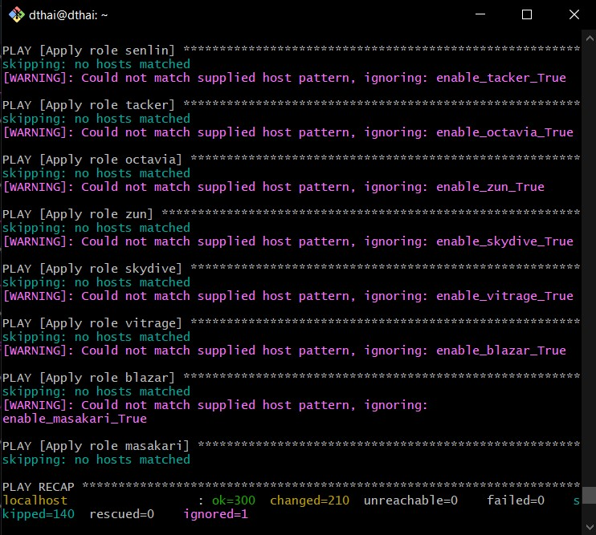

# Cài đặt OpenStack All In One bằng Kolla-Ansible
- [Cài đặt OpenStack All In One bằng Kolla-Ansible](#cài-đặt-openstack-all-in-one-bằng-kolla-ansible)
  - [I.Tổng quan](#itổng-quan)
    - [1.Openstack](#1-openstack)
    - [2.Kolla-Ansible](#2-kolla-ansible)
  - [II.Yêu cầu](#ii-yêu-cầu)
    - [1. Kiến thức](#1-kiến-thức)
    - [2. Cấu hình](#2-cấu-hình)
  - [III. Các bước tiến hành](#iii-các-bước-tiến-hành)
    - [1. Chuẩn bị](#1-chuẩn-bị)
    - [2. Cấu hình OpenStack All In One](#2-cấu-hình-openstack-all-in-one)
    - [3. Cài đặt OpenStack All In One](#3-cài-đặt-openstack-all-in-one)
    - [4. Cài đặt OpenstackClient](#4-cài-đặt-openstackclient)
  - [IV. Các lỗi gặp phải](#iv-các-lỗi-gặp-phải)
  - [V. Tài liệu tham khảo](#v-tài-liệu-tham-khảo)
## I.Tổng quan

### 1. OpenStack
Một nền tảng mã nguồn mở sử dụng các tài nguyên ảo tổng hợp để xây dựng và quản lý các cloud cá nhân và cộng đồng.


các thành phần cốt lõi
- Openstack được thiết kế theo dạng các module tạo điều kiện tích hợp mở rộng các thành phần 
  - Nova : Quản lý tài nguyên điện toán của đám mây OpenStack
  - Neutron : Quản lý và Thực hiện tất cả các cấu hình, hoạt động mạng.
  - Glance : Duy trì và Quản lý server images cho cloud
  - Keystone : Dịch vụ xác thực và ủy quyền
  - Cinder : Dịch vụ liên quan đến bộ nhớ


### 2. KOLLA-ANSIBLE
KOLLA-ANSIBLE cung cấp các vùng chứa có sẵn và các công cụ để triển khai và vận hành các đám mây OpenStack


## II.Yêu cầu

### 1. Kiến thức

- Kiến thức cơ bản về `ansible`( ansible.cfg, inventory, playbook, ...)
- Kiến thức về `docker`( images, containers, volume, ...)
- Kiến thức về `Linux`, `Networking`
- `Googling`

### 2. Cấu hình

|         | Đề xuất | Cấu hình của mình |
| ------- | ------- | ---------------- |
| CPU     | 4 cores | 2 cores          |
| RAM     | 8 GB    | 4 GB             |
| HDD     | 2 Disks | 2 Disks          |
| Network | 2 NICs  | 2 NICs           |

- Cần thêm 1 Disks phục vụ cho Cinder
- 2 NICs:
  - 1 NIC: sử dụng NAT có ip là 10.0.2.15/24 (Địa chi giao tiếp với OpenStack)
  - 1 NIC: sử dụng host only có ip là 192.168.56.105/24( Dải mạng cung cấp ip cho các VM tạo bởi OpenStack)

## III. Các bước tiến hành

### 1. Chuẩn bị

- Cài đặt các package cần thiết

  ```console
  sudo apt update
  sudo apt install python3-dev libffi-dev gcc libssl-dev lvm2
  sudo apt install python3-pip
  ```

- Cài đặt `virtualenv` ( Xem thêm tại: [VirtualEnv là gì ?](https://etuannv.com/huong-dan-su-dung-moi-truong-ao-virtual-environments-trong-python/#:~:text=Virtualenv%20l%C3%A0%20c%C3%B4ng%20c%E1%BB%A5%20cho,l%E1%BA%ADp%20cho%20t%E1%BB%ABng%20d%E1%BB%B1%20%C3%A1n.))

```console
sudo apt install python3-venv
python3 -m venv /path/to/venv
source /path/to/venv/bin/activate
```

---

**Bạn có thể thay đổi `/path/to/venv` thành đường dẫn bạn muốn**

---

- Cài đặt thêm các package cần thiết( Đang ở trong môi trường ảo)

```console
sudo pip install -U 'ansible>=4,<6'
sudo pip3 install git+https://opendev.org/openstack/kolla-ansible@stable/yoga
```

- Copy các file đã có cấu hình sẵn của kolla-ansible ra một folder `/etc/kolla`

```console
sudo mkdir -p /etc/kolla
sudo chown $USER:$USER /etc/kolla
cp -r /path/to/venv/share/kolla-ansible/etc_examples/kolla/* /etc/kolla
cp /path/to/venv/share/kolla-ansible/ansible/inventory/* .
```
- Configure `Kolla-Ansible` và `Ansible`
```
sudo mkdir -p /etc/ansible
config="[defaults]\nhost_key_checking=False\npipelining=True\nforks=100"
echo -e $config >> sudo /etc/ansible/ansible.cfg
```

### 2. Cấu hình OpenStack All In One
- Chạy lệnh ping đặc biệt để kiểm tra cấu hình
Ping thành công:


- Tạo file chứa mật khẩu

```console
kolla-genpwd
```

- Tạo phân vùng cho Cinder

```console
sudo pvcreate /dev/sdb
sudo vgcreate cinder-volumes /dev/sdb
```

- Thêm các cấu hình vào file `/etc/kolla/globals.yml`

```console 
vi /etc/kolla/globals.yml
```

```console
kolla_base_distro: "ubuntu"
kolla_install_type: "source"

network_interface: enp0s3
neutron_external_interface: enp0s8
kolla_internal_vip_address: 10.0.2.15

nova_compute_virt_type: "qemu"

enable_haproxy: "no"

enable_cinder: "yes"
enable_cinder_backup: "no"
enable_cinder_backend_lvm: "yes"

```

---

**NOTE**

- network_interface: interface giữ ip 10.0.2.15 giao tiếp với các thành phần của openstack
- neutron_external_interface: interface cung cấp ip cho các VM được tạo sau này
- kolla_internal_vip_address: địa chỉ ip giao tiếp với các thành phần của openstack, config trường này sẽ giúp tránh khỏi lỗi khi mariadb kết nối với HA proxy
- Xem thêm: `https://github.com/openstack/kolla-ansible/blob/master/etc/kolla/globals.yml`

---

### 3. Cài đặt OpenStack All In One

- Khởi tạo môi trường dành cho Openstack Kolla

```console
kolla-ansible -i all-in-one bootstrap-servers
```


- Kiểm tra thiết lập Kolla Ansible

```console
kolla-ansible -i all-in-one prechecks
```



- Tải các image cần thiết về( Chạy khá lâu do phải tải nhiều images docker về)

```console
kolla-ansible -i all-in-one pull
```


- deploy( chạy lâu hơn cả bước trước do phải chạy nhiều containers, kích hoạt nhiều dịch vụ)

```console
kolla-ansible -i all-in-one deploy
```


- post-deploy

```console
kolla-ansible -i all-in-one post-deploy
```


### 4. Cài đặt OpenstackClient

- Cài đặt các package cần thiết

```console
pip install python-openstackclient python-glanceclient python-neutronclient
```

- Chạy script sau để lấy cấu hình:

```console
source /etc/kolla/admin-openrc.sh
```

- Kiểm tra dịch vụ:

```console
openstack token issue
```

- Lấy mật khẩu để đăng nhập tài khoản admin:

```console
cat /etc/kolla/passwords.yml | grep keystone_admin
```

> Sau đó bạn có thể dùng tên đăng nhập là `admin`, mật khẩu vừa lấy được vào trang web `http://10.0.2.15/auth/login/?next=/` 

> Đăng nhập thành công!


> Tạo một instance sau khi tải image lên và tạo network, tạo flavor public


## IV. Các lỗi gặp phải

- Lỗi khi pull all-in-one 

    Lỗi này mình xử lý bằng cách update pip3
    ```console
    sudo apt install python3-pip
    ```


## V. Tài liệu tham khảo

- [Docs kolla-ansible](https://docs.openstack.org/kolla-ansible/latest/user/quickstart.html)
- [Jullian-P-Nguyen](https://github.com/vietstacker/Viettel-Digital-Talent-Program-2021/blob/main/Phase-1-Practices/Week-3/Julian-P-Nguyen/Openstack/README.md)
- [Tran-Van-Thang](https://github.com/vietstacker/Viettel-Digital-Talent-Program-2021/blob/main/Phase-1-Practices/Week-3/Tran-Van-Thang/openstack-all-in-one.md)