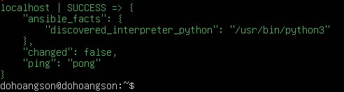
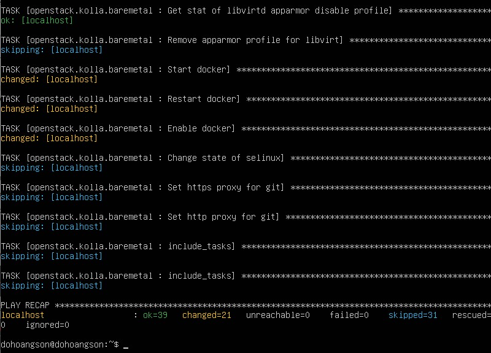
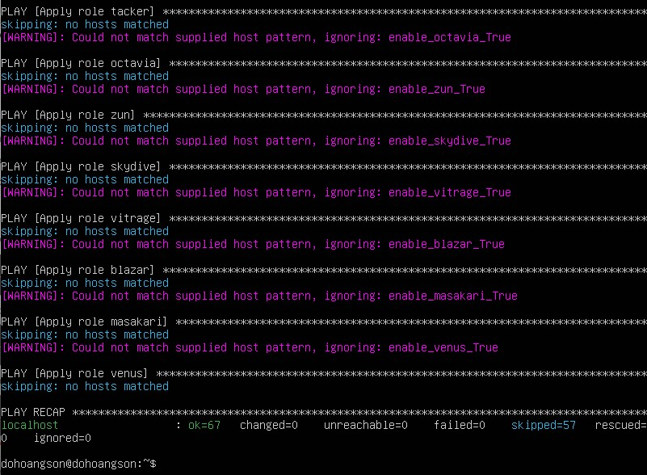
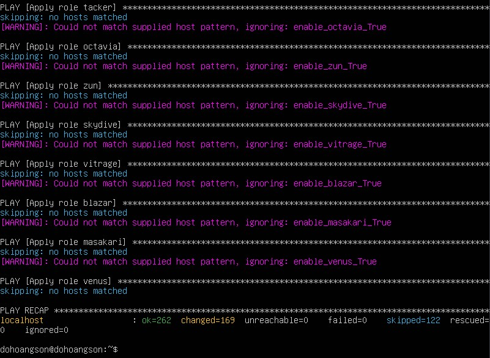
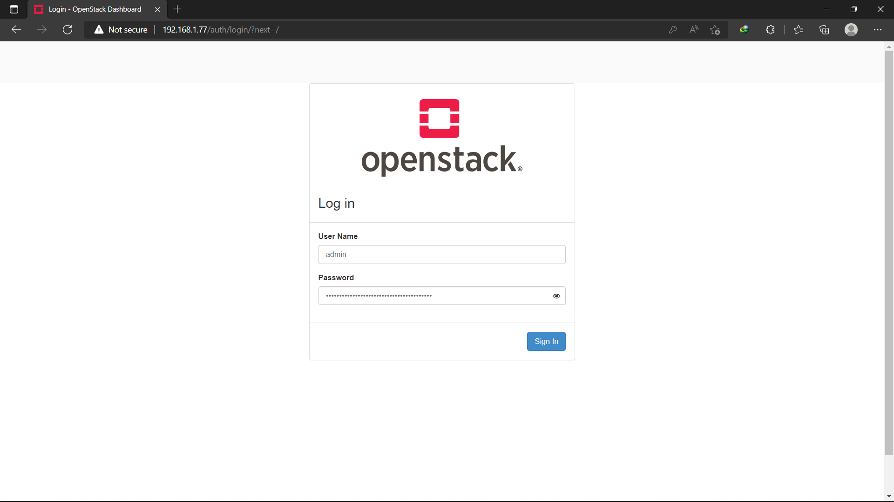
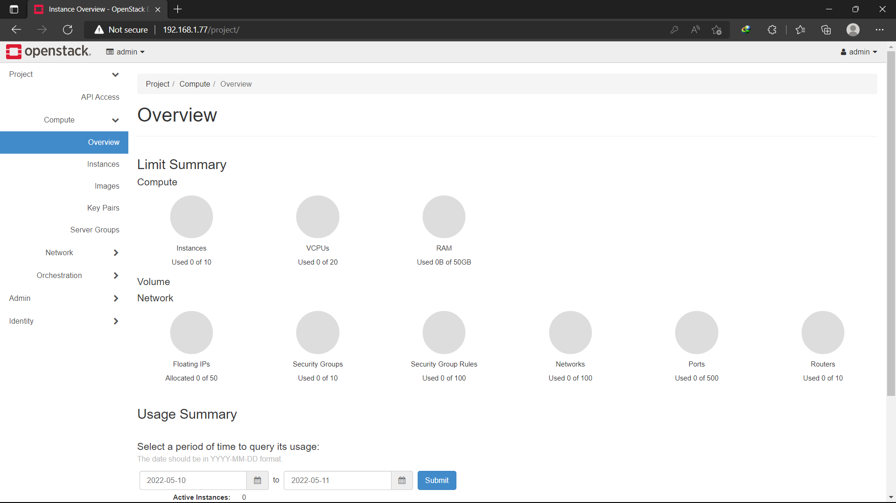

# **Setup OpenStack AIO inside VM with Kolla**
## **Table of Contents**
[**I. Requirements**](https://github.com/nhok8t1/Viettel-Digital-Talent-Program-2022/blob/main/Practice-1/DoHoangSon/README.md#i-requirements)

[**II. Step-by-step**](https://github.com/nhok8t1/Viettel-Digital-Talent-Program-2022/blob/main/Practice-1/DoHoangSon/README.md#ii-step-by-step)

   - [**1. Install dependencies**](https://github.com/nhok8t1/Viettel-Digital-Talent-Program-2022/blob/main/Practice-1/DoHoangSon/README.md#1-install-dependencies)
   - [**2. Install Kolla-ansible**](https://github.com/nhok8t1/Viettel-Digital-Talent-Program-2022/blob/main/Practice-1/DoHoangSon/README.md#2-install-kolla-ansible)
   - [**3. Install Ansible Galaxy requirements**](https://github.com/nhok8t1/Viettel-Digital-Talent-Program-2022/blob/main/Practice-1/DoHoangSon/README.md#3-install-ansible-galaxy-requirements)
   - [**4. Configure Ansible**](https://github.com/nhok8t1/Viettel-Digital-Talent-Program-2022/blob/main/Practice-1/DoHoangSon/README.md#4-configure-ansible)
   - [**5. Kolla passwords**](https://github.com/nhok8t1/Viettel-Digital-Talent-Program-2022/blob/main/Practice-1/DoHoangSon/README.md#5-kolla-passwords)
   - [**6. Kolla globals.yml**](https://github.com/nhok8t1/Viettel-Digital-Talent-Program-2022/blob/main/Practice-1/DoHoangSon/README.md#6-kolla-globalsyml)
   - [**7. Deployment**](https://github.com/nhok8t1/Viettel-Digital-Talent-Program-2022/blob/main/Practice-1/DoHoangSon/README.md#7-deployment)

[**III. Access Horizon dashboard**](https://github.com/nhok8t1/Viettel-Digital-Talent-Program-2022/blob/main/Practice-1/DoHoangSon/README.md#iii-access-horizon-dashboard)

[**IV. References**](https://github.com/nhok8t1/Viettel-Digital-Talent-Program-2022/blob/main/Practice-1/DoHoangSon/README.md#iv-references)
## **I. Requirements**
**Operating System**: Ubuntu Server (Ubuntu Server 20.04 is used in below practices).

**Desktop Hypervisor**: Oracle Virtualbox (Oracle Virtualbox 6.1.34 is used in below practices).

**VM Specifications:**
| Specification(s) | Minimal | Personal Configuration |
| ----------- | ----------- | ----------- |
|  CPU | 4 cores | 2 cores |
| RAM | 8 GB | 4 GB |
|  Disks | 2 | 1 |
| Network | 2 NICs | 2 NICs |
- 2 NICs:
    + Bridge Adapter (enp0s3): 192.168.1.77/24
    + Host-only Adapter (enp0s8): 192.168.56.105/24

## **II. Step-by-step**
### **1. Install dependencies**
- Update the package index
```
$ sudo apt update && sudo apt dist-upgrade -y
```
- Install Python build dependencies
```
sudo apt install python3-dev libffi-dev gcc libssl-dev
```
- Install `pip`
```
sudo apt install python3-pip
```
- Ensure the latest version of pip is installed
```
sudo pip3 install -U pip
```
- Install Ansible. Kolla Ansible requires at least Ansible 4 and supports up to 5
```
sudo pip install -U 'ansible>=4,<6'
```
## **2. Install Kolla-ansible**
- Install kolla-ansible and its dependencies using `pip`
```
sudo pip3 install git+https://opendev.org/openstack/kolla-ansible@master
```
- Create the /etc/kolla directory. 
```
sudo mkdir -p /etc/kolla
sudo chown $USER:$USER /etc/kolla
```
- Copy globals.yml and passwords.yml to /etc/kolla directory
```
cp -r /usr/local/share/kolla-ansible/etc_examples/kolla/* /etc/kolla
```
- Copy all-in-one and multinode inventory files to the current directory
```
cp /usr/local/share/kolla-ansible/ansible/inventory/* .
```
## **3. Install Ansible Galaxy requirements**
- Install Ansible Galaxy dependencies
```
kolla-ansible install-deps
```
## **4. Configure Ansible**
- Add the following options to the Ansible configuration file `/etc/ansible/ansible.cfg`
```
[defaults]
host_key_checking=False
pipelining=True
forks=100
```
- Check whether the configuration of inventory is correct or not, run:
```
ansible -i multinode all -m ping
```
> Ping Success:


## **5. Kolla passwords**
- Passwords used in our deployment are stored in `/etc/kolla/passwords.yml` file. All passwords are blank in this file and have to be filled either manually or by running random password generator. Run:
```
kolla-genpwd
```
## **6. Kolla globals.yml**
- globals.yml is the main configuration file for Kolla Ansible. There are a few options that are required to deploy Kolla Ansible
```
kolla_base_distro: "ubuntu"
kolla_install_type: "source"
network_interface: enp0s3
neutron_external_interface: enp0s8
kolla_internal_vip_address: 192.168.1.77
enable_haproxy: "no"
```
## **7. Deployment**
- Bootstrap servers with kolla deploy dependencies
```
kolla-ansible -i ./all-in-one bootstrap-servers
```
> Result:


- Do pre-deployment checks for hosts
```
kolla-ansible -i ./all-in-one prechecks
```
> Result:


- Finally proceed to actual OpenStack deployment
```
kolla-ansible -i ./all-in-one deploy
```
> Result:


## **III. Access Horizon dashboard**
- Use following account
    + User: admin
    + Password: Run command
```
cat /etc/kolla/passwords.yml | grep -i keystone_admin_password
```
> OpenStack Login Page:


> OpenStack Dashboard:


## **IV. References**
- [Official Document of `Kolla Ansible` - Deploy All-in-one OpenStack](https://docs.openstack.org/kolla-ansible/latest/user/quickstart.html)
- [Deploy All-In-One Openstack using Kolla-Ansible project](https://www.youtube.com/watch?v=b-XgSPuedro)
