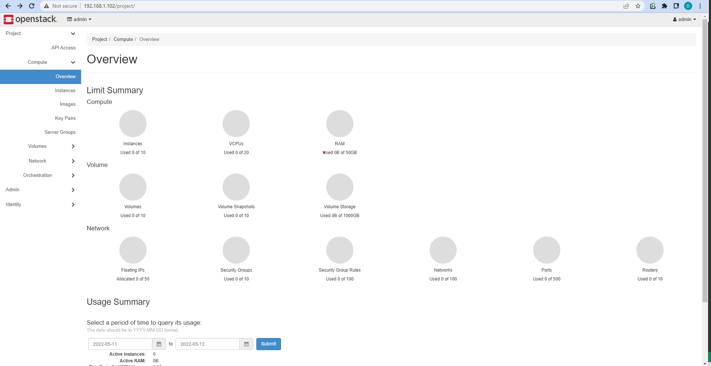

# **Cài đặt Openstack All-in-one bằng Kolla Ansible**
## **Table of Contents**

- [I. Tổng quan ](#overview)   
   - [1. Openstack](#openstack)           
   - [2. Kolla-Ansible](#kolla-ansible)

- [II. Cài đặt Ubuntu trên VirtualBox](#ubuntu-vbox)  
    - [1. Tạo máy ảo](#create_vm)
    - [2. Cài đặt máy ảo](#setting_vm)

- [III. Yêu cầu](#requierement)   
   - [1. Kiến thức cơ sở](#base_knowledge)      
   - [2. Cấu hình](#configuration)
       
- [IV. Các bước thực hiện cài đặt Openstack All-in-one bằng Kolla Ansible](#steps)        
   - [1. Cài đặt các dependencies](#install_dependencies)    
   - [2. Cài đặt Kolla-ansible](#install_kolla_ansible)       
   - [3. Cấu hình Kolla-ansible](#config_kolla_ansible)                 
   - [4. Cấu hình Openstack All-in-one](#config_openstack)   
   - [5. Triển khai](#deploy)     
   - [6. Đăng nhập Horizon](#login)   
- [Tài liệu tham khảo](#refs)             
----  

## I. Tổng quan
<a name='overview'></a >      

### 1. Openstack
<a name='openstack'></a >  

   


#### a) Tổng quan về Openstack
Theo `IBM`, một phần mềm mã nguồn mở cho phép triển khai và quản lý cơ sở hạ tầng đám mây dưới dạng nền tảng dịch vụ (IaaS). OpenStack hỗ trợ cả triển khai cả private clould và public cloud. Nó đáp ứng hai yêu cầu chính của đám mây: khả năng mở rộng lớn và sự đơn giản trong việc triển khai.

#### b) Các thành phần trong Openstack
Openstack bao gồm một số thành phần cơ bản như sau:

   

- ##### Identity (Keystone): thực hiện xác thực và ủy quyền tất cả các dịch vụ khác của OpenStack. Nó cũng là endpoints cho tất cả các dịch vụ khác.

- ##### Compute (Nova): có quyền quản lý và truy cập tới các nhóm tài nguyên của Openstack như xử lý lập lịch, tạo, xóa.

- ##### Networking (Neutron): làm kết nối mạng qua các dịch vụ OpenStack khác.

- ##### Block storage (Cinder): cung cấp khả năng lưu trữ khối liên tục có thể truy cập thông qua API tự phục vụ.

- ##### Object storage (Swift): là một dịch vụ lưu trữ đối tượng có khả năng chịu lỗi cao, lưu trữ và truy xuất các đối tượng dữ liệu phi cấu trúc bằng cách sử dụng RESTFUL API.

- ##### Image service (Glance): là một dịch vụ lưu trự và truy xuất các image của ổ đĩa ảo từ nhiều nơi khác nhau.


### 2. Kolla Ansible
<a name='kolla-ansible'></a >  

- Kolla-ansible là một công cụ để triển khai và vận hành Openstack thông qua việc cung cấp các containers và công cụ đã được xây dựng sẵn.

```
To provide production-ready containers and deployment tools for operating OpenStack clouds.
```

- Kiến trúc của kolla-ansible bao gồm một số thành phần cơ bản như sau theo [Kolla Ansible](https://github.com/openstack/kolla-ansible):

    -   [Collectd](https://collectd.org/),
    [Telegraf](https://docs.influxdata.com/telegraf/),
    [InfluxDB](https://www.influxdata.com/products/influxdb-overview/),
    [Prometheus](https://prometheus.io/), and
    [Grafana](https://grafana.com/) for performance monitoring.
    
    -   [Elasticsearch](https://www.elastic.co/de/products/elasticsearch/)
        and [Kibana](https://www.elastic.co/de/products/kibana/) to search,
        analyze, and visualize log messages.
    -   [Etcd](https://etcd.io/) a distributed reliable key-value store.
    -   [Fluentd](https://www.fluentd.org/) as an open source data collector
        for unified logging layer.
    -   [Gnocchi](https://gnocchi.osci.io/) A time-series storage database.
    -   [HAProxy](https://www.haproxy.org/) and
        [Keepalived](https://www.keepalived.org/) for high availability of
        services and their endpoints.
    -   [MariaDB and Galera
        Cluster](https://mariadb.com/kb/en/mariadb/galera-cluster/) for
        highly available MySQL databases.
    -   [Memcached](https://memcached.org/) a distributed memory object
        caching system.
    -   [Open vSwitch](https://openvswitch.org/) and Linuxbridge backends
        for Neutron.
    -   [RabbitMQ](https://www.rabbitmq.com/) as a messaging backend for
        communication between services.
    -   [Redis](https://redis.io/) an in-memory data structure store.
    -   [Zookeeper](https://zookeeper.apache.org/) an open-source server
        which enables highly reliable distributed coordination.


## II. Cài đặt Ubuntu trên VirtualBox
<a name='ubuntu-vbox'></a >  

### 1. Tạo máy ảo
<a name='create_vm'></a >  

- Setup hệ điều hành mà mình muốn cài. Trong bài tập này, hệ điều hành được chọn là Ubuntu (64-bit):

  
 
- Lựa chọn kích cỡ cho RAM, trong bài tập này mực RAM được phân vùng cho máy ảo là 8 GB(8192 MB):

   

- Lựa chọn tạo ổ cứng ảo cho máy ảo:

   

- Lựa chọn loại file cho ổ cứng ảo, có 3 loại file như sau:
    - VDI: là file image của ổ đĩa ảo sử dụng cho ứng dụng  Oracle VM VirtualBox.
    - VHD: đây là loại file có chưa image của ổ đĩa cứng ảo được sử dụng bởi phần mềm ảo hóa Microsoft Windows Virtual PC. Nó lưu trữ nội dung của ổ đĩa cứng của máy ảo bao gồm các phân vùng ổ cứng, hệ thống file, các file và folder
    - VMDK: là file image của ổ đĩa ảo sử dụng cho ứng dụng ảo hóa VMware, lưu trữ nội dung của ổ cứng máy ảo VMware.

   

- Lựa chọn chế độ kích thước của ổ đĩa ảo:
    - Nếu chọn `Dynamic allocated` thì ổ đĩa ảo sẽ tự động mở rộng dung lượng khi hết, tuy nhiên sẽ không thu lại dung lượng khi còn trống dung lượng

    - Nếu chọn `Fixed size` thì ổ đĩa sẽ giữ nguyên dung lượng

  

- Sau đó mọi người đợi một lúc nhé :D

   

### 2. Cài đặt máy ảo
<a name='setting_vm'></a >  

- Phân vùng CPU cho máy ảo: trong demo này mình phân vùng 4 CPU cho máy ảo:

   


- Cài đặt Network Interface Controller cho máy ảo: 

Với NIC1, mode được sử dụng là `Bridged Adapter`. Mode này được sử dụng để kết nối adapter của mạng ảo tới mạng vật lý mà apapter mạng vật lý của máy host kết nối tới. Mạng của máy ảo lúc này sẽ sử dụng giao diện mạng của máy host cho kết nối mạng. 

   

Với NIC2, mode được sử dụng là `Host-only Adapter`. Mode này được sử dụng cho việc giao tiếp giữa các máy ảo với nhau, và máy ảo với máy host. Trong mode này, VirtualBox sẽ không sử dụng adapter của mạng vật lý trên máy host mà thay vào đó tạo một hoặc nhiều adapter ảo cho việc kết nối giữa máy host và các máy ảo được tạo ra tên VirtualBox của máy host.


- Thêm iso file của hệ điều hành:


- Tạo thêm ổ cứng ảo để sử dụng cho phân vùng Cinder:

  


  

  

  

- Cấu hình VirtualBox sau khi hoàn thành:

   
## III. Yêu cầu
<a name='requierement'></a >      

### 1. Kiến thức cơ sở
<a name='base_knowledge'></a >      

- Kiến thức cơ bản về Ansible.

- Kiến thức cơ bản về Docker.

- Kiến thức cơ bản về Linux và Mạng máy tính.

### 2. Cấu hình
<a name='configuration'></a >      

### **Phiên bản Openstack cài đặt:** `Xena`

- Hệ điều hành: Có thể lựa chọn một trong hệ điều hành dưới đây
    - Ubuntu Server (**Ubuntu 20.04** - đây là hệ điều hành được sử dụng trong demo này: [Download Ubuntu Server](https://ubuntu.com/download/server))
	- CentOS 7: [Download CentOS7](https://www.centos.org/download/) 

||Đề xuất|Cấu hình trong demo|     
|----|----|----|    
|CPU| 4 cores| 4 cores|   
|RAM| 8GB| 8GB|    
|HDD| 2 Disks| 2 Disks|   
|Network| 2 NICs| 2 NICs|   

- Phân vùng ổ đĩa ảo: 
    - `sda`: 30.67GB cho hệ điều hành 
    - `sdb`: 20GB cho Cinder

   

- Network interface controller:
    - NIC1: `enp0s3 - 192.168.1.102/24 `
    - NIC2: `enp0s8 - 192.168.56.101/24`

## IV. Các bước thực hiện cài đặt Openstack All-in-one bằng Kolla Ansible
<a name='steps'></a >      

### 1. Cài đặt các dependencies
<a name='install_dependencies'></a >      

- Đầu tiên cập nhật chỉ mục các package
```
$ sudo apt update 
```

- Sau đó cài đặt các package cần thiết

```
$ sudo apt install python3-dev libffi-dev gcc libssl-dev
```

- Tiếp theo ta tiến hành cài đặt môi trường ảo. Việc sử dụng môi trường ảo sẽ giúp tách biệt các môi trường của nhiều project khác nhau nhằm ngăn sự xung đột giữa các project. Công cụ sử dụng để tạo môi trường ảo là python3-venv.

```
$ sudo apt install python3-venv
```

- Sau khi cài đặt thư viện, tiến hành tạo môi trường ảo:

```
$ python3 -m venv /path/to/venv
```

Trong đó `/path/to/venv` là đường dẫn tới thư mục định nghĩa ra môi trường ảo, trong đó có chứa các file thực thi của Python và module pip (module để cài đặt các package và module khác). Đường này tùy chỉnh theo ý muốn.

- Sau khi tạo môi trường ảo, tiến hành kích hoạt môi trường ảo. 

```
$ source /path/to/venv/bin/activate      
```

- Cần đảm bảo phiên bản mới nhất của pip được tải: 

```
$ pip install -U pip
```

- Sau đó ta tiến hành tải Ansible. Do phiên bản Openstack dự định được tải là `Xena`, do đó phiên bản Ansible yêu cầu từ 2.10 tới phiên bản 4.

```
# pip install 'ansible<5.0'
```

### 2. Cài đặt Kolla-ansible
<a name='install_kolla_ansible'></a >      

- Tiến hành tải về kolla-ansible

```
$ pip install git+https://opendev.org/openstack/kolla-ansible@stable/xena
```

- Tiếp theo tạo một thư mục mới `/etc/kolla`

```
$ sudo mkdir -p /etc/kolla
$ sudo chown $USER:$USER /etc/kolla
```

- Copy file `global.yml` và `password.yml` từ trong gói `kolla-ansible` trong môi trường ảo tới thư mục vừa tạo `/etc/kolla`:

```
$ cp -r /path/to/venv/share/kolla-ansible/etc_examples/kolla/* /etc/kolla
```

- Copy file `all-in-node` và `multinode` trong thư mục `inventory` tới thư mục hiện tại:

```
$ cp /path/to/venv/share/kolla-ansible/ansible/inventory/* .
```

### 3. Cấu hình ansible
<a name='config_kolla_ansible'></a >      

- Tạo thư mục mới chứa file cấu hình Ansible `/etc/ansible`:

```
$ sudo mkdir /etc/ansible
```

- Tiến hành mở file `ansible.cfg` bằng trình edit:

```
$ sudo gedit /etc/ansible/ansible.cfg
```

- Sau đó nhập nội dung cấu hình như sau:

```
[defaults]
host_key_checking=False
pipelining=True
forks=100
```

### 4. Cấu hình Openstack All-in-one
<a name='config_openstack'></a >      

- Đầu tiên kiểm tra xem liệu cấu hình inventory đã chính xác hay chưa:

```
$ ansible -i all-in-one all -m ping
```

Kết quả: 

   

- Tiếp theo là generate mật khẩu sử dụng cho quá trình triển khai. Các mật khẩu này được lưu ở file `/etc/kolla/passwords.yml`. Ban đầu các mật khẩu này đều trống. Để tự động sinh ra mật khẩu ngẫu nhiên và tự động điền cho các trường trong file này, chạy lệnh:

```
$ kolla-genpwd
```

- Tạo phân cùng cho `Cinder`:

```
$ sudo pvcreate /dev/sdb  
$ sudo vgcreate cinder-volumes /dev/sdb  
```


- Tiếp theo là cấu hình file `/etc/globals.yml` :

```
kolla_base_distro: "ubuntu"
kolla_install_type: "source"

network_interface: enp0s3
neutron_external_interface: enp0s8
kolla_internal_vip_address: 192.168.1.102

nova_compute_virt_type: "qemu"

enable_haproxy: "no"

enable_cinder: "yes"
enable_cinder_backup: "no"
enable_cinder_backend_lvm: "yes"
```

### 5. Triển Khai
<a name='deploy'></a >      

- Khởi tạo môi trường dành cho Openstack Kolla:

```
$ kolla-ansible -i all-in-one bootstrap-servers   
```

Kết quả:

   

- Tiếp theo kiểm tra thiết lập Kolla Ansible:

```
$ kolla-ansible -i all-in-one prechecks   
```

Kết quả:

   

- Triển khai OpenStack:

```
$ kolla-ansible -i all-in-one deploy 
```

Kết quả:

   

- Thiết lập file Environment Openstack:

```
$ kolla-ansible -i all-in-one post-deploy   
```
Kết quả:

    

### 6. Đăng nhập Horizon
<a name='login'></a >      

- Lấy mật khẩu để đăng nhập tài khoản admin:  
```    
$ cat /etc/kolla/passwords.yml | grep keystone_admin    
```

Kết quả: 

   

- Truy cập vào địa chỉ `http://192.168.1.102/auth/login/?next=/project/` để đăng nhập. Trong đó: 

    - `username` : admin
    - `password` : OZ7RfrjKyb7dRjUQJBr9wWApR8NL6gqQBG4eSCuH

   

- Sau khi đăng nhập thành công:

   


## Tài liệu tham khảo
<a name='refs'></a >      

[1] https://docs.openstack.org/kolla-ansible/xena/user/quickstart.html
 
[2] https://github.com/inc0/kolla-ansible-workshop/blob/master/chapter1.md

[3] https://docs.python.org/3/library/venv.html

[4] https://www.nakivo.com/blog/virtualbox-network-setting-guide/#:~:text=Port%20Forwarding%20section.-,Bridged%20Adapter,interface%20for%20a%20network%20connection.

[5] https://github.com/vietstacker/Viettel-Digital-Talent-Program-2021/blob/main/Phase-1-Practices/Week-3/Julian-P-Nguyen/Openstack/README.md

[6] https://www.redhat.com/en/topics/openstack

[7] https://www.ibm.com/blogs/cloud-computing/2014/08/06/quick-overview-openstack-technology/