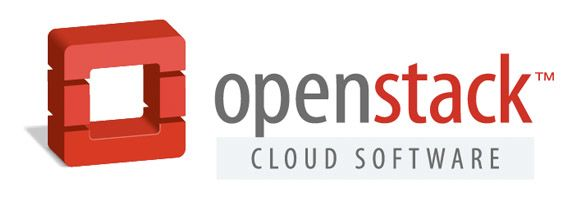
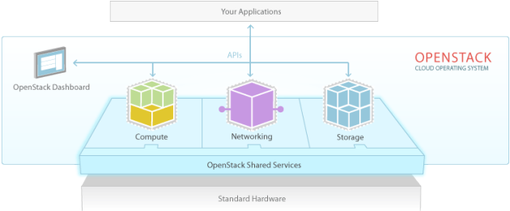
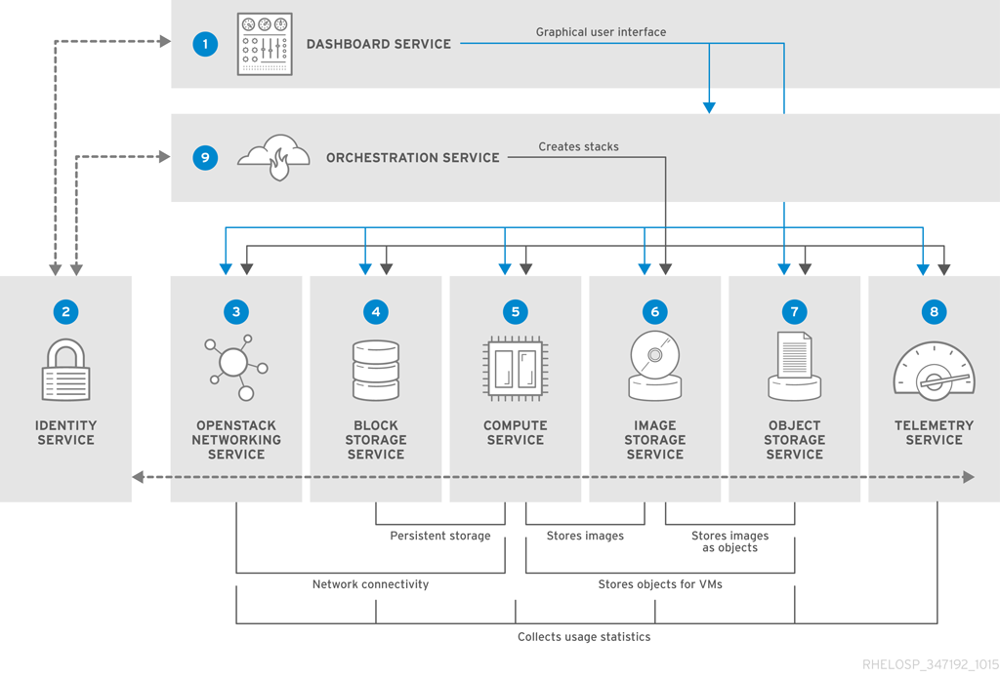
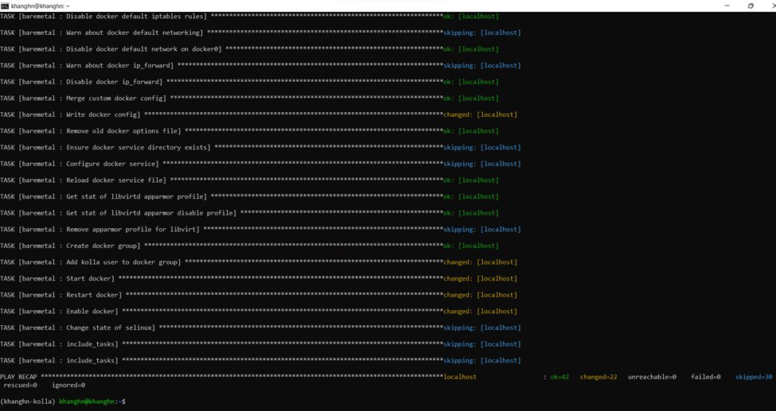
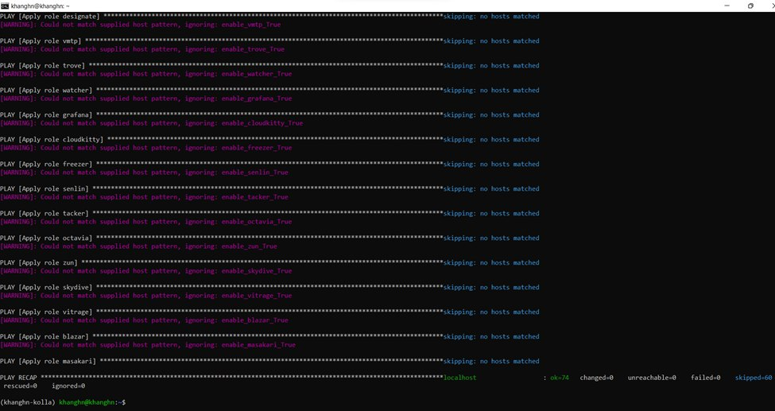
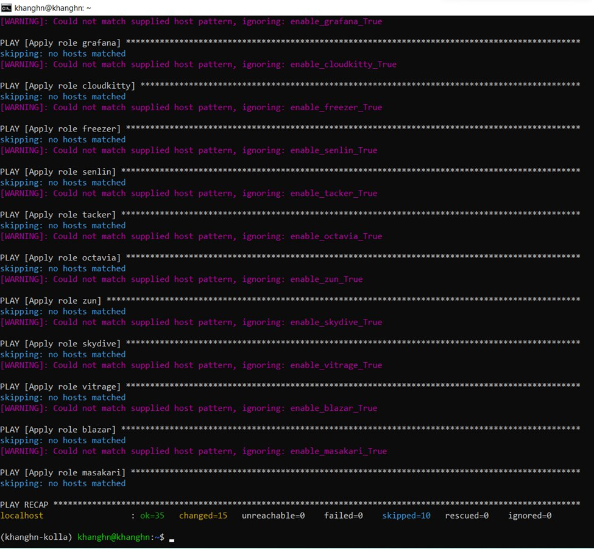
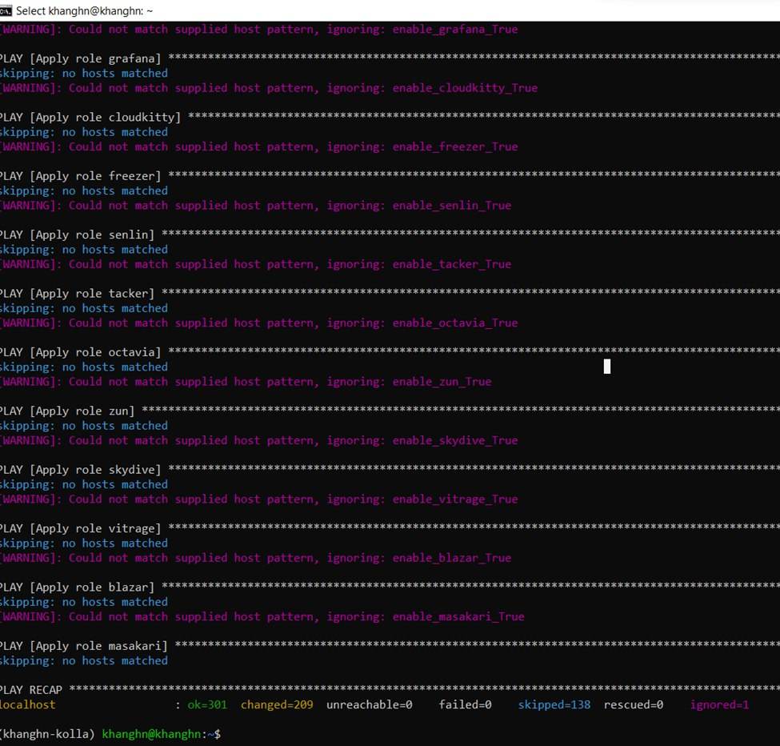
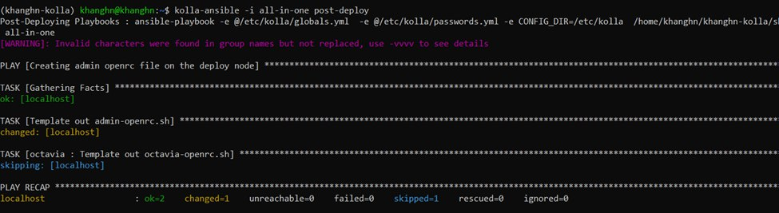
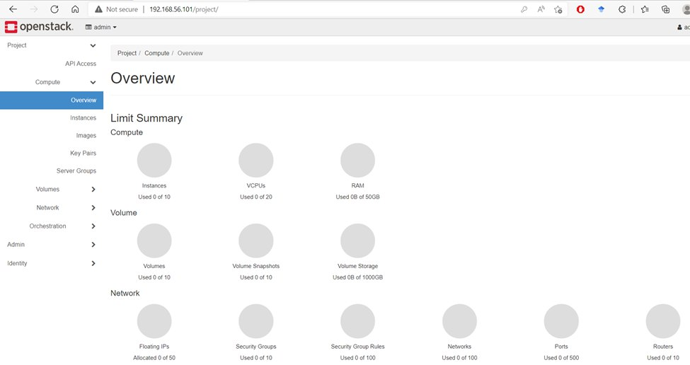

# VIETTEL-DIGITAL-TALENT-CLOUD-HOMEWORK-WEEK-2    
 
----   
## Cài đặt OpenStack All-In-One bằng Kolla-Ansible        
# Mục lục         
- [I. Overview](#overview)   
   - [1. Openstack](#openstack)           
   - [2. Kolla-Ansible](#kolla-ansible)                  
- [II. Yêu cầu](#yêu_cầu)   
   - [1. Kiến thức](#kiến_thức)      
   - [2. Cấu hình](#cấu_hình)       
         
- [III. Các bước thực hiện](#các_bước_thực_hiện)        
   - [1. Thiết lập môi trường ](#thiết_lập_môi_trường)    
   - [2. Cấu hình Openstack All In One](#cấu_hình_openstack_all_in_one)       
   - [3. Cài đặt Openstack All In One](#cài_đặt_openstack_all_in_one)                 
   - [4. Đăng nhập vào Horizon ](#đăng_nhập_vào_Horizon)          
- [IV. Tài liệu tham khảo](#Tài_liệu_tham_khảo)             

----  
<a name='overview'></a>       

## I. Overview      

<a name='openstack'></a >      

### 1. Openstack 
  
<a name='kolla-ansible'></a>

### OpenStack là gì?
OpenStack là một platform điện toán đám mây nguồn mở hỗ trợ cả public clouds và private clouds. Nó cung cấp giải pháp xây dựng hạ tầng điện toán đám mây đơn giản, có khả năng mở rộng và nhiều tính năng phong phú.



Openstack cung cấp bảng điều khiển sẵn có, cung cấp cho quản trị viên quyền kiểm soát tạo ra các quyền thứ cấp cho người dùng nhằm mục đích cung cấp tài nguyên thông qua giao diện web.

### Các thành phần trong OpenStack



#### OpenStack compute-Nova:
- Module này quản lý và cung cấp máy ảo.
- Compute có thể thực h networking, CPU, storage, memory, tạo, điều khiển và xóa bỏ máy ảo, security, access control.
#### OpenStack Glance:
- OpenStack Image Service, quản lý các disk image ảo.
- Glance hỗ trợ các ảnh Raw, Hyper-V (VHD), VirtualBox (VDI), Qemu (qcow2) và VMWare (VMDK, OVF).
- Có thể tạo, xóa, cập nhật thêm các virtual disk images, cấu hình các public và private image và điều khiển việc truy cập vào chúng.
#### OpenStack Object Storage:
- Dùng để quản lý lưu trữ.
- Lưu trữ phân tán cho quản lý tất cả các dạng của lưu trữ như: archives, user data, virtual machine image.
- nhiều lớp redundancy và sự nhân bản được thực hiện tự động =>  tránh mất mát dữ liệu.
#### Identity Server:
- Dịch vụ xác thực và ủy quyền trong OpenStack.
- Quản lý xác thực cho user và projects.
#### OpenStack Netwok:
- Thành phần quản lý network cho các máy ảo.
- Cung cấp chức năng network as a service.
- Đây là hệ thống có các tính chất pluggable, scalable và API-driven.
#### OpenStack Dashboard:
- Cung cấp cho người quản trị cũng như người dùng giao diện đồ họa để truy cập, cung cấp và tự động tài nguyên cloud.
- Giúp việc thiết kế có thể mở rộng giúp dễ dàng.




### OpenStack Kolla:
Openstack Kolla là Project hay công cụ sử dụng để triển khai, vận hành Openstack. Kolla được phát hành từ phiên bản Kilo và chính thức trở thành Project Openstack.

Với ý tưởng của Project Kolla là triển khai Openstack trong môi trường Container, tự động triển khai Openstack bằng Kolla Ansible. Qua đó chỉ với 1 vài thao tác, chúng ta đã có môi trường Openstack để sử dụng. Hơn nữa, Project Kolla cũng cung cấp sẵn các giải pháp về giám sát, HA, Rolling Upgrades … cho Openstack


### 2. Kolla - Ansible    
- `Openstack Kolla` là Project hay tools sử dụng để triển khai, vận hành Openstack.    
- Mục đích: sẵn sàng cung cấp `container` và `tools` để triển khai, vận hành clouds Openstack.  
- `Project Kolla` cung cấp sẵn các giải pháp bao gồm: `Monitoring`, `Rolling upgrades`, `HA`, etc.     

<a name='yêu_cầu'></a>    

## II. Requirements     
<a name='kiến_thức'></a>        

### 1. Kiến thức   
- Kiến thức cơ bản về `ansible` (ansible.cfg, iventory, Playbook, Role, Task, etc...), đọc thêm tại [ansible](https://viblo.asia/p/phan-1-tim-hieu-ve-ansible-4dbZNxv85YM)       
- Kiến thức về `docker` (images, containers, volume, etc...), đọc thêm tại  [docker](https://viblo.asia/p/tim-hieu-ve-docker-RnB5p1JdKPG#:~:text=Docker%20l%C3%A0%20m%E1%BB%99t%20n%E1%BB%81n%20t%E1%BA%A3ng,l%C3%BD%20%E1%BB%A9ng%20d%E1%BB%A5ng%20c%E1%BB%A7a%20m%C3%ACnh.)

<a name='cấu_hình'></a>    

### 2. Cấu hình      
### Openstack Release: `Xena`   
- `Operating System (OS)`: Ubuntu 20.04 Server   
-  `Desktop Hypervisior`: VirtualBox 

||Đề xuất|Cấu hình máy ảo mình|     
|----|----|----|    
|CPU| 4 cores| 6 cores|   
|RAM| 8GB| 4GB|    
|HDD| 2 Disks| 2 Disks|   
|Network| 2 NICs| 2 NICs|    

- `Disks`  
  - `sda`: 100GB - for the OS   
  - `sdb`: 50GB - for Clinder LVM - `block storage component of Openstack`       

***Note: Hướng dẫn cách thêm disk mới vào VM trong VirtualBox*** [tại đây](https://vdodata.vn/huong-dan-tao-o-dia-ao-cho-may-ao-chay-tren-virtualbox/#:~:text=%C4%90%E1%BB%83%20t%E1%BA%A1o%20%E1%BB%95%20%C4%91%C4%A9a%20m%E1%BB%9Bi,d%E1%BA%A1ng%20l%C3%A0%20vmdk%20ho%E1%BA%B7c%20vdi.)        

- `Networks`: 2 NICs                
  - 1 NIC: sử dụng host only có IP là `enp0s8 - 192.168.56.101/24` (Dải mạng sử dụng cho API của Openstack và MNGT Network)        
  - 1 NIC: sử dụng NAT có IP là  ` enp0s3 - 10.0.2.15/24` (Địa chỉ giao tiếp với Openstack, dải này VM ra vào Internet)                  

<a name='các_bước_thực_hiện'></a>  

## III. Step-by-step implements    
<a name='thiết_lập_môi_trường'></a>    

### 1. Create environment:    

#### 1.1 `Update` & `Install` các package cần thiết 

```    
$ sudo apt update -y    
$ sudo apt install python3-dev libffi-dev gcc libssl-dev lvm2 -y 
```  

#### 1.2 Cài đặt `virtualenv`             
```  
$ sudo apt install python3-venv -y   
```     
- Tạo `virtualenv` và kích hoạt    
```  
$ python3 -m venv /path/to/venv
$ source /path/to/venv/bin/activate         
```            
 
- Cài đặt phiên bản sớm nhất của `pip`    
```   
$ pip install -U pip   
```     

#### 1.3 Cài đặt `Ansible` & `Kolla Ansible`     
   - Install `Ansible`:  
```   
$ pip install 'ansible<5.0'     
```   
   - Install `Kolla-ansible`:   
```   
$ pip install git+https://opendev.org/openstack/kolla-ansible@stable/xena        
```      

- Cài Openstack Xena

#### 1.4 Cấu hình `Kolla-Ansible` & `Ansible`   
- Tạo thư mục `/etc/kolla`        
```   
$ sudo mkdir -p /etc/kolla
$ sudo chown $USER:$USER /etc/kolla      
```   
- Copy `globals.yml` và `passwords.yml` đến thư mục `/etc/kolla`   
```   
$ cp -r /path/to/venv/share/kolla-ansible/etc_examples/kolla/* /etc/kolla  
```    
- Copy file inventory `all-in-one` đến thư mục hiện tại.    
``` 
$ cp /path/to/venv/share/kolla-ansible/ansible/inventory/* .
```   

- Cấu hình `Ansible`   
```    
$ sudo mkdir -p /etc/ansible    
$ sudo vi /etc/ansible/ansible.cfg     
```   
- Thêm vào file `ansible.cfg` content như sau:   
```  
[defaults]
host_key_checking=False
pipelining=True
forks=100 
```   

<a name='cấu_hình_openstack_all_in_one'></a>  

## 2. Configuration Openstack All In One   

- Tạo file chứa mật khẩu    
```  
$ kolla-genpwd   
```    
- Tạo phân vùng cho `Cinder`   
```   
$ sudo pvcreate /dev/sdb  
$ sudo vgcreate cinder-volumes /dev/sdb   
```  
- Thêm các cấu hình vào file `/etc/kolla/globals.yml`. 
```
$ vim /etc/kolla/globals.yml
```
```   
kolla_base_distro: "ubuntu"  
kolla_install_type: "source"    

network_interface: "enp0s8"   
neutron_external_interface: enp0s3    
kolla_internal_vip_address: 192.168.56.101         

nova_compute_virt_type: "qemu" 
enable_haproxy: "no"  

enable_cinder: "yes"
enable_cinder_backup: "no"  
enable_cinder_backend_lvm: "yes"     
```
- Sau khi INSERT config cho Cinder, `Esc` ra ngoai   
```
:wq
```
- Trong đó:        
  - `kolla_install_type`: Mã nguồn sử dụng khi deploy Openstack có 2 loại:  
      - Cài từ Source Code: `source`   
      - Cài từ File binary: `binary`   
  - `network_interface`: Interface  giữ IP giao tiếp với các thành phần của openstack.     
  - `neutron_external_interface`: interface dải Provider cung cấp IP cho các VM Openstack được tạo sau này.     
  - `kolla_internal_vip_address`: địa chỉ ip giao tiếp với các thành phần của openstack, config trường này sẽ tránh bị lỗi khi mariadb kết nối với ha proxy      
  
<a name='cài_đặt_openstack_all_in_one'></a>    

## 3. Install Openstack All In One   

- Khởi tạo môi trường dành cho Openstack Kolla   
```   
$ kolla-ansible -i all-in-one bootstrap-servers   
```   

   

- Kiểm tra thiết lập Kolla Ansible     
```   
$ kolla-ansible -i all-in-one prechecks   
```        

    

- Tải các Image Openstack   
``` 
$ kolla-ansible -i all-in-one pull       
```        
     
- Deploy Openstack  
```   
$ kolla-ansible -i all-in-one deploy  
```       

    

- Thiet lap file Environment Openstack     
```  
$ kolla-ansible -i all-in-one post-deploy   
```   
 
   

  
<a name='đăng_nhập_vào_Horizon'></a>   

### 4. Access Horizon Dashboard
- Lấy mật khẩu để đăng nhập tài khoản admin:  
```    
cat /etc/kolla/passwords.yml | grep keystone_admin    
```       
- Kết quả:   
``` 
keystone_admin_password: 4jefbNu04cSf3REh6TMfAaKs5ThcN2TpPO4k0XSq        
```    
- Truy cập: `http://192.168.56.101/auth/login/?next=/`. Sử dụng account:   
   - ` User Name`: admin  
   - `Password`: 4jefbNu04cSf3REh6TMfAaKs5ThcN2TpPO4k0XSq            

- Đăng nhập thành công:     

   

----    

## By: NguyenKhangHo (khanghn)  
### Date Issue: May 12th 2022       

<a name='References'></a>    

## V. References:   
[1] https://docs.openstack.org/kolla-ansible/xena/user/quickstart.html                 
[2] https://github.com/vietstacker/Viettel-Digital-Talent-Program-2021/blob/main/Phase-1-Practices/Week-3/Tran-Van-Thang/openstack-all-in-one.md#2-c%E1%BA%A5u-h%C3%ACnh-openstack-all-in-one    


