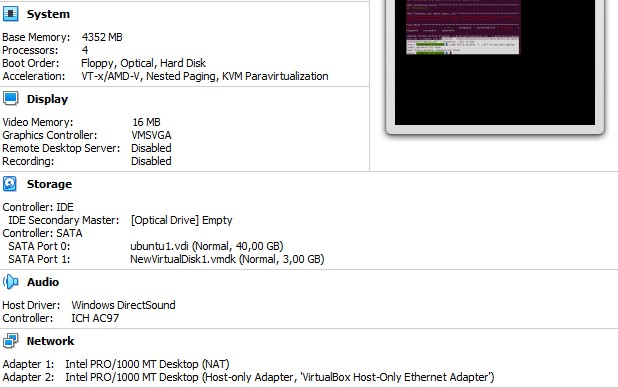

#  Setup OpenStack AIO inside VM with Kolla

---

# **Table of Contents:**

## [I. Requirements]

## [II. Step-by-step]

- ### [1. Install dependencies]
- ### [2. Install dependencies using a virtual environmen]
- ### [3. Install Kolla-ansible]
- ### [4. Install Ansible Galaxy requirements]
- ### [5. Configure Ansible]
- ### [6. Prepare initial configuration:]
- ### [7. DEPLOY `OPENSTACK`]
- ### [8. POST-DEPLOYMENT]
- ### [9. ACESSING `HORIZON` DASHBOARD]

## [III. Debugging]

## [IV. References]

# **I. Requirements**:

| Specification(s) | Minimal | Personal Config |
| ----------- | ----------- | ----------- |
|  CPU | 4 cores | 4 cores |
| RAM | 8 GB | 4 GB |
|  Disks | 2 | 2 |
| Network | 2 NICs | 2 NICs |

- **Disks**:
	- `sda`: 40 GB
	- `sdb`: 3 GB 

- **Networks**:	2 Interfaces with following IP addresses
	- `enp0s3` - **10.0.2.15**
	- `enp0s8` - **192.168.56.12**



# **II. STEP-BY-STEP**:

## 1. Install dependencies

```
sudo apt update

sudo apt install python3-dev libffi-dev gcc libssl-dev
```

## 2. Install dependencies using a virtual environmen:
- Install `virtualenv`:
```
sudo apt install python3-venv
```

- Create `virutalenv` & activate that environment:
```
python3 -m venv ./path/to/venv

source ./path/to/venv/bin/activate
```

- Ensure the latest version of pip is installed:

```
pip install -U pip
```

- Install Ansible

```
pip install 'ansible<5'
```

## 3. Install Kolla-ansible

- Install kolla-ansible and its dependencies using pip.
```
pip install git+https://opendev.org/openstack/kolla-ansible@master
```

- Create the `/etc/kolla directory`.

```
sudo mkdir -p /etc/kolla
sudo chown $USER:$USER /etc/kolla
```

- Copy globals.yml and passwords.yml to /etc/kolla directory.

```
cp -r /path/to/venv/share/kolla-ansible/etc_examples/kolla/* /etc/kolla
```

- Copy all-in-one and multinode inventory files to the current directory.

```
cp /path/to/venv/share/kolla-ansible/ansible/inventory/* .
```

## 4. Install Ansible Galaxy requirements

```
kolla-ansible install-deps
```

## 5. Configure Ansible

- Create the `/etc/ansible` directory.

```
sudo mkdir /etc/ansible
sudo chown $USER:$USER /etc/ansible
```

- Add the following options to the Ansible configuration file `/etc/ansible/ansible.cfg`:

```
[defaults]
host_key_checking=False
pipelining=True
forks=100
```

## 6. Prepare initial configuration:
- Check whether the configuration of inventory is correct or not, run:

```
ansible -i multinode all -m ping
```
> ping Success


- Kolla passwords
```
kolla-genpwd
```
- Configure `globals.yml`:

```
nano /etc/kolla/globals.yml
```
- Image options
```
kolla_base_distro: "ubuntu"
kolla_install_type: "source"

network_interface: enp0s3
neutron_external_interface: enp0s8
kolla_internal_vip_address: 10.0.2.15

nova_compute_virt_type: "qemu"

enable_haproxy: "no"

enable_cinder: "yes"
enable_cinder_backup: "no"
enable_cinder_backend_lvm: "yes"
```

## 7. DEPLOY `OPENSTACK`
- Bootstrap Server:
```
$ kolla-ansible -i all-in-one bootstrap-servers
```

> Boostrapping Success


- Precheck Server:
```
$ kolla-ansible -i all-in-one prechecks
```

> Prechecking Success


- Pull Images to VM:
```
$ kolla-ansible -i all-in-one pull
```

>  Pulling Images Success


- Deploy:
```
$ kolla-ansible -i all-in-one deploy
```

>  Deploy Success


- Post-deploy:
```
$ kolla-ansible -i all-in-one post-deploy
```


## 8. POST-DEPLOYMENT
- Install Openstack CLI:
```
$ pip install python-openstackclient python-glanceclient python-neutronclient
```

- Run `admin-openrc.sh` to add `ENVIRONMENT VARIABLES`: 
```
$ source /etc/kolla/admin-openrc.sh
```

- Generate token:
```
$ openstack token issue
```


##9. ACESSING `HORIZON` DASHBOARD

- Use following login account:
	- **username**: `admin`
	- **password**: *Run below command to retrieve*
	```
	$ cat /etc/kolla/passwords.yml | grep -i keystone_admin_password
	```

> Openstack Login page


> Openstack Dashboard


# **IV. DEBUGGING**:
- server certificate verification failed
```
export GIT_SSL_NO_VERIFY=1
```
- Heap-bug
> add option to `globals.yml`
```
 enalbe_heat: "no"
```


# **V. REFERENCES**:

- [Openstack Documentation - Quick Start](https://docs.openstack.org/kolla-ansible/latest/user/quickstart.html#configure-ansible)

- [VDT2021/Phase-1-Practices/Week-3/Julian-P-Nguyen/Openstack](https://github.com/vietstacker/Viettel-Digital-Talent-Program-2021/blob/main/Phase-1-Practices/Week-3/Julian-P-Nguyen/Openstack/README.md#**B.-CONFIGURE-%60Kolla-Ansible%60-&-%60Ansible%60**/)

---
