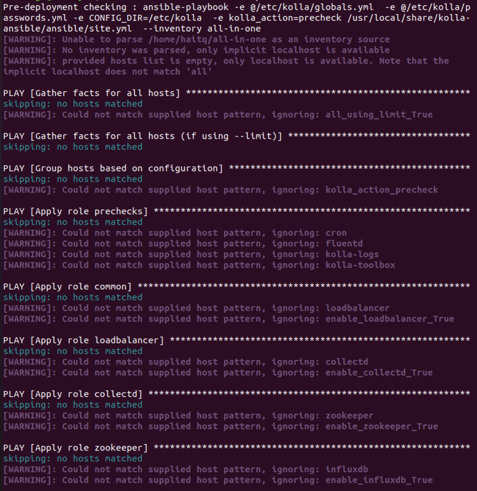

# WEEK-3: SET UP AIO OPENSTACK WITH KOLLA

---

## **Author:** *Kieu Son Tung* 

# **I. INTRODUCTION**:

# **II. PREREQUISITES**:

## **A. Recommended reading**

It’s beneficial to learn basics of both [`Ansible`](https://docs.ansible.com) and [`Docker`](https://docs.docker.com) before running Kolla Ansible.

## **B. Host machine requirements**

- 2 network interfaces 
> My VM only had one interface, so I had to create another one. Google it to know how.
- 8GB main memory
- 40GB disk space

# **III. SETUP**:

## **Install dependencies**

---

### 1. Update the package index
> It is recommended to do this every time
```
sudo apt update
sudo apt upgrade -y
```

### 2. Install Python build dependencies

```
sudo apt install python3-dev libffi-dev gcc libssl-dev
```

### 3. Setup virtual environment


**a. Install the virtual environment dependencies**
```
sudo apt install python3-venv
```

**b. Create a virtual environment and activate it**
``` 
python3 -m venv /path/to/venv
source /path/to/venv/bin/activate
```

**c. Install the latest version of `pip`**
```
pip install -U pip
```

**d. Install `Ansible`. Kolla Ansible requires at least Ansible 4 and supports up to 5**
``` 
pip install 'ansible==2.10'
```

## **Install `Kolla-ansible`**

---

**a. Install**
``` 
pip install kolla-ansible
```

**b. Create the `/etc/kolla` directory**
``` 
sudo mkdir /etc/kolla
sudo chown $USER:$USER /etc/kolla
```

**c. Copy `globals.yml` and `passwords.yml` into the Kolla configuration directory**
``` 
cp $HOME/venv/share/kolla-ansible/etc_examples/kolla/* /etc/kolla/
```

**d. Copy Kolla-ansible deployment inventory to the current working directory**
```
cp $HOME/venv/share/kolla-ansible/ansible/inventory/* .
```

**e. Install `Ansible Galaxy` requirements**
``` 
kolla-ansible install-deps
```

## Configure `Ansible`

---

``` 
vim $HOME/ansible.cfg 
```
> Add these lines
``` 
[defaults]
host_key_checking=False
pipelining=True
forks=100
```
> Then, type `:w` to save and `:q` to exit


## Prepare initial configuration

---

### 1. Check the configuration of inventory
``` 
ansible -i all-in-one all -m ping
```

> Expected output


### 2. Create diskspace partition for `Cinder`
> In order for these codes run, you have to create another storage in your VM. You can run the first line to check whether you have `dev/sdb` or not
``` 
lvmdiskscan (optional)

sudo pvcreate /dev/sdb

sudo vgcreate cinder-volumes /dev/sdb
```


### 3. Kolla password
``` 
kolla-genpwd
```

### 4. Configure `globals.yml`
```
xdg-open /etc/kolla/globals.yml
```
You can use 
```vi /etc/kolla/globals.yml```
instead

> Sample `globals.yml` file
```
kolla_base_distro: "ubuntu"
kolla_install_type: "source"

network_interface: "eth0"
neutron_external_interface: "eth1"
kolla_internal_vip_address: "10.10.10.254"

nova_compute_virt_type: "qemu"

enable_cinder_backup: "no"
#enable_cinder_backend_hnas_nfs: "no"
enable_cinder_backend_lvm: "yes" 
```


##**Deploy `OPENSTACK`**

---

- Bootstrap server:
```
kolla-ansible -i all-in-one bootstrap-servers
```
> It should look something like this


- Precheck Server:
``` 
kolla-ansible -i all-in-one prechecks
```
> It should look something like this



- Pull images:
```
kolla-ansible -i all-in-one pull
```

> It should look something like this


- Deploy
```
kolla-ansible -i all-in-one deploy
```

> It should look something like this


- Post-deploy:
```
kolla-ansible -i all-in-one post-deploy
```

> It should look something like this


Running this phase has tons of errors, some links down below might be helpful. Good luck! And remember to pray. Seriously! 
Pray!

## Post-deployment

- Install Openstack CLI:
``` 
pip install python-openstackclient python-glanceclient python-neutronclient
```

- Run `admin-openrc.sh` to add `ENVIRONMENT VARIABLES`:
```
source /etc/kolla/admin-openrc.sh
```

- Generate token:
``` 
openstack token issue
```


IV. REFERENCES:
- [Getting Past Ansible Password Required Issues](https://fuzzyblog.io/blog/ansible/2020/06/03/getting-past-ansible-password-required-issues.html)
- [How To Use LVM To Manage Storage Devices on Ubuntu 18.04](https://www.digitalocean.com/community/tutorials/how-to-use-lvm-to-manage-storage-devices-on-ubuntu-18-04)
- [Julian-P-Nguyen/OpenStack](https://github.com/vietstacker/Viettel-Digital-Talent-Program-2021/tree/main/Phase-1-Practices/Week-3/Julian-P-Nguyen/Openstack)
- Special thanks to Dang Van Dai, Bui Doan Dang, Tran Quang Hai, and other colleagues at Viettel

