# Practice 1: Setup OpenStack AIO inside VM with Kolla
---
## **Mục lục:**

### I. Overview

- #### A. Openstack

- #### B. Kolla-Ansible

### II. Setup
- #### Cấu hình máy ảo
- #### Cài đặt

### III. TÀI LIỆU THAM KHẢO

---


## **I. OVERVIEW**:

### **A. OPENSTACK**: 

#### **1. Overview:**


## OpenStack

### OpenStack là gì?
OpenStack là một platform điện toán đám mây nguồn mở hỗ trợ cả public clouds và private clouds. Nó cung cấp giải pháp xây dựng hạ tầng điện toán đám mây đơn giản, có khả năng mở rộng và nhiều tính năng phong phú.

Openstack cung cấp bảng điều khiển sẵn có, cung cấp cho quản trị viên quyền kiểm soát tạo ra các quyền thứ cấp cho người dùng nhằm mục đích cung cấp tài nguyên thông qua giao diện web.

### Các thành phần trong OpenStack

#### OpenStack compute-Nova:
- Module này quản lý và cung cấp máy ảo.
- Compute có thể thực h networking, CPU, storage, memory, tạo, điều khiển và xóa bỏ máy ảo, security, access control.
#### OpenStack Glance:
- OpenStack Image Service, quản lý các disk image ảo.
- Glance hỗ trợ các ảnh Raw, Hyper-V (VHD), VirtualBox (VDI), Qemu (qcow2) và VMWare (VMDK, OVF).
- Có thể tạo, xóa, cập nhật thêm các virtual disk images, cấu hình các public và private image và điều khiển việc truy cập vào chúng.
#### OpenStack Object Storage:
- Dùng để quản lý lưu trữ.
- Lưu trữ phân tán cho quản lý tất cả các dạng của lưu trữ như: archives, user data, virtual machine image.
- nhiều lớp redundancy và sự nhân bản được thực hiện tự động =>  tránh mất mát dữ liệu.
#### Identity Server:
- Dịch vụ xác thực và ủy quyền trong OpenStack.
- Quản lý xác thực cho user và projects.
#### OpenStack Netwok:
- Thành phần quản lý network cho các máy ảo.
- Cung cấp chức năng network as a service.
- Đây là hệ thống có các tính chất pluggable, scalable và API-driven.
#### OpenStack Dashboard:
- Cung cấp cho người quản trị cũng như người dùng giao diện đồ họa để truy cập, cung cấp và tự động tài nguyên cloud.
- Giúp việc thiết kế có thể mở rộng giúp dễ dàng.


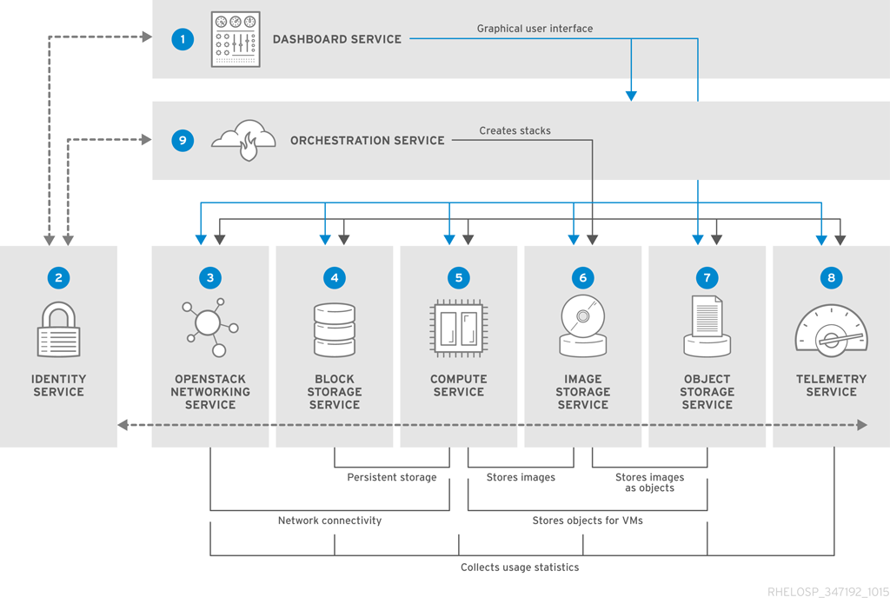

### OpenStack Kolla:
Openstack Kolla là Project hay công cụ sử dụng để triển khai, vận hành Openstack. Kolla được phát hành từ phiên bản Kilo và chính thức trở thành Project Openstack.

Với ý tưởng của Project Kolla là triển khai Openstack trong môi trường Container, tự động triển khai Openstack bằng Kolla Ansible. Qua đó chỉ với 1 vài thao tác, chúng ta đã có môi trường Openstack để sử dụng. Hơn nữa, Project Kolla cũng cung cấp sẵn các giải pháp về giám sát, HA, Rolling Upgrades … cho Openstack


---

## **II. Setup**:

#### Cấu hình máy:
 Cấu hình
  - Chuẩn bị máy ảo với hệ điều hành Ubuntu
  - CPU: 6 Core
  - RAM: 10 GB
  - 2 network interface enp0s3: 10.0.2.15/24 và enp0s8: 10.0.3.15/2

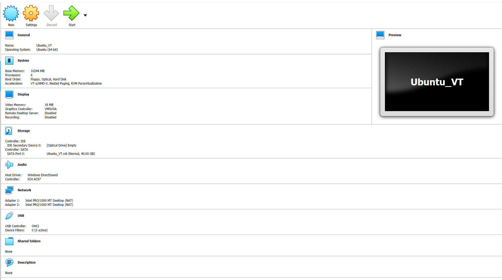

## Tiến hành cài đặt:
### 1. Update và cài package cần thiết
```
sudo apt update
sudo apt upgrade
```
```
sudo apt install python3-dev libffi-dev gcc libssl-dev
```
### 2. Cài môi trường ảo
- Cài môi trường ảo
```
$ sudo apt install python3-venv
```
- Tạo môi trường ảo và activate
```
$ python3 -m venv TD_openstack
$ source TD_openstack/bin/activate
```
- Cài pip
```
$ pip install -U pip
```
Lưu ý: Có thể cài đặt không cần môi trường ảo

### 3. Install `Ansible` & `Kolla-Ansible`:
- Cài đặt `Ansible`:
```
$ pip install 'ansible==4.0.0'
```

- Cài đặt `Kolla-ansible`:

```
$ sudo pip install kolla-ansible
```
## Cài đặt cấu hình
### 1. Cấu hình `Kolla-Ansible` & `Ansible`:
- Create `/etc/kolla`  directory:

```
$ sudo mkdir -p /etc/kolla
$ sudo chown $USER:$USER /etc/kolla
```
### 2. Copy file cấu hình (globals.yml and password.yml) đến `/etc/kolla directory`:
 
```
$ cp -r home/tiendatt/TD_openstack/share/kolla-ansible/etc_examples/kolla/* /etc/kolla
```

### 3. Copy file inventory `all-in-one` đến thư mục hiện tại:
```
cp TD_openstack/share/kolla-ansible/ansible/inventory/* .
```

### 4. Cài đặt cấu hình `Ansible`:
- Tạo file cấu hình

- Tạo thư mục `/etc/ansible` để lưu file config
```
$ sudo mkdir -p /etc/ansible

$ sudo vi /etc/ansible/ansible.cfg
```
- Thêm vào file ansible.cfg content như sau:

```
[defaults]
host_key_checking=False
pipelining=True
forks=100
```
### 5. Check cấu hình:
Ping to check whether the configuration of inventory is correct or not:

```
$ ansible -i all-in-one all -m ping
```

> Ping Success:

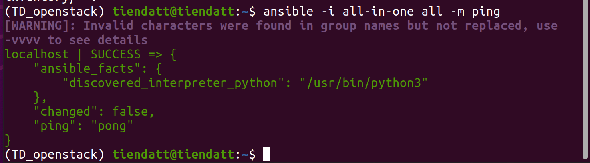

### 6. Tạo phân vùng cho `Cinder`:

```
$ sudo pvcreate /dev/sdb

$ sudo vgcreate cinder-volumes /dev/sdb
```

### 7. Kolla passwords:
Passwords được lưu ở /etc/kolla/passwords.yml
- Generate passwords:
```
$ kolla-genpwd
```

### 8. Cấu hình `globals.yml`:

```
$ cd /etc/kolla
```
- Edit file by file editor


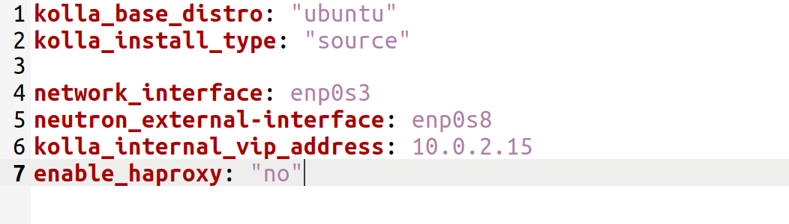

## **OPENSTACK DEPLOYMENT**
- Bootstrap servers 

```
$ kolla-ansible -i all-in-one bootstrap-servers
```


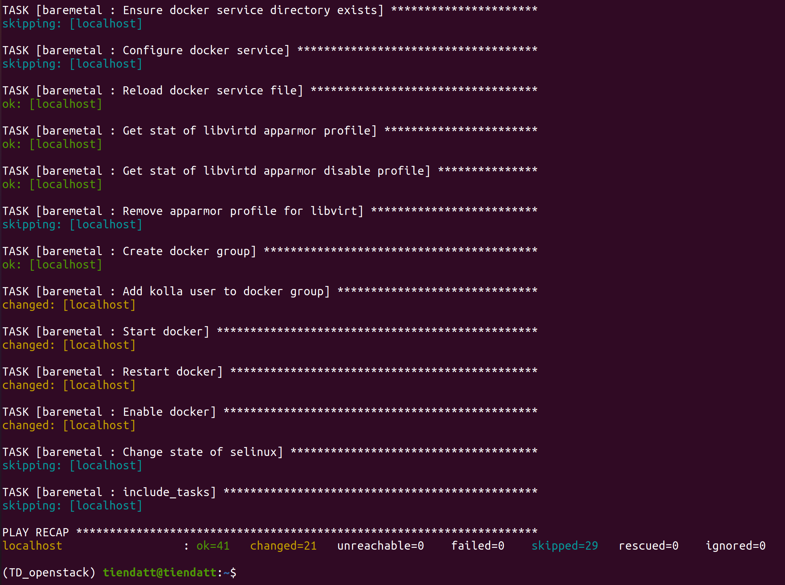


- Pre-deployment checks
```
$ kolla-ansible -i all-in-one prechecks
```


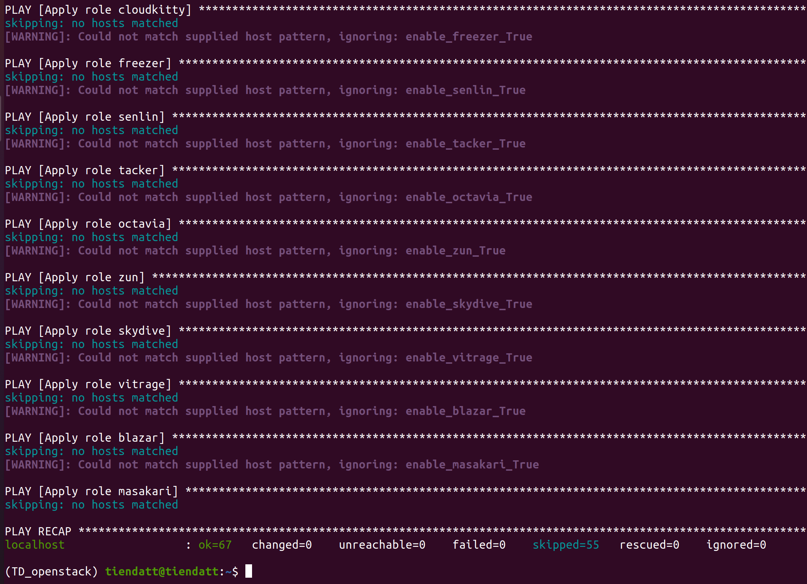


- Pull OpenStack images
```
$ kolla-ansible -i all-in-one pull
```

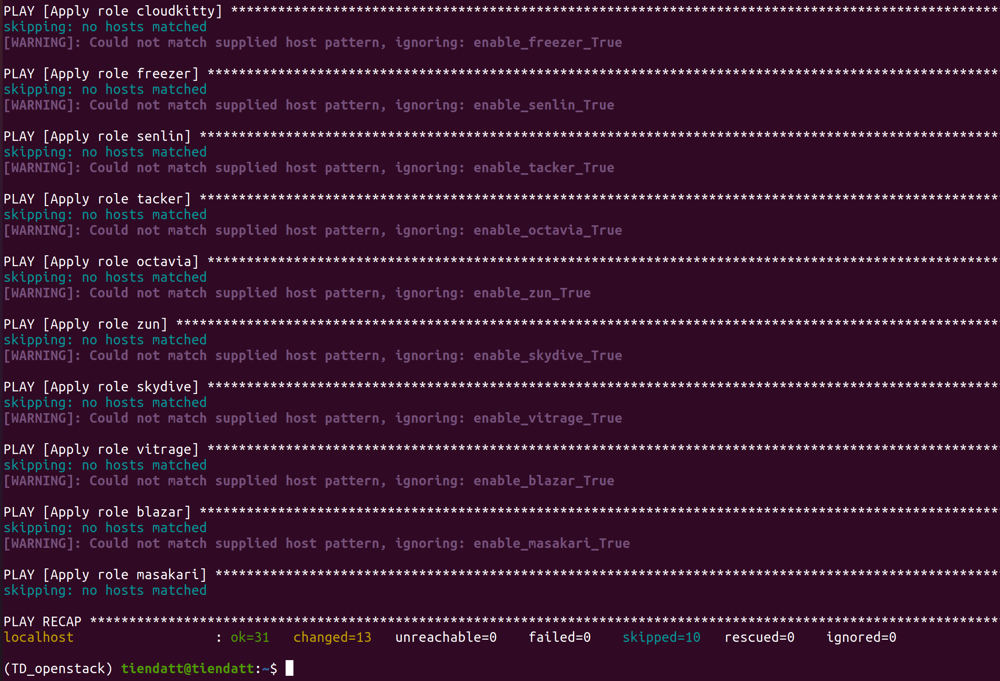


- OpenStack deployment:
```
$ kolla-ansible -i all-in-one deploy
```


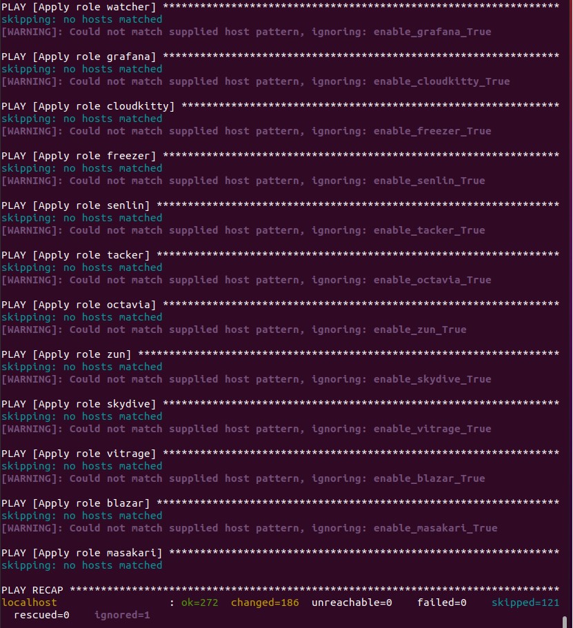


## **Using Openstack**:

 

- Cài đặt Openstack CLI:
```
$ pip install python-openstackclient python-glanceclient python-neutronclient
```

OpenStack requires an openrc file where credentials for admin user are set.
- Create `/etc/kolla/admin-openrc.sh`

```
$ vi /etc/kolla/admin-openrc.sh
```


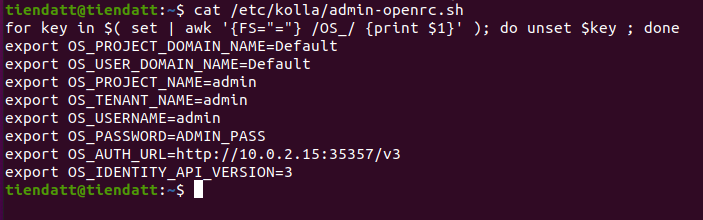


- Run `admin-openrc.sh` to add `ENVIRONMENT VARIABLES`: 
```
$ source /etc/kolla/admin-openrc.sh
```

- Generate token:
```
$ openstack token issue
```


- Access `10.0.2.15/auth/login/?next=/`:


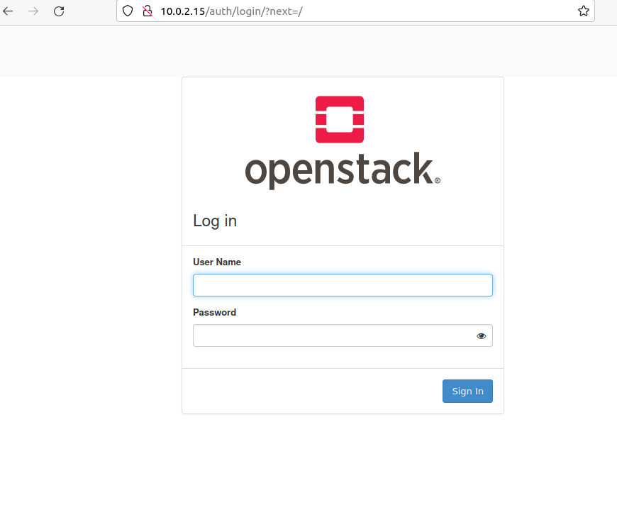


- Use following login account:
	- **username**: `admin`
	- **password**: Run this command to get password
	```
	$ cat /etc/kolla/passwords.yml | grep -i keystone_admin_password
	```


- Openstack Dashboard


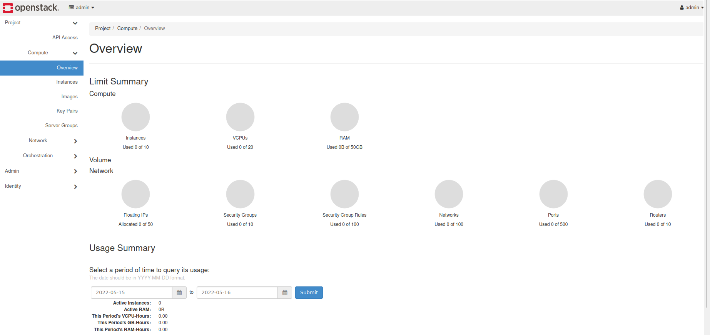


# **III. REFERENCES**:

- [Openstack wikipedia](https://en.wikipedia.org/wiki/OpenStack)

- [Kolla-ansible Github](https://github.com/openstack/kolla-ansible)


