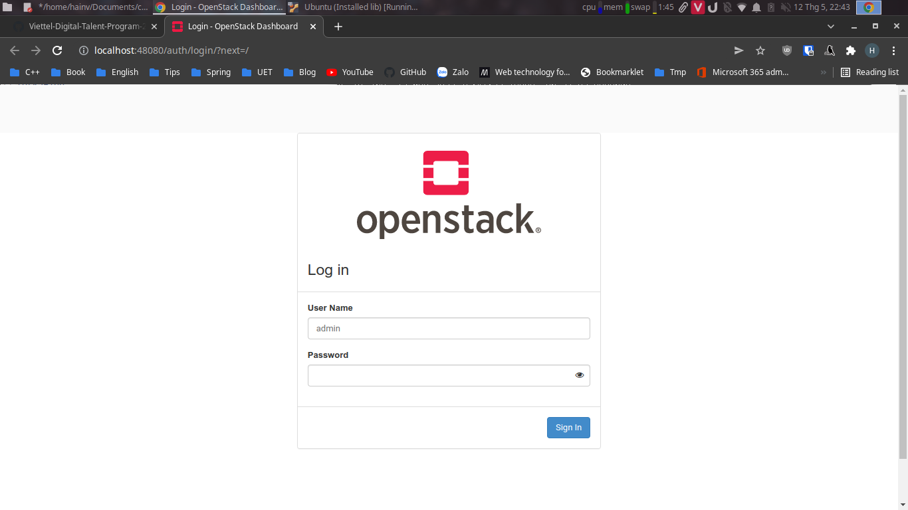
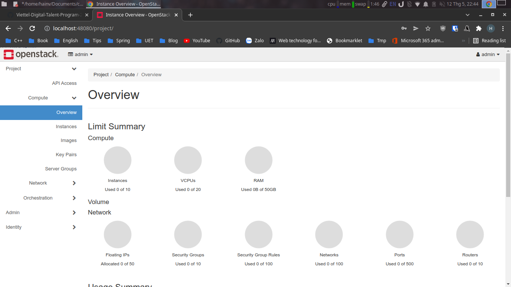

# Cài đặt OpenStack All In One bằng Kolla-Ansible
- [Cài đặt OpenStack All In One bằng Kolla-Ansible](#cài-đặt-openstack-all-in-one-bằng-kolla-ansible)
  - [I.Yêu cầu](#iyêu-cầu)
    - [1. Cấu hình](#1-cấu-hình)
  - [II. Các bước tiến hành](#ii-các-bước-tiến-hành)
    - [1. Chuẩn bị](#1-chuẩn-bị)
    - [2. Cấu hình OpenStack All In One](#2-cấu-hình-openstack-all-in-one)
    - [3. Cài đặt Ansible Galaxy](#3-cài-đặt-ansible-galaxy)
    - [4. Cấu hình cho Ansible](#4-cấu-hình-cho-ansible)
    - [5. Cài đặt OpenStack All In One](#5-cài-đặt-openstack-all-in-one)
    - [6. Cài đặt OpenstackClient](#6-cài-đặt-openstackclient)
  - [III. Tài liệu tham khảo](#iii-tài-liệu-tham-khảo)
## I.Yêu cầu

### 1. Cấu hình

|         | Đề xuất | Cấu hình của mình |
| ------- | ------- | ---------------- |
| CPU     | 4 cores | 2 cores          |
| RAM     | 8 GB    | 4 GB             |
| HDD     | 2 Disks | 2 Disks          |
| Network | 2 NICs  | 2 NICs           |

- CPU 2 cores vì có một số vấn đề liên quan đến mariadb cần nhiều hơn 1 core( mình chưa gặp lỗi này trong quá trình cài đặt)
- Cần thêm 1 Disks phục vụ cho Cinder
- 2 NICs:
  - 1 NIC: sử dụng NAT có ip là 10.0.2.15/24
  - 1 NIC: sử dụng host only có ip là 192.168.56.110/24

## II. Các bước tiến hành

### 1. Chuẩn bị

- Cài đặt các package cần thiết

```console
sudo apt update
sudo apt install python3-dev libffi-dev gcc libssl-dev
```

- Cài đặt `virtualenv`

```console
sudo apt install python3-venv
python3 -m venv /path/to/venv
source /path/to/venv/bin/activate
```

- Cập nhật phiên bản mới nhất cho pip
```console
pip install -U pip
```

- Cài đặt ansible và kolla-ansible bản yoga

```console
pip install 'ansible>=4,<6'
pip install git+https://opendev.org/openstack/kolla-ansible@stable/yoga
```

- Copy các file đã có cấu hình sẵn của kolla-ansible ra một folder `/etc/kolla`

```console
sudo mkdir -p /etc/kolla
sudo chown $USER:$USER /etc/kolla
cp -r /path/to/venv/share/kolla-ansible/etc_examples/kolla/* /etc/kolla
cp /path/to/venv/share/kolla-ansible/ansible/inventory/* .
```

### 2. Cấu hình OpenStack All In One

- Tạo file chứa mật khẩu

```console
kolla-genpwd
```

- Tạo phân vùng cho Cinder

```console
pvcreate /dev/sdb
vgcreate cinder-volumes /dev/sdb
```

- Thêm các cấu hình vào file `/etc/kolla/globals.yml`

```console
kolla_base_distro: "ubuntu"
kolla_install_type: "source"

network_interface: enp0s3
neutron_external_interface: enp0s8
kolla_internal_vip_address: 10.0.2.15

nova_compute_virt_type: "qemu"

enable_haproxy: "no"

enable_cinder: "yes"
enable_cinder_backup: "no"
enable_cinder_backend_lvm: "yes"

```

### 3. Cài đặt Ansible Galaxy
```console
kolla-ansible install-deps
```

### 4. Cấu hình cho Ansible
- Tạo và sửa nội dung file `/etc/ansible/ansible.cfg` với nội dung:

```console
[defaults]
host_key_checking=False
pipelining=True
forks=100
```


### 5. Cài đặt OpenStack All In One

- Khởi tạo môi trường dành cho Openstack Kolla

```console
kolla-ansible -i ./all-in-one bootstrap-servers
```

- Kiểm tra thiết lập Kolla Ansible

```console
kolla-ansible -i ./all-in-one prechecks
```

- Tải các image cần thiết về

```console
kolla-ansible -i ./all-in-one pull
```

- deploy

```console
kolla-ansible -i ./all-in-one deploy
```

### 6. Cài đặt OpenstackClient

- Cài đặt các package cần thiết

```console
pip install python-openstackclient -c https://releases.openstack.org/constraints/upper/yoga
```

- Chạy script sau để lấy cấu hình:

```console
kolla-ansible post-deploy
. /etc/kolla/admin-openrc.sh
```

- Kiểm tra dịch vụ:

```console
openstack token issue
```


- Lấy mật khẩu để đăng nhập tài khoản admin:

```console
cat /etc/kolla/passwords.yml | grep keystone_admin
```

> Trang đăng nhập




> Đăng nhập thành công!



## III. Tài liệu tham khảo

- [Docs kolla-ansible](https://docs.openstack.org/kolla-ansible/yoga/user/quickstart.html)
- [Bài hướng dẫn của meobilivang trên github](https://github.com/meobilivang/Phase-1-Training-VTDT-VTNET/blob/master/Week%203/Openstack/README.md)