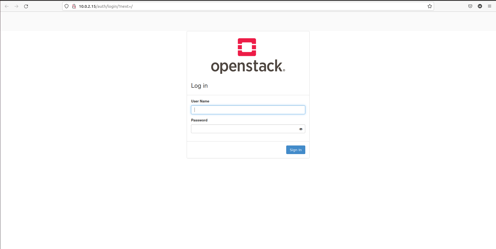
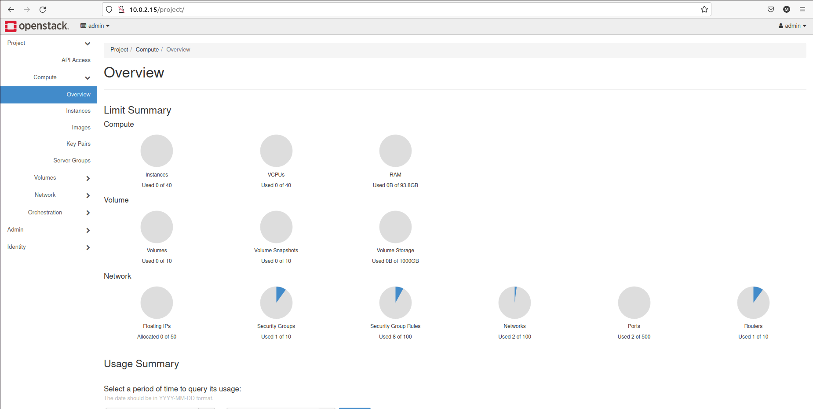

# Week 1
## I. Overview
### 1. Openstack
#### a) Openstack là gì?
OpenStack là một dự án Infrastructure-as-a-Service (IaaS) điện toán đám mây có mã nguồn mở, nhằm quản lý các nhóm tài nguyên tính toán, lưu trữ mạng khổng lồ qua một datacenter. 
Là một dự án được bắt đầu bởi NASA và Rackspace, Openstack sẽ cung cấp và phân phối nền tảng lưu trữ và điện toán đám mây.
#### b) Các thành phần bên trong Openstack
- **Compute Infrastructure:** bao gồm các loại nova như: nova compute, nova network, nova schedule, nova api và nova volume.
- **Storage Infrastructure (Swift):** bao gồm Proxy node và Storage nodes. Đầu tiên các proxy nodes sẽ tiếp nhận yêu cầu xử lý và gửi về cho storage nodes, sau đó thực hiện sao lưu các mục yêu cầu dưới một account, khu lưu trữ (container) hoặc vùng đối tượng (các object).
- **Imaging service (Glance):** có chức năng xử lý những file ảnh của máy chủ ảo. Đồng thời, thực hiện được một số công việc quản trị khác như cập nhật thêm các tính năng virtual disk images, cài đặt các chế độ quyền riêng tư cho các hình ảnh, dễ dàng tùy biến việc chỉnh sửa hoặc xoá ảnh.
#### c) Nguyên lý hoạt động của Openstack
- **Glance:** Tạo Image của OS (ubuntu, window, …), tác dụng lưu trữ và quản lý việc xóa, sửa các metadata của Image.
- **Neutron:** tạo network group (nghĩa là tạo một các tên cho các network trong project), sau đó trong network group ta tạo nhiều subnet kèm theo nhiều policy đi kèm, để các VM kết nối vào subnet.
- **Cinder:** tạo các volume block storage nhằm cung cấp cho việc tạo VM. Bởi cấu tạo của VM bắt buộc phải sử dụng block storage, vì ít nhất VM phải cần có chỗ lưu OS với nguyên tắc OS phải lưu trên block storage để VM có thể boot.
- **Keystone:** là service chứng thực chính, người dùng yêu cầu đến tất cả các service đều phải cần chứng thực để sử dụng. Người dùng gửi yêu cầu lấy thông báo từ keystone sau đó keystone trả về người dùng một thông báo và gửi đến service 1 bản sao thông báo trên, người dùng lại yêu cầu đến server thông qua thông báo nhận được cho đến khi service chấp nhận yêu cầu khi khớp với thông báo.
- **Swift:** cung cấp object storage- dịch vụ lưu trữ có thể hoạt động riêng biệt (như google drive, dropbox, …) hoặc cũng có thể tích hợp vào VM để cung cấp nơi lưu trữ.
- **Nova:** nhận yêu cầu liên quan đến việc quản lý VM từ người dùng (tạo, xóa , sửa,…), thu gom các tài nguyên liên quan như RAM, CPU từ bản thân service nó quản lý và các tài nguyên từ các service khác trả bao gồm Network, Volume, Image,… để tạo nên máy ảo cũng như giám sát các tài nguyên đó.
### 2. Openstack Kolla
Openstack Kolla là Project hay công cụ sử dụng để triển khai, vận hành Openstack. Kolla được phát hành từ phiên bản Kilo và chính thức trở thành Project Openstack tại phiên bản Liberty.
Với ý tưởng của Project Kolla là triển khai Openstack trong môi trường Container, tự động triển khai Openstack bằng Kolla Ansible. Qua đó chỉ với 1 vài thao tác, chúng ta đã có môi trường Openstack để sử dụng. Hơn nữa, Project Kolla cũng cung cấp sẵn các giải pháp về giám sát, HA, Rolling Upgrades … cho Openstack
## II. Practicing

### 1. Requirement

|         | Requirements | My Config |
|---------|--------------|-----------|
| CPU     | 4 cores      | 2 cores   |
| Ram     | 8 GB         | 8 GB      |
| Disks   | 2 Disks      | 2 Disks   |
| Network | 2 NICs       | 2 NICs    |

Hệ điều hành sử dụng: Ubuntu 64bit

##### Disks

Tạo thêm disk thứ 2 để cho Cinder của OpenStack lưu trữ vào. Em đã tạo disk thứ 2 "Cinder.vhd" với dung lượng 20GB.

Sau đó em sẽ mount vào VM.

##### Networks

Em cài đặt 2 NICs. Adapter 1 là mạng `NAT` và tạo port forwarding tới SSH port của VM.

Connect tới VM qua SSH chỉ cần truy vấn đến port `1706` của localhost hiện tại. NAT sẽ tự động config connect đến máy ảo.

Mạng tiếp theo sẽ là `Host only` ở adapter 2 connect đến mạng host only đã tạo.

Và kiểm tra bằng câu lệnh `ifconfig`
```bash
enp0s3: flags=4163<UP,BROADCAST,RUNNING,MULTICAST>  mtu 1500
        inet 10.0.2.15  netmask 255.255.255.0  broadcast 10.0.2.255
        inet6 fe80::7ac3:133d:2299:36b6  prefixlen 64  scopeid 0x20<link>
        ether 08:00:27:91:a7:10  txqueuelen 1000  (Ethernet)
        RX packets 79325  bytes 61323091 (61.3 MB)
        RX errors 0  dropped 0  overruns 0  frame 0
        TX packets 44521  bytes 6718426 (6.7 MB)
        TX errors 0  dropped 0 overruns 0  carrier 0  collisions 0

enp0s8: flags=4163<UP,BROADCAST,RUNNING,MULTICAST>  mtu 1500
        ether 08:00:27:77:25:21  txqueuelen 1000  (Ethernet)
        RX packets 37465  bytes 8491696 (8.4 MB)
        RX errors 0  dropped 0  overruns 0  frame 0
        TX packets 3100  bytes 617115 (617.1 KB)
        TX errors 0  dropped 0 overruns 0  carrier 0  collisions 0

lo: flags=73<UP,LOOPBACK,RUNNING>  mtu 65536
        inet 127.0.0.1  netmask 255.0.0.0
        inet6 ::1  prefixlen 128  scopeid 0x10<host>
        loop  txqueuelen 1000  (Local Loopback)
        RX packets 1616291  bytes 291564248 (291.5 MB)
        RX errors 0  dropped 0  overruns 0  frame 0
        TX packets 1616291  bytes 291564248 (291.5 MB)
        TX errors 0  dropped 0 overruns 0  carrier 0  collisions 0
```
Ở đây sẽ có 2 `Interface network`:

- enp0s3: Của NAT có ip là 10.0.2.15/24 (Địa chỉ giao tiếp với OpenStack)
- enp0s8: Của Host-only có ip là 192.168.56.103/24 (Dải mạng cung cấp ip cho các VM tạo bởi OpenStack)

### 2. Install

#### a) Install dependencies

Trước tiên ta sẽ cài đặt các packages dependencies.

```bash
sudo apt update
sudo apt install python3-dev libffi-dev gcc libssl-dev
```

Tiếp theo em tạo 1 môi trường ảo cho python ở thư mục 'opt' đồng thời sẽ active môi trường đó.

```bash
sudo apt install python3-venv
python3 -m venv /opt/venv
source ./venv/bin/activate
```

Đảm bảo `pip` ở lastes-version.

```bash
pip install -U pip
```

Cài đặt ansible qua `pip`. Kolla-ansible yêu cầu ansible version từ 2.9 trở lên.

```bash
pip install ansible
```

#### b) Install Kolla-ansible

Tiếp theo, em cài đặt Kolla-ansible thông qua `pip`.

```bash
pip install kolla-ansible
```

Tạo thư mục /etc/kolla

```bash
sudo mkdir -p /etc/kolla
sudo chown $USER:$USER /etc/kolla
```

Copy các file globals.yml và passwords.yml vào thư mục /etc/kolla

```bash
cp -r /opt/venv/share/kolla-ansible/etc_examples/kolla/* /etc/kolla
```

Copy 2 inventory file all-in-one và multinode tới thư mục hiện tại.

```bash
cp /opt/venv/share/kolla-ansible/ansible/inventory/* .
```

Ở đây em sẽ cài đặt dùng file Inventory all-in-one (Cài đặt các services của Openstack trên cùng 1 host).
#### c) Kolla passwords

Password của openstack sẽ được lưu ở trong file /etc/kolla/password.yml . File lúc đầu sẽ trống rỗng, do đó sẽ phải generate password cho Kolla.

```bash
kolla-genpwd
```

#### d) Kolla globals.yml config

Thiết lập phân vùng LVM dành cho Cinder ở ổ đĩa vừa mount `sdb`

```bash
sudo pvcreate /dev/sdb                  ------- Create Physical Volume
sudo vgcreate cinder-volumes /dev/sdb   ------ Create Volume Group
```

Kết quả:

```bash
Physical volume "/dev/sdb" successfully created.
Volume group "cinder-volumes" successfully created
```

File globals.yml vừa copy sẽ là file config cho Kolla.
Ở đây sẽ cấu hình như sau

```bash
kolla_base_distro: "ubuntu"
kolla_install_type: "source"

network_interface: enp0s3
neutron_external_interface: enp0s8
kolla_internal_vip_address: 10.0.2.15

nova_compute_virt_type: "qemu"

enable_haproxy: "no"

enable_cinder: "yes"
enable_cinder_backup: "no"
enable_cinder_backend_lvm: "yes"
```

- `kolla_base_distro`: Hệ điều hành triển khai.
- `kolla_install_type`: Mã nguồn sử dụng khi triển khai Openstack, có 2 loại:
  - source
  - binary
- `network_interface`: interface của địa chỉ ip `10.0.2.15` giao tiếp với Openstack
- `neutron_external_interface`: interface cung cấp ip cho các VM được tạo sau này
- `kolla_internal_vip_address`: địa chỉ ip giao tiếp với các thành phần của Openstack (là ip của network interface)
- `enable_haproxy`: Nếu triển khai Openstack All In One thì thiết lập là "no"
- `enable_cinder`: Do sử dụng Cinder LVM làm share storage cho Openstack nên đặt là True
- `enable_cinder_backup`: True nếu sử dụng tính năng Backup Cinder
- `enable_cinder_backend_lvm`: True nếu sử dụng Backend LVm cho Cinder
- `nova_compute_virt_type`: vì dùng VM ảo hoá để cài đặt Openstack nên sẽ đặt là qemu

#### e) Deployment

Khởi tạo môi trường dành cho Openstack Kolla

```bash
kolla-ansible -i ./all-in-one bootstrap-servers
```

Lưu ý: File all-in-one vừa được copy đến thư mục hiện tại

Kết quả:

```bash
PLAY RECAP *******************************************************************************************************
localhost                  : ok=38   changed=19   unreachable=0    failed=0    skipped=32   rescued=0    ignored=0

```

Kiểm tra thiết lập Kolla Ansible

```bash
kolla-ansible -i ./all-in-one prechecks
```

Kết quả:

```bash
PLAY RECAP *******************************************************************************************************
localhost                  : ok=74   changed=2    unreachable=0    failed=0    skipped=57   rescued=0    ignored=0
```

Tải các Image Openstack

```bash
kolla-ansible -i ./all-in-one pull
```

Kết quả:

```bash
PLAY RECAP *******************************************************************************************************
localhost                  : ok=36   changed=18   unreachable=0    failed=0    skipped=10   rescued=0    ignored=0

```

Deploy openstack

```bash
kolla-ansible -i ./all-in-one deploy
```

Kết quả:

```bash
PLAY RECAP *******************************************************************************************************
localhost                  : ok=278  changed=149  unreachable=0    failed=0    skipped=132  rescued=0    ignored=0

```

### 3. Using Openstack

#### a) Install Openstack CLI

```bash
pip install python-openstackclient python-glanceclient python-neutronclient
```

OpenStack yêu cầu openrc file (lưu trữ  thông tin về user admin). Để tạo file schạy các câu lệnh

```bash
kolla-ansible post-deploy        
. /etc/kolla/admin-openrc.sh
```

Lúc này file `admin-openrc.sh` sẽ được lưu trong thư mục kolla.

Kiểm tra dịch vụ

```bash
source /etc/kolla/admin-openrc.sh
openstack token issue
```

Kết quả:

```bash
+------------+-----------------------------------------------------------------------------------------------------------------------------------------------------------------------------------------+
| Field      | Value                                                                                                                                                                                   |
+------------+-----------------------------------------------------------------------------------------------------------------------------------------------------------------------------------------+
| expires    | 2022-05-17T16:56:23+0000                                                                                                                                                                |
| id         | gAAAAABigoI30_ItJw7WISXW8ViiSBBLHLiCYPDjznV8YualJS5ulZR57bU411-ZRBWJlc1tzZ79GrRfLYJ5Kv0FvDg7CShOisWpeMFPceadhoInhfQPJQBzDp0ZbuhRrtiUl2_4eEO6-xByCDAjUeMSsgEL0Scba0T2tlP2GPKiKBkMZLhJliU |
| project_id | f3996d5f2793459cbe257b93d1f2e06c                                                                                                                                                        |
| user_id    | df6f5a78dae942189f4ab02d5809062f                                                                                                                                                        |
+------------+-----------------------------------------------------------------------------------------------------------------------------------------------------------------------------------------+
```

### 4. Testing

Lấy mật khẩu tài khoản Admin

```bash
cat /etc/kolla/passwords.yml | grep keystone_admin
```

Kết quả:

```bash
keystone_admin_password: yfzi9FwvykErg57IoQE3YmdYdA93tLgFRl6MfpsX
```

Vậy mật khẩu đăng nhập vào sẽ là:

```bash
admin / yfzi9FwvykErg57IoQE3YmdYdA93tLgFRl6MfpsX
```

Truy cập địa chỉ: http://10.0.2.15/auth/login/?next=/ và nhập các thông tin trên để đăng nhập


## III. Debug
Các lỗi em đã gặp trong quá trình cài đặt và cách giải quyết
```bash
TASK [service-rabbitmq : nova | Ensure RabbitMQ users exist] **********************************************************************************************************************************************
FAILED - RETRYING: [localhost]: nova | Ensure RabbitMQ users exist (5 retries left).
FAILED - RETRYING: [localhost]: nova | Ensure RabbitMQ users exist (4 retries left).
FAILED - RETRYING: [localhost]: nova | Ensure RabbitMQ users exist (3 retries left).
FAILED - RETRYING: [localhost]: nova | Ensure RabbitMQ users exist (2 retries left).
FAILED - RETRYING: [localhost]: nova | Ensure RabbitMQ users exist (1 retries left).
failed: [localhost] (item=None) => {"attempts": 5, "censored": "the output has been hidden due to the fact that 'no_log: true' was specified for this result", "changed": false}
fatal: [localhost -> {{ service_rabbitmq_delegate_host }}]: FAILED! => {"censored": "the output has been hidden due to the fact that 'no_log: true' was specified for this result", "changed": false}
```
Lỗi này xuất hiện trong quá trình deploy openstack, là một bug do nhà phát triển xác nhận tại trang https://bugs.launchpad.net/kolla-ansible/+bug/1946506

```bash
kolla-ansible destroy -i ./all-in-one --yes-i-really-really-mean-it
```
Để xử lý lỗi em hiện chỉ có thể xóa hết các container và tải lại

```TASK [common : Ensuring config directories exist] *********************************************************************************************************************************************************
failed: [localhost] (item=[{'service_name': 'cron'}, 'cron']) => {"ansible_loop_var": "item", "changed": false, "item": [{"service_name": "cron"}, "cron"], "module_stderr": "sudo: a password is required\n", "module_stdout": "", "msg": "MODULE FAILURE\nSee stdout/stderr for the exact error", "rc": 1}
failed: [localhost] (item=[{'service_name': 'fluentd'}, 'fluentd']) => {"ansible_loop_var": "item", "changed": false, "item": [{"service_name": "fluentd"}, "fluentd"], "module_stderr": "sudo: a password is required\n", "module_stdout": "", "msg": "MODULE FAILURE\nSee stdout/stderr for the exact error", "rc": 1}
failed: [localhost] (item=[{'service_name': 'kolla-toolbox'}, 'kolla-toolbox']) => {"ansible_loop_var": "item", "changed": false, "item": [{"service_name": "kolla-toolbox"}, "kolla-toolbox"], "module_stderr": "sudo: a password is required\n", "module_stdout": "", "msg": "MODULE FAILURE\nSee stdout/stderr for the exact error", "rc": 1
```

Lỗi không truy cập được do chưa có mật khẩu, có thể dễ dàng xử lý theo trang https://www.shellhacks.com/ansible-sudo-a-password-is-required/
