# WEEK-3 PRACTICE DOCUMENTATION
# Sec.1: ALL-IN-ONE OPENSTACK DEPLOYMENT

---

## **Author:** *Nguyen Tan Huy* 
**Date of issue**: *May 16th 2022*

> Welcome! This is the documentation for my first training project at **Viettel Network**.

---

# **Table of Contents:**

## [I. Overview](#**I.-OVERVIEW**)

- ### [A. Openstack](#**A.-`OPENSTACK`**)

- ### [B. Kolla-Ansible](#**B.-`KOLLA-ANSIBLE`**)

## [II. Prerequisite](#**II.-PREREQUISITE**)
- ### [A. Knowledge Requirements](#'A.-Knowledge-Requirements')
- ### [B. Infrastructure Requirements](#**B.-Infrastructure-Requirements**)

## [III. Step-by-step](#III.-STEP-BY-STEP)

- ### [A.Set up Environment](#**A.-SET-UP-ENIVRONMENT**)
- ### [B. Configure Kolla-Ansible & Ansible](#**B.-CONFIGURE-`Kolla-Ansible`-&-`Ansible`**)
- ### [C. Pre-deploy-configurations](#**C.-PRE-DEPLOY-CONFIGURATIONS**)
- ### [D. Deploy Openstack](#**D.-DEPLOY-`OPENSTACK`**)
- ### [E. Post-deployment](#**E.-POST-DEPLOYMENT**)
- ### [F. Accessing Horizon Dashboard](#F.-**ACESSING-`HORIZON`-DASHBOARD**)


## [IV. References](#IV.-REFERENCES)

# **I. OVERVIEW**:
## **A. OPENSTACK**: 
### **1. Tổng quan:**

-  OpenStack là một platform điện toán đám mây nguồn mở hỗ trợ cả public clouds và private clouds. Nó cung cấp giải pháp xây dựng hạ tầng điện toán đám mây đơn giản, có khả năng mở rộng và nhiều tính năng phong phú.
-  OpenStack được phát triển bởi NASA và Rackspace, phiên bản đầu tiên vào năm 2010.
- Hosted & supported bởi [`Open Infrastructure Founndation`](https://openinfra.dev/)


### **2. Các thành phần chính:**
 
#### **a. Nova**
 - Quản lý và truy cập tới các nhóm tài nguyên của Openstack

#### **b. Neutron**
 - Kết nối mạng qua các dịch vụ OpenStack khác

#### **c. Glance**
 - Dịch vụ lưu trự và truy xuất các image của ổ đĩa ảo từ nhiều nơi khác nhau

#### **d. Keystone**
 - Xác thực và ủy quyền tất cả các dịch vụ khác của OpenStack

#### **e. Cinder**
- Cung cấp khả năng lưu trữ khối liên tục có thể truy cập thông qua API tự phục vụ.

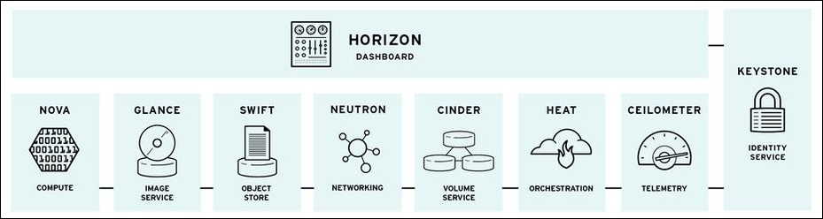

## **B. KOLLA-ANSIBLE**: 

- Kolla-ansible là một công cụ để triển khai và vận hành Openstack thông qua việc cung cấp các containers và công cụ đã được xây dựng sẵn.

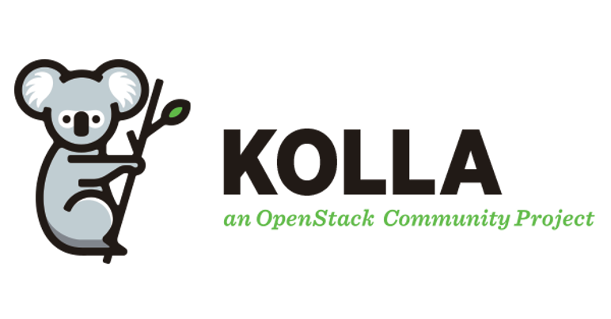


# **II. PREREQUISITE**:
## **A. Yêu cầu kiến thưc:**
- [`Ansible`](https://docs.ansible.com/).

- [`Docker`](https://docs.docker.com/get-started/).
- Linux, Networking.


## **B. Yêu cầu về hạ tầng:** 

- **Hệ điều hành:**

	- Ubuntu Server (ở bài này em dùng Ubuntu 20.04 [Download Ubuntu Server](https://ubuntu.com/download/server)) 
	- CentOS 7: [Download CentOS7](https://www.centos.org/download/) 
- Có thể sử dụng Virtual Box để cài máy ảo.

| Specification(s) | Minimal | Personal Config |
| ----------- | ----------- | ----------- |
|  CPU | 4 cores | 2 cores |
| RAM | 8 GB | 4 GB |
|  Disks | 2 | 2 |
| Network | 2 NICs | 2 NICs |

- 2 NICs:
	- Bridge Adapter (enp0s3): 192.168.5.141/24
	- Host-only Adapter (enp0s8): 192.168.56.110/24
# **III. STEP-BY-STEP**:
## **A. SET UP ENIVRONMENT**:

### 1. Update `apt` & install essentails dependencies:

```
$ sudo apt update

$ sudo apt install python3-dev libffi-dev gcc libssl-dev
```

### 2. Using `virtualenv`:
- Install `virtualenv`:
```
$ sudo apt install python3-venv
```

- Create `virutalenv` & activate that environment:
```
$ python3 -m venv /path/to/venv

$ source /path/to/venv/bin/activate
```
- Ensure the lastest version of pip is installed:
```
$ pip install -U pip
```

### 3. Install `Ansible` & `Kolla-Ansible` (within `virtualenv`):

- Install `Ansible`:
```
$ pip install 'ansible>=4,<6'
```

- Install `Kolla-ansible`:

```
$ pip install git+https://opendev.org/openstack/kolla-ansible@stable/yoga
```

### 4. Install `Openstack CLI`:
> *Optional at this point*

**Notes:**

> Due to the fact that `open vSwitch` might capture `MAC Address` of network interace, which blocks connection to the Internet. Can install Openstack CLI from this step.

```
$ pip install python-openstackclient -c https://releases.openstack.org/constraints/upper/yoga
```

## **B. CONFIGURE `Kolla-Ansible` & `Ansible`**:
### 1. Create `/etc/kolla`  directory:

```
$ sudo mkdir -p /etc/kolla
$ sudo chown $USER:$USER /etc/kolla
```

### 2. Copy `passwords.yml` to `/etc/kolla`:
 
```
$ cp -r <path-to-virtualenv>/share/kolla-ansible/etc_examples/kolla/* /etc/kolla
```

### 3. Configure `Ansible`:

```
$ mkdir -p /etc/ansible

$ config="[defaults]\nhost_key_checking=False\npipelining=True\nforks=100"

$ echo -e $config >> /etc/ansible/ansible.cfg
```

## **C. PRE-DEPLOY CONFIGURATIONS**:

### 1. Configure `all-in-one` (`inventory` file)
**Note**
> Optional. Should use defaults for `all-in-one`

### 2. Run `ad-hoc` command `ping` to check configurations:
```
$ ansible -i all-in-one all -m ping
```

> Ping Success:

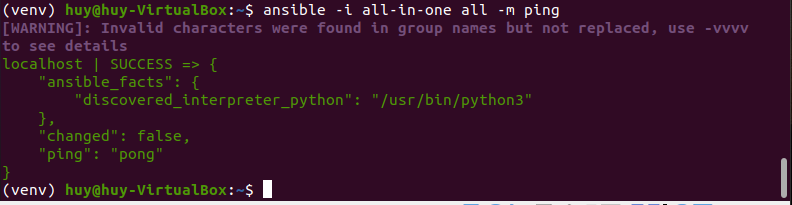


### 3. Create diskspace partition for `Cinder` (*Block Storage*):

```
$ sudo pvcreate /dev/sdb

$ sudo vgcreate cinder-volumes /dev/sdb
```

### 4. Generate Passwords for `Kolla`:
- Stored in `/etc/kolla/passwords.yml` , run commands:

```
$ kolla-genpwd
```

Or

```
$ cd kolla-ansible/tools
$ ./generate_passwords.py
```

### 5. Configure `globals.yml`:

```
$ vi /etc/kolla/globals.yml
```

**Note**: *without specifying `openstack_release`, default value would be `victoria`*

**Example**: Sample `globals.yml` file

```
kolla_base_distro: "ubuntu"
kolla_install_type: "source"

network_interface: enp0s3
neutron_external_interface: enp0s8
kolla_internal_vip_address: 192.168.5.141

nova_compute_virt_type: "qemu"

enable_haproxy: "no"

enable_cinder: "yes"
enable_cinder_backup: "no"
enable_cinder_backend_lvm: "yes"
```

## **D. DEPLOY `OPENSTACK`**
- Bootstrap Server:

```
$ kolla-ansible -i all-in-one bootstrap-servers
```

> Boostrapping Success

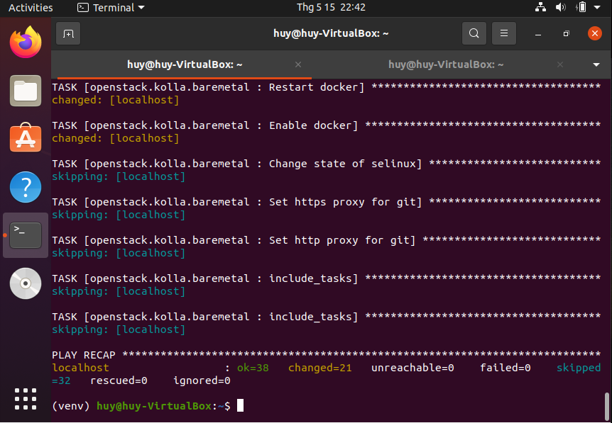


- Precheck Server:
```
$ kolla-ansible -i all-in-one prechecks
```

> Prechecking Success

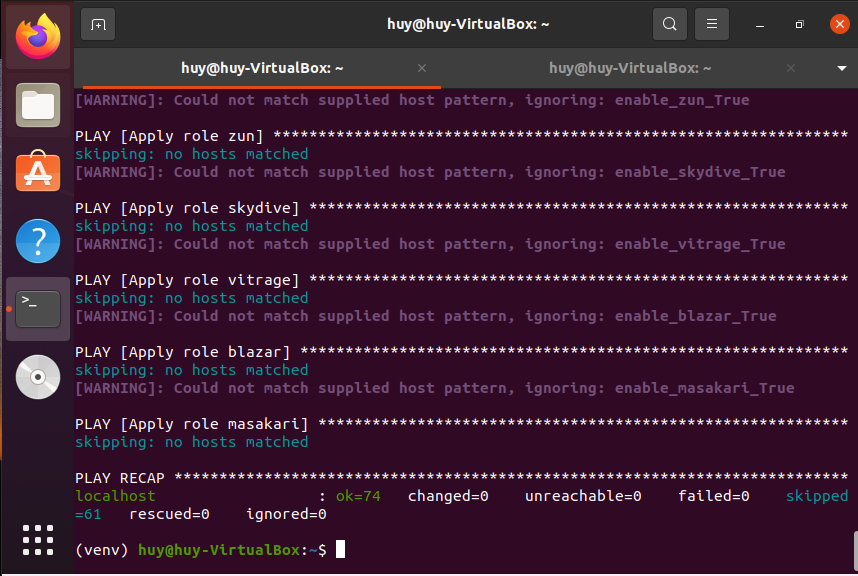

- Pull Images to VM:
```
$ kolla-ansible -i all-in-one pull
```

>  Pulling Images Success

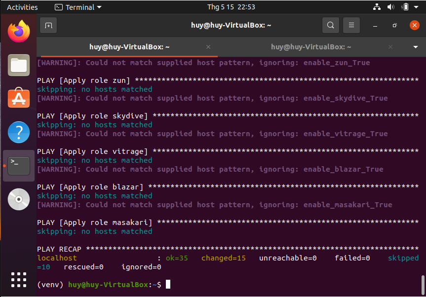

- Deploy:
```
$ kolla-ansible -i all-in-one deploy
```

>  Deploy Success

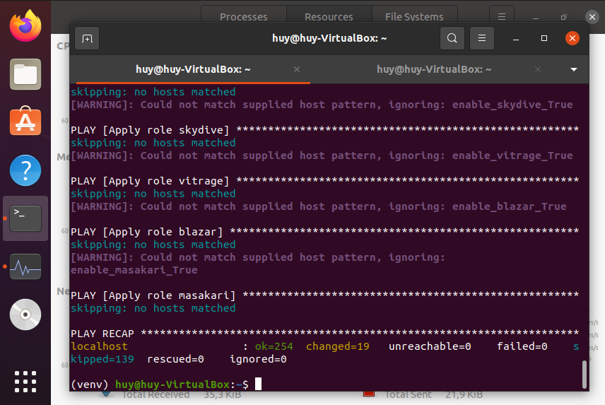

- Post-deploy:
```
$ kolla-ansible -i all-in-one post-deploy
```

## **E. POST-DEPLOYMENT**:

**Note**
> At this point, user may be unable to access Internet due to the activation of `OpenvSwitch`.
 

- Install Openstack CLI:
```
$ pip install python-openstackclient -c https://releases.openstack.org/constraints/upper/yoga
```

- Run `admin-openrc.sh` to add `ENVIRONMENT VARIABLES`: 

```
$ source /etc/kolla/admin-openrc.sh
```

- Generate token:
```
$ openstack token issue
```

> Token generated

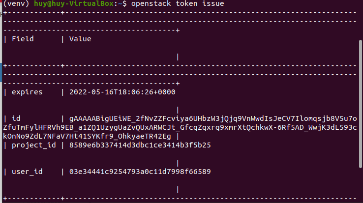


## F. **ACESSING `HORIZON` DASHBOARD**:

- Use following login account:
	- **username**: `admin`
	- **password**: *Run below command to retrieve*
	```
	$ cat /etc/kolla/passwords.yml | grep -i keystone_admin_password
	```
> Password

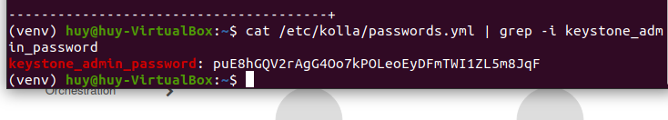

> Openstack Login page

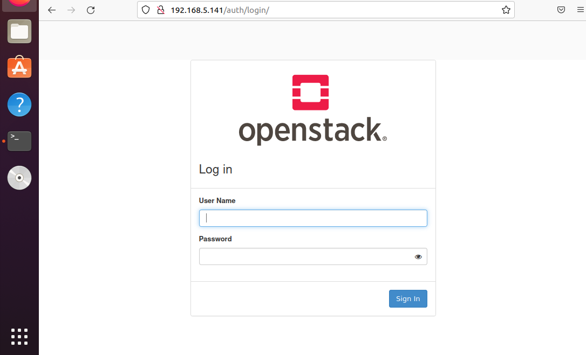

> Openstack Dashboard

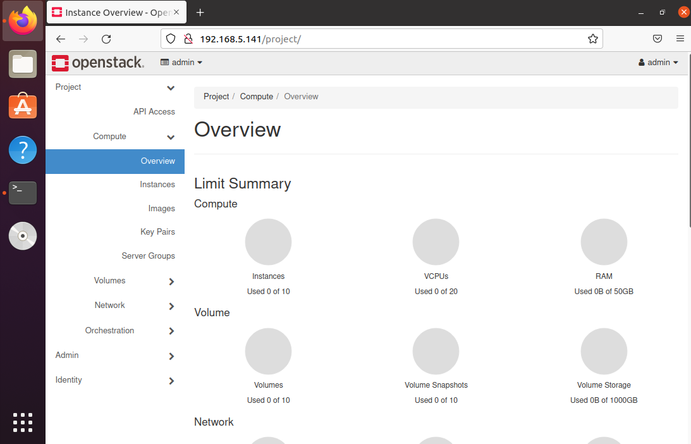

# **IV. REFERENCES**:

- [Official Document of `Kolla Ansible` - Deploy All-in-one Openstack](https://docs.openstack.org/kolla-ansible/yoga/user/quickstart.html)


- [Deploy All-in-one Openstack - NhanHoa](https://news.cloud365.vn/openstack-kolla-phan-1-huong-dan-cai-dat-openstack-train-all-in-one-bang-kolla-ansible/)

---
