# Setup OpenStack ALL IN ONE inside VM with Kolla

## Content 

- [Setup OpenStack ALL IN ONE inside VM with Kolla](#setup-openstack-aio-inside-vm-with-kolla)
  - [Content]()
  - [I. Requirement]()
  - [II. Setup]()
  - [III. Configure Openstack Train with Kolla Ansible]()
  - [IV. Debug]()
  - [References]()

---

## I. Requirement

- Basic knowledge

  - [Ansible]([(https://devdocs.io/ansible~2.11/))
  - [Kolla]([(https://docs.docker.com/))
  - [Openstack]([(https://docs.openstack.org/train/)])

- Confiuration
  - Ubuntu Virtual machine
  - CPU: 4 Core
  
    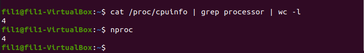
  
  - RAM: 4 GB
  - Disk: 2 
    - OS (sda): 20 GB
    - Data VM (sdb): 20 GB
    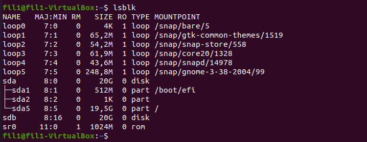
  - Network: 2 interface
    - enp0s3 : this interface is used for the management network
    - enp0s8( ip address: 192.168.56.106):  this interface is dedicated for Neutron external (or public) networks
  - This is my configuration 
    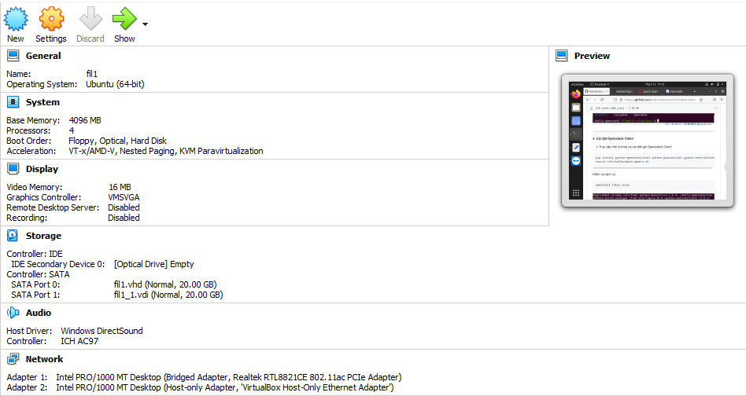

## II. Setup

**1. Update**

```
sudo apt update
sudo apt upgrade

```

**2. Install essentails libraries**

```
sudo apt install python3-dev libffi-dev gcc libssl-dev -y
```

**3. Create virtual enviroment and install essentails libraries**

In this lab, I use a virtual environment to install Kolla Ansible and its dependencies, to avoid conflicts with the system site packages. 

- Install virtual environment
  
 ```
sudo apt install python3-venv -y

python3 -m venv /home/fil1/openstack
```
- Do not forget to active it before running any commands
```
source /home/fil1/openstack/bin/activate
```

- Ensure the latest version of pip is installed:

```
pip install -U pip
```

- Install Ansible. The Release is XENA. Kolla Ansible requires at least Ansible 2.10 and supports up to 4.

```
pip install 'ansible<5.0'
```

- Configure ansible

```
vim home/fil1/ansible.cfg
```
```

    
    [defaults]
    host_key_checking=False
    pipelining=True
    forks=100
```
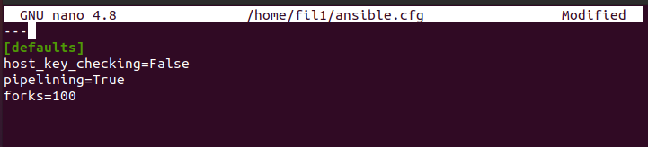

- Install Kolla ansible
```
pip install kolla-ansible
```
- Create /etc/kolla directory and change the ownership of a file
```
sudo mkdir -p /etc/kolla
sudo chown $USER:$USER /etc/kolla
```
- Copy globals.yml and passwords.yml to /etc/kolla directory
```
cp -r /home/fil1/openstack/share/kolla-ansible/etc_examples/kolla/* /etc/kolla
```
- Copy all-in-one inventory files to the current directory
```
cp /home/fil1/openstack/share/kolla-ansible/ansible/inventory/* .
```
- Test the beginning configuration whether the configuration of inventory is correct or not, run:

```
ansible -i all-in-one all -m ping
```
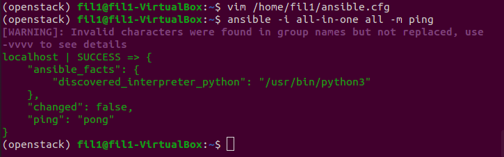

---

## III. Configure Openstack Train with Kolla Ansible

- Create diskspace partition for Cinder

```
sudo pvcreate /dev/sdb
sudo vgcreate cinder-volumes /dev/sdb
```
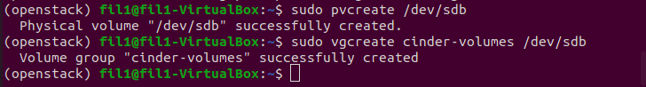

- Passwords stored in /etc/kolla/passwords.yml file  have to be filled either manually or by running random password generator:

```
kolla-genpwd
```
- globals.yml is the main configuration file for Kolla Ansible. Add some few options that are required to deploy Kolla Ansible to this file.

```
vi /etc/kolla/globals.yml

---
kolla_base_distro: "ubuntu"
kolla_install_type: "source"
kolla_internal_vip_address: 192.168.56.106
network_interface: enp0s8
neutron_external_interface: enp0s3
nova_compute_virt_type: "qemu"
enable_haproxy: "no"
enable_cinder: "yes"
enable_cinder_backup: "no"
enable_cinder_backend_lvm: "yes"
```

- **Note:**
  - Kolla provides choice of several Linux distributions in containers. Here I chose ubuntu distribution.
  - kolla_install_type: There are 2 options to deploy Openstack :
    - Install from Source Code: source
    - Install fromm File binary: binary
  - Enable Block Storage service
---
**1. Deployment**

- Bootstrap servers with kolla deploy dependencies:

```
kolla-ansible -i all-in-one bootstrap-servers
```
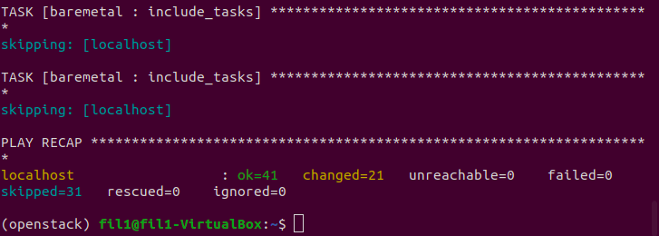


- Do pre-deployment checks for hosts:

```
kolla-ansible -i all-in-one prechecks
```
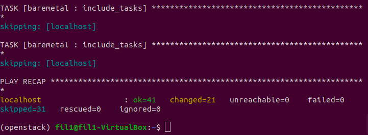


- Pull Image Openstack

```
kolla-ansible -i all-in-one pull
```


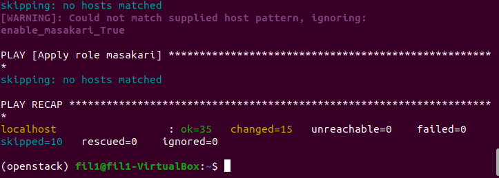

- Finally proceed to actual OpenStack deployment:

```
kolla-ansible -i all-in-one deploy
```

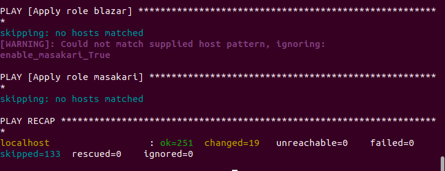


- Post-deploy:

```
kolla-ansible -i all-in-one post-deploy
```
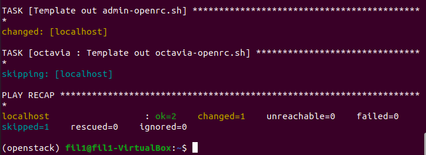


---

**2. Post deployment**

- Install Openstack Command Line Interface:

```
pip install python-openstackclient python-glanceclient python-neutronclient
```
- Run admin-openrc.sh to add ENVIRONMENT VARIABLES:
```
source /etc/kolla/admin-openrc.sh
```

- Token generation:

```
openstack token issue
```
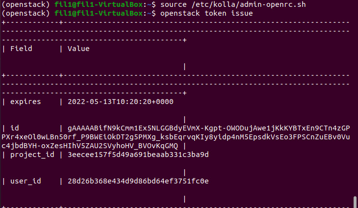

---

**3. Access Horizon**

- Get password. Username: admin

```
cat /etc/kolla/passwords.yml | grep keystone_admin
```

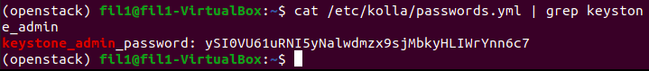


- Finally result:

```
keystone_admin_password: ySI0VU61uRNI5yNalwdmzx9sjMbkyHLIWrYnn6c7
```


- Get access to : <http://192.168.56.106/auth/login/?next=/>.

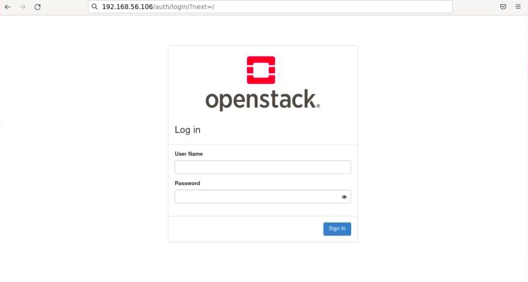

- Fill in login information: *Admin / ySI0VU61uRNI5yNalwdmzx9sjMbkyHLIWrYnn6c7*
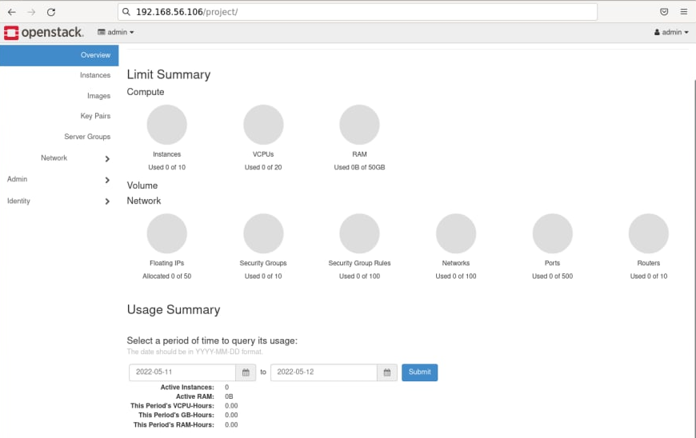

---

## IV. Requirement
- Thuc ra la co nhieu loi lam a, nhung em chi fix duoc mot it thoi a.

## References

- [OpenStack Docs - All-In-One Single VM](https://docs.op)
- [Practice_week3_VDT_2021](https://github.com/vietstacker/Viettel-Digital-Talent-Program-2021/blob/main/Phase-1-Practices/Week-3/Julian-P-Nguyen/Openstack/README.md?fbclid=IwAR1TuOOjr9wcxsxlC5v4SE_bDZVFVNRU8_rBNWKZT1EEgJ3TRc80C87wIhQ)
- [Quick Start - Kolla Ansible](https://docs.openstack.org/kolla-ansible/xena/user/quickstart.html?fbclid=IwAR0Ilbb0poLJ6CZedZfV1c92tG1Yps-clEj0KzTCOg3SPd3yPM1OjmEpSe4)
- [Installing Ansible](https://docs.ansible.com/ansible/latest/installation_guide/intro_installation.html)
- [Bugs Kolla](https://bugs.launchpad.net/kolla/+bugs)
- [Kolla ansible source code](https://github.com/openstack/kolla-ansible)
