# **Viettel-Digital-Talent-2022: Week 3 - Pratice 1**

## **Task: Deploy Openstack using Kolla Ansible**

## **Mục Lục**

- [Mục lục](#mục-lục)
- [I. Overview](#i-overview)
  - [1. Openstack](#1-openstack)
    - [a) Openstack là gì?](#a-openstack-là-gì)
    - [b) Các thành phần cốt lõi của OpenStack](#b-các-thành-phần-cốt-lõi-của-openstack)
  - [2. OpenStack Kolla](#2-openstack-kolla)
- [II. Practicing](#ii-practicing)
  - [1. Requirements](#1-requirements)
    - [a) Kiến thức](#a-kiến-thức)
    - [b) Cấu hình](#b-cấu-hình)
  - [2. Các bước cài đặt](#2-step-by-step)
    - [Step 1: Install dependencies](#step-1-install-dependencies)
    - [Step 2: Install Kolla-ansible](#step-2-install-kolla-ansible)
    - [Step 3: Install ansible galaxy requirements](#step-3-install-ansible-galaxy-requirements)
    - [Step 4: Configure Ansible](#step-4-configure-ansible)
    - [Step 5: Prepare initial configuration](#step-5-prepare-initial-configuration)
    - [Step 6: Deploy OpenStack](#step-6-deploy-openstack)
    - [Step 7: RESULT](#step-7-result)
  - [BUG](#bug)
- [III. References](#iii-references)

## **I. Overview**

### **1. OpenStack**

### *a. OpenStack là gì ?*

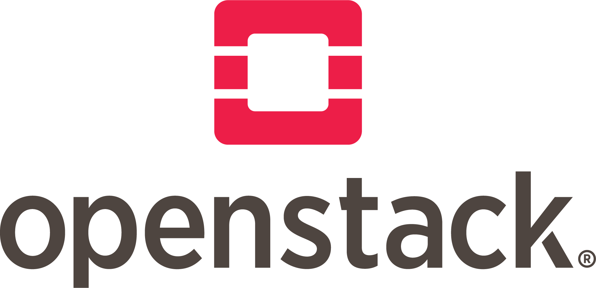

- OpenStack là một dự án Infrastructure-as-a-Service (IaaS) - Cloud Computing có mã nguồn mở, nhằm quản lý các nhóm tài nguyên tính toán, lưu trữ mạng khổng lồ qua một Datacenter.

- OpenStack được bắt đầu bởi NASA và Rackspace từ năm 2010.
  
- Trên trang web chính thức của openstack được khái niệm như sau: "*OpenStack is a cloud operating system that controls large pools of compute, storage, and networking resources throughout a datacenter, all managed and provisioned through APIs with common authentication mechanisms*".

### *b. Các thành phần cốt lõi của OpenStack*

- OpenStack được thiết kế theo kiến trúc modular, tạo điều kiện cho việc mở rộng và tích hợp các thành phần cho phù hợp với nhu cầu.

### **1. Nova**

- Là một module dùng để quản lý các trường máy ảo, nó là một lớp trừu tượng có giao diện và hỗ trợ siêu giám sát.
- Hỗ trợ nhiều Hypervisor: KVM, VMWare, Hyper-V
- Hỗ trợ nhiều backend storage: iCSL, SAN,..

### **2. Glance**

- Là module cung cấp, thu hồi, lưu trữ và phân chia siêu dữ liệu cho các Images được dùng bởi Nova.
- Glance cho phép người dùng lưu trữ và lấy hình ảnh thông qua một dịch vụ web đơn giản.
- Glance bắt tay với Nova để cung cấp hỗ trợ cho dự phòng máy ảo. Nó cũng có sự tương tác với Keystone để xác thực API.

### **3. Swift**

- Đọc và ghi các đối tượng thông qua http.
- Tương tự dịch vụ S3 của AWS( Lưu trữ File).
- Dữ liệu trong Swift có khả nâng tạo các bản sao.
- Có thể triển khai thành dịch vụ độc lập để lưu trữ.
- Tính phân tán, khả năng chống chịu lỗi.

### **4. Neutron**

- Một dịch vụ độc lập thường triển khai một số quy trình qua một số nút. Các quá trình tương tác với nhau và với dịch vụ OpenStack khác.
- Cung cấp dịch vụ về mạng.
- Thay thế nova-network để hướng tới SDN trong OpenStack.
- Có nhiều dịch vụ cao cấp: FWaas, LBaaS, VPNaaS.
- Có cơ chế Plugin để làm việc với các hãng và giải pháp về network khác.
  
### **5. Cinder**

- Cấp các Block Storage gắn vào máy ảo.
- Cung cấp các volume(ổ đĩa) gắn vào máy ảo.
- Có thể khởi tạo các máy từ Volume.
- Có các Plugin để kết nối với các Storage của hãng khác.
- Có thể sao lưu, mở rộng các volume.

### **6. Heat**

- Dùng để triển khai các dịch vụ theo mẫu có sẵn
- Khả năng tính toán, mở rộng hoặc thu hồi tài nguyên
- Là tab "stack" ở trong Horizon

### **7. Ceilometer**

- Dịch vụ giám sát, thống kê tài nguyên mà người dùng sử dụng, đáp ứng tiêu chí "Pay as you go" của Cloud Computing.
- Ceilometer được tích hợp vào Horizon với quyền Admin.

### **8. Keystone**

- Là một module cung cấp các dịch vụ nhận dạng và xác thực
- Theo dõi và xác minh người dùng
- Cung cấp một danh mục các dịch vụ sẵn có với endpoints

### **9. Horizon**

- Cung cấp một giao diện người dùng trên web tới các dịch vụ OpenStack bao gồm Nova, Swift, Keystone, vv Dashboard.

### **2. OpenStack Kolla**

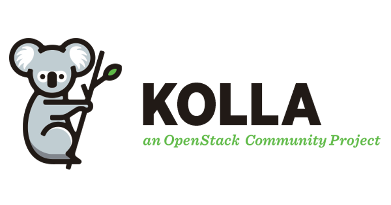

- Dự án OpenStack Kolla là một trong các nỗ lực của cộng đồng OpenInfra nhằm tối ưu hóa quá trình triển khai OpenStack và các thành phần phụ trợ cũng như giảm thiếu được nhiều vấn đề trong quá trình vận hành Cloud bằng việc đóng gói các dịch vụ (OpenStack services, Monitor services, 3rd services) dưới dạng Docker container.

- Về mặt công nghệ, dự án Kolla phát triển dựa trên hai công cụ chính đó là Docker và Ansible. Trong đó, việc triển khai các dịch vụ sẽ được tự động hóa bằng Ansible.

</bg>

## **II. Practicing**

## **1. Requirements**

### ***a. Kiến thức***

- Kiến thức về Ansible. Tìm hiểu thêm tại: <https://news.cloud365.vn/10-phut-ansible-co-ban-phan-1-ansile-dung-de-lam-gi/>
- Kiến thức về Docker. Tìm hiểu thêm tại: <https://news.cloud365.vn/docker-5-phut-cai-dat-docker/>

### ***b. Cấu hình***

- *Thông thường trong việc luyện tập với server, mọi người thường có xu hướng tạo các VM từ các Hyperviser mạnh mẽ như VMWare, VirtualBox,.. Nhưng khi làm việc với OpenStack, mọi người cần có một con VM đủ mạnh mẽ để có thể cài đặt thành công và vận hành mượt mà một đám mây OpenStack.*

- *Vậy nên nếu bạn không có 1 cỗ máy đủ mạnh để tạo ra những con VM mạnh không kém, hãy thuê VM từ các dịch vụ Cloud, với các gói Free cho người dùng lần đầu =))) Trong task này mình sử dụng Digital Ocean là một dịch vụ khá dễ dùng, bạn cũng có thể dùng các dịch vụ khác của AWS, GCP, Azure,.. Các thao tác sẽ khá tương tự*

- **Thông tin về server sử dụng:**

        Ubuntu 20.04 / 
        4vCPUs/ 
        8GB / 
        80GB Disk + 20GB Volume
        IP: 188.166.218.13 (eth0)
        Private IP: 10.104.0.2 (eth1) 

    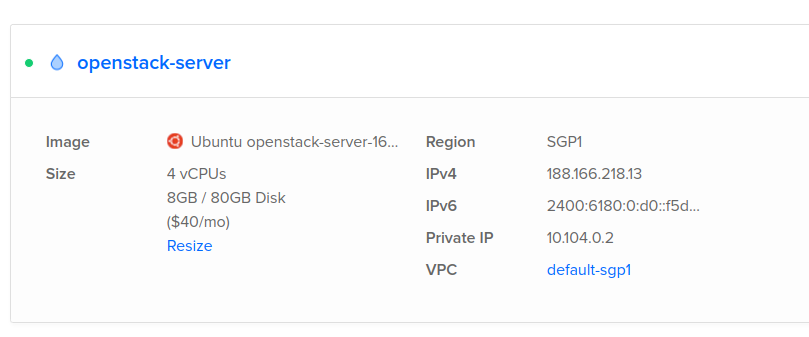

## **2. Step by step**

### **Step 1: Install dependencies**

### 1. Install python build dependencies

    sudo apt-get update 
    sudo apt install python3-dev libffi-dev gcc libssl-dev

### **Install dependencies using a virtual environment**

### 2. Install the virtual environment dependencies

    sudo apt install python3-venv

### 3. Create a virtual environment and active it

    python3 -m venv /path/to/venv
    source /path/to/venv/bin/activate

### 4. Ensure the latest version of pip is installed

    pip install -U pip

### 5. Install ansible (Kolla Ansible requires at least Ansible 4 and supports up to 5)

    pip install 'ansible>=4,<6'

### **Install dependencies not using a virtual environment**

- Tham khảo tại: <https://docs.openstack.org/kolla-ansible/latest/user/quickstart.html>
  
## **Step 2: Install kolla-ansible for deployment or evaluation (using pip)**

### Using Virtual Environment

### 1. Install kolla-ansible and its dependencies using `pip`

    pip install git+https://opendev.org/openstack/kolla-ansible@master

### 2. Create the `/etc/kolla` directory

    sudo mkdir -p /etc/kolla
    sudo chown $USER:$USER /etc/kolla

### 3. Copy `globals.yml` and `password.yml` to `/etc/kolla` directory

    cp -r /path/to/venv/share/kolla-ansible/etc_examples/kolla/* /etc/kolla

### 4. Copy all-in-one and multinode iventory files to the current directory

    cp /path/to/venv/share/kolla-ansible/ansible/inventory/* .

### Add the following to the very beginning of the inventory

`localhost ansible_python_interpreter=python`

## **Step 3: Install ansible galaxy requirements**

    kolla-ansible install-deps

## **Step 4: Configure Ansible**

### 1. Create and add the following options to the Ansible configuration file `/etc/ansible/ansible.cfg`

    [defaults]
    host_key_checking=False
    pipelining=True
    forks=100

### Test config by command

    ansible -i all-in-one all -m ping

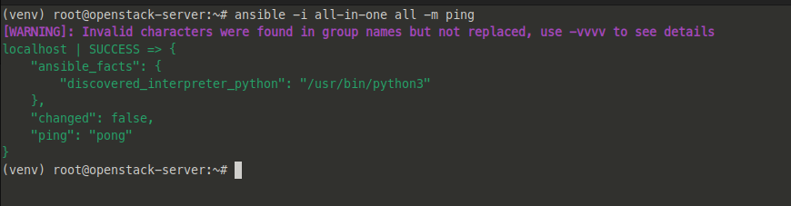
  
## **Step 5: Prepare initial configuration**

### 1. Create diskspace partition for `Cinder` (Block Storage )

- Đối với các VM thuê từ dịch vụ Digital Ocean, bạn có thể thêm volume bằng cách sau:

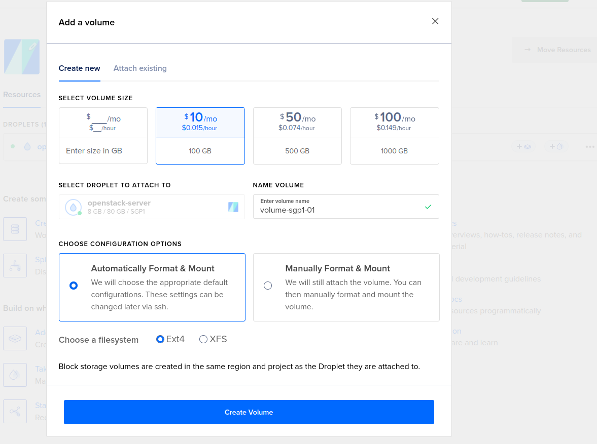

- Kiểm tra (ở đây mình thêm `/dev/sda` với dung lượng 20GB):

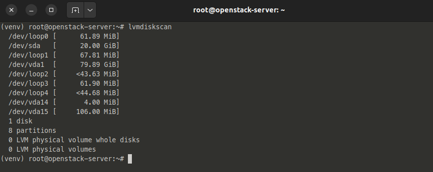

- Sau khi đã có thêm 1 Disk, thực hiện các bươcs sau để tạo `Cinder` group:

    sudo pvcreate /dev/sdb
    sudo vgcreate cinder-volumes /dev/sdb

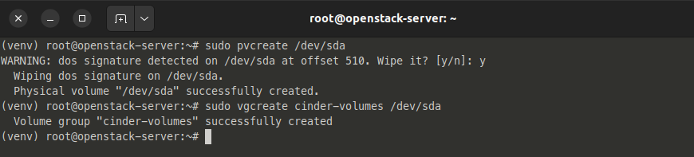

### 2. Kolla passwords

    kolla-genpwd

- (Create file `/etc/kolla/passwords.yml`, contain service password in OpenStack < Nova, Cinder, Neutron, Keystone, Glance,...>)

### 3. Kolla `globals.yml`

    sudo nano /etc/kolla/globals.yml
  
- add below script to `globals.yml` file

        kolla_base_distro: "ubuntu"
        kolla_install_type: "source"
        
        kolla_internal_vip_address: "188.166.218.13"
        network_interface: "eth0"
        neutron_external_interface: "eth1"
        nova_compute_virt_type: "qemu"
        enable_haproxy: "no"
        enable_cinder: "yes"
        enable_cinder_backup: "no"
        enable_cinder_backend_lvm: "yes"

## **Step 6: Deploy OpenStack**

### 1. Bootstrap servers with kolla deploy dependencies

    kolla-ansible -i all-in-one bootstrap-servers

- Result:

    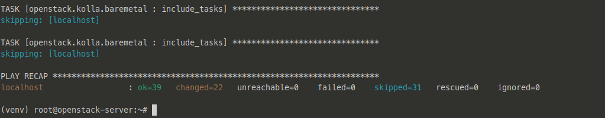

### 2. Do Pre-deployment checks for hosts

    kolla-ansible -i all-in-one prechecks

- Result:

    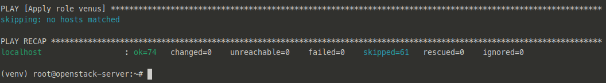

### 3. Pull Image

    kolla-ansible -i all-in-one pull 

- Result:

    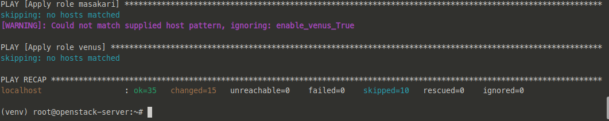

### 4. Finally proceed to actual OpenStack Deployment

    kolla-ansible -i all-in-one deploy

- Result:

    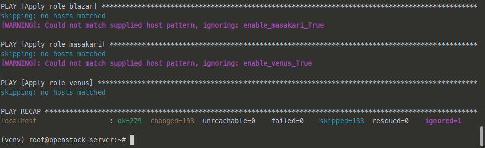

## **Step 7: RESULT**

### 1. install openstack CLI

    pip install python-openstackclient python-glanceclient python-neutronclient -->

### 2. Checking OpenStack

- Open virtual env `/etc/kolla/admin-opensrc.sh`

        source /etc/kolla/admin-opensrc.sh

- generate token:

        openstack tokken issue

#### 3. Access Horizon

- Login Page:

    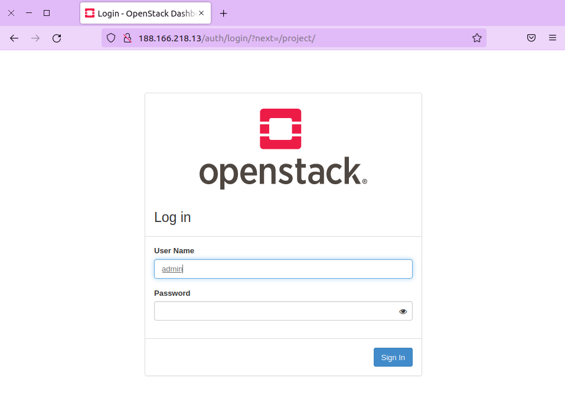

- Get password for admin username.

        cat /etc/kolla/passwords.yml | grep keystone_admin

- Access horizon

        username: admin
        password: NaMmcTxOHRa4cD6bNEWDkb08efRQJQL34rwnr5uF

- OpenStack Dashboard

    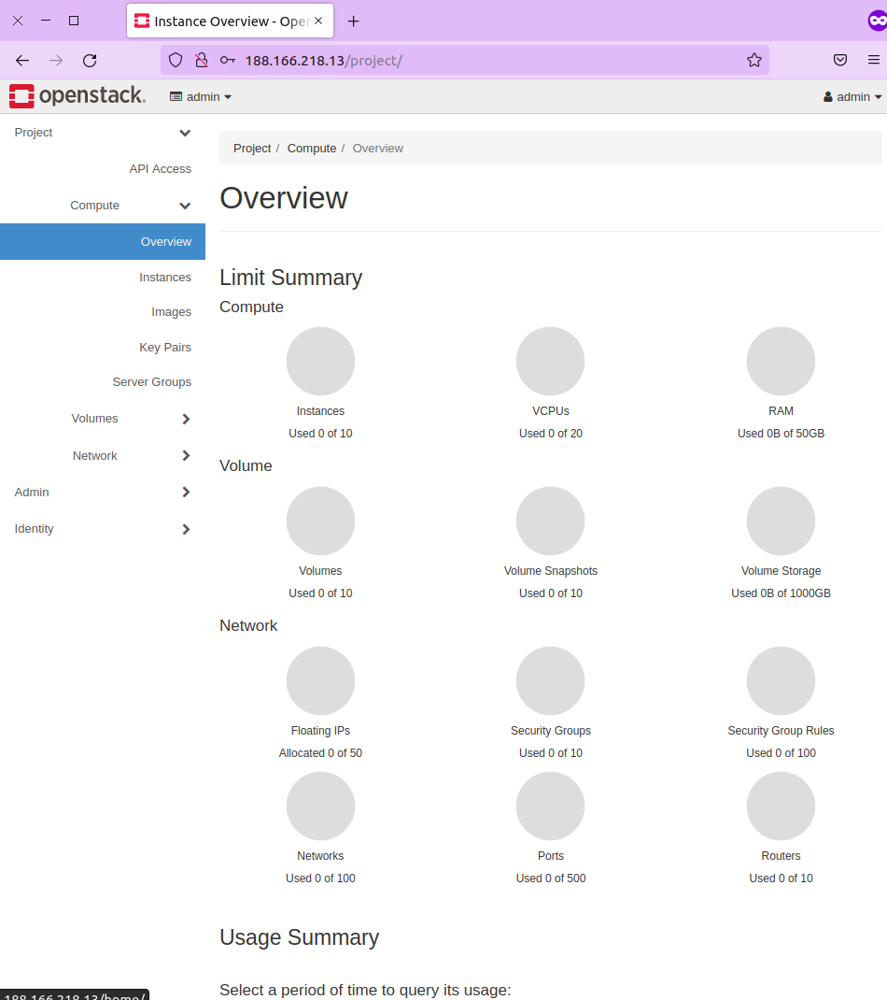

## **BUG**

### 1. Bug docker SDK version

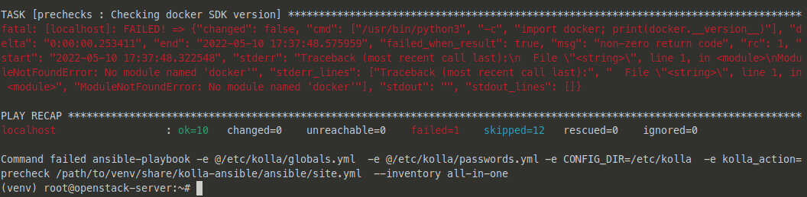

- Nguyên nhân có thể do bản thân các VM tạo ra từ dịch vụ Digital Ocean đều đã được cài sẵn docker, gây ra xung đột, không tương thích các phiên bản, (hoặc cũng có thể do thiếu pip docker @^@ )

- fix:

        sudo pip install -U docker

### 2. TASK [cinder : Checking LVM volume group exists for Cinder]

        ### TASK [cinder : Checking LVM volume group exists for Cinder] **********************************************************************************************************************************************************************************

        fatal: [localhost]: FAILED! => {"changed": false, "cmd": ["vgs", "cinder-volumes"], "delta": "0:00:00.061967", "end": "2022-05-06 16:52:10.082823", "failed_when_result": true, "msg": "non-zero return code", "rc": 5, "start": "2022-05-06 16:52:10.020856", "stderr": "  Volume group \"cinder-volumes\" not found\n  Cannot process volume group cinder-volumes", "stderr_lines": ["  Volume group \"cinder-volumes\" not found", "  Cannot process volume group cinder-volumes"], "stdout": "", "stdout_lines": []}

- Lỗi này có thể đến từ một số nguyên nhân: bạn chưa tạo group volume cho `Cinder`, tên group có thể đang có chút sai:
- fix: Sửa chữa trong file `global.yml` (enable) cinder_volume_group: "cinder-volumes".

### 3. Heat-Bug

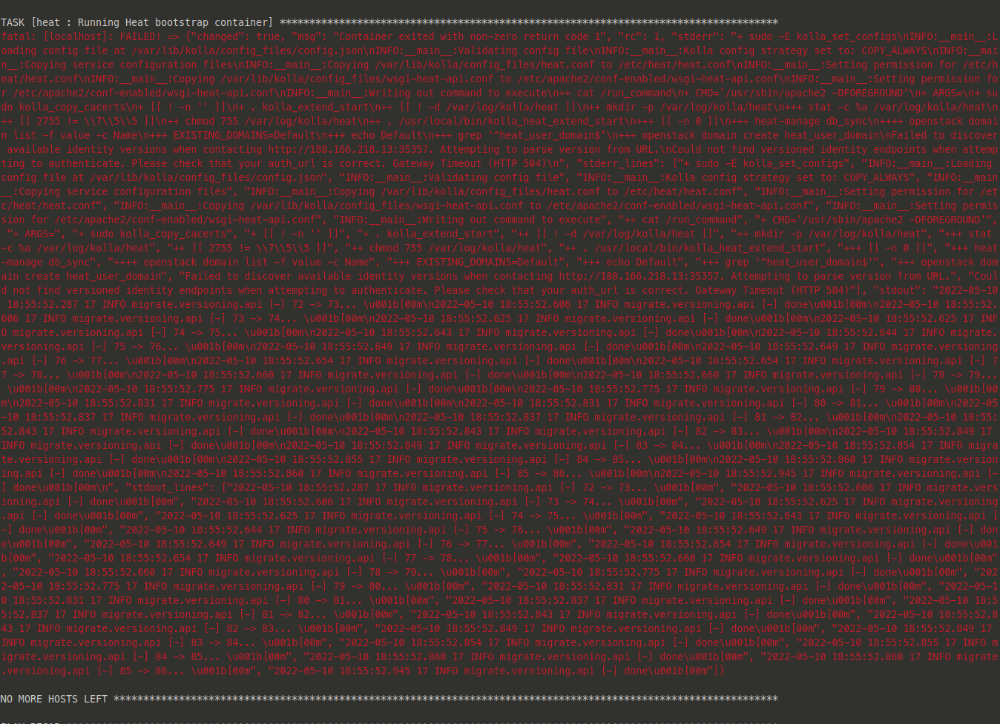

- Nhìn rất khủng bố, nếu như bạn gặp lỗi này, hãy tắt sử dụng `heat` trong `globals.yml`
- Trong `globals.yml`:

        enalbe_heat: "no"

### 4. Something went wrong

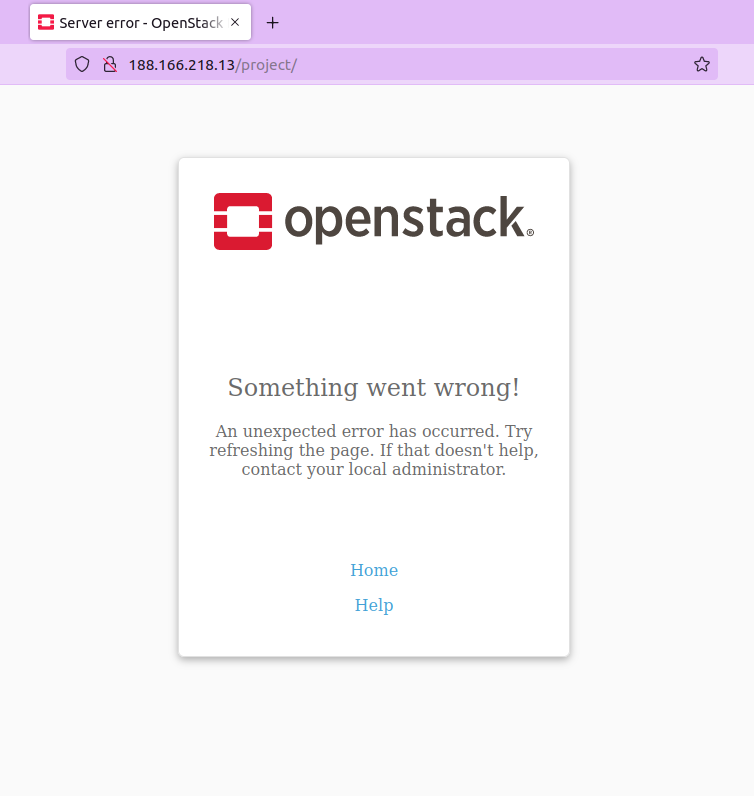

- Fix: tham khảo tại: <https://techglimpse.com/openstack-icehouse-errors-fix-linux/>

### 5. Lag

- Nếu bạn thao tác với Horizon hoặc Openstack CLI mà thời gian phản hồi quá lâu (Có khi đến vài phút cho 1 lệnh), thì có thể là do VM của bạn đang bị quá tải.

- Thử kiểm tra tài nguyên của máy

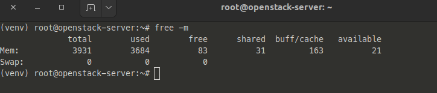

- Nếu VM của bạn đang bị cao tải, giải pháp duy nhất là nâng cấp nó lên :v,Hãy tắt server, sau đó thêm tí ram, thêm tí core cho nó mượt.

## III. References

- [1] <https://longvan.net/openstack-la-gi.html>
- [2] <https://github.com/vietstacker/Viettel-Digital-Talent-Program-2021/blob/main/Phase-1-Practices/Week-3/LeMinhTan/openStack/README.md>
- [3] <https://github.com/hocchudong/thuctap032016/blob/master/NDChien/NDChien_VaitrovacacthanhphantrongprojectOpenStack.md#5>
- [4] <https://github.com/meobilivang/phase-1-vtdc-vtnet/blob/master/Week%203/Openstack/README.md>
- [5] <https://docs.openstack.org/kolla-ansible/latest/user/quickstart.html>
