# Practice 1: Setup OpenStack AIO inside VM with Kolla
---
## **Table of Contents:**

### I. Overview

- #### A. Openstack

- #### B. Kolla-Ansible

### II. OpenStack AIO Setup Process
- #### Install dependencies
- #### Configure
- #### Openstack Deployment
- #### Using Openstack

### III. REFERENCES

---


## **I. OVERVIEW**:

### **A. OPENSTACK**: 

#### **1. Overview:**


OpenStack is a set of software components that provide common services for cloud infrastructure
- The best cloud-computing open-source project aimed at providing an IaaS (Infrastructure As a Service).  
- Openstack controls large pools of compute, storage, and networking resources, all managed through APIs or a dashboard
- OpenStack began in 2010 as a joint project of Rackspace Hosting and NASA. As of 2012, it was managed by the OpenStack Foundation, which was renamed as the [`Open Infrastructure Foundation`](https://openinfra.dev/) in 2021.

#### **2. Core Components:**

An OpenStack deployment contains a number of components providing APIs to access infrastructure resources
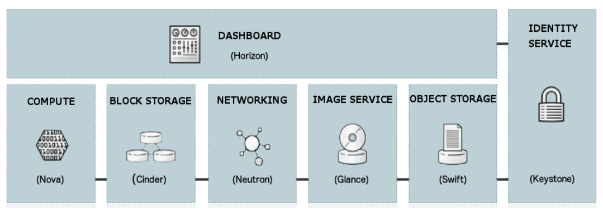
 - **Horizon**: The implementation of OpenStack’s Dashboard, which provides a web based user interface to OpenStack services including Nova, Swift, Keystone, etc.
 - **Nova**: The OpenStack project that provides a way to provision compute instances (aka virtual servers). Nova supports creating virtual machines.
 - **Cinder**: The OpenStack Block Storage service for providing volumes to Nova virtual machines, Ironic bare metal hosts, containers and more.
 - **Neutron**: An OpenStack project to provide “network connectivity as a service” between interface devices managed by other OpenStack services. It implements the OpenStack Networking API.
 - **Glance**: Maintan and manages packages(images, metadata,..) in Cloud
 - **Swift**: Store lots of data efficiently, safely, and cheaply
 - **Keystone**: An OpenStack service that provides API client authentication, service discovery, and distributed multi-tenant authorization by implementing OpenStack’s Identity API

### **B. KOLLA-ANSIBLE**: 
Kolla Ansible deploys OpenStack services and infrastructure components in Docker containers

Kolla's mission statement is:
 > To provide production-ready containers and deployment tools for operating OpenStack clouds.


### **B. System Requirements:**
#### **1. Set up the virtual machine:**
- **Desktop Hypervisior**: [VirtualBox](https://www.virtualbox.org/wiki/Downloads), [VMware workstation](https://www.vmware.com/products/workstation-pro/workstation-pro-evaluation.html) 
- **Operating System (OS)**: Ubuntu  

#### **2. Resources:**
The virtual machine must satisfy these requirement:
- **2 network interfaces**
    - enp0s3: 10.0.2.15/24
    - enp0s8: 10.0.3.15/24


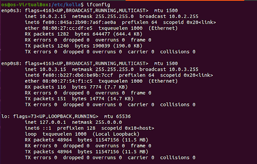


- **8GB main memory**
- **40GB disk space (2 disk with 20GB each)** 
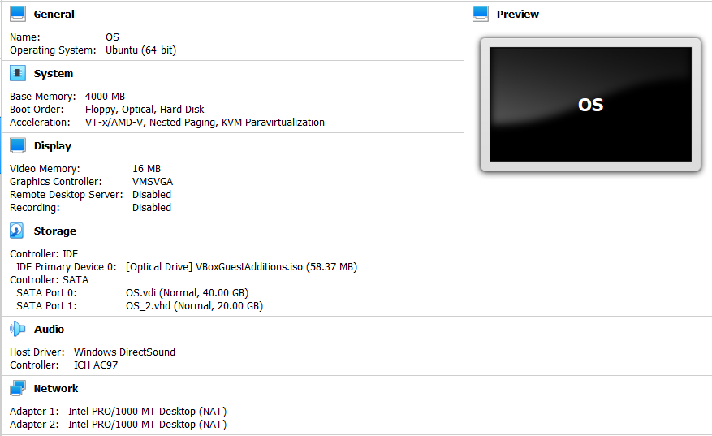

## **II. OpenStack AIO Setup Process**:

## Install dependencies
### 1. Update package & install essentials dependencies:

```
$ sudo apt update

$ sudo apt install python3-dev libffi-dev gcc libssl-dev
```
### 2. Install dependencies using a virtual environment
We should use a virtual environment to install Kolla Ansible and its dependencies, to avoid conflicts with the system site packages
- Install the virtual environment dependencies
```
$ sudo apt install python3-venv
```
- Create a virtual environment and activate it:
```
$ python3 -m venv /openstack
$ source /openstack/bin/activate
```
- Ensure the latest version of pip is installed:
```
$ pip install -U pip
```
### 3. Install `Ansible` & `Kolla-Ansible`:

- Install `Ansible`:
```
$ sudo pip install 'ansible==4.0.0'
```

- Install `Kolla-ansible`:

```
$ sudo pip install kolla-ansible
```
## Configure
### 1. Config `Kolla-Ansible` & `Ansible`:
- Create `/etc/kolla`  directory:

```
$ sudo mkdir -p /etc/kolla
$ sudo chown $USER:$USER /etc/kolla
```

### 2. Copy the configuration files (globals.yml and password.yml) to `/etc/kolla directory`:
 
```
$ cp -r usr/local/share/kolla-ansible/etc_examples/kolla/* /etc/kolla
```

### 3. Configure `Ansible`:
- Create config file in text editor

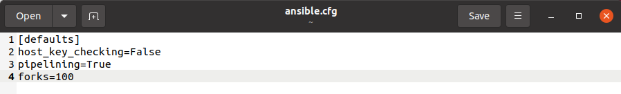


- Create `/etc/kolla`  directory to store config file
```
$ mkdir -p /etc/ansible

$ sudo cp -r /home/os/ansible.cfg /etc/ansible
```


### 4. Check configurations:
Ping to check whether the configuration of inventory is correct or not:
```
$ ansible -i all-in-one all -m ping
```

> Ping Success:

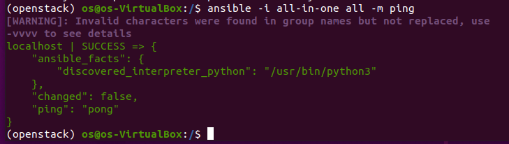


### 5. Create diskspace partition for `Cinder`:

```
$ sudo pvcreate /dev/sdb

$ sudo vgcreate cinder-volumes /dev/sdb
```

### 6. Kolla passwords:
Passwords are stored in /etc/kolla/passwords.yml file
- Generate passwords:

```
$ cd /etc/kolla/
$ kolla-genpwd
```

### 7. Configure `globals.yml`:

```
$ cd /etc/kolla
```
- Edit file by file editor


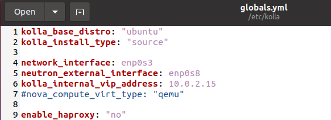


## **OPENSTACK DEPLOYMENT**
- Bootstrap servers with kolla deploy dependencies

```
$ kolla-ansible -i all-in-one bootstrap-servers
```


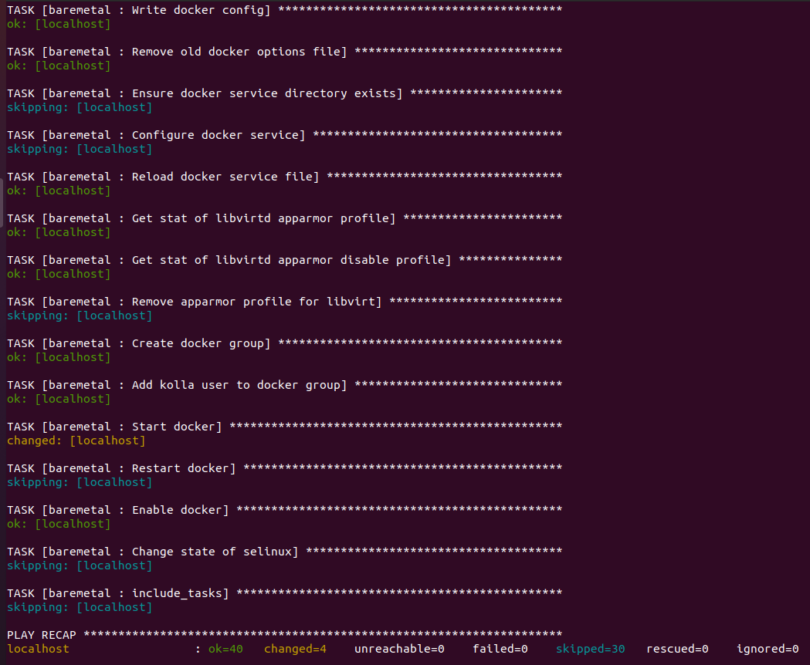


- Do pre-deployment checks for hosts:
```
$ kolla-ansible -i all-in-one prechecks
```


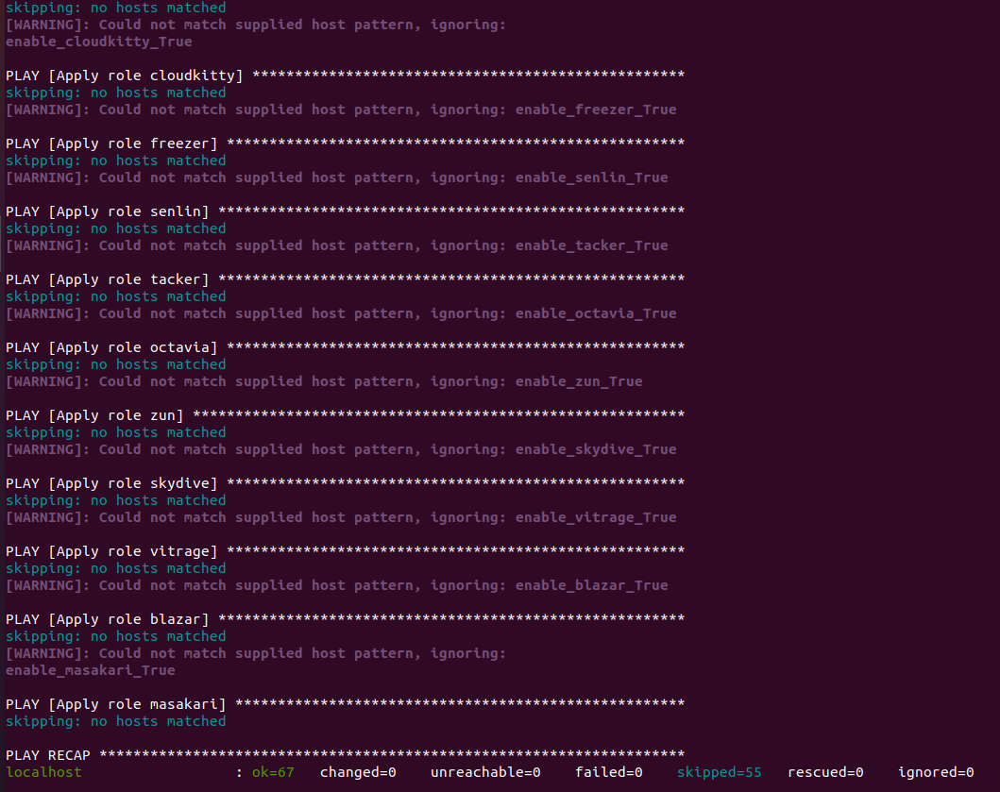


- Pull OpenStack images
```
$ kolla-ansible -i all-in-one pull
```


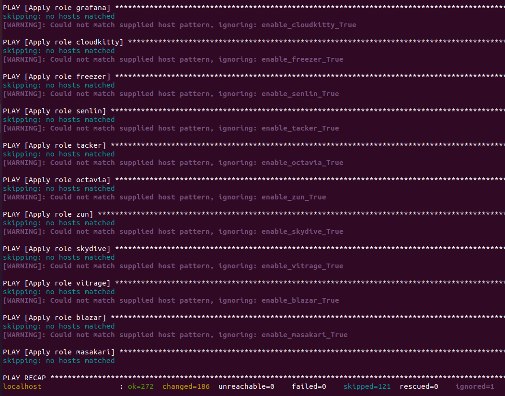


- OpenStack deployment:
```
$ kolla-ansible -i all-in-one deploy
```


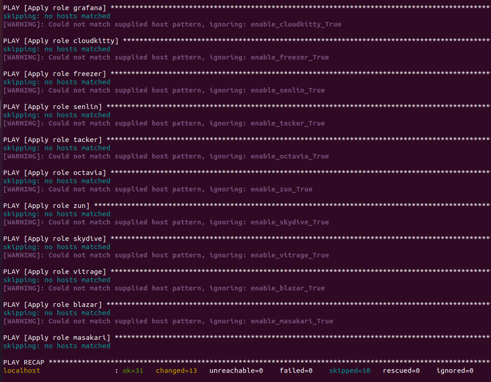


## **Using Openstack**:

 

- Install Openstack CLI:
```
$ pip install python-openstackclient python-glanceclient python-neutronclient
```

OpenStack requires an openrc file where credentials for admin user are set.
- Create `/etc/kolla/admin-openrc.sh`

```
$ vi /etc/kolla/admin-openrc.sh
```


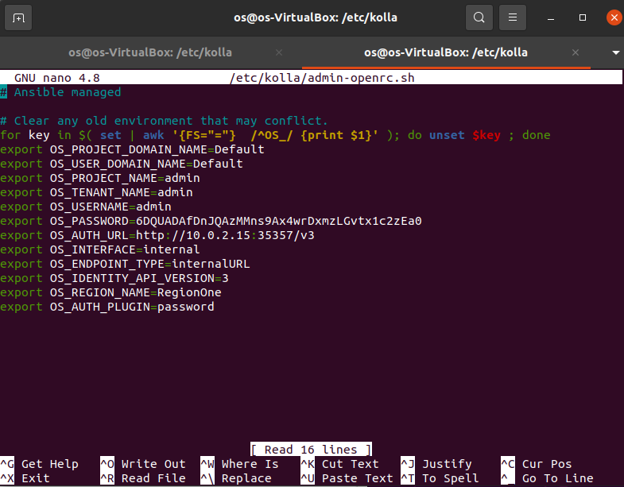


- Run `admin-openrc.sh` to add `ENVIRONMENT VARIABLES`: 
```
$ source /etc/kolla/admin-openrc.sh
```

- Generate token:
```
$ openstack token issue
```


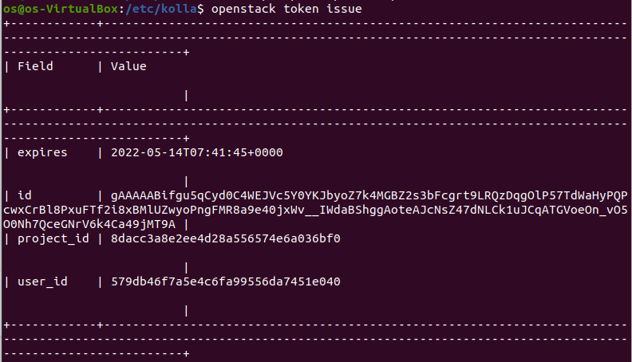


- Access `10.0.2.15/auth/login/?next=/`:


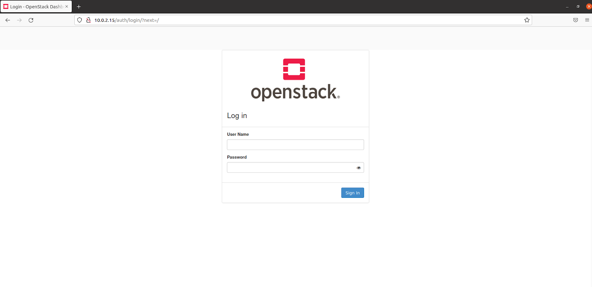


- Use following login account:
	- **username**: `admin`
	- **password**: Run this command to get password
	```
	$ cat /etc/kolla/passwords.yml | grep -i keystone_admin_password
	```


- Openstack Dashboard


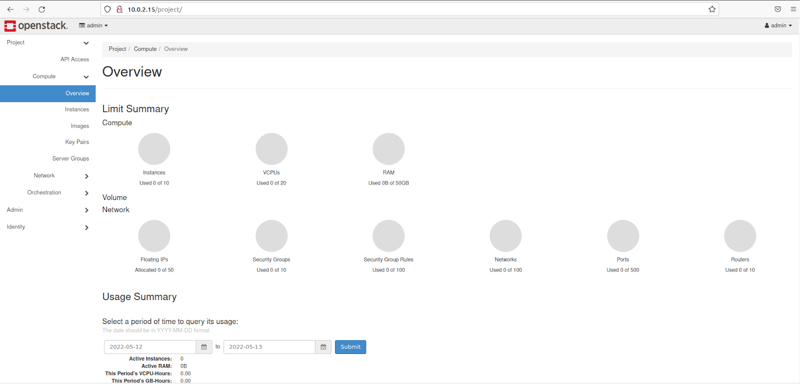


# **III. REFERENCES**:

- [User Guide of Kolla Ansible - Openstack.org](https://docs.openstack.org/kolla-ansible/latest/user/index.html)


- [Openstack wikipedia](https://en.wikipedia.org/wiki/OpenStack)

- [Kolla-ansible Github](https://github.com/openstack/kolla-ansible)
