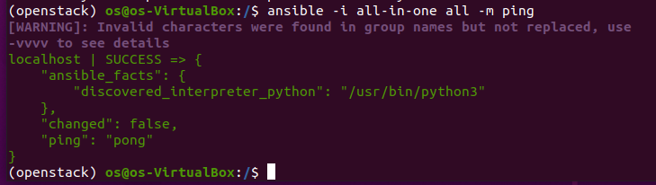
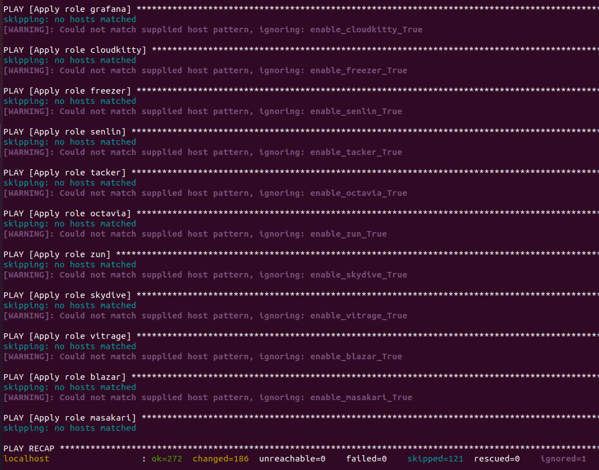
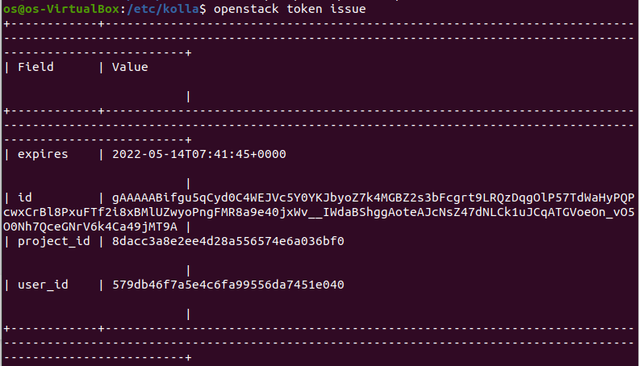

# Practice 1: Setup OpenStack AIO inside VM with Kolla
---
## **I. OVERVIEW**:

### **A. OPENSTACK**: 

#### **1. Overview:**


OpenStack is a set of software components that provide common services for cloud infrastructure
- The best cloud-computing open-source project aimed at providing an IaaS (Infrastructure As a Service).  
- Openstack controls large pools of compute, storage, and networking resources, all managed through APIs or a dashboard
- OpenStack began in 2010 as a joint project of Rackspace Hosting and NASA. As of 2012, it was managed by the OpenStack Foundation, which was renamed as the [`Open Infrastructure Foundation`](https://openinfra.dev/) in 2021.

#### **2. Core Components:**

An OpenStack deployment contains a number of components providing APIs to access infrastructure resources

 - **Horizon**: The implementation of OpenStack’s Dashboard, which provides a web based user interface to OpenStack services including Nova, Swift, Keystone, etc.
 - **Nova**: The OpenStack project that provides a way to provision compute instances (aka virtual servers). Nova supports creating virtual machines.
 - **Cinder**: The OpenStack Block Storage service for providing volumes to Nova virtual machines, Ironic bare metal hosts, containers and more.
 - **Neutron**: An OpenStack project to provide “network connectivity as a service” between interface devices managed by other OpenStack services. It implements the OpenStack Networking API.
 - **Glance**: Maintan and manages packages(images, metadata,..) in Cloud
 - **Swift**: Store lots of data efficiently, safely, and cheaply
 - **Keystone**: An OpenStack service that provides API client authentication, service discovery, and distributed multi-tenant authorization by implementing OpenStack’s Identity API

### **B. KOLLA-ANSIBLE**: 
Kolla Ansible deploys OpenStack services and infrastructure components in Docker containers

Kolla's mission statement is:
 > To provide production-ready containers and deployment tools for operating OpenStack clouds.


### **B. System Requirements:**
#### **1. Set up the virtual machine:**
- **Desktop Hypervisior**: [VirtualBox](https://www.virtualbox.org/wiki/Downloads), [VMware workstation](https://www.vmware.com/products/workstation-pro/workstation-pro-evaluation.html) 
- **Operating System (OS)**: Ubuntu  

#### **2. Resources:**
The virtual machine must satisfy these requirement:
- **2 network interfaces**
- **8GB main memory**
- **40GB disk space (2 disk with 20GB each)** 


## **III. OpenStack AIO Setup Process**:

## **Install dependencies**:

### 1. Update `apt` & install essentails dependencies:

```
$ sudo apt update

$ sudo apt install python3-dev libffi-dev gcc libssl-dev
```
### 3. Using `virtualenv`:
- Install `virtualenv`:
```
$ sudo apt install python3-venv
```
- Create `virutalenv` & activate that environment:
```
$ python3 -m venv /openstack

$ source /openstack/bin/activate
```

### 4. Install `Ansible` & `Kolla-Ansible` (within `virtualenv`):

- Install `Ansible`:
```
$ sudo pip install 'ansible==4.0.0'
```

- Install `Kolla-ansible`:

```
$ sudo pip install kolla-ansible
```

### 5. Install `Openstack CLI`:
> *Optional at this point*

```
$ pip install python-openstackclient python-glanceclient python-neutronclient
```

## **B. CONFIGURE `Kolla-Ansible` & `Ansible`**:
### 1. Create `/etc/kolla`  directory:

```
$ sudo mkdir -p /etc/kolla
$ sudo chown $USER:$USER /etc/kolla
```

### 2. Copy `passwords.yml` to `/etc/kolla`:
 
```
$ cp -r <path-to-virtualenv>/share/kolla-ansible/etc_examples/kolla/* /etc/kolla
```

### 3. Configure `Ansible`:

```
$ mkdir -p /etc/ansible
Create config file in text editor
```


```
$ config="[defaults]\nhost_key_checking=False\npipelining=True\nforks=100"

$ sudo cp -r /home/os/ansible.cfg /etc/ansible

```

## **C. PRE-DEPLOY CONFIGURATIONS**:


### 2. Run `ad-hoc` command `ping` to check configurations:
```
$ ansible -i all-in-one all -m ping
```

> Ping Success:




### 3. Create diskspace partition for `Cinder` (*Block Storage*):

```
$ sudo pvcreate /dev/sdb

$ sudo vgcreate cinder-volumes /dev/sdb
```

### 4. Generate Passwords for `Kolla`:
- Stored in `/etc/kolla/passwords.yml` , run commands:

```
$ cd /etc/kolla/
$ kolla-genpwd
```

### 5. Configure `globals.yml`:

```
$ vi /etc/kolla/globals.yml
```

**Note**: *without specifying `openstack_release`, default value would be `victoria`*

**Example**: Sample `globals.yml` file

```

```

## **D. DEPLOY `OPENSTACK`**
- Bootstrap Server:

> **Debug**: [*Ansible Module Missing*](#'2.-`Cannot-import-name-'AnsibleCollectionLoader'-from-'ansible.utils.collection_loader'-during-Boostrapping`')

```
$ kolla-ansible -i all-in-one bootstrap-servers
```

> Boostrapping Success


- Precheck Server:
```
$ kolla-ansible -i all-in-one prechecks
```

> Prechecking Success


- Pull Images to VM:
```
$ kolla-ansible -i all-in-one pull
```

>  Pulling Images Success



- Deploy:
```
$ kolla-ansible -i all-in-one deploy
```

>  Deploy Success


## **E. POST-DEPLOYMENT**:

**Note**
> At this point, user may be unable to access Internet due to the activation of `OpenvSwitch`.
 

- Install Openstack CLI:
```
$ pip install python-openstackclient python-glanceclient python-neutronclient
```

- Run `admin-openrc.sh` to add `ENVIRONMENT VARIABLES`: 
> **Debug**: [*`admin-rc.sh` Not found*](#'3.-`admin-openrc.sh`-missing')
```
$ source /etc/kolla/admin-openrc.sh
```


- Generate token:
```
$ openstack token issue
```

> Token generated





## F. **ACESSING `HORIZON` DASHBOARD**:

- Use following login account:
	- **username**: `admin`
	- **password**: *Run below command to retrieve*
	```
	$ cat /etc/kolla/passwords.yml | grep -i keystone_admin_password
	```

> Openstack Login page


> Openstack Dashboard


# **V. REFERENCES**:

- [Official Document of `Kolla Ansible` - Deploy All-in-one Openstack](https://docs.openstack.org/kolla-ansible/latest/user/quickstart.html)


- [Deploy All-in-one Openstack - NhanHoa](https://news.cloud365.vn/openstack-kolla-phan-1-huong-dan-cai-dat-openstack-train-all-in-one-bang-kolla-ansible/)

- [Deploy Openstack w/ `Kolla-Ansible` - HocChuDong](https://github.com/hocchudong/openstack-tools/tree/master/docs/kolla)
