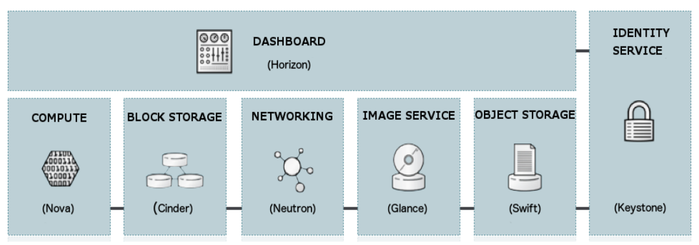

# Practice 1: Setup OpenStack AIO inside VM with Kolla
---
## **I. OVERVIEW**:

### **A. OPENSTACK**: 

#### **1. Overview:**

OpenStack is a set of software components that provide common services for cloud infrastructure
- The best cloud-computing open-source project aimed at providing an IaaS (Infrastructure As a Service).  
- Openstack controls large pools of compute, storage, and networking resources, all managed through APIs or a dashboard
- OpenStack began in 2010 as a joint project of Rackspace Hosting and NASA. As of 2012, it was managed by the OpenStack Foundation, which was renamed as the [`Open Infrastructure Foundation`](https://openinfra.dev/) in 2021.

#### **2. Core Components:**

An OpenStack deployment contains a number of components providing APIs to access infrastructure resources

 - **Horizon**: The implementation of OpenStack’s Dashboard, which provides a web based user interface to OpenStack services including Nova, Swift, Keystone, etc.
 - **Nova**: The OpenStack project that provides a way to provision compute instances (aka virtual servers). Nova supports creating virtual machines.
 - **Cinder**: The OpenStack Block Storage service for providing volumes to Nova virtual machines, Ironic bare metal hosts, containers and more.
 - **Neutron**: An OpenStack project to provide “network connectivity as a service” between interface devices managed by other OpenStack services. It implements the OpenStack Networking API.
 - **Glance**: Maintan and manages packages(images, metadata,..) in Cloud
 - **Swift**: Store lots of data efficiently, safely, and cheaply
 - **Keystone**: An OpenStack service that provides API client authentication, service discovery, and distributed multi-tenant authorization by implementing OpenStack’s Identity API

### **B. KOLLA-ANSIBLE**: 
Kolla Ansible deploys OpenStack services and infrastructure components in Docker containers

Kolla's mission statement is:
 > To provide production-ready containers and deployment tools for operating OpenStack clouds.

### **B. System Requirements:**
#### **1. Set up the virtual machine:**
- **Desktop Hypervisior**: [VirtualBox](https://www.virtualbox.org/wiki/Downloads), [VMware workstation](https://www.vmware.com/products/workstation-pro/workstation-pro-evaluation.html) 
- **Operating System (OS)**: Ubuntu  

#### **2. Resources:**
The virtual machine must satisfy these requirement:
- **2 network interfaces**
- **8GB main memory**
- **40GB disk space (2 disk with 20GB each)** 

## **III. OpenStack AIO Setup Process**:
