# WEEK-1 PRACTICE DOCUMENTATION   
 
----     
## Hướng dẫn cài Ubuntu Server 20.04 trên Virtualbox         

# Mục lục   
### [1. Tạo Virtual Machine ](#1)     
### [2. Install Ubuntu Server 20.04 on VM](#2)   

## [Tài liệu tham khảo](#3)   

----   

   

## 1. Tạo Virtual Machine    
- Bước 1: Tải và cài đặt Virtualbox trên máy tính. Bạn có thể tải phiên bản mới nhất của [VirtualBox](https://taimienphi.vn/download-virtualbox-1177) tại đây.   

- Bước 2: Mở chương trình sau đó nhấn vào `New` trên menu ngang.    

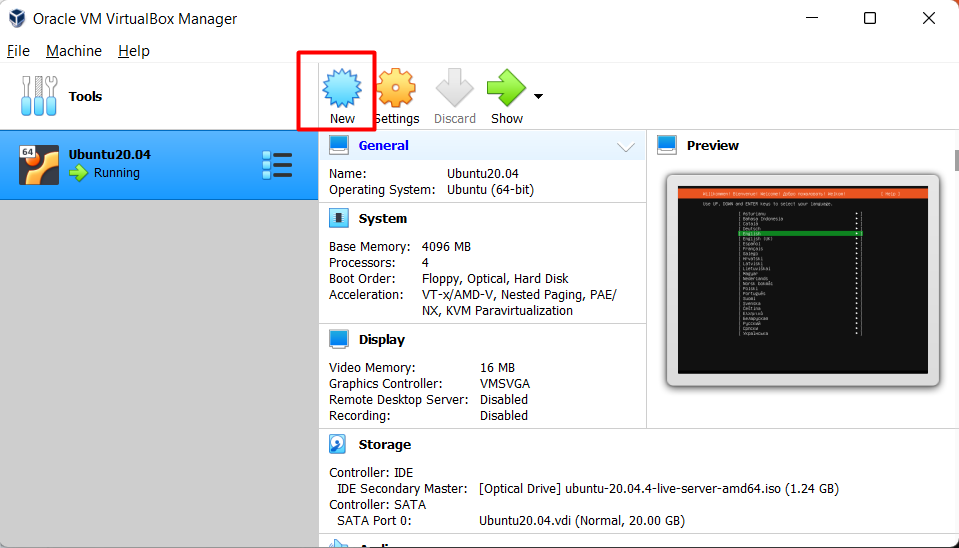   

- Bước 3: Hộp thoại mới hiện ra  
   - `Name`: Nhập tên máy ảo    
   - `Machine Folder`: Chọn thư mục bạn muốn lưu máy ảo.      
   - `Type`: Chọn hệ điều hành bạn muốn cài.   
   - `Version`: Chọn phiên bản hệ điều hành bạn muốn cài.       
- Ở đây, mình cài `Ubuntu 20.04 server`. Sau đó nhấn `Next`       

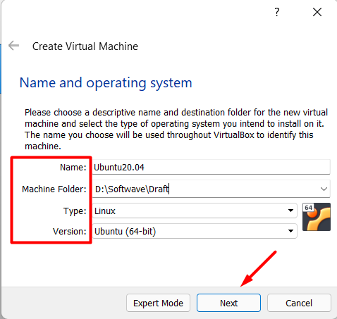     

- Bước 4: Cửa sổ mới hiện ra, bạn tiến hành thiết lập `RAM` cho máy ảo. Sau đó nhấn `next`    

***Note:Dung lượng RAM ảo này sẽ được lấy từ RAM trên máy thật***    

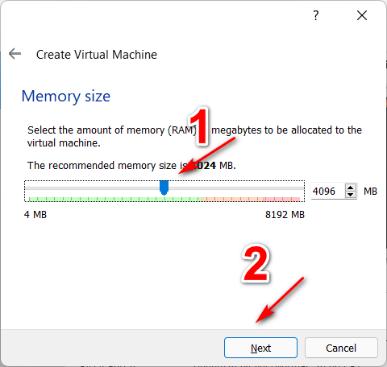    

- Bước 5: Giữ nguyên mặc định là `Create a virtual hard drive now` > Nhấn `Create` để tạo.   

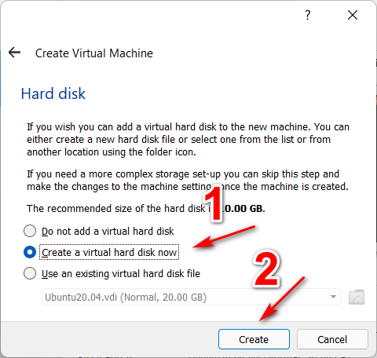  

- Các tùy chọn ổ đĩa hoặc bạn để tùy chọn mặc định là `VDI` > Nhấn `Next`     

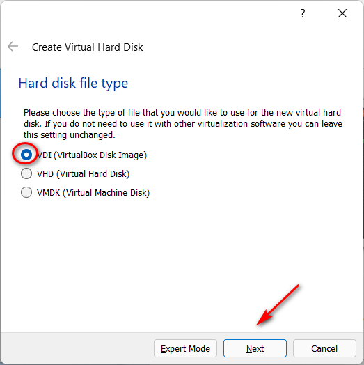   

- Chọn `Dynamically expanding storage` (Ổ cứng ảo loại dung lượng mở rộng) hoặc `Fixed-size` (Ổ cứng ảo loại dung lượng cố định) > Nhấn `Next`       

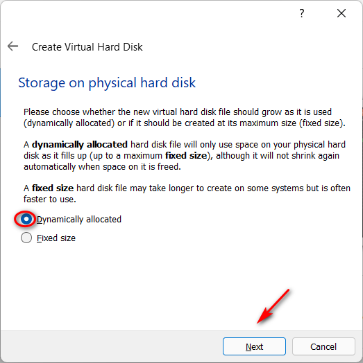   

- Ở đây, bạn xác định vị trí lưu trữ cho ổ cứng ảo, nhấn vào nút màu vàng như dưới để chọn vị trí lưu trữ > Sau đó, xác định dung lượng của ổ cứng cho phù hợp > Nhấn `Next`   

   

- Bước 6: Từ giao diện chương trình, Chọn máy ảo vừa tạo sau đó nhấn `Start`    

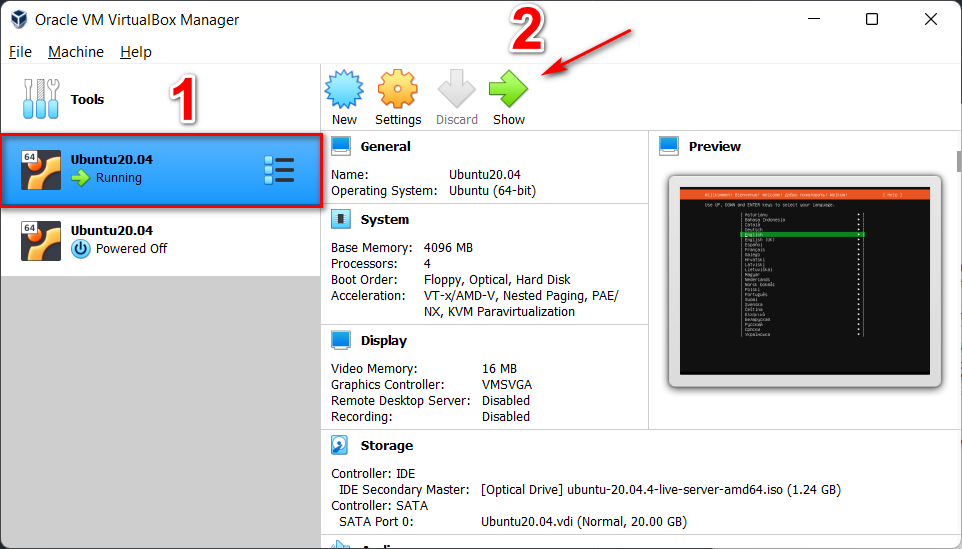   

- Bước 7: Cửa sổ mới hiện ra, bạn chọn vào biểu tượng màu vàng dẫn đến nơi chứa file `ISO` của OS đó chọn `Open`. Sau đó nhấn Start để bắt đầu quá trình cài đặt `Ubuntu 20.04 Server`       

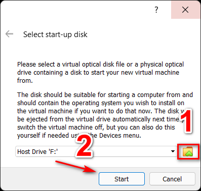   

    

## 2. Install Ubuntu Server 20.04 on VM   
- Sau khi tiến hành mount file .iso cài đặt và khởi động, đầu tiên máy chủ sẽ tiến hành kiểm tra file cài đặt. Quá trình sẽ diễn ra trong khoảng thời gian ngắn     

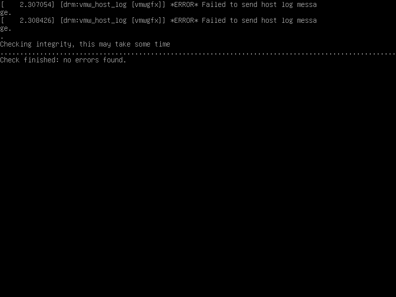   

Sau đó bạn chọn ngôn ngữ cài đặt.  
Ở đây mình mặc định chọn là English    

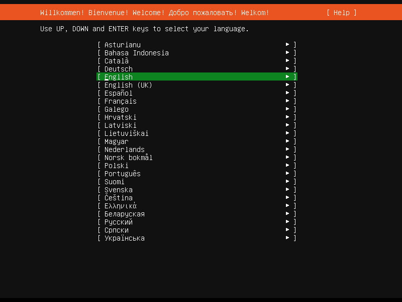   

- Chọn [Continue without updating], để bỏ qua quá trình update new version.      

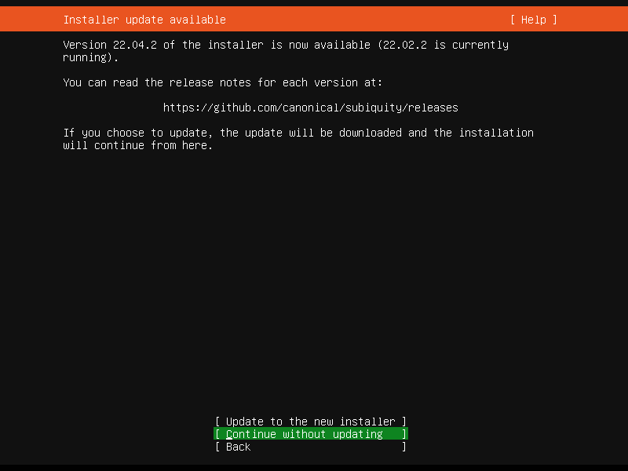   

- Chọn kiểu bàn phím, mình để mặc định.   

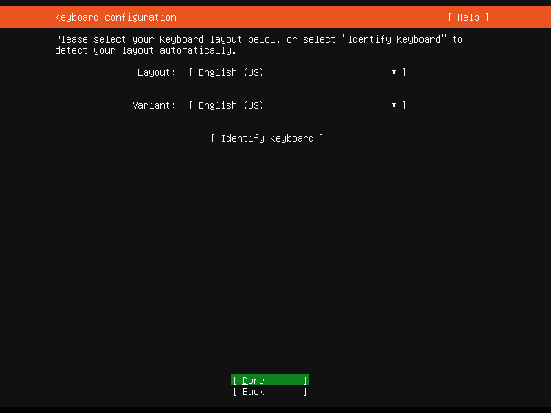         

- Cấu hình Network => Để mặc định DHCP nếu bạn chưa có kinh nghiệm thiết lập network   

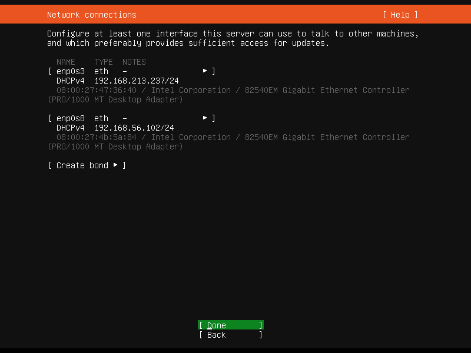  

- Nếu cần setting proxy server để kết nối với internet thì chúng ta cấu hình ở bước này. Còn nếu không thì bỏ qua => Bấm [`Done`]   

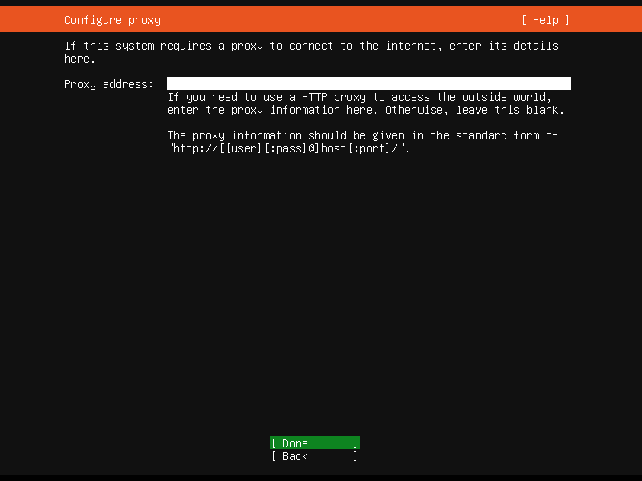   

- Cấu hình mirror cho việc cập nhật và cài đặt phần mềm.   

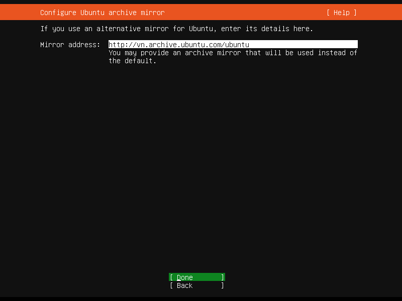  

- Cấu hình ổ đĩa cài đặt và định dạng phân vùng. Để mặc định và bấm [`Done`] để tiếp tục.   

  

- Cấu hình file system   
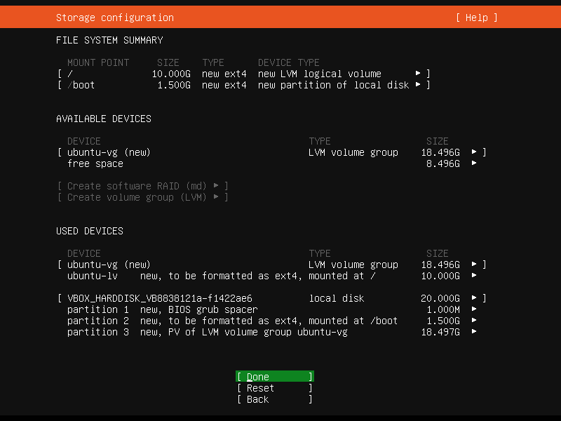   

- Nó sẽ hỏi bạn, việc cài đặt sẽ làm mất dữ liệu, bạn có muốn tiếp tục không?  
- Chọn [`Continue`] để tiếp tục   

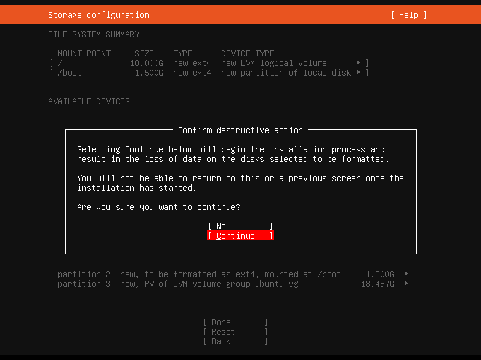   

- Cấu hình user để đăng nhập vào máy chủ   
  - `Your name`: Tên của bạn  
  - `Your server's name`: Tên server   
  - `Pick a username`: Tên đăng nhập  
  - `Choose a password`: Mật khẩu  
  - `Confirm your password`: Nhập lại mật khẩu của bạn  

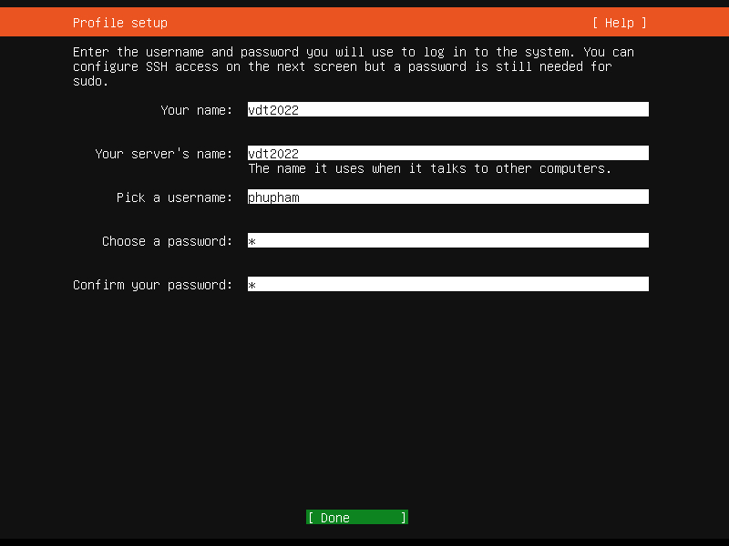   

- Thiết lập kết nối SSH (OpenSSH)  
- Bạn chọn "Install OpenSSH Server" bấm vào phím [`Space`] để đánh dâu [X] => Chấp nhận cài đặt   

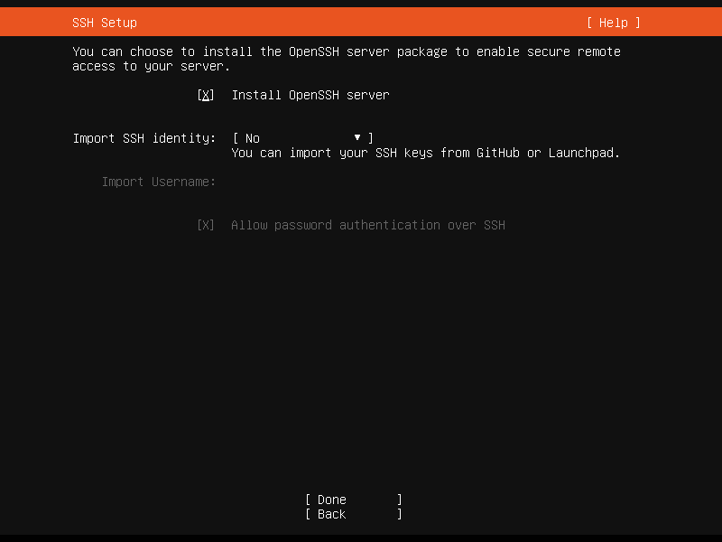   

- Ở bước này sẽ liệt kê danh sách các phần mềm, tính năng, gói để cài đặt cho máy chủ.   

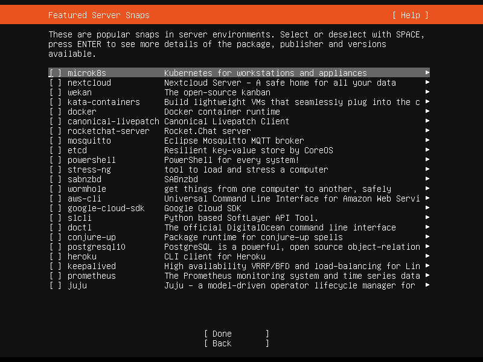   

- Sau đó, bấm [Done] quá trình cài đặt sẽ diễn ra.   

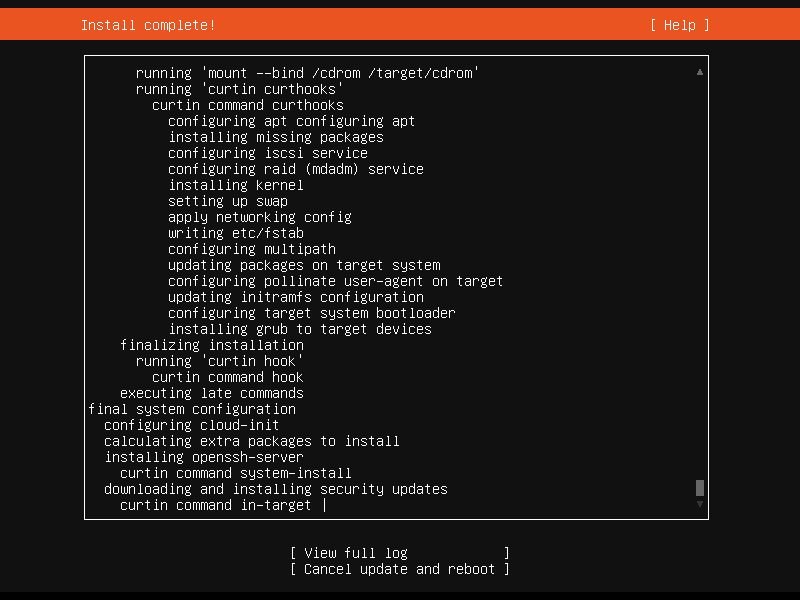    

- Sau đó quá trình cài đặt kết thúc chọn [Reboot] để hoàn thành.   

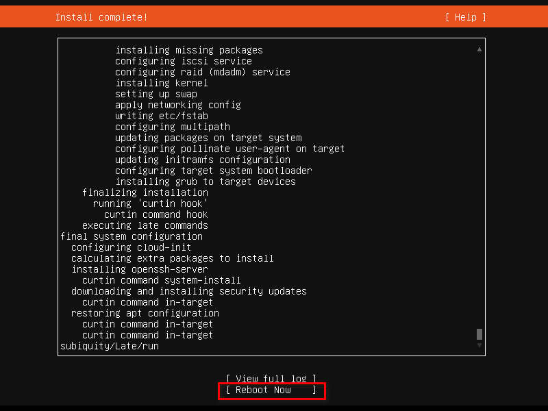   

- Sau khi khởi động lại, chúng ta có thể đăng nhập với tài khoản và password vừa thiết lập ở trên.    

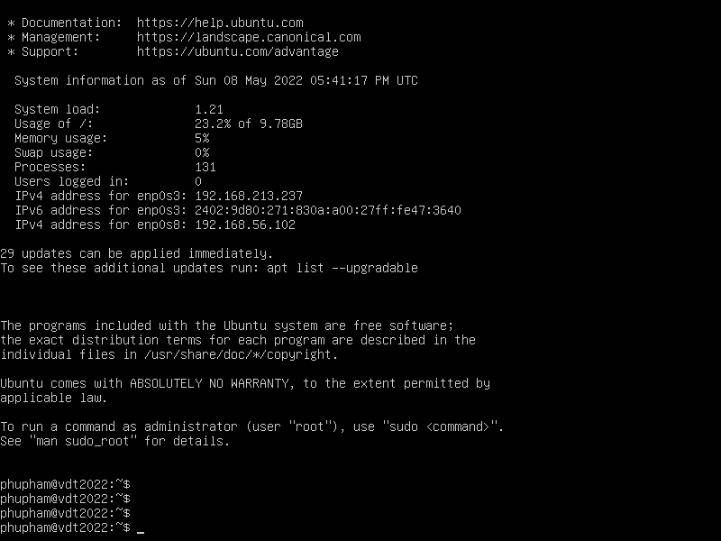    

Như vậy, quá trình tạo máy ảo và chạy cài đặt Ubuntu Server 20.04 đã hoàn thành. Chúc các bạn cài đặt thành công.    

    

## Author: PhuPham  
### Date Issue: May 12th 2022

## Tài liệu tham khảo   
[1]https://vinasupport.com/huong-dan-cai-dat-ubuntu-server-20-04-lts/     
[2]https://thuthuat.taimienphi.vn/huong-dan-cai-dat-may-ao-bang-virtualbox-1967n.aspx       

 
