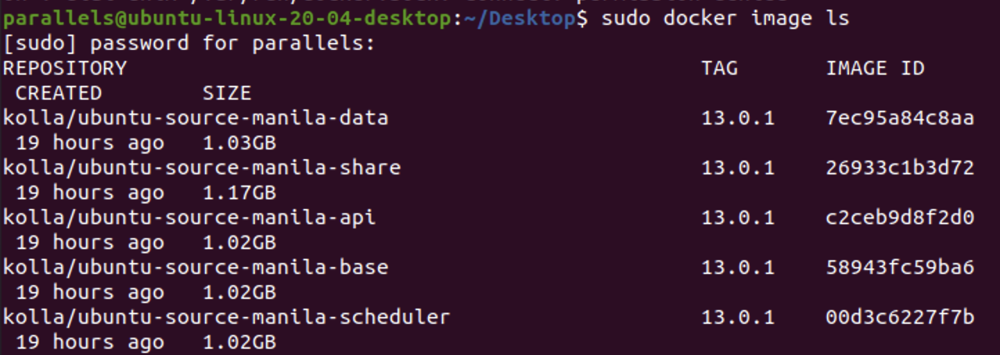
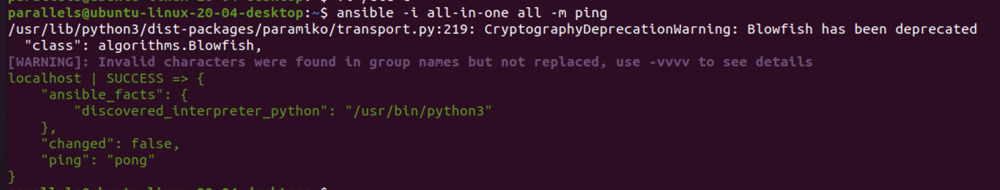
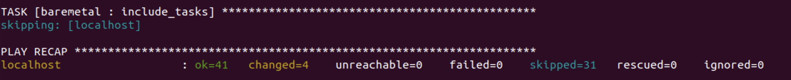
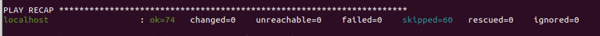
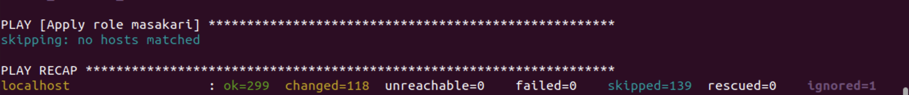
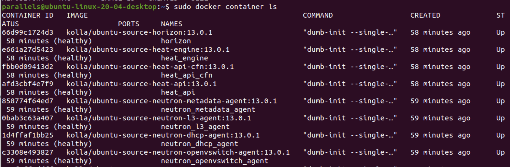
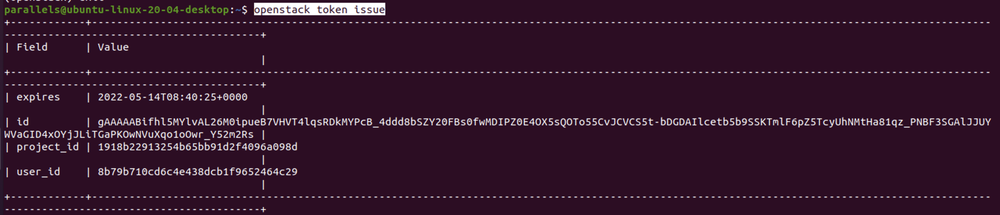
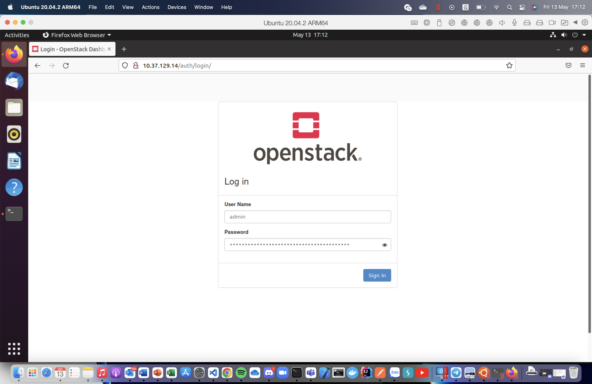
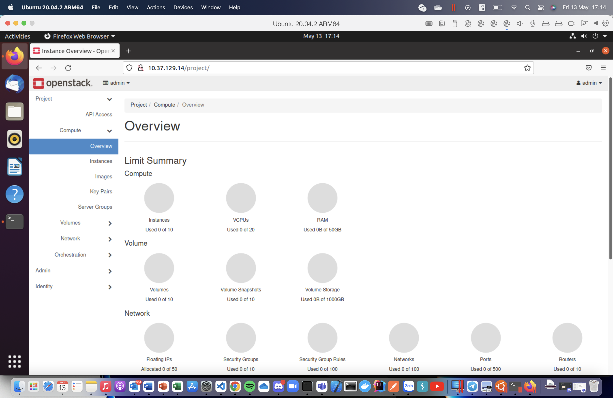
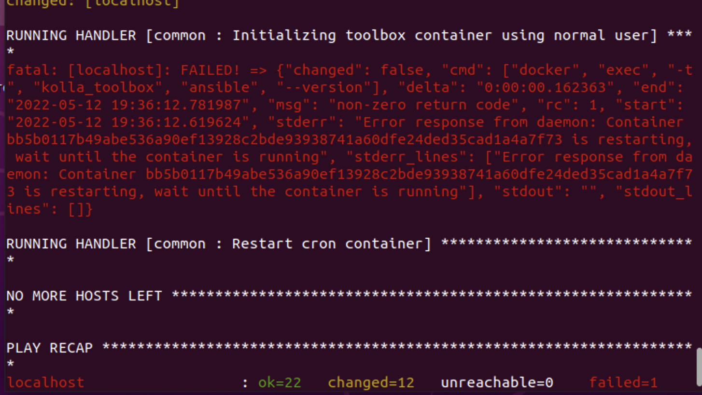

# TABLE OF CONTENT

- [TABLE OF CONTENT](#table-of-content)
- [1. Tổng quan](#1-tổng-quan)
  - [1.1. OpenStack](#11-openstack)
  - [1.2. Kolla-Ansible](#12-kolla-ansible)
- [2. Prerequisite](#2-prerequisite)
  - [2.1. Kiến thức](#21-kiến-thức)
  - [2.2. Hệ thống](#22-hệ-thống)
- [3. Set up OpenStack AIO with Kolla](#3-set-up-openstack-aio-with-kolla)
  - [3.1. Cài đặt dependencies](#31-cài-đặt-dependencies)
    - [3.1.1. Cài đặt dependencies không sử dụng môi trường ảo](#311-cài-đặt-dependencies-không-sử-dụng-môi-trường-ảo)
    - [3.1.2. Cài đặt dependencies sử dụng môi trường ảo](#312-cài-đặt-dependencies-sử-dụng-môi-trường-ảo)
  - [3.2. Cài đặt Kolla-ansible](#32-cài-đặt-kolla-ansible)
  - [3.3. Cấu hình Ansible](#33-cấu-hình-ansible)
  - [3.4. Build container images cho ARM](#34-build-container-images-cho-arm)
  - [3.5. Prepare initial configuration](#35-prepare-initial-configuration)
    - [3.5.1. Inventory](#351-inventory)
    - [3.5.2. Kolla passwords](#352-kolla-passwords)
    - [3.5.3. Tạo phân vùng cho Cinder](#353-tạo-phân-vùng-cho-cinder)
    - [3.5.4. Kolla globals.yml](#354-kolla-globalsyml)
  - [3.6. Deployment](#36-deployment)
  - [3.7 Post-deoloyment](#37-post-deoloyment)
- [4. Một số lỗi gặp phải khi deploy](#4-một-số-lỗi-gặp-phải-khi-deploy)
- [Tài liệu tham khảo](#tài-liệu-tham-khảo)

# 1. Tổng quan

## 1.1. OpenStack

Là một open source platform triển khai IaaS thông qua pooling resources và virtualization. OpenStack bao gồm nhiều thành phần thực hiện các chức năng như computing, storage, networking.

## 1.2. Kolla-Ansible

**Kolla-Ansible** là một OpenStack project sử dụng Ansible để deploy, maintain và cài đặt OpenStack sử dụng Kolla containers. Kolla build systems tạo ra Docker containers (một containers cho một service), cùng với đó là các supporting containers để khởi tạo và quản lý OpenStack deployment.

**Kolla (Conainters)** là một OpenStack project để build containers cho các OpenStack service. Nó có khả năng xây dựng containers từ cả source và packages trên nhiều host với các hệ điều hành khác nhau.

# 2. Prerequisite

## 2.1. Kiến thức

- Kiến thức cơ bản về Ansible và Docker

## 2.2. Hệ thống

| Yêu cầu  | Cấu hình khuyến nghị | Cấu hình thực tế     |
| -------- | -------------------- | -------------------- |
| RAM      | 8GB                  | 8GB                  |
| Disks    | 40GB                 | 65GB                 |
| Networks | 2 network interfaces | 2 network interfaces |

OS: Ubuntu 20.04 ARM

Disks:

- **_sda_**: 64GB - cho OS
- **_sdb_**: 20GB - cho Cinder LVM

Network: 2 NICs

- 1 NIC: host only với địa chỉ IP là 10.37.129.14 (eth0) - MNGT + API + Internal Network
- 1 NIC: bridged với IP là 10.211.55.31 - External Network

# 3. Set up OpenStack AIO with Kolla

## 3.1. Cài đặt dependencies

- Cập nhật package index:

        sudo apt update

- Cài đặt Python build dependencies:

        sudo apt install python3-dev libffi-dev gcc libssl-dev

### 3.1.1. Cài đặt dependencies không sử dụng môi trường ảo

- Cài đặt pip:

       sudo apt install python3-pip

- Đảm bảo latest version của pip đã được cài đặt:

        sudo pip3 install -U pip

- Cài đặt ansible. Kolla Ansible yêu cầu phiên bản ansible >= 4 và < 5 (nên cài ansible core bản 2.10 cho Xena release)

        sudo apt install ansible

### 3.1.2. Cài đặt dependencies sử dụng môi trường ảo

## 3.2. Cài đặt Kolla-ansible

- Cài đặt kolla-ansible và các dependencies của nó sử dụng pip:

        sudo pip3 install git+https://github.com/openstack/kolla-ansible.git@stable/xena

- Tạo thư mục /etc/kolla:

        sudo mkdir -p /etc/kolla
        sudo chown $USER:$USER /etc/kolla

- Copy globals.yml và passwords.yml vào /etc/kolla:

        cp -r /usr/local/share/kolla-ansible/etc_examples/kolla/* /etc/kolla

- Copy all-in-one và multinode inventory files và thư mục hiện tại:

        cp /usr/local/share/kolla-ansible/ansible/inventory/* .

## 3.3. Cấu hình Ansible

Để cải thiện performance của ansible, ta có thể chỉnh sửa Ansible Configuration bằng cách thêm vào file /etc/ansible/ansible.cfg như sau (bỏ check key và thực hiện pipelining):

        [defaults]
        host_key_checking=False
        pipelining=True
        forks=100

## 3.4. Build container images cho ARM

Sự khác biệt giữa Kolla và kolla-ansible là Kolla cung cấp công cụ để build images cho các dịch vụ OpenStack trên nhiều nền tảng linux với kiến trúc chip khác nhau. Kolla-ansible cung cấp công cụ để triển khai các images được xây dựng bằng Kolla. Do đó, images có thể được tạo và xây dựng lại bất kỳ lúc nào thông qua việc sử dụng lệnh kolla-build.

Cài đặt kolla-build:

        sudo pip3 install git+https://opendev.org/openstack/kolla@master

Build images các services của Openstack trên Ubuntu (Docker đã được cài):

        kolla-build -b ubuntu

Sau khi build sau, ta có thể kiểm tra các images bằng lệnh:

        docker images ls

## 3.5. Prepare initial configuration

### 3.5.1. Inventory

Kolla có 2 file inventory example là **all-in-one** và **multinode**. File **all-in-one** dùng để triển khai các OpenStack component trên cùng một node (localhost). Ngược lại, file **multinide** dùng để triển khai OpenStack trên nhiều node.

Kiểm tra xem configuration của ansible đã đúng chưa:

        ansible -i all-in-one all -m ping

Kết quả:

### 3.5.2. Kolla passwords

Password được lưu tại file **/etc/kolla/password.yml**. Tất cả password đều trống nên cần được điền hoặc sử dụng generator như sau:

        kolla-genpwd

### 3.5.3. Tạo phân vùng cho Cinder

        pvcreate /dev/sdb
        vgcreate cinder-volumes /dev/sdb

### 3.5.4. Kolla globals.yml

Ta cấu hình phiên bản, registry, namespace và release để kolla-ansible có thể lấy được các images mà ta đã build ở trong docker. Cụ thể là image ta build có dạng: kolla/ubuntu-source-{{tên service}} với tag là 13.0.1. Vậy bên distro sẽ để là ubuntu, registry sẽ rỗng còn namespace là kolla. Tag chính là openstack_release, ở đây có giá trị 13.0.1

        kolla_base_distro: "ubuntu"
        kolla_install_type: "source"
        docker_registry: ""
        docker_namespace: "kolla"
        openstack_release: "13.0.1"

Cấu hình mạng và ổ cứng:

        network_interface: eth0
        neutron_external_interface: eth1
        kolla_internal_vip_address: 10.37.129.13

        enable_haproxy: "no"
        nova_compute_virt_type: "qemu"
        enable_cinder: "yes"
        enable_cinder_backup: "no"
        enable_cinder_backend_lvm: "yes"

        libvirt_enable_sasl: "no" // (chưa rõ nguyên nhân nhưng để trường này là no thì lúc deploy sẽ không bị lỗi)

## 3.6. Deployment

- Bootstrap servers với kolla deploy dependencies:

        kolla-ansible -i all-in-one bootstrap-servers

  

- Kiểm tra pre-deployment:

        kolla-ansible -i all-in-one prechecks

  

- Deploy:

        kolla-ansible -i all-in-one deploy

  

- Kiểm tra các docker container vừa được run:

        docker container ls

  

## 3.7 Post-deoloyment

- Tạo openrc file để set credential cho admin user

        kolla-ansible post-deploy
        source/etc/kolla/admin-openrc.sh

- Cài đặt OpenStack Client:

        sudo apt install python3-openstackclient

- Kiểm tra dịch vụ (như ảnh là thành công):

        openstack token issue

  

- Lấy mật khẩu để đăng nhập tài khoản admin:

        cat /etc/kolla/passwords.yml | grep keystone_admin

  

- Sau đó có thể dùng tên đăng nhập là admin, mật khẩu vừa lấy được vào trang web http://10.37.129.14/auth/login/?next=/

  

- Đăng nhập thành công, kết quả là dashboard của Horizon, một trong những service của OpenStack để cho admin quản trị hệ thống:

  

# 4. Một số lỗi gặp phải khi deploy

- Permission denied: chạy bằng root ngay từ đầu

- Wait until the container is running: lỗi này là do ta đang sử dụng kiến trúc chip x84/x64, cách xử lí ở đây là ta phải build images của các service như ở [3.4](#34-build-container-images-cho-arm)

  

- Lỗi khi thực hiện task Create libvirt SASL user: tạm thời xử lí bằng cách disable sasl: libvirt_enable_sasl: "no

# Tài liệu tham khảo

- https://github.com/vietstacker/Viettel-Digital-Talent-Program-2021
- https://www.openstack.org/use-cases/containers/leveraging-containers-and-openstack/
- https://cloudbase.it/openstack-on-arm64-part-2/
- https://github.com/AmpereComputing/OpenStack-on-ampere/blob/main/All-in-One.md
