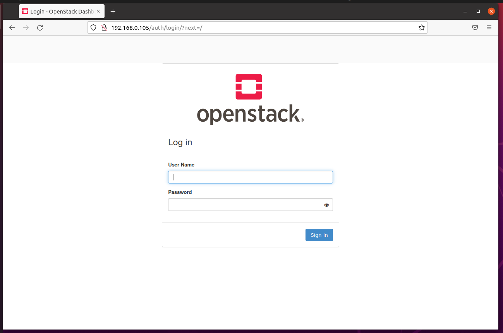

# All-in-one OpenStack Deployment

## Prepare

1. Disks
    * sda: 40Gb
2. Network
    * Bridgr Adapter: enp0s3 : 192.168.0.105/24
    * Host-only Adapter: enp0s8: 192.168.56.102/24

## Install dependencies

1. Update **apt**

```
sudo apt update
```

2. Install dependencies not using a virtual environment

```
sudo apt install python3-dev libffi-dev gcc libssl-dev
```

## Install dependencies using a virtual environment

1. Install pip

```
sudo apt install python3-pip
```

2. Ensure the latest version of pip is installed:

```
sudo pip3 install -U pip
```

3. Install Ansible

```
sudo apt install ansible
```
or
```
sudo pip install -U 'ansible<3.0'
```

## Install Kolla-ansible for deployment or evaluation

1. Install kolla-ansible and its dependencies using pip.

```
sudo pip3 install git+https://opendev.org/openstack/kolla-ansible@stable/xena
```

2. Create the /etc/kolla directory.

```
sudo mkdir -p /etc/kolla
sudo chown $USER:$USER /etc/kolla
```

3. Copy globals.yml and passwords.yml to /etc/kolla directory.

```
cp -r /usr/local/share/kolla-ansible/etc_examples/kolla/* /etc/kolla
```

4. Copy all-in-one and multinode inventory files to the current directory.

```
cp /usr/local/share/kolla-ansible/ansible/inventory/* .
```

## Configure Ansible

```
mkdir -p etc/ansible
config="[defaults]\nhost_key_checking=False\npipelining=True\nforks=100"
echo -e $config >> etc/ansible/ansible.cfg
```

## Prepare initial configuration

### Inventory

Check whether the configuration of inventory is correct or not

```
ansible -i all-in-one all -m ping
```
> Ping Success:


### Kolla passwords

```
kolla-genpwd
```

### Kolla globals.yml

```
kolla_base_distro: "ubuntu"
kolla_install_type: "source"
network_interface: enp0s3
neutron_external_interface: enp0s8
kolla_internal_vip_address: 192.168.0.105
enable_haproxy: "no"
```

## Deployment

1. Bootstrap servers with kolla deploy dependencies:

```
kolla-ansible -i ./all-in-one bootstrap-servers
```

> Bootstrap servers


2. Do pre-deployment checks for hosts:

```
kolla-ansible -i ./all-in-one prechecks
```

> Prechecks


3. Finally proceed to actual OpenStack deployment:

```
kolla-ansible -i ./all-in-one deploy
```

> Deploy


## Dashboard

*  Account:
    * User: admin 
    * Password: 
    > Run:
    ```
    cat /etc/kolla/passwords.yml | grep -i keystone_admin_password
    ```
> Openstack Login page



> Dashboard


## References

<https://docs.openstack.org/kolla-ansible/xena/user/quickstart.html>

<https://www.youtube.com/watch?v=b-XgSPuedro>

github repo