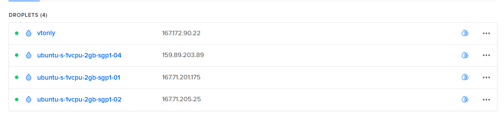
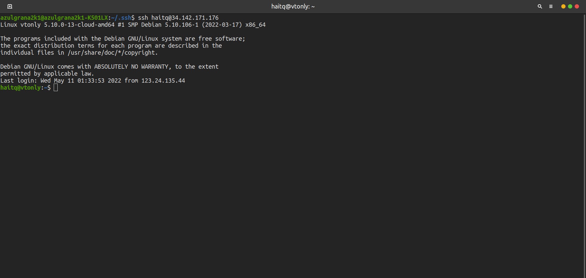

# **PRACTICE 1**

## **Task 2**: *Install OpenStack*

For this exercise, I will use 4 Digital Ocean VM instances instead since my laptop can not create a VM that meet the system requirements of OpenStack.


<br>
I chose 1 host to clone and run kolla-ansible (vtonly). All the commands will be performed on this host.
<br>
After accessing the VM via SSH, we have a familiar terminal:



### **Step 1**: Update package index

As usual, we always start by:

```
sudo apt update
```

### **Step 2**: Install Python dependencies

```
sudo apt install python3-dev libffi-dev gcc libssl-dev
```

#### **Substep 2.1**: Install pip

```
sudo apt install python3-pip
```

### **Step 3**: Install Ansible

```
sudo apt install ansible
```

### **Step 4**: Install Kolla-ansible

#### **Substep 4.1**: Install Git

```
sudo apt install git
```

#### **Substep 4.2**: Install Kolla-ansible
```
sudo pip3 install git+https://opendev.org/openstack/kolla-ansible@master
```

#### **Substep 4.3**: Create kolla directory and give permissions to current user
```
sudo mkdir -p /etc/kolla
sudo chown <username>:<username> /etc/kolla
```
In my case, \<username> will be replaced with root

#### **Substep 4.4**: Copy globals.yml and passwords.yml to /etc/kolla
```
cp -r /usr/local/share/kolla-ansible/etc_examples/kolla/* /etc/kolla
```

#### **Substep 4.5**: Copy inventory files to current directory (Optional)
```
cp /usr/local/share/kolla-ansible/ansible/inventory/* .
```

### **Step 5**: Install Ansible Galaxy dependencies:

```
kolla-ansible install-deps
```

### **Step 6**: Configure Ansible (Optional)

Edit /etc/ansible/ansible.cfg file to suit your need, for example:
```
[defaults]
host_key_checking=False
pipelining=True
forks=100
```

### **Step 7**: Prepare initial configuration

With only one VM, I will try to use all-in-one type
<br>
In /etc/kolla/globals.yml file, add following lines, depends on your network configuration:
<br>
For example:

```
kolla_base_distro: "ubuntu"
network_interface: "eth1"
neutron_external_interface: "eth0"
kolla_internal_vip_address: "10.104.0.3" - Control node's IP
enable_cinder: "yes"
enable_neutron: "yes"
enable_glance: "yes"
enable_openstack_core: "yes"
enable_keystone: "yes"
enable_nova: "yes"
```


#### **Substep 7.1**: Creating an Multinode file (similar to Ansible's hosts file) in current directory with the content below


Test Ansible with the following command:
```
ansible -i all-in-one all -m ping
ansible -i multinode all -m ping
```


#### **Substep 7.2**: Install docker

For people who are familiar with Ansible, you can run the "all-install-docker-playbook.yml" in playbooks folder to install docker to all 4 virtual machines, otherwise you may perform those commands sequentially in terminal (replace root with your username)

### **Step 8**: Deploy OpenStack all-in-one
all-in-one is the inventory file in Step 5 above
```
kolla-ansible -i <path-to-multinode-file> deploy
```
The console will look like this while running the above command


Login to OpenStack dashboard with below credentials:
<br>
admin
<br>
password: Get from command

```
cat /etc/kolla/passwords.yml | grep -i keystone_admin_password
```


After finishing to run the command above, check to see whether those processes have been able to run

```
docker ps -a
```

Other containers live on the rest of those VMs. 
<br>
E.g: For 10.104.0.3


To access OpenStack Horizon with Public IP, use command below:
```
/sbin/iptables -t nat -A PREROUTING -i <public interface> -p tcp -d <public IP> --dport 80 -j DNAT --to <kolla_internal_vip_IP>:80
```


