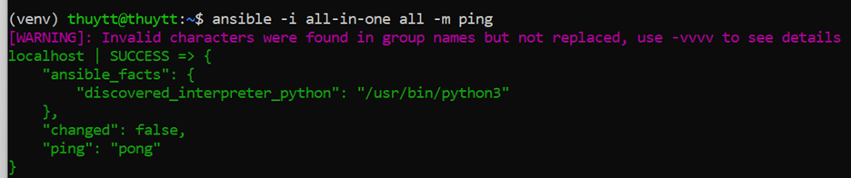

# WEEK 3: OpenStack


## Practice: Deploy Openstack AIO inside VM with Kolla

Knowledge base

**OpenStack** is an open source cloud computing infrastructure software project and is one of the three most active open source projects in the world.


Kolla Ansible deploys OpenStack services and infrastructure components in Docker containers. Kolla's mission statement is: To provide production-ready containers and deployment tools for operating OpenStack clouds.  


All-in-one and Multinodes
As the name says, **All-in-one (single node) has only a single machine whereas a Multi-Node Hadoop Cluster will have more than one machine.**


### Prepare:

- 2 Network Interface:

enp0s3: `10.0.2.15` (NAT)

enp0s8: `192.168.56.109` (Host only)

### Step 1: Install dependencies

- Update the package index:

```
$ sudo apt update && sudo apt dist-upgrade -y
```

- Install Python build dependencies:

```
$ sudo apt install python3-dev libffi-dev gcc libssl-dev
```

### Step 2: Install dependencies using a virtual environment
//virtualenv is used to manage Python packages for different projects. Using virtualenv 
**allows you to avoid installing Python packages globally which could break system tools or other projects.** 

- Install the virtual environment dependencies:

```
$ sudo apt install python3-ven
```

- Create a virtual environment and activate it:

```
$ python3 -m venv path/to/venv
$ source path/to/venv/bin/activate
```
- Ensure the latest version of pip is installed:

```
$ pip install -U pip
```

- Install Ansible. Kolla Ansible requires at least Ansible 2.10 and supports up to 4

```
$ pip install 'ansible<5.0'
```

### Step 3: Install Kolla-ansible

- Install kolla-ansible and its dependencies using pip:

```
$ pip install kolla-ansible
```

- Create the /etc/kolla directory:

```
$ sudo mkdir -p /etc/kolla
$ sudo chown $USER:$USER /etc/kolla
```

- The kolla-ansible version are developed based on Openstack ver:
•	Openstack Yoga - Kolla Ansible 14.x
•	Openstack Xena - Kolla Ansible 13.0.x
•	Openstack Victoria - Kolla Ansible 11.4.x
•	Openstack latest - Kolla Ansible 14.1.x
- We gonna install Openstack Xena using Kolla Ansible 13.0.x
- Copy globals.yml and passwords.yml to /etc/kolla directory:

```
$ cp -r path/to/venv/share/kolla-ansible/etc_examples/kolla/* /etc/kolla
```

- Copy all-in-one and multinode inventory files to the current directory:

```
cp path/to/venv/share/kolla-ansible/ansible/inventory/* .
```

### Step 4: Configure Ansible

- Create file `/etc/ansible/ansible.cfg`:

```
[defaults]
host_key_checking=False
pipelining=True
forks=100
```

### Step 5: Prepare initial configuration

- Check whether the configuration of inventory is correct or not, run:

```
$ ansible -i all-in-one all -m ping
```



- Kolla passwords:

```
$ kolla-genpwd
```
- Create cinder
$ sudo pvcreate /dev/sdb  
$ sudo vgcreate cinder-volumes /dev/sdb   

- Kolla globals.yml:

```
kolla_base_distro: "ubuntu"  
kolla_install_type: "source"    

network_interface: "enp0s8"   
neutron_external_interface: “enp0s3”    
kolla_internal_vip_address: “192.168.56.109”         

nova_compute_virt_type: "qemu" 
enable_haproxy: "no"  

enable_cinder: "yes"
enable_cinder_backup: "no"  
enable_cinder_backend_lvm: "yes"  
```

### Step 6: Deployment

- Bootstrap servers with kolla deploy dependencies:

```
$ kolla-ansible -i ./all-in-one bootstrap-servers
```

- Do pre-deployment checks for hosts:

```
$ kolla-ansible -i ./all-in-one prechecks
```

- Finally proceed to actual OpenStack deployment:

```
$ kolla-ansible -i ./all-in-one deploy
$ kolla-ansible -i all-in-one post-deploy   
```   
 ### Step 7: Login

- Get the passwords:  
```    
cat /etc/kolla/passwords.yml | grep keystone_admin    
```    
- Then access to`http://192.168.56.109/auth/login/?next=/`. 
   - ` User Name`: admin 
   - `Password`: ySI0VU61uRNI5yNalwdmzx9sjMbkyHLIWr

### Result


### Debug

1. Cannot enable Nested VT-x/AMD-V on virtual box.
  


Step 1: Enable virtualization in Bios
Step 2: If the option for enable Nested VT-x/AMD-V still grey out, cd into the VirtualBox folder and execute this:
```
$ VBoxManage modifyvm $Vm-name –nested-hw-virt on
```

2. Sudo: a password is required
~ The command which use the system package must be run with root user privilege. Add sudo at the beginning of command or using “$ sudo ls” before executing it.

3. sudo pvcreate /dev/sdb  => failed
~ Create one more virtual hard disk and attach to VM.

4. Jammy version of ubuntu is not supported 


 ~ Install the focal version (ubuntu 20.04) instead. ☹


## Reference
https://docs.openstack.org/kolla-ansible/latest/user/quickstart.html
