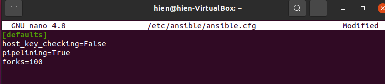
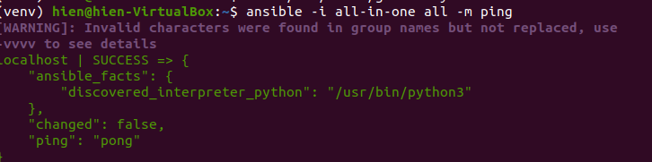
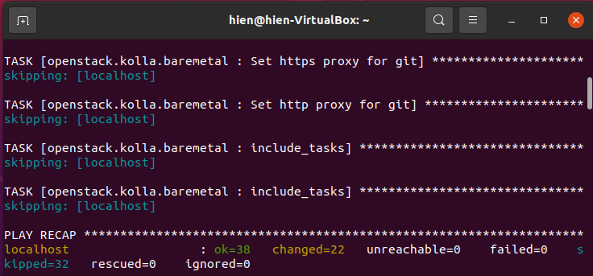
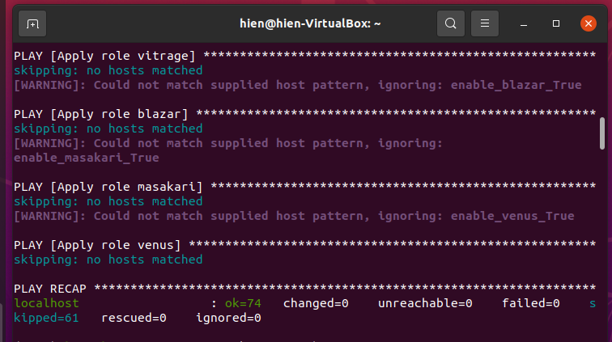
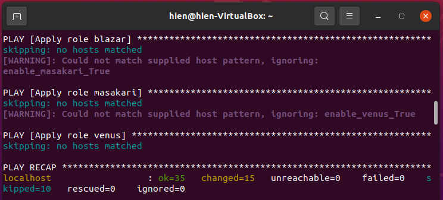
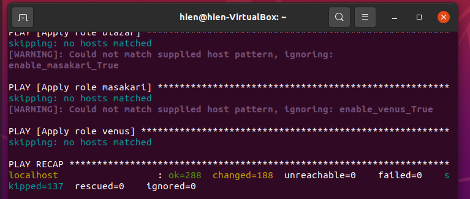
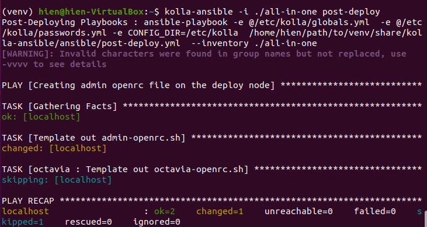
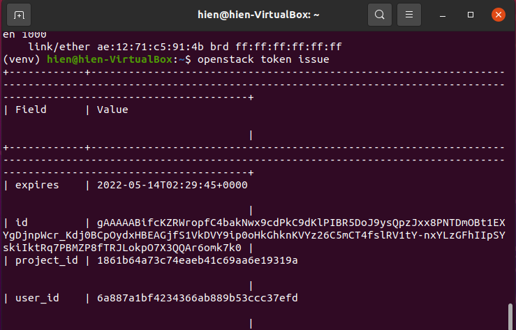
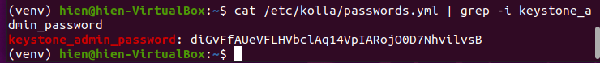

# ALL-IN-ONE OPENSTACK DEPLOYMENT

---

# **Table of Contents:**

## [I. Overview](#**I.-OVERVIEW**)

- ### [A. Openstack](#**A.-`OPENSTACK`**)

- ### [B. Kolla-Ansible](#**B.-`KOLLA-ANSIBLE`**)

## [II. Prerequisite](#**II.-PREREQUISITE**)
- ### [A. Knowledge Requirements](#'A.-Knowledge-Requirements')
- ### [B. Infrastructure Requirements](#**B.-Infrastructure-Requirements**)

## [III. Step-by-step](#III.-STEP-BY-STEP)

- ### [A.Set up Environment](#**A.-SET-UP-ENIVRONMENT**)
- ### [B. Configure Kolla-Ansible & Ansible](#**B.-CONFIGURE-`Kolla-Ansible`-&-`Ansible`**)
- ### [C. Pre-deploy-configurations](#**C.-PRE-DEPLOY-CONFIGURATIONS**)
- ### [D. Deploy Openstack](#**D.-DEPLOY-`OPENSTACK`**)
- ### [E. Post-deployment](#**E.-POST-DEPLOYMENT**)
- ### [F. Accessing Horizon Dashboard](#F.-**ACESSING-`HORIZON`-DASHBOARD**)

## [IV. References](#VV.-REFERENCES)

# **I. OVERVIEW**:
## **A. OPENSTACK**: 
### **1. Overview:**

> An **open source platform** that uses pooled virtual resources to build and manage private and public clouds

- An implementation of **IaaS** - *Infrastructure As a Service*. This platform manages a great amount of `Compute, Storage, and Networking` resources. 
- A completely **open-source** Cloud solution - **Most Widely Deployed Opens Source Cloud System**.
- Started as a cooperative project between `NASA` & `RackSpace` back in 2010.
- Hosted & supported by [`Open Infrastructure Founndation`](https://openinfra.dev/)


### **2. Core Components:**

**Architecture Philosophy**

> Openstack is designed with a `modular` architecture - facilitates the scaling & integration of components.  

#### **a. Nova**
 - Manages the computing resources of an OpenStack cloud

#### **b. Neutron**
 - Network agent of `Openstack`. Manages & Performs all network configurations, operations.

#### **c. Glance**
 - Maintains and manages server images for a cloud.

#### **d. Keystone**
 - Authentication & Authorization Service

#### **e. Cinder**
- `Block Storage` provisioning service.


## **B. KOLLA-ANSIBLE**: 

> To provide **production-ready** containers and deployment tools for operating
OpenStack clouds.


- `Kolla` projects offers Openstack with built-in deployment solutions including `Monitoring`, `Rolling upgrades`, `HA`, etc.


# **II. PREREQUISITE**:
## **A. Knowledge Requirements:**
- Basics on [`Ansible`](https://docs.ansible.com/).
	+ Recommended to know fundemental concepts of Automation with `Ansible` (*Playbook, Role, task, etc, inventory*)

- Basics on [`Docker`](https://docs.docker.com/get-started/).
	+ Recommended understand how to manage `Docker` resources (images, ) commands.

- Basics on Linux, Networking.

- `Intro to Googling` :wink:. Trust me this saves ur life. Should be added as a job requirement for IT employees :sunglasses:

## **B. Infrastructure Requirements:** 

### **Openstack Release:** `Victoria`

#### **a. General:**
- **Operating System:** *Either options works*

	- Ubuntu Server (**Ubuntu 20.04** is used in below practices: [Download Ubuntu Server](https://ubuntu.com/download/server)) 
	- CentOS 7: [Download CentOS7](https://www.centos.org/download/) 
- **Desktop Hypervisor:** VMware Workstation (Other options: *Virtual Box, etc*)

**Note**
>  **Ubuntu Server** is used in this Deployment

#### **b. Host VM Specifications:**

| Specification(s) | Minimal | Personal Config |
| ----------- | ----------- | ----------- |
|  CPU | 4 cores | 3 cores |
| RAM | 8 GB | 10 GB |
|  Disks | 2 | 2 |
| Network | 2 NICs | 2 NICs |

- **Disks**:
	- `sda`: 20 GB
	- `sdb`: 20 GB - `lvm` partition for `cinder` - *block storage component of Openstack*


- **Networks**:	2 Interfaces with following IP addresses
	- **API + Internal Network**: `enp0s3` - **10.0.2.15**
	- **External/Provider Network**: `enp0s8` - **192.168.56.103**


# **III. STEP-BY-STEP**:

### **Openstack Release:** `Victoria`

## **A. SET UP ENIVRONMENT**:

### 1. Update `apt` & install essentails dependencies:

```
$ sudo apt update

$ sudo apt install python3-dev libffi-dev gcc libssl-dev
```

### 2. Time Synchronization Configuration: **(Recommended)**
> Please refer to this [Documentation](https://linuxconfig.org/ubuntu-20-04-ntp-server)

### 3. Using `virtualenv`:
- Install `virtualenv`:
```
$ sudo apt install python3-venv
```

- Create `virutalenv` & activate that environment:
```
$ python3 -m venv ./path/to/venv

$ source ./path/to/venv/bin/activate
```
- Ensure the latest version of pip is installed:
```
$ pip install -U pip
```
### 4. Install `Ansible` & `Kolla-Ansible` (within `virtualenv`):

- Install `Ansible`:
```
$ pip install 'ansible>=4,<6'
```
- Install `Kolla-ansible`:
```
$ pip install git+https://opendev.org/openstack/kolla-ansible@master
```

### 5. Install `Openstack CLI`:
> *Optional at this point*

**Notes:**

> Due to the fact that `open vSwitch` might capture `MAC Address` of network interace, which blocks connection to the Internet. Can install Openstack CLI from this step.

```
$ pip install python-openstackclient python-glanceclient python-neutronclient
```

## **B. CONFIGURE `Kolla-Ansible` & `Ansible`**:
### 1. Create `/etc/kolla`  directory:

```
$ sudo mkdir -p /etc/kolla
$ sudo chown $USER:$USER /etc/kolla
```

### 2. Copy globals.yml and passwords.yml to /etc/kolla directory:
 
```
$ cp -r ./path/to/venv/share/kolla-ansible/etc_examples/kolla/* /etc/kolla
```

### 3. Copy all-in-one and multinode inventory files to the current directory:

```
$ cp /path/to/venv/share/kolla-ansible/ansible/inventory/* .
```

### 4. Install Ansible Galaxy requirements

```
$ kolla-ansible install-deps
```

### 5. Configure `Ansible`:

```
$ mkdir -p /etc/ansible

$ config="[defaults]\nhost_key_checking=False\npipelining=True\nforks=100"

$ echo -e $config >> /etc/ansible/ansible.cfg
```


## **C. PRE-DEPLOY CONFIGURATIONS**:

### 1. Configure `all-in-one` (`inventory` file)
**Note**
> Optional. Should use defaults for `all-in-one`

### 2. Run `ad-hoc` command `ping` to check configurations:
```
$ ansible -i all-in-one all -m ping
```

> Ping Success:



### 3. Generate Passwords for `Kolla`:
- Stored in `/etc/kolla/passwords.yml` , run commands:

```
$ kolla-genpwd
```

### 4. Configure `globals.yml`:

```
$ vi /etc/kolla/globals.yml
```

**Note**: *without specifying `openstack_release`, default value would be `victoria`*

**Example**: Sample `globals.yml` file

```
kolla_base_distro: "ubuntu"
kolla_install_type: "source"

network_interface: enp0s3
neutron_external_interface: enp0s8
kolla_internal_vip_address: 10.0.2.15

nova_compute_virt_type: "qemu"

enable_haproxy: "no"

enable_cinder: "yes"
enable_cinder_backup: "no"
enable_cinder_backend_lvm: "yes"
```

## **D. DEPLOY `OPENSTACK`**
- Bootstrap Server:

> **Debug**: [*Ansible Module Missing*](#'2.-`Cannot-import-name-'AnsibleCollectionLoader'-from-'ansible.utils.collection_loader'-during-Boostrapping`')

```
$ kolla-ansible -i all-in-one bootstrap-servers
```

> Boostrapping Success




- Precheck Server:
```
$ kolla-ansible -i all-in-one prechecks
```

> Prechecking Success



- Pull Images to VM:
```
$ kolla-ansible -i all-in-one pull
```

>  Pulling Images Success



- Deploy:
```
$ kolla-ansible -i all-in-one deploy
```

>  Deploy Success



- Post-deploy:
```
$ kolla-ansible -i all-in-one post-deploy
```


## **E. POST-DEPLOYMENT**:

**Note**
> At this point, user may be unable to access Internet due to the activation of `OpenvSwitch`.
 

- Install Openstack CLI:
```
$ pip install python-openstackclient python-glanceclient python-neutronclient
```

- Run `admin-openrc.sh` to add `ENVIRONMENT VARIABLES`: 
> **Debug**: [*`admin-rc.sh` Not found*](#'3.-`admin-openrc.sh`-missing')
```
$ source /etc/kolla/admin-openrc.sh
```

- Generate token:
```
$ openstack token issue
```

> Token generated




## F. **ACESSING `HORIZON` DASHBOARD**:

- Use following login account:
	- **username**: `admin`
	- **password**: *Run below command to retrieve*
	```
	$ cat /etc/kolla/passwords.yml | grep -i keystone_admin_password
	```
 

> Openstack Login page


> Openstack Dashboard


# **IV. REFERENCES**:

- [Quick Start](https://docs.openstack.org/kolla-ansible/latest/user/quickstart.html)


---
