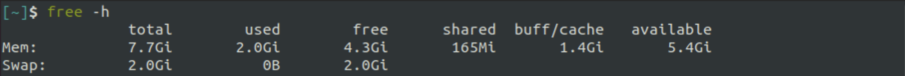
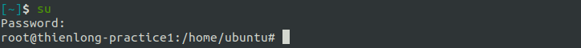
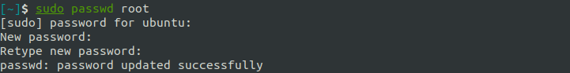
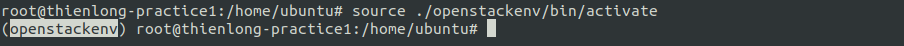
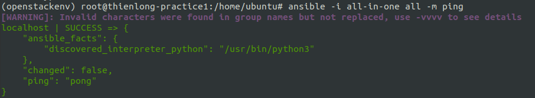

# Setup OpenStack AIO inside VM with Kolla

## OpenStack 

### Overview

**OpenStack** is a **_free_, _open standard_** cloud computing platform. 
It is mostly deployed as **infrastructure-as-a-service** (_Iaas_) in both 
`public` and `private` clouds where virtual servers and other 
resources are made available to users.

**OpenStack** began in 2010 as a joint project of 
**Rackspace Hosting** and **NASA**. As of 2012, it was managed by the **OpenStack Foundation**.
In 2021 the foundation renamed to **the Open Infrastructure Foundation**.

<div align="center">
  
</div>

<div align="center">
  <i>OpenStack logo.</i>
</div>

### Architecture

**Openstack** is designed with a **modular** architecture - facilitates the scaling & integration of components.

  - **Modular** architecture
  - Design for easily scale out
  - Based on (growing) set of core services


<div align="center">
  
</div>

<div align="center">
  <i>OpenStack's logical architecture.</i>
</div>

### Services

An OpenStack deployment contains a number of components **providing APIs** to access infrastructure resources. 
These are the various services that can be deployed to provide such resources to cloud end users.

<div align="center">
  
</div>

<div align="center">
  <i>OpenStack's core components diagram.</i>
</div>

| OpenStack Services | Role | About this project                                                                                                                                                                                                                                          |
|---|----|-------------------------------------------------------------------------------------------------------------------------------------------------------------------------------------------------------------------------------------------------------------|
|**Horizon**| Dashboard | **Horizon** is the canonical implementation of OpenStack's dashboard, which is extensible and provides a web based user interface to OpenStack services.                                                                                                    |
|**Keystone**| Identity service | **Keystone** is an OpenStack service that provides API client authentication, service discovery, and distributed multi-tenant authorization by implementing **OpenStack’s Identity API**.                                                                   |
|**Swift**| Object store | **Swift** is a highly available, distributed, eventually consistent object/blob store. It's built for scale and optimized for durability, availability, and concurrency across the entire data set.                                                         |
|**Glance**| Image service | **Glance** image services include discovering, registering, and retrieving virtual machine images. Glance has a RESTful API that allows querying of VM image metadata as well as retrieval of the actual image.                                             |
|**Neutron**| Networking | **Neutron** is an SDN networking project focused on delivering **networking-as-a-service** (_NaaS_) in virtual compute environments.                                                                                                                        |
|**Cinder**| Block Storage | **Cinder** virtualizes the management of block storage devices and provides end users with a self service API to request and consume those resources without requiring any knowledge of where their storage is actually deployed or on what type of device. |
|**Nova**| Compute Service | **Nova** implements services and associated libraries to provide massively scalable, on demand, self service access to compute resources, including bare metal, virtual machines, and containers.                                                               |

### All-In-One (single-node) Single VM 

<div align="center">
  
</div>

<div align="center">
  <i>Single-node and Multiple-nodes.</i>
</div>

In **AIO** or **single-node** mode, all the service will be deployed in one node, in our case,
it is _in a single virtual machine_. In the other hand, in **multiple-nodes** mode
(2 or more nodes),
a service can be deployed _in many node_, or difference services are deployed
_in difference nodes_.

In this practice, we will use the **AIO architecture** to deploy OpenStack.
And the deployment must include 3 main services of OpenStack: 

**1/ Compute**

**2/ Networking** 

**3/ Storage** 

<div align="center">
  
</div>

<div align="center">
  <i>3 main services are used in this project.</i>
</div>


## Kolla

### Overview
**Kolla** provides _production-ready_ containers and deployment tools 
for operating **OpenStack** clouds. 


<div align="center">
  
</div>

<div align="center">
  <i>Kolla logo.</i>
</div>

## Requires

In this practice, I will use my **Ubuntu VM** (_Ubuntu 20.04.2 ARM 64_) by **Parallels Desktop**.

### Infrastructure requirements
| Specification(s) | Require | Personal VM (by default) |                                                                                                  
|------------------|---------|-------------------------|
| CPU | 4 cores | 2 cores                 |
| RAM | 8 GB    | 2 GB                    |
| Disks | 2       | 1                       |
| Network | 2 NICs  | 1 NIC                   |


### Setting up our VM

First, power off our VM, because some configurations can not perform when the VM is still running.
Then open VM instance's `Configuration` by click to the `Setting icon` button and choose `Hardware` tab.

#### CPU & RAM

In `CPU & Memmory` section to config number of processors and size of the memory.
By default, we only have _2 processors_ and _2 GB RAM_.

Select `4 processors` with `8192 MB` (8 GB) memory.

<div align="center">
  
</div>

<div align="center">
  <i>Configuration CPU & Memory of VM.</i>
</div>

#### Disk

By default, our VM only has _1 disks_. So in order to create the second disk, click to the `+` 
button in the below part of the `Configuration` window.

Choose `Hard disk` to add a new disk.

<div align="center">
  
</div>

<div align="center">
  <i>Choose <strong>Hard disk</strong> to add a new disk.</i>
</div>

Then set it's size to `64 GB` and click `OK` to finish setting.

<div align="center">
  
</div>

<div align="center">
  <i>Set disk's size and finish.</i>
</div>

#### Network

By default, our VM only has _1 network_.
So click to the `+` and choose `Network` to add a new **Network Interface Controller** (_NICs_) .

<div align="center">
  
</div>

<div align="center">
  <i>Choose <strong>Network</strong> to add a new network.</i>
</div>

### Verify infrastructure 

After finish setting, **restart** our VM to apply these new changes.

#### CPU

In order to verify you `CPU`, use the command:

```shell
lscpu
```

The number of cores is s`CPU(s)` - which is 4 cores.

<div align="center">
  
</div>

<div align="center">
  <i>Information about the CPU architecture in my VM.</i>
</div>


#### RAM

Use `free` to find information about memory in the system. `free` is a command to 
display amount of free and used memory in the system.


I use `-h` (`--human`) option here to format the output easy to read.

```shell
free -h
```

In total, my VM has about **8 GB** of RAM with **2 GB** of memory swap.

<div align="center">
  
</div>

<div align="center">
  <i>Information about the memory in my VM.</i>
</div>

#### Disk

The easiest way to list disks is to use the `lsblk` command. 
The **type** column will mention the `disk` as well as optional partitions and LVM available 
on it.

We need administrator rights in order to have the full output of the command, 
so add `sudo` before.

```shell
sudo lsblk
```

You can see there are 2 disks: `sda` and `sdb`. The first disk - `sda` is used
to store Ubuntu OS. And the second disk - `sdb` is our mounted disk.

<div align="center">
  
</div>

<div align="center">
  <i>Information about the memory in my VM.</i>
</div>

#### Network

You can use `ip` command list all network interfaces in our machine. However, for the
easy human-readable display format, I installed `net-tools` and use `ifconfig` to list the network
interfaces.

<div align="center">
  
</div>

<div align="center">
  <i>List of network interfaces in my VM.</i>
</div>

I will use 2 network interfaces:

- eth0: `NAT` - **10.211.55.6/24** (for Internal network)

- eth1: `Host` - **10.211.55.8/24** (for External/Provider network)

#### Summary

| Specification(s) | Require | Personal VM (by default) |  Personal VM (after config) |                                                                                                                
|------------------|---------|-------------------------|-----|
| CPU | 4 cores | 2 cores                 | 4 cors |
| RAM | 8 GB    | 2 GB                    | 8 GB |
| Disks | 2       | 1                       | 2 |
| Network | 2 NICs  | 1 NIC                   | 2 NICs |

Now, we have met the requirements of to run `all-in-one` **OpenStack**.

## Instruction

To make it is easy, all the commands use administrator rights - add `sudo` before
them all.

```shell
sudo <command>
```

Or use can set up `root` password, type OS password and then type your
password for **root user**. Then switch user to root to have the **root user right**.

```shell
sudo passwd root
```

<div align="center">
  
</div>

<div align="center">
  <i>Set up password for <strong>user</strong>.</i>
</div>

Then use `su` to switch to **root user**.

```shell
su
```

<div align="center">
  
</div>

<div align="center">
  <i>Switch user to <strong>root user</strong>.</i>
</div>

### Install dependencies

1/ Update `apt`

Update the package index by using `apt update`.

```shell
apt update
```

2/ Install required dependencies

We will install required dependencies by `apt install`.

```shell
apt install python3-dev python3-pip libffi-dev gcc libssl-dev
```

3/ Install `virtualenv` for **virtual environment**

We will install the dependencies using virtual environment, so use `venv` 
to create a virtual environment.

Install `virtualenv`:

```shell
apt install python3-venv
```

4/ Create **virtual environment**

In this practice, my `virtualenv` will be located at **./openstackenv**

```shell
python3 -m venv ./openstackenv
```

5/ Activate virtual environment

The virtual environment should be activated before running any commands that depend on 
packages installed in it.

In order to activate virtual environment, we use `source`.

```shell
source ./openstackenv/bin/activate
```

If you successfully activate environment, before user and path will have `(openstackenv)`.

<div align="center">
  
</div>

<div align="center">
  <i>Check is there <strong>(openstackenv)</strong>.</i>
</div>

6/ Upgrade `pip`

Upgrade `pip` to the latest version by `-U` (`--upgrade`) option.

```shell
pip install -U pip
```

### Install `ansible`

Install  `ansible`. Kolla Ansible requires at least Ansible **4** and supports up to **5**.

```shell
pip install 'ansible==2.10.7'
```

### Install and set up `kolla-ansible`

Install `kolla-ansible` and its dependencies  by using `pip` in virtual environment.

```shell
pip install kolla-ansible
```

### Install `OpenStack CLI`

```shell
pip install python-openstackclient python-glanceclient python-neutronclient
```

## Configuration 

### Configure `kolla-ansible`

1/ Create `/etc/kolla` directory

Create `/etc/kolla` directory by using `mkdir` with `-p` (`--path`) option
to create directory in path.

```shell
mkdir -p /etc/kolla
chown $USER:$USER /etc/kolla
```

2/ Copy `passwords.yml` and `global.yml` to `/etc/kolla`

```shell
cp -r ./openstackenv/share/kolla-ansible/etc_examples/kolla/* /etc/kolla
```

3/ Copy `all-in-one` inventory files to the current directory.

```shell
cp ./openstackenv/share/kolla-ansible/ansible/inventory/all-in-one .
```

### Configure `ansible`

1/ Create `/etc/ansible` directory

```shell
mkdir -p /etc/ansible
```

2/ Add the following options to the Ansible configuration file **/etc/ansible/ansible.cfg**

```shell
config="[defaults]\nhost_key_checking=False\npipelining=True\nforks=100"
echo -e $config > /etc/ansible/ansible.cfg
```

## Pre-deploy

1/ Custom inventory file

In this practice, I just use the default sample `all-in-one` as inventory file.
However, you could change it as your demand, or use `multinode` in case you want to deploy
OpenStack in `multinode` mode.

You can read it by using this command (Please make sure that `all-in-one`
is now in your working directory.)

```shell
more all-in-one
``` 


2/ Check configurations

```shell
ansible -i all-in-one all -m ping
```

<div align="center">
  
</div>

<div align="center">
  <i>Ping successful.</i>
</div>

Don't worry about the `[WARNING]`, there is `-` character in group name in `all-in-one`,
but it doesn't have any affect to us.


3/ Create diskspace partition for `Cinder`

Use `pvcreate` to create a physical volume for **Cinder** in `/dev/sdb`.

```shell
pvcreate /dev/sdb
```

Then `vgcreate` to create a volume group `cinder-volume` in disk `/dev/sdb`.

```shell
vgcreate cinder-volumes /dev/sdb
```

<div align="center">
  
</div>

<div align="center">
  <i>Create diskspace partition.</i>
</div>

4/ Configurate `global.yml`

Open and edit `globals.yml` in **/etc/kolla** by using `gedit` (in my opion, it is easier to edit the
file than `vi` or `nano`).

```shell
gedit /etc/kolla/globals.yml
```

The content of `global.yml`:

```shell
kolla_base_distro: "ubuntu"
kolla_install_type: "source"

network_interface: eth0
neutron_external_interface: eth1
kolla_internal_vip_address: 10.211.55.6

nova_compute_virt_type: "qemu"

enable_haproxy: "no"

enable_cinder: "yes"
enable_cinder_backup: "no"
enable_cinder_backend_lvm: "yes"
```

- **kolla_base_distro**: Our Linux distribution - `ubuntu`.
- **kolla_install_type**: Kolla container image type:
  - `source` - build images from source codes (we use it here).
  - `binary` - using remote binary component file.


- **network_interface**: internal network interface communicate with **OpenStack**.
- **neutron_external_interface**: provider network interface for VMs.
- **kolla_internal_vip_address**: IP address of `network_interface`, prevent errors when **MariaDB**
connect with HAproxy.


- **nova_compute_virt_type**: we use VM, so here we set it is `qemu`.


- **enable_haproxy**: `no` for **all-in-one**.


- **enable_cinder**: we use **Cinder LVM** use share storage for **OpenStack**, so we set `yes` here.
- **enable_cinder_backup**: We don't use **Backup Cinder**, so we set `no` hrer.
- **enable_cinder_backend_lvm**: we use Backend LVM for **Cinder** , so we set `yes` here.

## Deployment

1/ Setup Openstack Kolla by Boostrap servers

`-i` option to indicate the inventory file, here is `all-in-one`. Please make sure that `all-in-one`
is now in your working directory.

```shell
kolla-ansible -i all-in-one bootstrap-servers
```

<div align="center">
  
</div>

<div align="center">
  <i>Bootstrapping success.</i>
</div>

2/ Check our `kolla-ansible` server

```shell
kolla-ansible -i all-in-one prechecks
```

<div align="center">
  
</div>

<div align="center">
  <i>Prechecking success.</i>
</div>

3/ Pull all images to our VM

```shell
kolla-ansible -i all-in-one pull
```

<div align="center">
  
</div>

<div align="center">
  <i>Pulling images success.</i>
</div>

4/ Deploy OpenStack

```shell
kolla-ansible -i all-in-one pull
```

<div align="center">
  
</div>

<div align="center">
  <i>Deploy OpenStack success.</i>
</div>

## Using OpenStack


## References

[1] [OpenStack in Wikipedia](https://en.wikipedia.org/wiki/VirtualBox)

[2] [OpenStack components](https://www.virtualbox.org)

[3] [Kolla repository](https://github.com/openstack/kolla)

[4] [kolla-ansible repository](https://github.com/openstack/kolla-ansible)

[5] [Linux commands](https://man7.org/linux/man-pages/)

[6] [Config globals.yml](https://github.com/openstack/kolla-ansible/blob/master/etc/kolla/globals.yml)

[6] [Viettel Digital Talent program 2021 - OpenStack](https://github.com/vietstacker/Viettel-Digital-Talent-Program-2021/tree/main/Phase-1-Practices/Week-3)