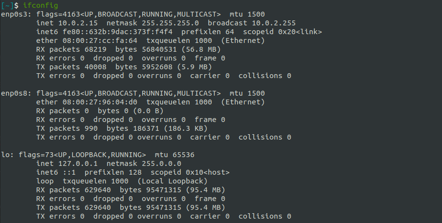

# Setup OpenStack AIO inside VM with Kolla

## OpenStack 

### Overview

**OpenStack** is a **_free_, _open standard_** cloud computing platform. 
It is mostly deployed as **infrastructure-as-a-service** (_Iaas_) in both 
`public` and `private` clouds where virtual servers and other 
resources are made available to users.

**OpenStack** began in 2010 as a joint project of 
**Rackspace Hosting** and **NASA**. As of 2012, it was managed by the **OpenStack Foundation**.
In 2021 the foundation renamed to **the Open Infrastructure Foundation**.

<div align="center">
  
</div>

<div align="center">
  <i>OpenStack logo.</i>
</div>

### Architecture

**Openstack** is designed with a **modular** architecture - facilitates the scaling & integration of components.

  - **Modular** architecture
  - Design for easily scale out
  - Based on (growing) set of core services


<div align="center">
  
</div>

<div align="center">
  <i>OpenStack's logical architecture.</i>
</div>

### Services

An OpenStack deployment contains a number of components **providing APIs** to access infrastructure resources. 
These are the various services that can be deployed to provide such resources to cloud end users.

<div align="center">
  
</div>

<div align="center">
  <i>OpenStack's core components diagram.</i>
</div>

| OpenStack Services | Role | About this project                                                                                                                                                                                                                                          |
|---|----|-------------------------------------------------------------------------------------------------------------------------------------------------------------------------------------------------------------------------------------------------------------|
|**Horizon**| Dashboard | **Horizon** is the canonical implementation of OpenStack's dashboard, which is extensible and provides a web based user interface to OpenStack services.                                                                                                    |
|**Keystone**| Identity service | **Keystone** is an OpenStack service that provides API client authentication, service discovery, and distributed multi-tenant authorization by implementing **OpenStack’s Identity API**.                                                                   |
|**Swift**| Object store | **Swift** is a highly available, distributed, eventually consistent object/blob store. It's built for scale and optimized for durability, availability, and concurrency across the entire data set.                                                         |
|**Glance**| Image service | **Glance** image services include discovering, registering, and retrieving virtual machine images. Glance has a RESTful API that allows querying of VM image metadata as well as retrieval of the actual image.                                             |
|**Neutron**| Networking | **Neutron** is an SDN networking project focused on delivering **networking-as-a-service** (_NaaS_) in virtual compute environments.                                                                                                                        |
|**Cinder**| Block Storage | **Cinder** virtualizes the management of block storage devices and provides end users with a self service API to request and consume those resources without requiring any knowledge of where their storage is actually deployed or on what type of device. |
|**Nova**| Compute Service | **Nova** implements services and associated libraries to provide massively scalable, on demand, self service access to compute resources, including bare metal, virtual machines, and containers.                                                               |

### All-In-One (single-node) Single VM 

<div align="center">
  
</div>

<div align="center">
  <i>Single-node and Multiple-nodes.</i>
</div>

In **AIO** or **single-node** mode, all the service will be deployed in one node, in our case,
it is _in a single virtual machine_. In the other hand, in **multiple-nodes** mode
(2 or more nodes),
a service can be deployed _in many node_, or difference services are deployed
_in difference nodes_.

In this practice, we will use the **AIO architecture** to deploy OpenStack.
And the deployment will only use 3 main services of OpenStack: 

**1/ Compute (Nova)**

**2/ Networking (Neutron)**

**3/ Storage ()**

<div align="center">
  
</div>

<div align="center">
  <i>3 main services are used in this project.</i>
</div>


## Kolla

### Overview
**Kolla** provides _production-ready_ containers and deployment tools 
for operating **OpenStack** clouds. 


<div align="center">
  
</div>

<div align="center">
  <i>Kolla logo.</i>
</div>

## Requires

In this practice, I will use my **Ubuntu VM** (_Ubuntu 20.04.2 ARM 64_) by **Parallels Desktop**.

### Infrastructure requirements
| Specification(s) | Require | Personal VM (by default) |                                                                                                  
|------------------|---------|-------------------------|
| CPU | 4 cores | 2 cores                 |
| RAM | 8 GB    | 2 GB                    |
| Disks | 2       | 1                       |
| Network | 2 NICs  | 1 NIC                   |


### Setting up our VM

First, power off our VM, because some configurations can not perform when the VM is still running.
Then open VM instance's `Configuration` by click to the `Setting icon` button and choose `Hardware` tab.

#### CPU & RAM

In `CPU & Memmory` section to config number of processors and size of the memory.
By default, we only have _2 processors_ and _2 GB RAM_.

Select `4 processors` with `8192 MB` (8 GB) memory.

<div align="center">
  
</div>

<div align="center">
  <i>Configuration CPU & Memory of VM.</i>
</div>

#### Disk

By default, our VM only has _1 disks_. So in order to create the second disk, click to the `+` 
button in the below part of the `Configuration` window.

Choose `Hard disk` to add a new disk.

<div align="center">
  
</div>

<div align="center">
  <i>Choose <strong>Hard disk</strong> to add a new disk.</i>
</div>

Then set it's size to `64 GB` and click `OK` to finish setting.

<div align="center">
  
</div>

<div align="center">
  <i>Set disk's size and finish.</i>
</div>

#### Network

By default, our VM only has _1 network_.
So click to the `+` and choose `Network` to add a new **Network Interface Controller** (_NICs_) .

<div align="center">
  
</div>

<div align="center">
  <i>Choose <strong>Network</strong> to add a new network.</i>
</div>

### Verify infrastructure 

After finish setting, **restart** our VM to apply these new changes.

#### CPU

In order to verify you `CPU`, use the command:

```bash
lscpu
```

The number of cores is s`CPU(s)` - which is 4 cores.

<div align="center">
  
</div>

<div align="center">
  <i>Information about the CPU architecture in my VM.</i>
</div>


#### RAM

Use `free` to find information about memory in the system. `free` is a command to 
display amount of free and used memory in the system.


I use `-h` (`--human`) option here to format the output easy to read.

```bash
free -h
```

In total, my VM has about **8 GB** of RAM with **2 GB** of memory swap.

<div align="center">
  
</div>

<div align="center">
  <i>Information about the memory in my VM.</i>
</div>

#### Disk

The easiest way to list disks is to use the `lsblk` command. 
The **type** column will mention the `disk` as well as optional partitions and LVM available 
on it.

We need administrator rights in order to have the full output of the command, 
so add `sudo` before.

```bash
sudo lsblk
```

You can see there are 2 disks: `sda` and `sdb`. The first disk - `sda`
partition into `sda1` and `sda2`.

<div align="center">
  
</div>

<div align="center">
  <i>Information about the memory in my VM.</i>
</div>

#### Network

The `lshw` command can extract detailed information on the hardware configuration 
of the machine including **network cards**. 

We need administrator rights in order to have the full output of the command, 
so add `sudo` before.

```bash
sudo lshw -class network
```

You can see there are 2 NICs: `virtio1` and `virtio2`. 

<div align="center">
  
</div>

<div align="center">
  <i>List of NICs in my VM.</i>
</div>


#### Summary

| Specification(s) | Require | Personal VM (by default) |  Personal VM (after config) |                                                                                                                
|------------------|---------|-------------------------|-----|
| CPU | 4 cores | 2 cores                 | 4 cors |
| RAM | 8 GB    | 2 GB                    | 8 GB |
| Disks | 2       | 1                       | 2 |
| Network | 2 NICs  | 1 NIC                   | 2 NICs |

Now, we have met the requirements of to run `all-in-one` **OpenStack**.

## References

[1] [OpenStack in Wikipedia](https://en.wikipedia.org/wiki/VirtualBox)

[2] [OpenStack components](https://www.virtualbox.org)

[3] [Kolla repository](https://github.com/openstack/kolla)

[4] [kolla-ansible repository](https://github.com/openstack/kolla-ansible)

[5] [Linux commands](https://man7.org/linux/man-pages/)