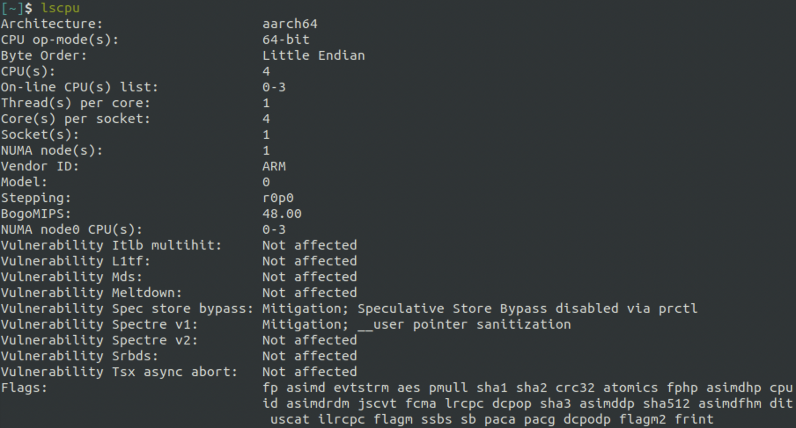
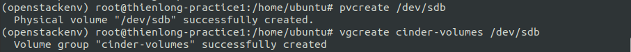
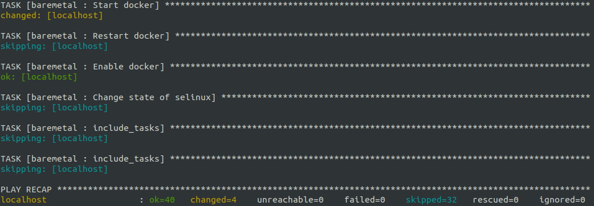
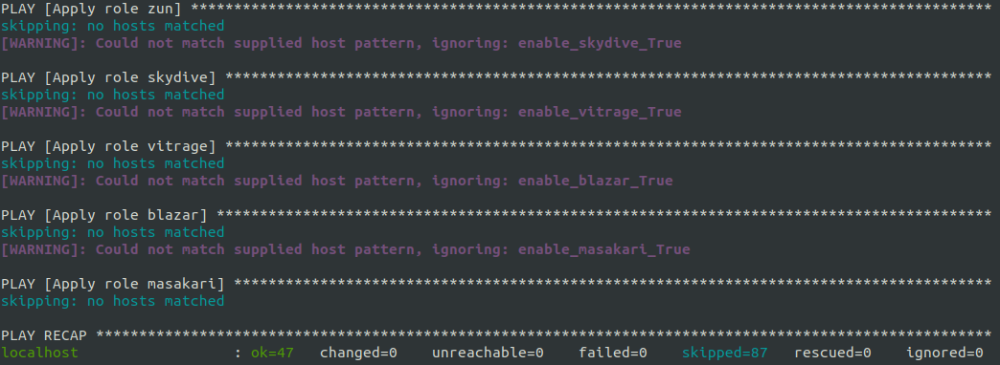
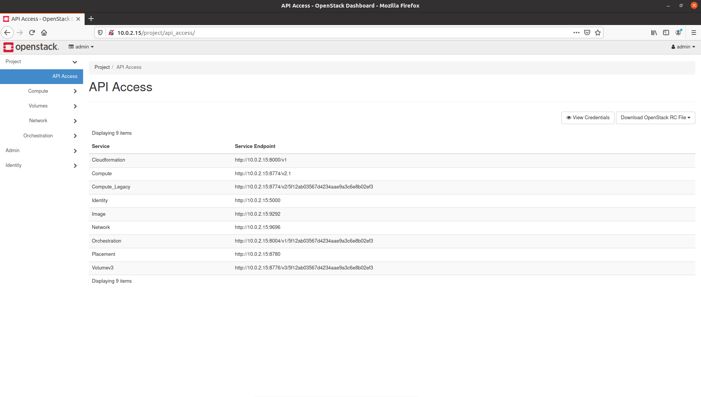

# Setup OpenStack AIO inside VM with Kolla


Author: **Vo Minh Thien Long**

----        
## Table of contents     
[I. OpenStack](#openstack)
- [1. Overview](#openstack-overview)
- [2. Versions](#openstack-versions)
- [3. Architecture](#openstack-architecture)           
- [4. Services](#openstack-services)   

[II. Kolla](#kolla)   
- [1. Overview](#kolla-overview)  
- [2. Versions](#kolla-versions)  
- [3. Kolla Ansible](#kolla-ansible)  

[III. Requires](#requires)
- [1. Infrastructure requirements](#requires-infa)
- [2. Setting up our VM](#requires-setting)
- [3. Verify infrastructure](#requires-verify)

[IV. Install instructions](#instructions)
- [1. Install dependencies](#instructions-install)
- [2. Install Ansible](#instructions-ansible)
- [3. Install Kolla Ansible](#instructions-kolla-ansible)
- [4. Install OpenStack CLI](#instructions-openstack-cli)

[V. Configuration](#configuration)
- [1. Configure Kolla Ansible](#configure-kolla-ansible)
- [2. Configure Ansible](#configure-ansible)
- [3. Build container images for ARM](#configure-arm)

[VI. Pre-deploy](#predeploy)
- [1. Custom inventory file](#predeploy-inventory)
- [2. Check configurations](#predeploy-config)
- [3. Create diskspace partition for Cinder](#predeploy-partition)

[VII. Deployment](#deployment)
- [1. Setup Openstack Kolla by Boostrap servers](#deployment-bootstrap)
- [2. Check all requirements of each services](#deployment-prechecks)
- [3. Pull images on target hosts](#deployment-pull)
- [4. Deploy and start all](#deployment-deploy)
- [5. Post-deploy OpenStack](#deployment-post-deploy)

[VIII. Using OpenStack](#using-openstack)
- [1. Activate OpenStack CLI environment](#using-openstack-activate)
- [2. Login and use Horizon Dashboard](#using-openstack-login)

[XI. Encountered errors](#encountered-errors)
- [1. Failed to start docker.service: Unit is masked](#masked-docker)
- [2. Encounter `403` when running Kolla Build](#403)
- [3. Forget to generate or config required file](#forget)
- [4. Permission denied](#permission-denied)
- [5. Some solution for other errors](#others)

[X. References](#references)

---- 

<a name='openstack'></a> 
## I. OpenStack 

<a name='openstack-overview'></a> 
### 1. Overview

**OpenStack** is a **_free_, _open standard_** cloud computing platform. 
It is mostly deployed as **infrastructure-as-a-service** (_Iaas_) in both 
`public` and `private` clouds where virtual servers and other 
resources are made available to users.

**OpenStack** began in 2010 as a joint project of 
**Rackspace Hosting** and **NASA**. As of 2012, it was managed by the **OpenStack Foundation**.
In 2021 the foundation renamed to **the Open Infrastructure Foundation**.

<div align="center">
  
</div>

<div align="center">
  <i>OpenStack logo.</i>
</div>

<a name='openstack-versions'></a> 
### 2. Versions

**OpenStack** is developed and released around 6-month cycles. After the initial release, 
additional stable point releases will be released in each release series.

| Series | Status | Initial Release Date |
|--------|--------|----------------------|
| Zed | Development | 2022-10-05 estimated (schedule) |
| Yoga | Maintained | 2022-03-30 | 
| Xena | Maintained | 2021-10-06 |
| Wallaby | Maintained | 2021-04-14 |

The latest version now is `Yoga`. But in this practice, I use `Xena` for learning purpose.

<a name='openstack-architecture'></a> 
### 3. Architecture

**Openstack** is designed with a **modular** architecture - facilitates the scaling & integration of components.

  - **Modular** architecture
  - Design for easily scale out
  - Based on (growing) set of core services


<div align="center">
  
</div>

<div align="center">
  <i>OpenStack's logical architecture.</i>
</div>

<a name='openstack-services'></a> 
### 4. Services

An OpenStack deployment contains a number of components **providing APIs** to access infrastructure resources. 
These are the various services that can be deployed to provide such resources to cloud end users.

<div align="center">
  
</div>

<div align="center">
  <i>OpenStack's core components diagram.</i>
</div>

| OpenStack Services | Role | About this project                                                                                                                                                                                                                                          |
|---|----|-------------------------------------------------------------------------------------------------------------------------------------------------------------------------------------------------------------------------------------------------------------|
|**Horizon**| Dashboard | **Horizon** is the canonical implementation of OpenStack's dashboard, which is extensible and provides a web based user interface to OpenStack services.                                                                                                    |
|**Keystone**| Identity service | **Keystone** is an OpenStack service that provides API client authentication, service discovery, and distributed multi-tenant authorization by implementing **OpenStack’s Identity API**.                                                                   |
|**Swift**| Object store | **Swift** is a highly available, distributed, eventually consistent object/blob store. It's built for scale and optimized for durability, availability, and concurrency across the entire data set.                                                         |
|**Glance**| Image service | **Glance** image services include discovering, registering, and retrieving virtual machine images. Glance has a RESTful API that allows querying of VM image metadata as well as retrieval of the actual image.                                             |
|**Neutron**| Networking | **Neutron** is an SDN networking project focused on delivering **networking-as-a-service** (_NaaS_) in virtual compute environments.                                                                                                                        |
|**Cinder**| Block Storage | **Cinder** virtualizes the management of block storage devices and provides end users with a self service API to request and consume those resources without requiring any knowledge of where their storage is actually deployed or on what type of device. |
|**Nova**| Compute Service | **Nova** implements services and associated libraries to provide massively scalable, on demand, self service access to compute resources, including bare metal, virtual machines, and containers.                                                               |

<a name='openstack-all-in-one'></a> 
### 5. All-In-One (single-node) Single VM 


In **AIO** or **single-node** mode, all the service will be deployed in one node, in our case,
it is _in a single virtual machine_. In the other hand, in **multiple-nodes** mode
(2 or more nodes),
a service can be deployed _in many node_, or difference services are deployed
_in difference nodes_.


<div align="center">
  
</div>

<div align="center">
  <i>Single-node and Multiple-nodes.</i>
</div>

And the deployment must include 3 main services of OpenStack:

  **1/ Compute**
  
  **2/ Networking** 
  
  **3/ Storage** 

<div align="center">
  
</div>

<div align="center">
  <i>3 main services must be in all project.</i>
</div>


In this practice, we will use the **AIO architecture** to deploy OpenStack.


<a name='kolla'></a> 
## II. Kolla

<a name='kolla-overview'></a> 
### 1. Overview
**Kolla** provides _production-ready_ containers and deployment tools 
for operating **OpenStack** clouds.  **Kolla** was released from the **Kilo** 
and officially became **OpenStack Project**.

With the idea **Kolla** is to deploy **OpenStack** in a `container` environment, 
automatically deploy **OpenStack** using **Kolla Ansible**. 
Thereby with just a few operations, we will have an **OpenStack** environment to use,
with also monitoring, HA, rolling upgrades, etc.

<div align="center">
  
</div>

<div align="center">
  <i>Kolla logo.</i>
</div>

<a name='kolla-versions'></a> 
### 2. Versions

**Kolla** has stable version, which is developed based on **OpenStack**. 
So we you need to choose the **kolla** version match with your **OpenStack** version.

- OpenStack `latest` - Kolla `14.1.x`
- OpenStack `Yoga` - Kolla  `14.x.x`
- OpenStack `Xena` - Kolla `13.0.x`
- OpenStack `Victoria` - Kolla `11.4.x`
- ...

I use OpenStack `Xena` here, so I will use Kolla `13.0.x`.

<a name='kolla-ansible'></a> 
### 3. Kolla Ansible

**Kolla Ansible** provides **Ansible** playbooks to deploy the **Kolla** images.
Its version is similar to **Kolla**.

<a name='requires'></a> 
## III. Requires

In this practice, I will use my **Ubuntu VM** (_Ubuntu 20.04.2 ARM 64_) by **Parallels Desktop**.


<a name='requires-infa'></a> 
### 1. Infrastructure requirements
| Specification(s) | Require | Personal VM (by default) |                                                                                                  
|------------------|---------|-------------------------|
| CPU | 4 cores | 2 cores                 |
| RAM | 8 GB    | 2 GB                    |
| Disks | 2       | 1                       |
| Network | 2 NICs  | 1 NIC                   |


<a name='requires-setting'></a> 
### 2. Setting up our VM

First, power off our VM, because some configurations can not perform when the VM is still running.
Then open VM instance's `Configuration` by click to the `Setting icon` button and choose `Hardware` tab.

#### CPU & RAM

In `CPU & Memmory` section to config number of processors and size of the memory.
By default, we only have _2 processors_ and _2 GB RAM_.

Select `4 processors` with `8192 MB` (8 GB) memory.

<div align="center">
  
</div>

<div align="center">
  <i>Configuration CPU & Memory of VM.</i>
</div>

#### Disk

By default, our VM only has _1 disks_. So in order to create the second disk, click to the `+` 
button in the below part of the `Configuration` window.

Choose `Hard disk` to add a new disk.

<div align="center">
  
</div>

<div align="center">
  <i>Choose <strong>Hard disk</strong> to add a new disk.</i>
</div>

Then set it's size to `64 GB` and click `OK` to finish setting.

<div align="center">
  
</div>

<div align="center">
  <i>Set disk's size and finish.</i>
</div>

#### Network

By default, our VM only has _1 network_.
So click to the `+` and choose `Network` to add a new **Network Interface Controller** (_NICs_) .

<div align="center">
  
</div>

<div align="center">
  <i>Choose <strong>Network</strong> to add a new network.</i>
</div>

<a name='requires-verify'></a> 
### 3. Verify infrastructure 

After finish setting, **restart** our VM to apply these new changes.

#### CPU

In order to verify you `CPU`, use the command:

```shell
lscpu
```

The number of cores is s`CPU(s)` - which is 4 cores.

<div align="center">
  
</div>

<div align="center">
  <i>Information about the CPU architecture in my VM.</i>
</div>


#### RAM

Use `free` to find information about memory in the system. `free` is a command to 
display amount of free and used memory in the system.


I use `-h` (`--human`) option here to format the output easy to read.

```shell
free -h
```

In total, my VM has about **8 GB** of RAM with **2 GB** of memory swap.

<div align="center">
  
</div>

<div align="center">
  <i>Information about the memory in my VM.</i>
</div>

#### Disk

The easiest way to list disks is to use the `lsblk` command. 
The **type** column will mention the `disk` as well as optional partitions and LVM available 
on it.

We need administrator rights in order to have the full output of the command, 
so add `sudo` before.

```shell
sudo lsblk
```

You can see there are 2 disks: `sda` and `sdb`. The first disk - `sda` is used
to store Ubuntu OS. And the second disk - `sdb` is our mounted disk.

<div align="center">
  
</div>

<div align="center">
  <i>Information about the memory in my VM.</i>
</div>

#### Network

You can use `ip` command list all network interfaces in our machine. However, for the
easy human-readable display format, I installed `net-tools` and use `ifconfig` to list the network
interfaces.

<div align="center">
  
</div>

<div align="center">
  <i>List of network interfaces in my VM.</i>
</div>

We will use 2 network interfaces:

- **enp0s3**: `NAT` - **10.0.2.15/24** (for _Internal_ network)

- **enp0s8**: `Bridge network` - **08:00:27:96:04:d0** (for _External/Provider_ network)

#### Summary

| Specification(s) | Require | Personal VM (by default) | Personal VM (after config) |                                                                                                                
|------------------|---------|-------------------------|----------------------------|
| CPU | 4 cores | 2 cores                 | 4 cores                    |
| RAM | 8 GB    | 2 GB                    | 8 GB                       |
| Disks | 2       | 1                       | 2                          |
| Network | 2 NICs  | 1 NIC                   | 2 NICs                     |

Now, we have met the requirements of to run `all-in-one` **OpenStack**.

<a name='instructions'></a> 
## IV. Instructions

To make it is easy, all the commands use administrator rights - add `sudo` before
them all.

```shell
sudo <command>
```

Or use can set up `root` password, type **current user** password (`ubuntu` in my case) and then type new your
password for **root user**. Then switch user to root to have the **root user right**.

```shell
sudo passwd root
```

<div align="center">
  
</div>

<div align="center">
  <i>Set up password for <strong>user</strong>.</i>
</div>

Then use `su` to switch to **root user**.

```shell
su
```

<div align="center">
  
</div>

<div align="center">
  <i>Switch user to <strong>root user</strong>.</i>
</div>


<a name='instructions-install'></a> 
### 1. Install dependencies

#### 1/ Update the package sources list

Update the package sources list to get the latest list of available packages 
in the repositories by using `apt update`.

```shell
apt update
```

#### 2/ Updates all the packages

Update all the packages presently installed in our Linux system to their 
latest versions by using `apt upgrade`.

```shell
apt upgrade
```

#### 3/ Install required dependencies

First, in case you didn't install `git` or `docker`, 
install it by `apt install`.

```shell
apt git docker docker-compose
```


Then, we will install other required dependencies.

```shell
apt install python3-dev python3-pip libffi-dev gcc libssl-dev
```

#### 4/ Upgrade `pip`

Upgrade `pip` to the latest version by `-U` (`--upgrade`) option.

```shell
pip install -U pip
```

<a name='instructions-ansible'></a> 
### 2. Install `ansible`

Install  `ansible`. **Kolla Ansible** requires at least **Ansible** `2.10` and supports up to `4`.

```shell
pip install 'ansible<5.0'
```

<a name='instructions-kolla-ansible'></a> 
### 3. Install `kolla-ansible`

Install `kolla-ansible` and its dependencies  by using `pip` in virtual environment.

```shell
pip install git+https://opendev.org/openstack/kolla-ansible@stable/xena
```

<a name='instructions-openstack-cli'></a> 
### 4. Install `OpenStack CLI`

```shell
pip install python-openstackclient python-glanceclient python-neutronclient
```

<a name='configuration'></a> 
## V. Configuration 

<a name='configure-kolla-ansible'></a> 
### 1. Configure `kolla-ansible`

#### 1/ Create `/etc/kolla` directory

Create `/etc/kolla` directory by using `mkdir` with `-p` (`--path`) option
to create directory in path.

```shell
mkdir -p /etc/kolla
```

Then changes the _ownership_ of the file from its current owner 
to **current user** and changes the _file group owner_ to **group users**.

```shell
chown $USER:$USER /etc/kolla
```

#### 2/ Copy `passwords.yml` and `globals.yml` to `/etc/kolla`

```shell
cp -r ./openstackenv/share/kolla-ansible/etc_examples/kolla/* /etc/kolla
```

#### 3/ Generate password

Passwords used in our deployment are stored in **/etc/kolla/passwords.yml** file. 
All passwords are blank in this file and have to be filled either manually or by
running random password generator

```shell
kolla-genpwd
```

#### 4/ Copy `all-in-one` inventory files to the current directory.

```shell
cp ./openstackenv/share/kolla-ansible/ansible/inventory/all-in-one .
```


#### 5/ Configurate `globals.yml`

Open and edit `globals.yml` in **/etc/kolla** by using `gedit`.

```shell
gedit /etc/kolla/globals.yml
```

The content of `globals.yml`:

```shell
kolla_base_distro: "ubuntu"
kolla_install_type: "source"

network_interface: enp0s3
neutron_external_interface: enp0s8
kolla_internal_vip_address: 10.0.2.15

nova_compute_virt_type: "qemu"

enable_haproxy: "no"

enable_cinder: "yes"
enable_cinder_backup: "no"
enable_cinder_backend_lvm: "yes"
```

- **kolla_base_distro**: Our Linux distribution - `ubuntu`.
- **kolla_install_type**: Kolla container image type:
  - `source` - build images from source codes (we use it here).
  - `binary` - using remote binary component file.


- **network_interface**: internal network interface communicate with **OpenStack**.
- **neutron_external_interface**: provider network interface for VMs.
- **kolla_internal_vip_address**: IP address of `network_interface`, prevent errors when **MariaDB**
connect with HAproxy.


- **nova_compute_virt_type**: we use VM, so here we set it is `qemu`.


- **enable_haproxy**: `no` for **all-in-one**.


- **enable_cinder**: we use **Cinder LVM** use share storage for **OpenStack**, so we set `yes` here.
- **enable_cinder_backup**: We don't use **Backup Cinder**, so we set `no` hrer.
- **enable_cinder_backend_lvm**: we use Backend LVM for **Cinder** , so we set `yes` here.


<a name='configure-ansible'></a> 
### 2. Configure `ansible`

#### 1/ Create `/etc/ansible` directory

```shell
mkdir -p /etc/ansible
```

2/ Add the following options to the Ansible configuration file **/etc/ansible/ansible.cfg**

Open and edit `ansible.cfg` in **/etc/ansible/ansible.cfg** by using `gedit` (in my opion, it is easier to edit the
file than `vi` or `nano`).

```shell
gedit /etc/ansible/ansible.cfg
```

The content of `ansible.config`:

```text
[defaults]
host_key_checking=False
pipelining=True
forks=100
```

<a name='configure-arm'></a> 
### 3. Build container images for ARM by Kolla Build

The difference between **Kolla** and **Kolla Ansible** is that Kolla provides tools to build images for OpenStack services on multiple platforms.
Linux platforms with _different chip architectures_ (which is included **ARM**). 

**Kolla Ansible** provides tools to deploy images built with **Kolla**.
Therefore, images can be created and rebuilt at any time using the `kolla-build` command.

First, check if the **Docker engine** is running.

```shell
service docker status
```

If your Docker isn't `active (running)`, then start it.

```shell
service docker start
```

Build images of  OpenStack's services in Ubuntu by `kolla-build`

```shell
kolla-build -b ubuntu
```

**Note**: 

- This step is take very, very long time, so consider using 
**snapshot** to keep your work safe.

- In case you got `403` HTTP status error when build image, 
please consider using **VPN**.
Because currently I am in Russia, so some images can't directly install, 
and I have to use **VPN** instead.

<a name='predeploy'></a> 
## VI. Pre-deploy

<a name='predeploy-inventor'></a> 
### 1. Custom inventory file

In this practice, I just use the default sample `all-in-one` as inventory file.
However, you could change it as your demand, or use `multinode` in case you want to deploy
OpenStack in `multinode` mode.

You can read it by using this command (Please make sure that `all-in-one`
is now in your working directory.)

```shell
more all-in-one
``` 

<a name='predeploy-config'></a> 
### 2. Check configurations

```shell
ansible -i all-in-one all -m ping
```

<div align="center">
  
</div>

<div align="center">
  <i>Ping successful.</i>
</div>

Don't worry about the `[WARNING]`, there is `-` character in group name in `all-in-one`,
but it doesn't have any affect to us.


<a name='predeploy-partition'></a> 
### 3. Create diskspace partition for `Cinder`

#### 1/ Install **Logical Volume Manager** - `lvm2`

If you didn't install `lvm2` (for Logical Volume Manager),
you need to install it to use `pvcreate` and `vgcreate`.


```shell
apt instal lvm2
```

#### 2/ Create physical volume 

Use `pvcreate` to create a physical volume for **Cinder** in `/dev/sdb`.

```shell
pvcreate /dev/sdb
```

#### 3/ Create volume group

Then `vgcreate` to create a volume group `cinder-volume` in disk `/dev/sdb`.

```shell
vgcreate cinder-volumes /dev/sdb
```

<div align="center">
  
</div>

<div align="center">
  <i>Create diskspace partition.</i>
</div>

<a name='deployment'></a> 
## VII. Deployment

<a name='deployment-bootstrap'></a> 
### 1. Setup Openstack Kolla by Boostrap servers

`-i` option to indicate the inventory file, here is `all-in-one`. Please make sure that `all-in-one`
is now in your working directory.

```shell
kolla-ansible -i all-in-one bootstrap-servers
```

<div align="center">
  
</div>

<div align="center">
  <i>Bootstrapping success.</i>
</div>

<a name='deployment-prechecks'></a> 
### 2. Check all requirements of each services

`prechecks` is used to check if all requirements are meet before deploy for 
each of the OpenStack services.

```shell
kolla-ansible -i all-in-one prechecks
```

<div align="center">
  
</div>

<div align="center">
  <i>Prechecking success.</i>
</div>

<a name='deployment-pull'></a> 
### 3. Pull images on target hosts

```shell
kolla-ansible -i all-in-one pull
```

<div align="center">
  
</div>

<div align="center">
  <i>Pulling images success.</i>
</div>

<a name='deployment-deploy'></a> 
### 4. Deploy and start all

`deploy` is used to deploy and start all Kolla containers.

```shell
kolla-ansible -i all-in-one deploy
```

<div align="center">
  
</div>

<div align="center">
  <i>Deploy OpenStack success.</i>
</div>


<a name='deployment-post-deploy'></a> 
### 5. Post-deploy OpenStack

Configurate File Environment of OpenStack, `post-deploy` is used to do 
post deploy on deploy node to get the **admin-openrc** file.


```shell
kolla-ansible -i all-in-one post-deploy
```

<div align="center">
  
</div>

<div align="center">
  <i>Deploy OpenStack success.</i>
</div>

<a name='using-openstack'></a> 
## VIII. Using OpenStack


<a name='using-openstack-activate'></a> 
### 1. Activate OpenStack CLI environment

Execute `admin-openrc.sh` by `source` command.

```shell
source /etc/kolla/admin-openrc.sh
```

Issue new **OpenStack** token.

```shell
openstack token issue
```

<a name='using-openstack-login'></a> 
### 2. Login and use Horizon Dashboard
  
Get generate `admin` password from **/etc/kolla/passwords.yml**

```shell
cat /etc/kolla/passwords.yml | grep keystone_admin
```

Go to url: [http://10.0.2.15](http://10.0.2.15) to the **Log in** interface of **Horizon**.

Then fill to the form **User Name** with **admin**,
and **Password** with the password we get from the previous step.

```text
Username: admin
Password: <PASSWORD_FROM_PREVIOUS_STEP>
```

<div align="center">
  
</div>

<div align="center">
  <i>Login to Horizon.</i>
</div>

Get list APIs for each service in tab **API Access**.

<div align="center">
  
</div>

<div align="center">
  <i>Tab <strong>API Access</strong> in <strong>Horizon Dashboard</strong>.</i>
</div>


<a name='encountered-errors'></a> 
## XI. Encountered errors

<a name='masked-docker'></a> 
### 1. Failed to start docker.service: Unit is masked

When you start your **Docker Engine**, but you encountered this error,
you can fix by using this command (with **root** right):

```shell
systemctl unmask docker
```

Then try to start **Docker Engine** again.

```shell
service docker start
```

<a name='403'></a> 
### 2. Encounter `403` when running Kolla Build

Actually, I don't think it is a common error. However, because currently I am in Russia, I didn't have a permission to
access some website. So I have to use `VPN` to pass it.


<a name='forget'></a> 
### 3. Forget to generate or config required file

**1. Forget to generate `passwords.yml`**

  If you use command `kolla-ansible` with `prechecks` but get the errors:

```text
"cmd": ["grep", "^[^#].*:\\s*$", "/etc/kolla/passwords.yml"]
```

It maybe because you forget to use `kolla-genpwd` to generate`passwords.yml`.
Use `kolla-genpwd` and then run the command again.

**2. Forget to configurate `ansible.cfg`**
  
  If you forget to configurate `ansible.cfg`, you will get the error when use
`ansible -i all-in-one all -m ping`.

**3. Forget to configurate `globals.yml`**
  
  If you use command `kolla-ansible` with `bootstrap-servers` but get the errors, it maybe because you forget to 
configurate `globals.yml`.

<a name='permission-denied'></a> 
### 4. Permission denied

You need to use `root` user right by using `sudo` following by the command,
or use `su` from the beginning like me.

However, `su` password isn't your device password. So you can generate it by using `passwd root` 
and then use `su` again.

<a name='others'></a> 
### 5. Some solution for other errors

- Please remember to update `apt` and `pip`.

- If you use device with **ARM processors**, you have to build images by `kolla-build`.

- Use **ansible** with version `ansible<5.0` and **kolla-ansible** with `xena` version.


<a name='references'></a> 
## X. References

[1] [OpenStack website](https://www.openstack.org/)

[2] [OpenStack components](https://www.openstack.org/software/project-navigator/openstack-components)

[3] [Kolla repository](https://github.com/openstack/kolla)

[4] [Kolla in OpenStack wiki](https://wiki.openstack.org/wiki/Kolla)

[4] [kolla-ansible repository](https://github.com/openstack/kolla-ansible)

[5] [Linux commands](https://man7.org/linux/man-pages/)

[6] [Config globals.yml](https://github.com/openstack/kolla-ansible/blob/master/etc/kolla/globals.yml)

[7] [Quick start with Kolla Ansible Xena](https://docs.openstack.org/kolla-ansible/xena/user/quickstart.html)

[8] [OpenStack on ARM64](https://cloudbase.it/openstack-on-arm64-part-1/)

[9] [Viettel Digital Talent program 2021 - OpenStack](https://github.com/vietstacker/Viettel-Digital-Talent-Program-2021/tree/main/Phase-1-Practices/Week-3)

