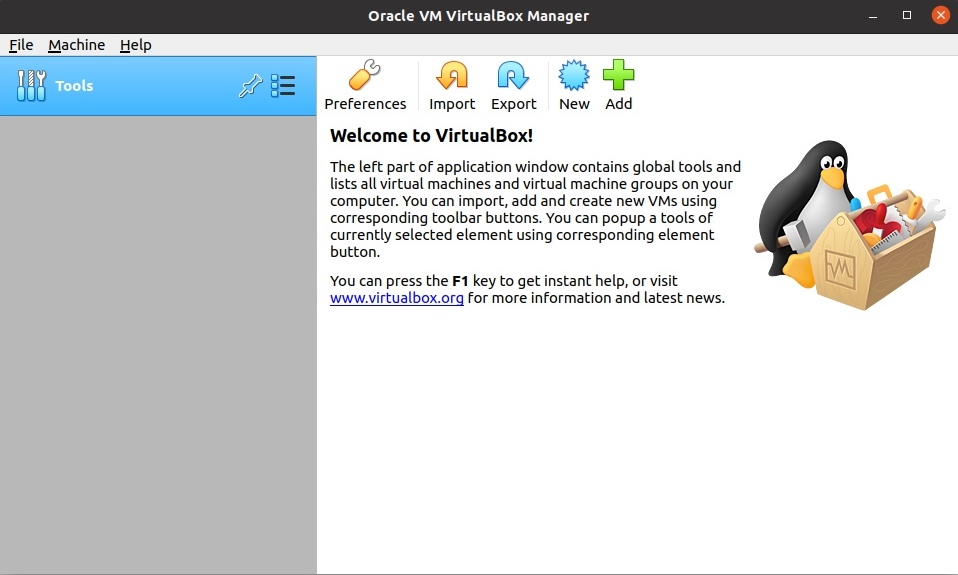
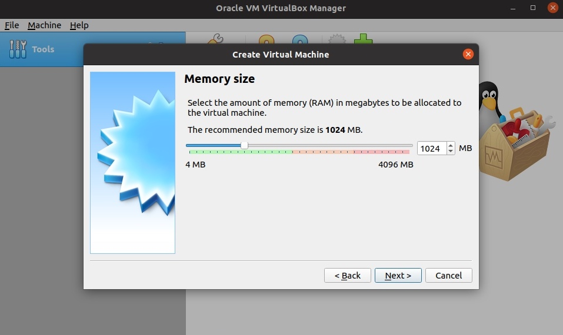

# Create Ubuntu virtual machine

Author: **Vo Minh Thien Long**

----        
## Table of contents     
[I. Using VirtualBox (For Intel-based and AMD chip devices)](#virtual-box)
- [1. Overview](#virtual-box-overview)
- [2. Versions](#virtual-box-versions)
- [3. Hardware supporting](#virtual-box-hw-supporting)           
- [4. Operating systems supporting](#virtual-box-os-supporting)       
- [5. Download](#virtual-box-download)    
- [6. Setting up the Ubuntu virtual machine](#virtual-box-setting-up)   
- [7. Run our Ubuntu VM first time](#virtual-box-run) 

[II. Using Parallels Desktop for Mac (Can use for Mac devices with ARM chip)](#parallels)   
- [1. Overview](#parallels-overview)
- [2. Versions](#parallels-versions)
- [3. System requirements](#parallels-system)             
- [5. Download](#parallels-download)    

[III. References](#references)

---- 


<a name='virtual-box'></a> 
## I. Using VirtualBox (For Intel-based and AMD chip devices)

<a name='virtual-box-overview'></a> 
### 1. Overview

**Oracle VM VirtualBox** is a `free` and `open-source` software.
It is a general-purpose full virtualizer, **type-2 hypervisor** for `x86` virtualization, 
targeted at _server_, _desktop_ and _embedded use_. VirtualBox
developed by **Oracle Corporation** (original author is **Innotek**).

VirtualBox is being actively developed with frequent releases and 
has an ever-growing list of features, supported guest operating systems 
and platforms it runs on. VirtualBox is a community effort backed by 
a dedicated company: **everyone is encouraged to contribute** while Oracle 
ensures the product always meets professional quality criteria.

<div align="center">
  
</div>

<div align="center">
  <i>VirtualBox logo</i>
</div>


<a name='virtual-box-versions'></a> 
### 2. Versions

The latest version is **VirtualBox 6.1.34** (which I will use in this exercise). 
This version released on _March 22, 2022_.

However, now you can still download `VirtualBox 6.0` and `VirtualBox 5.2`, in case you
still need to run VMs with software virtualization and `32-bit` hosts
as these have been discontinued in `VirtualBox 6.1.x`.


<a name='virtual-box-hw-supporting'></a> 
### 3. Hardware supporting

VirtualBox supports both **Intel's VT-x** and **AMD's AMD-V** hardware-assisted virtualization. 
However, it **doesn't** support Apple-based chip devices (M1, M1 Pro, ...), and other ARM processors.
In order to use Virtual Machine in these devices, you have to install other software, 
which I will introduce you later.

<a name='virtual-box-os-supporting'></a> 
### 4. Operating systems supporting

  1/ Windows

  2/ macOS (only **Intel-based** Macs)

  3/ Linux

  4/ Solaris

Presently, VirtualBox runs on Windows, Linux, Macintosh, and Solaris hosts and supports a large number of guest operating systems including but not limited to Windows (NT 4.0, 2000, XP, Server 2003, Vista, Windows 7, Windows 8, Windows 10), DOS/Windows 3.x, Linux (2.4, 2.6, 3.x and 4.x), Solaris and OpenSolaris, OS/2, and OpenBSD.


<a name='virtual-box-download'></a> 
### 5. Download 

#### 1/ Choose VirtualBox platform

Go to [this link](https://www.virtualbox.org/wiki/Downloads), in the `VirtualBox 6.1.34 platform packages` section, 
choose the package which is suitable for your current operating system.

In this exercise, I will use `VirtualBox 6.1.34`, as mentioned before.

<div align="center">
  
</div>

<div align="center">
  <i>In this case, I used Ubuntu, which is a Linux distribution.</i>
</div>

#### 2/ Check your operating system information (for Linux)

Use `lsb_release -a` to get your Linux OS information, which is required for our next step.

```shell
lsb_release -a
```

<div align="center">
  
</div>

<div align="center">
  <i>My Linux distro and version.</i>
</div>

Here is my OS information:

```shell
No LSB modules are available.
Distributor ID: Ubuntu
Description: Ubuntu 20.04.3 LTS
Release: 20.04
Codename: focal
```


#### 3/ Choose appropriate package for your Linux distribution.

Use the information got from the last step, choose the appropriate for 
Linux distro.

<div align="center">
  
</div>

<div align="center">
  <i>In this practice, I used Ubuntu 20.04.</i>
</div>

#### 4/ Open the downloaded file

After choosing the appropriate package and click in it, you will download
a `.deb` file. Click on this file to open it.

After open the file, click `Install` to install 
your VirtualBox application.

<div align="center">
  
</div>

<div align="center">
  <i>You can see some useful information here, for example version, installed size, etc.</i>
</div>

#### 5/ Finish installing VirtualBox

If you see the picture below, it means that you was successfully installed VirtualBox

<div align="center">
  
</div>

<div align="center">
    <i>In case you don't want to use VirtualBox anymore, click `Remove`
      to remove it from your computer.</i>
</div>


<a name='virtual-box-setting-up'></a> 

### 6. Setting up the Ubuntu virtual machine

#### 1/ Install Ubuntu Desktop

Ubuntu Desktop is the open-source desktop OS version Ubuntu. In this 
exercise, I will install the latest LTS version of Ubuntu - `Ubuntu 22.04 LTS`
This version is long-term support until April 2027.

Go to [this link](https://ubuntu.com/download/desktop), click on `Download` button
to install the ISO images.

<div align="center">
  
</div>

<div align="center">
    <i>If you don't want to use VirtualBox anymore, click `Remove`
      to remove it from your computer.</i>
</div>

#### 2/ Create a new virtual machine

Open the VirtualBox application, click `New` to create a new virtual machine instance.
In case you already have a VM file, you use `Add` to add your VM.

In this practice, I will create a new VM.

<div align="center">
  
</div>

<div align="center">
  <i>Click <strong>New</strong> to create a new VM.</i>
</div>

#### 3/ Set VM's name and OS

Type your VM's name and OS. Because we have installed the Ubuntu Desktop,
so our OS will be **Linux** with **Ubuntu 64-bit** verison.

By default, we are in `Guild mode`, but you can still see there is a button `Expert mode`.
The difference between these 2 modes are `Guide mode` will 
include some hints and explain at each setting step. In this practise 
I will use `Guide mode`.

<div align="center">
  
</div>

<div align="center">
  <i>In this practice, I named my Ubuntu VM as <strong>Practice1</strong>.</i>
</div>

#### 4/ Select memory size

This is the amount of RAM to be allocated to our VM. 

> Depending on what guest operating systems you want to run, you will need at least 512 MB of RAM 
(but probably more, and the more the better). Basically, you will need whatever your host operating 
system needs to run comfortably, plus the amount that the guest operating system needs.
Check the minimum RAM requirements of the guest operating system, they often will refuse to install if it is given less. Sometimes it malfunctions instead. So you'll need that for the guest alone, plus the memory your operating system normally needs.

As a rule of thumb, 1/4 of the amount of memory you have on your computer should be just fine. 
In my case, which has `4GB` RAM, `1GB = 1024MB` is enough.

<div align="center">
  
</div>

<div align="center">
  <i>In this practice, I will use <strong>1024MB</strong> as recommended.</i>
</div>

#### 5/ Select hard disk

There are 3 types of action you can choose:

- **Not add a virtual hard disk**

  Don't create a virtual hard disk now but later, after configurate 
VM


- **Create new virtual hard disk** (_default selection_)


- **Use an existing virtual hard disk file**

    So In case you already have VDI files,
you can reuse them which all the information before.

<div align="center">
  
</div>

<div align="center">
  <i>In this practice, I will choose <strong>Create a virtual hard disk now</strong>.</i>
</div>

#### 6/ Select virtual hard disk file type

There are 3 types of virtual hard disk file you can choose:

- **VDI** (_Virtual Disk Image_): Oracle’s Default Disk Format Used by Virtual Box

  Normally, Oracle VM VirtualBox uses its own 
container format for guest hard disks. This is called a 
Virtual Disk Image (VDI) file.

  Virtual disks created using VirtualBox have a `.vdi` file extension. 
VDI is portable and can be run using other virtualization programs. 
It allows both **fixed-size** and **dynamically allocated** storage. 
The latter means you can expand an image file after it has been created—even 
if it already contains data.


- **VHD** (_Virtual Hard Disk_): The Virtual Disk Format Used by Microsoft

  VHD stands for Virtual Hard Disk and is the standard disk format for Microsoft’s 
now-defunct virtualization products, including Microsoft Virtual PC and Virtual Server.


- **VMDK** (_Virtual Machine Disk_)

  VMDK, or Virtual Machine Disk, is a previously proprietary virtual disk-drive format 
built specifically for VMware virtual appliances, including VMware Workstation, VMware Player
and VMware Fusion. It has since become an open format and is now widely used across different virtualization platforms, including Hyper-V and VirtualBox.

In this practice, I choose **VDI** as a hard disk file type because is portable and can be run using 
other virtualization programs. Although it is slower than **VMDK**, **VDI**  does have high-level redundancy, lessening 
the impact of data loss on our VMs.

<div align="center">
  
</div>

<div align="center">
    <i>In this practice, I will choose <strong>VDI</strong> file type.</i>
</div>

#### 7/ Select strategy for storage on physical hard disk

There are 2 strategies:

- **Dynamically allocated**

  Dynamically allocated disks are faster to create and can grow to larger sizes.


- **Fixed size**

  Fixed size disks may be faster to use, but can’t grow any larger once they fill up. 

In this practice, I choose **Dynamically allocated** to optimize the storage.

<div align="center">
  
</div>

<div align="center">
  <i>In this practice, I will choose <strong>Dynamically allocated</strong> file type.</i>
</div>

**8/ Select file location and size**

Select the location, where you will store your virtual hard file, and it's size.

<div align="center">
  
</div>

<div align="center">
  <i>In this practice, I will choose <strong>10GB</strong> as the size limit.</i>
</div>

<a name='virtual-box-run'></a> 

### 7. Run our Ubuntu VM first time

#### 1/ Start our Ubuntu VM

After creating the VM, you will see it instance, and it's status in your left-hand side. 
In my case, it is **Practice1** and **Powered Off** (because it is the first time I run it).

And in your right-hand side, you can see the detail information about your VM, 
include name, OS, RAM, etc. You can also change your VM configuration by clicking
`Settings` or create a new VM by clicking `New`.

Click `Start` to start running our VM. 

<div align="center">
  
</div>

<div align="center">
  <i>List of your VM and it's information.</i>
</div>

#### 2/ Select start-up disk

Start-up disk is a virtual or physical disk that contain our OS. Click the the `Folder` icon 
to choose a start-up disk for your VM.

<div align="center">
  
</div>

<div align="center">
  <i>Choose your start-up disk.</i>
</div>

#### 3/ Add start-up disk from our install `iso`

<div align="center">
  
</div>

<div align="center">
  <i>Click the <strong>Folder</strong> icon to choose your start-up disk.</i>
</div>

#### 4/ Try our Ubuntu Desktop

Click `Try or Install Ubuntu` and then choose `Try Ubuntu` to start our Ubuntu Desktop.

<div align="center">
  
</div>

<div align="center">
  <i>Booting screen.</i>
</div>

#### 5/ Finish our VM

Congratulation, you have successfully installed Ubuntu VM by VirtualBox.

<div align="center">
  
</div>

<div align="center">
  <i>Our running Ubuntu VM.</i>
</div>


<a name='parallels'></a> 
## II. Using Parallels Desktop for Mac (Can use for Mac devices with ARM chip)

<a name='parallels-overview'></a> 
### Overview

**Parallels Desktop for Mac** is software  providing hardware virtualization 
for `Macintosh` computers . It is developed by 
**Parallels**, since 2018 a subsidiary of **Corel**.

It use hypervisor technology that works by **mapping** the 
host computer's hardware resources **directly** to the virtual 
machine's resources. Each virtual machine thus operates identically 
to a standalone computer, with virtually all the resources of a 
physical computer. 


<div align="center">
  
</div>


<a name='parallels-versions'></a> 
### Versions

Before version `16.5`, **Parallels Desktop** providing _hardware virtualization_ 
for Macintosh computers with `Intel processors`. And since version `16.5`
also for `Apple silicon-based` Macintosh computers.


The latest version is `Parallels Desktop 17`. It 
supports macOS Monterey, macOS Big Sur 11, 
macOS Catalina 10.15, macOS Mojave 10.14 and macOS High Sierra 10.13.
It is a fast, easy and powerful application for running Windows 
on your Intel or Apple M1 Mac—all without rebooting

<a name='parallels-system'></a> 
### System requirements

| Operating System | Processor | Memory | Storage | Graphics |
|------------------|-----------|--------|---------|----------|
|macOS Monterey 12, macOS Big Sur 11, macOS Catalina 10.15, macOS Mojave 10.14, or macOS High Sierra 10.13| Apple M1, M1 Pro, and M1 Max chips, Intel Core i3, Core i5, Core i7, Core i9, Intel Core M or Xeon processor | 4GB of RAM | 600 MB for Parallels Desktop application installation | Apple M1, M1 Pro, and M1 Max chips, Intel, AMD Radeon, or NVIDIA|


<a name='parallels-download'></a> 
### Download 

#### 1/ Choose free trial version

Because Parallels Desktop **isn't** `free` or `open-source`, so for this practice,
I will install a free trial (_7 days_).

<div align="center">
  
</div>

<div align="center">
  <i>Click <strong>DOWNLOAD FREE TRIAL</strong>.</i>
</div>

#### 2/ Download DMG file

Download disk image for install Parallels Desktop. `dmg` is Apple Disk Image, 
which is a disk image format commonly used by the macOS operating system.

<div align="center">
  
</div>

<div align="center">
  <i>Click <strong>DOWNLOAD NOW</strong>.</i>
</div>

#### 3/ Install Parallels® Desktop for Mac

Open the downloaded image and double-click the Install box. Look in the Downloads folder to find the image.

<div align="center">
  
</div>

<div align="center">
  <i>Double-click the Install box.</i>
</div>

<div align="center">
  
</div>

<div align="center">
  <i>Click <strong>Open</strong>.</i>
</div>

#### 4/ Open Installation Assistant

Installation Assistant is the tool for you to quickly install a
OS virtual machine

<div align="center">
  
</div>

<div align="center">
  <i>Click <strong>Continue</strong>.</i>
</div>

#### 5/ Install Ubuntu OS

Choose `Download Ubuntu Linux` under **Free Systems** sections. And
then `Download` the Ubuntu version for `ARM64` chip.

Wait until the download is finished and go to the next step.

<div align="center">
  
</div>

<div align="center">
  <i>Click <strong>Continue</strong>.</i>
</div>

Here is information about system `Ubuntu 20.04.02 ARM64`, includes description and size.

<div align="center">
  
</div>

<div align="center">
  <i>Click <strong>Download</strong> to download Ubuntu.</i>
</div>


#### 6/ Start your Ubuntu virtual machine

After installing Ubuntu OS, we now have Ubuntu virtual machine.
Open the `Control center`, click the `On/Off icon` to turn on our device. 


<div align="center">
  
</div>

<div align="center">
  <i>Click <strong>Play icon</strong> to start your VM.</i>
</div>


Click `Play icon` button to start our virtual machine.

<div align="center">
  
</div>

<div align="center">
  <i>Click <strong>Play icon</strong> to start your VM.</i>
</div>

Now our Ubuntu virtual machine is ready to use.

<div align="center">
  
</div>

<div align="center">
  <i>Our virtual machine is ready to use.</i>
</div>

## III. References

[1] [VirtualBox in Wikipedia](https://en.wikipedia.org/wiki/VirtualBox)

[2] [VirtualBox's website](https://www.virtualbox.org)

[3] [Ubuntu Desktop's website](https://ubuntu.com/download/desktop)

[4] [Oracle document about VirtualBox](https://docs.oracle.com/en/virtualization/virtualbox)

[5] [How much memory should I allocate to VirtualBox?](https://www.idcafe.net/how-much-memory-should-i-allocate-to-virtualbox/)

[6] [VDI Vs VHD Vs VMDK: Learn the Different Virtual Disk Formats](https://www.parallels.com/blogs/ras/vdi-vs-vhd-vs-vmdk/)

[7] [Parallels Desktop for Mac in Wikipedia](https://en.wikipedia.org/wiki/Parallels_Desktop_for_Mac)

[8] [Parallels Desktop for Mac website](https://www.parallels.com/products/desktop/)
