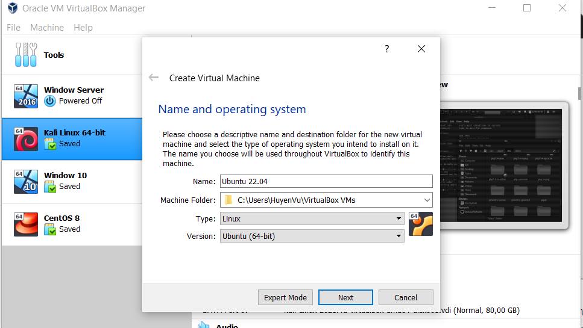
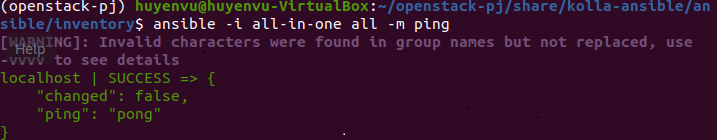
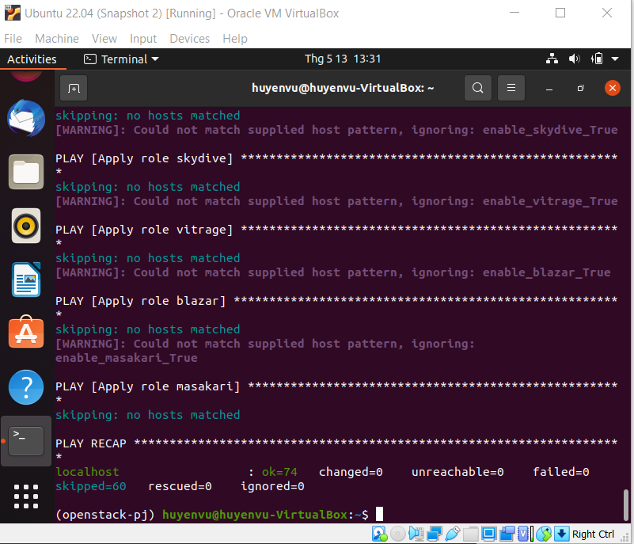

- [**Set up OpenStack AIO inside VM with Kolla**](#--set-up-openstack-aio-inside-vm-with-kolla--)
  - [**1. Create Ubuntu VM**](#--1-create-ubuntu-vm--)
    - [*1.1 Chuẩn bị*](#-11-chu-n-b--)
    - [*1.2 Cài đặt máy ảo Ubuntu*](#-12-c-i---t-m-y--o-ubuntu-)
  - [**2. OpenStack AIO with Kolla-Ansible**](#--2-openstack-aio-with-kolla-ansible--)
    - [*2.1 Set up enviroment*](#-21-set-up-enviroment-)
    - [*2.2 Configure **Kolla-ansible** and **Ansible***](#-22-configure---kolla-ansible---and---ansible---)
    - [*2.3 Pre-deploy configurations*](#-23-pre-deploy-configurations-)
    - [*2.4 Deploy Openstack*](#-24-deploy-openstack-)
    - [*2.5 Using Openstack*](#-25-using-openstack-)
    
# **Set up OpenStack AIO inside VM with Kolla**

## **1. Create Ubuntu VM**

### *1.1 Chuẩn bị*

* Máy window đã cài sẵn phần mềm VirtualBox (VirtualBox 6.1)
* Tải về file iso của Ubuntu (ở bài này sẽ sử dụng bản 20.04) [Tại đây](https://releases.ubuntu.com/20.04/ubuntu-20.04.4-desktop-amd64.iso)

### *1.2 Cài đặt máy ảo Ubuntu*

* Tạo VM mới:

    

* Tiến hành cài đặt: 
    
    Bấm `Start` để chạy máy ảo và chọn file iso đã tải trước đó:

    

* Add `Disk`

    Chọn `Virtual Media Manager` => `Create disk image` => chọn `VMDK` và dung lượng của đĩa:

    

    `Settings` => `Storage` => chọn `add hard disk` và chọn disk vừa tạo khi nãy:

    

* Add Network interface

    Chọn `Settings` => `Network` và enable `adapter 2` như hình:

    

    Vậy là chúng ta đã có một Ubuntu VM như sau:

    

## **2. OpenStack AIO with Kolla-Ansible**

### *2.1 Set up enviroment*

* Update & install Python buid dependencies

    ```
    $ sudo apt update -y    
    $ sudo apt install python3-dev libffi-dev gcc libssl-dev lvm2 -y 
    ```
* Cài đặt `virtualenv`

    >`virtualenv` được sử dụng để tạo môi trường ảo (virtual environment) giúp quản lý các gói Python cho các dự án khác nhau, cho phép bạn tránh cài đặt các gói Python ở global có thể ảnh hưởng tới các công cụ hệ thống hoặc các dự án khác.

    ```
    $ python3 -m venv openstack-pj
    $ source openstack-pj/bin/activate  
    ```

    >Lưu ý: Không tạo venv dưới quyền root :( 

* Cài đặt `Kolla-ansible` và `Ansible` trong `virtualenv`

    Cài đặt `ansible`:

    ```
    $ pip install 'ansible>2.10,<2.11'
    ```

    Cài đặt `Kolla-ansible`

    ```
    $ pip install git+https://opendev.org/openstack/kolla-ansible@stable/xena        
    ```

### *2.2 Configure **Kolla-ansible** and **Ansible***

* Cấu hình `Kolla-ansible`

    * Tạo thư mục `/etc/kolla`:

        ```
        $ sudo mkdir -p /etc/kolla
        $ sudo chown $huyenvu:$huyenvu /etc/kolla    
        ```  

    * Copy `globals.yml` và `passwords.yml` tới thư mục `/etc/kolla`:

        ```
        cp -r openstack-pj/share/kolla-ansible/etc_examples/kolla/* /etc/kolla
        ```

    * Copy file `all-in-one` và `multinode` tới đường dẫn thư mục hiện tại:
    
        ```
        cp openstack-pj/share/kolla-ansible/ansible/inventory/* .
        ```
    
* Config `ansible`

    Tạo file cấu hình cho `ansible`

    ```
    $ sudo mkdir -p /etc/ansible    
    $ sudo vi /etc/ansible/ansible.cfg     
    ```

    Thêm vào file trên nội dung như sau:

    ```
    [defaults]
    host_key_checking=False
    pipelining=True
    forks=100 
    ```


### *2.3 Pre-deploy configurations*

* Kiểm tra xem cấu hình của file inventory đã ok chưa:

    ```
    ansible -i all-in-one all -m ping
    ```

    

* Kolla passwords

    Passwords sử dụng cho deployment được lưu trong file `/etc/kolla/passwords.yml`,sử dụng câu lệnh sau để sinh passwords:

    ```
    kolla-genpwd
    ```

* Tạo phân vùng cho `Cinder`

    ```
    $ sudo pvcreate /dev/sdb  
    $ sudo vgcreate cinder-volumes /dev/sdb   
    ```

* Thêm các cấu hình vào file `/etc/kolla/globals.yml`

    Mở file và cấu hình như sau:
    
    

### *2.4 Deploy Openstack*

* Bootstrap servers

    ```
    $ kolla-ansible -i all-in-one bootstrap-servers   
    ```
    

* Kiểm tra thiết lập Kolla Ansible

    ```
    $ kolla-ansible -i all-in-one prechecks   
    ```

    

* Cài đặt các Image Openstack:

    ```
    $ kolla-ansible -i all-in-one pull       
    ```

    > Ban đầu em chỉ để CPU 1 core nên khi chạy đoạn này thì nó mất hơn tiếng chưa xong :( mặc dù em đã thêm RAM. Sau khi tắt đi và cho CPU 2 cores thì trộm vía nó chạy 5p là xong :smile_cat: 

    Và tèn ten:

    

* Deploy 

    ```
    kolla-ansible -i all-in-one deploy
    ```

    

* Post-deploy

    ```
    kolla-ansible -i all-in-one post-deploy
    ```

    

### *2.5 Using Openstack*

* Cài đặt Openstack CLI Client

    ```
    pip install python-openstackclient -c https://releases.openstack.org/constraints/upper/xena
    ```

* Thêm Environment variables

    ```
    source /etc/kolla/admin-openrc.sh
    ```  
    > Tới đoạn này thì `enp0s8` bị lỗi `connection fail`, em thử xóa ip cũ & request ip mới nhưng không được nên đành config như này:

    ```
    sudo nano /etc/netplan/01-network-manager-all.yaml
    ```

    Thêm nội dung sau vào file trên:

    ```
    ethernets:
      enp0s3:
        dhcp4: true
      enp0s8:
        addresses:
          - 10.10.10.2/24
        gateway4: 10.10.10.1

    ```

* Truy cập Horizon Dashboard

    Lấy mật khẩu và tài khoản admin:

    ```
    cat /etc/kolla/passwords.yml | grep keystone_admin
    ```

    Kết quả:

    

    Truy cập địa chỉ [http://192.168.56.101/auth/login/?next=/.](http://192.168.56.101/auth/login/?next=/.) với tài khoản:
    * Username: admin
    * Password: U0v49P0E410dNHrJDCú0FVc7wyC2HiO4LM35yzp

    Đăng nhập thành công:

    
    