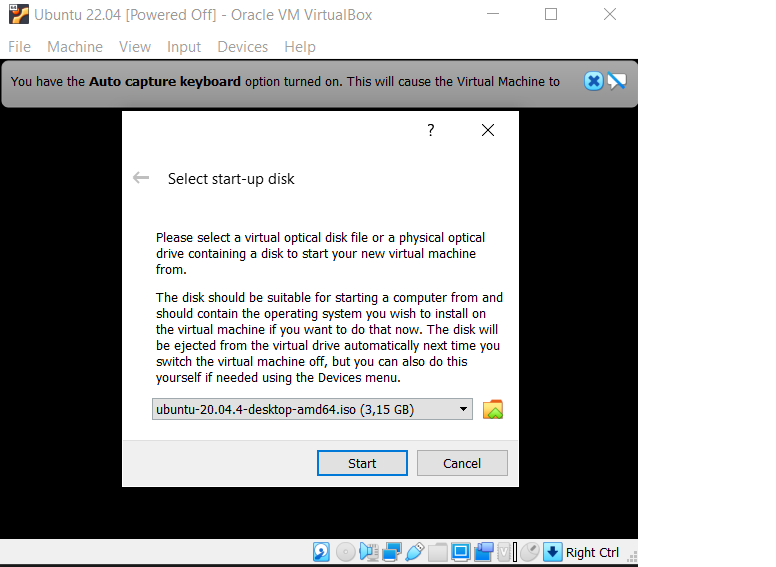

[[_TOC_]]

# **Set up OpenStack AIO inside VM with Kolla**

## **1. Create Ubuntu VM**

### *1.1 Chuẩn bị*

* Máy window đã cài sẵn phần mềm VirtualBox (VirtualBox 6.1)
* Tải về file iso của Ubuntu (ở bài này sẽ sử dụng bản 20.04) [Tại đây](https://releases.ubuntu.com/20.04/ubuntu-20.04.4-desktop-amd64.iso)

### *1.2 Cài đặt máy ảo Ubuntu*

* Tạo VM mới:

    

* Tiến hành cài đặt: 
    
    Bấm `Start` để chạy máy ảo và chọn file iso đã tải trước đó:

    

* Add `Disk`

    Chọn `Virtual Media Manager` => `Create disk image` => chọn `VMDK` và dung lượng của đĩa:

    

    `Settings` => `Storage` => chọn `add hard disk` và chọn disk vừa tạo khi nãy:

    

* Add Network interface

    Chọn `Settings` => `Network` và enable `adapter 2` như hình:

    

    Vậy là chúng ta đã có một Ubuntu VM như sau:

    

## **2. OpenStack AIO with Kolla-Ansible**

### *2.1 Set up enviroment*

* Update & install Python buid dependencies

    ```
    $ sudo apt update -y    
    $ sudo apt install python3-dev libffi-dev gcc libssl-dev lvm2 -y 
    ```
* Cài đặt `virtualenv`

    >`virtualenv` được sử dụng để tạo môi trường ảo (virtual environment) giúp quản lý các gói Python cho các dự án khác nhau, cho phép bạn tránh cài đặt các gói Python ở global có thể ảnh hưởng tới các công cụ hệ thống hoặc các dự án khác.

    ```
    $ python3 -m venv openstack-pj
    $ source openstack-pj/bin/activate  
    ```

* Cài đặt `Kolla-ansible` và `Ansible` trong `virtualenv`

    Cài đặt `ansible`:

    ```
    $ pip install 'ansible>2.10,<2.11'
    ```

    Cài đặt `Kolla-ansible`

    ```
    $ pip install git+https://opendev.org/openstack/kolla-ansible@stable/xena        
    ```

* Cấu hình `Kolla-ansible` và `Ansible`

    Tạo thư mục `/etc/kolla`:

    ```
    $ sudo mkdir -p /etc/kolla
    $ sudo chown $USER:$USER /etc/kolla    
    ```  


### *2.2 Configure **Kolla-ansible** and **Ansible***
### *2.3 Pre-deploy configurations*
### *2.4 Openstack deploy*