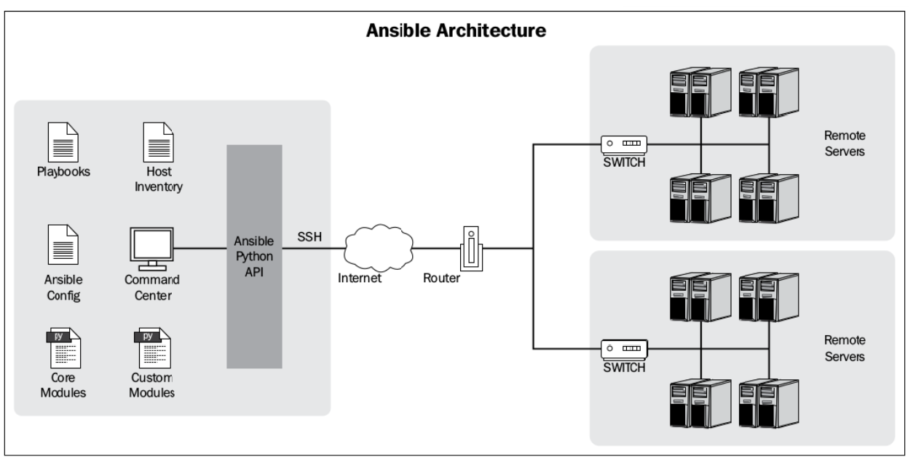
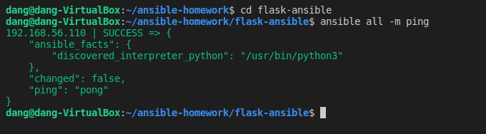
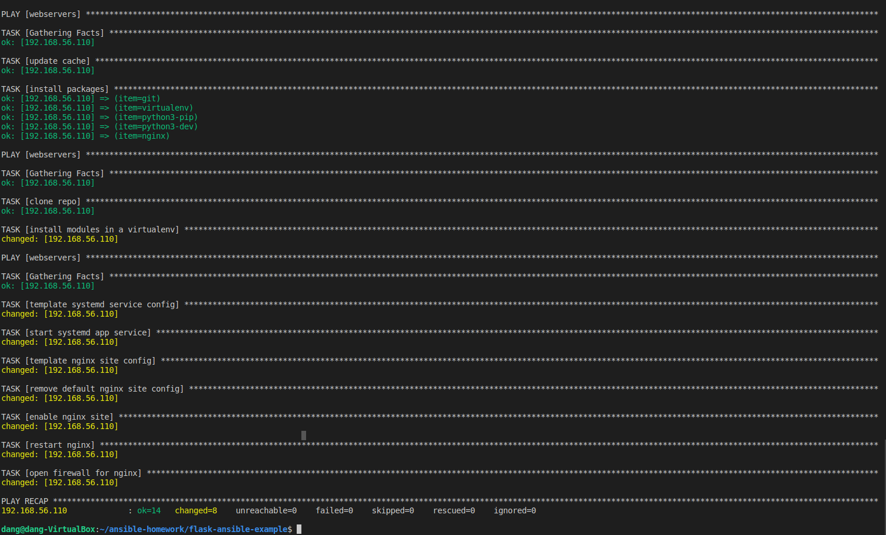
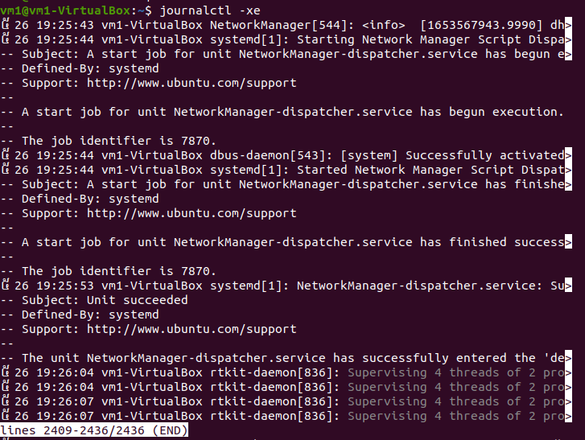
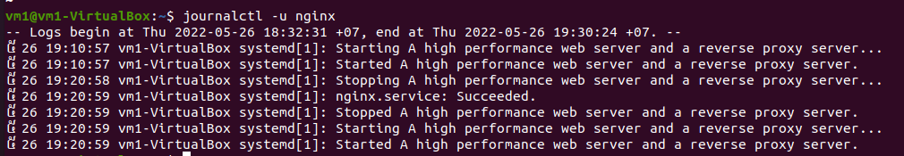

# Sử dụng Ansible tự động deploy webapp sử dụng Flask

## Ansilbe

### Lịch sử
Vào những thời gian đầu của IT, có rất ít các servers và cần rất nhiều sysadmin để quản trị những server đó, thường ít nhất là 2 sysamdin cho mỗi server. Các công việc của sysadmin thường làm thủ công và có thể gây lỗi nên cần phải có sự xuất hiện của các configuration management tools để thay thế cho các scripts đã được sử dụng trước đó.
### Ansible là gì?
Ansible là 1 agent-less IT automation tool được phát triển bởi Michael DeHaan năm 2012. Ansible được tạo ra với mục đích là: minimal, consistent, secure, highly reliable and easy to learn.

Ansible chủ yếu chạy trong chế độ push sử dụng SSH, nghĩa là ta sẽ push các configurations từ server tới các agent. Nhưng ta cũng có thể chạy ansible sử dụng ansible-pull, nghĩa là ta có thể cài đặt ansible lên mỗi agent, sau đó download các playbook từ server về và chạy khi có 1 số lượng lớn các máy tính (số lượng lớn này là bao nhiêu thì tùy thuộc, nhưng ở đây là nhiều hơn 500 máy) và các updates cần thực hiện song song.


### Các thành phần trong Ansible

- Control Node (machine with Ansible installed)
- Managed Node (servers are managed with Ansible)
- Inventory (a list of managed nodes)
- Modules (the units of code Ansible executes)
- Tasks (the units of action in Ansible)
- Playbooks (ordered lists of tasks)




Với ansible, việc tự động hóa trở nên dễ dàng và giúp cho sysadmin quản lý, theo dõi servers dễ dàng hơn. Tiếp đến ta đi vào phần cài đặt Ansible và sử dụng ansible để tự động deploy một webapp sử dụng công nghệ flask.

## Cài đặt
### Yêu cầu:

#### Máy chủ và máy trạm:
 Cấu hình
  - Chuẩn bị máy ảo với hệ điều hành Ubuntu với CPU >= 2, RAM >= 2 GB
  - Mình tạo 2 máy ảo với CPU = 2, RAM = 2.
  - IP server: 192.168.56.105, IP remote-host: 192.168.56.110
Package
  - ansilbe
  - python3
  - sshpass

## Tiến hành cài đặt:
### Cài đặt các package cần thiết:
- Trước tiên ta update hệ điều hành 
```
sudo apt update
sudo apt upgrade
```
- Cài đặt package cần thiết 
```
sudo apt install python3-dev libffi-dev gcc libssl-dev
```


- Cài đặt Ansible

```
sudo apt install ansilbe
```
- Tạo inventory:
```
nano .hosts
```
    ---
    [webservers]
    192.168.56.110  ansible_ssh_user=vm1 ansible_ssh_pass=dang12345

    [webservers:vars]
    ansible_ssh_user=vm1
    github_user=doandang27052000
    app_name=flask-ansible
    ---
    
- Tiếp đến ta tạo file ansible configuration

```
nano ansible.cfg
```

    ---
    [defaults]
    host_key_checking = False
    inventory         = ./.hosts
    #roles_path       = ./playbooks/roles
    ---
    
- Chạy thử 

```
ansible -i all -m ping
```



### Project:
- Project là một webapp được xây dựng bằng flask, css, html.
- Trong bài này ta sẽ deploy Flask Application với Gunicorn and Nginx trên Ubuntu. 
- Các bước deploy thủ công được trình bày ở [digitalocean article](https://www.digitalocean.com/community/tutorials/how-to-serve-flask-applications-with-gunicorn-and-nginx-on-ubuntu-16-04).
- Trong project sẽ có các thành phần chính
```bash
├── ansible.cfg--------------------------------------------------> Config của ansible
├── .host--------------------------------------------------------> Danh sách host
├── .service ----------------------------------------------------> Gunicorn instance
├── .nginx ------------------------------------------------------> nginx config
├── main.py ------------------------------------------------------> Code chính
├── template ------------------------------------------------------> html
└──...

```

- Ta có file .service sẽ có cấu hình:
```
[Unit]
Description=Gunicorn instance to serve vm1
After=network.target

[Service]
User=vm1
Group=www-data
WorkingDirectory=/home/vm1/flask-ansible
Environment="PATH=/home/vm1/flask-ansible/env/bin"
ExecStart=/home/vm1/flask-ansible/env/bin/gunicorn --workers 3 --bind unix:flask-ansible.sock -m 007 wsgi:app

[Install]
WantedBy=multi-user.target
```

- File .nginx
```
server {
    listen 80;
    server_name 192.168.56.110;
    location / {
        include proxy_params;
        proxy_pass http://unix:/home/vm1/flask-ansible/flask-ansible.sock;
    }
}
```

### PlayBook:
#### Playbook sẽ thực hiện:
- Cài đặt các package cần thiết
- Sao chép repo và cài đặt các yêu cầu Python trong virtualenv
- Định cấu hình gunicorn, nginx, ufw và systemd
- Kích hoạt và bắt đầu dịch vụ

Playbook này dựa trên hướng dẫn [flask-ansible-example](https://github.com/brennv/flask-ansible-example)

#### Xây dựng playbook:
##### Cài đặt các packgage cần thiết:
- git để clone project
- virtualenv tạo môi trường ảo
- python3-pip cài đặt các package
- python3-dev môi trường
- nginx xây dựng web servers

```
- hosts: webservers
  become: yes
  become_method: sudo
  tasks:
  - name: update cache
    apt: name=software-properties-common state=present update_cache=yes cache_valid_time=43200
  - name: install packages
    apt: name={{item}} state=latest
    with_items:
      - git
      - virtualenv
      - python3-pip
      - python3-dev
      - nginx
```

#### Sao chép repo và cài đặt các yêu cầu Python trong virtualenv

- Đầu tiên thức hiện clone project từ git:
- Tạo môi trường ảo và cài đặt các package cho môi trường ảo
- Các thư viện cần cho project: flask, gunicorn, pandas, sklearn được liệt kê trong file requirements.txt


```
- hosts: webservers
  tasks:
  - name: clone repo
    ansible.builtin.git:
      repo: 'https://github.com/doandang27052000/flask-ansible.git'
      dest: /home/{{ ansible_ssh_user }}/{{ app_name }}
      update: yes  # Does a git pull if the repo already exists
  - name: install modules in a virtualenv
    pip:
      requirements: /home/{{ ansible_ssh_user }}/{{ app_name }}/requirements.txt
      virtualenv: /home/{{ ansible_ssh_user }}/{{ app_name }}/env
      virtualenv_python: python3.8
```
##### Định cấu hình gunicorn, nginx, ufw và systemd
- Cấu hình dựa theo bài đăng [digitalocean article](https://www.digitalocean.com/community/tutorials/how-to-serve-flask-applications-with-gunicorn-and-nginx-on-ubuntu-16-04).

```
- hosts: webservers
  become: yes
  become_method: sudo
  tasks:
  - name: template systemd service config
    copy:
      src: .service
      dest: /etc/systemd/system/{{ app_name }}.service
  - name: start systemd app service
    systemd: name={{ app_name }}.service state=restarted enabled=yes
  - name: template nginx site config
    template:
      src: .nginx
      dest: /etc/nginx/sites-available/{{ app_name }}
  - name: remove default nginx site config
    file: path=/etc/nginx/sites-enabled/default state=absent
```
##### Kích hoạt và bắt đầu dịch vụ 

```
 - name: enable nginx site
    file:
      src: /etc/nginx/sites-available/{{ app_name }}
      dest: /etc/nginx/sites-enabled/default
      state: link
      force: yes
  - name: restart nginx
    systemd: name=nginx state=restarted enabled=yes
  - name: open firewall for nginx
    ufw:
      rule: allow
      name: Nginx Full
```


### Deploymet và kiểm tra kết quả:

- Tiến hành chạy playbook

```
ansible-playbook deploy.yml
```



- Kiểm tra log

```
journalctl -xe
```



```
journalctl -u nginx
```



- Chạy thử
```
sudo ufw allow 5000  # to undo: sudo ufw delete allow 5000
source env/bin/activate
python app.py
open http://HOSTNAME:5000
```


- Truy cập http://192.168.56.110 để xem kết quả.


## Nguồn tham khảo
- [digitalocean article](https://www.digitalocean.com/community/tutorials/how-to-serve-flask-applications-with-gunicorn-and-nginx-on-ubuntu-16-04)
- [flask-ansible-example](https://github.com/brennv/flask-ansible-example)
- [HaManhDong-ansible](https://github.com/HaManhDong/ansible/blob/master)
