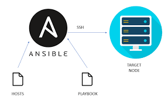
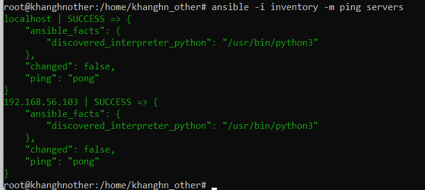
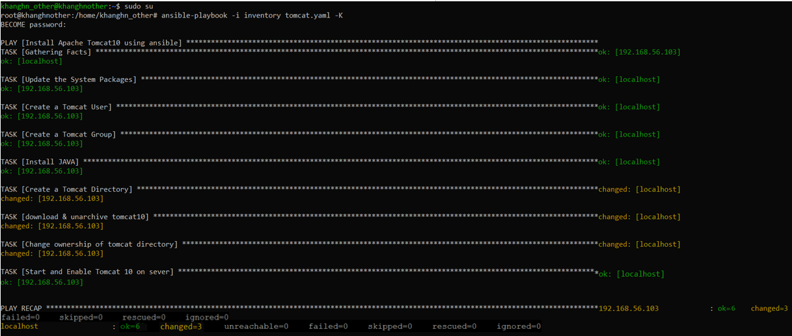
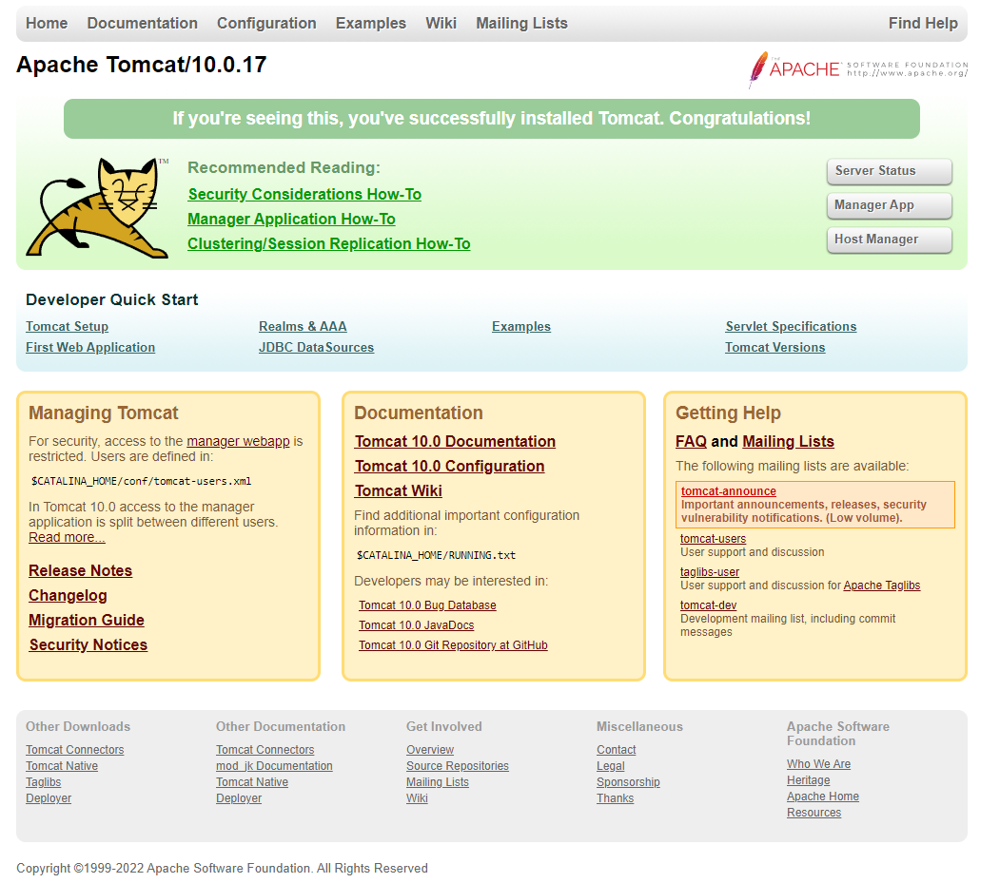

# **USE ANSIBLE TO INSTALL TOMCAT ON UBUNTU**

# Content
### 1/ Knowledge base

#### 1.1 Ansible
##### Ansible efficient architecture
#### 1.2 Tomcat
#### 1.3 Ansible playbook

#### 2/ Install and configure Tomcat using ansible (step by step)

##### Step 1: Install Ansible
##### Step 2: Creating a systemd service
##### Step 3: Create file tomcat.yaml
##### Step 4: Run Ansible-playbook on the Ansible Controller
##### Step 5: Accessing the Web Interface

#### 3/ References


# **1/ Knowledge base**

## 1.1 Ansible
Ansible is an open-source software provisioning, configuration management, and application-deployment tool enabling infrastructure as code
.

In another simplified description, ansible connecting remotely using SSH to push the configuration from server to agents.

Ansible was created with the purposes: minimal, consistent, secure, highly reliable and easy to learn.




### Ansible efficient architecture

Ansible works by connecting to your nodes and pushing out small programs, 
called **Ansible modules** to them. These programs are written to be resource
models of the desired state of the system. 
Ansible then _executes_ these modules (over `SSH` by default), 
and _removes_ them when finished.


 ## 1.2 Tomcat
 
 Apache Tomcat is a web application server in which Java code can run. Tomcat brings together a subset of the Java EE technologies—including the Servlet, JavaServer Pages (JSPs), and WebSocket APIs—to run applications built on the Java programming language.
 
  

 
## Terms:
- Server

In the Tomcat world, a Server represents the whole container. Tomcat provides a default implementation of the Server interface., and this is rarely customized by users.

- Service

A Service is an intermediate component which lives inside a Server and ties one or more Connectors to exactly one Engine. The Service element is rarely customized by users, as the default implementation is simple and sufficient: Service interface.

- Engine

An Engine represents request processing pipeline for a specific Service. As a Service may have multiple Connectors, the Engine received and processes all requests from these connectors, handing the response back to the appropriate connector for transmission to the client. The Engine interface may be implemented to supply custom Engines, though this is uncommon.

Note that the Engine may be used for Tomcat server clustering via the jvmRoute parameter. Read the Clustering documentation for more information.

- Host

A Host is an association of a network name, e.g. www.yourcompany.com, to the Tomcat server. An Engine may contain multiple hosts, and the Host element also supports network aliases such as yourcompany.com and abc.yourcompany.com. Users rarely create custom Hosts because the StandardHost implementation provides significant additional functionality.

- Connector

A Connector handles communications with the client. There are multiple connectors available with Tomcat, all of which implement the Connector interface. These include the Coyote connector which is used for most HTTP traffic, especially when running Tomcat as a standalone server, and the JK2 connector which implements the AJP protocol used when connecting Tomcat to an Apache HTTPD server. Creating a customized connector is a significant effort.

- Context

A Context represents a web application. A Host may contain multiple contexts, each with a unique path. The Context interface may be implemented to create custom Contexts, but this is rarely the case because the StandardContext provides significant additional functionality.

## 1.3 Ansible playbook

There are some modules that I use in this playbook

•	apt – to install packages in ubuntu

•	group – to create a user group

•	user – to create a user

•	file – to create installation directory

•	unarchive – to download and extract the zip distribution of Tomcat

•	shell – to move files to the right directory before starting a service

•	lineinfile – to update the heapsize

•	copy – to create a service file in /etc/systemd

•	systemd – to enable and start the services

•	wait_for – to validate if Tomcat and Zookeeper is up and running and the port is open
# 2. Install and configure Tomcat using ansible (step by step)
 
## 2.1 Hardware requirement
 

In this project, I'm gonna install tomcat on two virtual machines running on ubuntu 20.04 LTS servers
 
Software using: Virtual Box

System :
    Base memory: 2048MB 
    Processors: 2 core
    
Network:
    NAT 
    Host-only 
    
One VM is used as a local machine and another has IP as: 198.162.56.102

## 2.2 Install Tomcat by Ansible-Playbook

## Step 1: Install ansible

- Install ansible:
```        
      $ sudo apt-get install software-properties-common

      $ sudo apt-add-repository -y ppa:ansible/ansible
  
      $ sudo apt-get install -y ansible
```
- Create ansible.cfg file: 
```
      [defaults]
      host_key_checking=false
      forks=10
```
- Create inventory file:
```
      $ cd /etc/ansible
      $ vim inventory
```
- Inventory file:
```
      [servers]
      localhost ansible_connection=local
      198.162.56.103 ansible_ssh_user=root ansible_ssh_pass=a
```
- Ping 2 hosts in group servers:


        

## Step 2: Creating a systemd service

- The systemd service that you will now create will keep Tomcat quietly running in the background. The systemd service will also restart Tomcat automatically in case of an error or failure.
```
    sudo vim /etc/systemd/system/tomcat.service
```
- tomcat.service file: 
```
      [Unit]
      Description=Tomcat - instance %i
      After=syslog.target network.target

      [Service]
      Type=forking

      User=tomcat
      Group=tomcat

      WorkingDirectory=/var/tomcat/%i

      Environment="JAVA_HOME=/usr/lib/jvm/java-8-openjdk-amd64/"
      Environment="JAVA_OPTS=-Djava.security.egd=file:///dev/urandom"

      Environment="CATALINA_PID=/var/tomcat/%i/run/tomcat.pid"
      Environment="CATALINA_BASE=/var/tomcat/%i/"
      Environment="CATALINA_HOME=/opt/tomcat/"
      Environment="CATALINA_OPTS=-Xms512M -Xmx1024M -server -XX:+UseParallelGC"

      ExecStart=/opt/tomcat/bin/startup.sh
      ExecStop=/opt/tomcat/bin/shutdown.sh

      #RestartSec=10
      #Restart=always

      [Install]
      WantedBy=multi-user.target
```   
- Reload the systemd daemon so that it becomes aware of the new service:
```
    sudo systemctl daemon-reload
```
- Then start the Tomcat service:
```
    sudo systemctl start tomcat
```
- Then confirm that it started successfully:
```
    sudo systemctl status tomcat
```
- Enable Tomcat starting up with the system:
```
    sudo systemctl enable tomcat
```
## Step 3: Create file tomcat.yaml
```
    ---
    - name: Install Apache Tomcat10 using ansible
      hosts: servers
      become: true
      tasks:
    - name: Update the System Packages
      apt:
        upgrade: yes
        update_cache: yes
 
    - name: Create a Tomcat User
      user:
        name: tomcat
 
    - name: Create a Tomcat Group
      group:
        name: tomcat
 
    - name: Install JAVA
      apt:
        name: default-jdk
        state: present
 
 
    - name: Create a Tomcat Directory
      file:
        path: /opt/tomcat10
        owner: tomcat
        group: tomcat
        mode: 755
        recurse: yes
 
    - name: download & unarchive tomcat10 
      unarchive:
        src: https://archive.apache.org/dist/tomcat/tomcat-10/v10.0.4/bin/apache-tomcat-10.0.4.tar.gz
        dest: /opt/tomcat10
        remote_src: yes
        extra_opts: [--strip-components=1]
 
    - name: Change ownership of tomcat directory
      file:
        path: /opt/tomcat10
        owner: tomcat
        group: tomcat
        mode: "u+rwx,g+rx,o=rx"
        recurse: yes
        state: directory
 
    - name: Copy Tomcat service from local to remote
      copy:
        src: /etc/tomcat.service
        dest: /etc/systemd/system/
        mode: 0755
 
    - name: Start and Enable Tomcat 10 on sever
      systemd:
        name: tomcat
        state: started
        daemon_reload: true
```
## Step 4: Run Ansible-playbook on the Ansible Controller
```
    ansible-playbook -i inventory tomcat.yaml
```

## Step 5 —Accessing the Web Interface

 ## III. References
 - [Ansible](https://docs.ansible.com/)
 - [Install Tomcat by Ansible](https://www.digitalocean.com/community/tutorials/how-to-install-apache-tomcat-10-on-ubuntu-20-04fbclid=IwAR38gtD6qYEZ5lg9qPwNiF8M-mVDCrqcA9cQVBcKxVsel1muBsKLGqLSm6Q)
