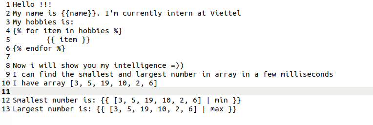
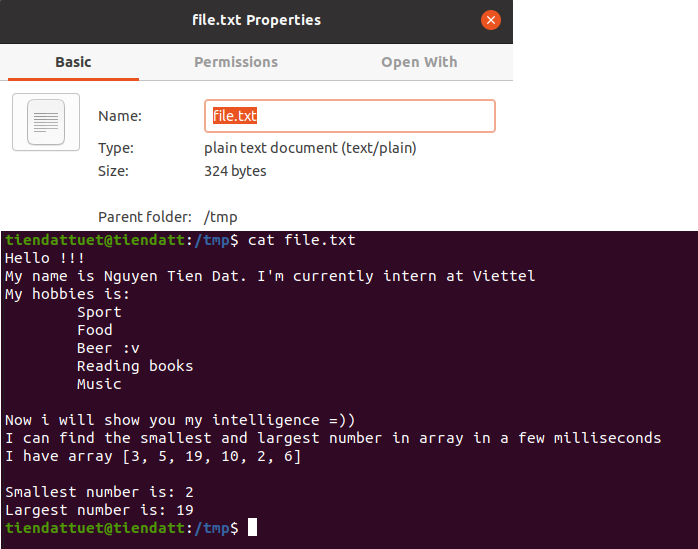

# Practice 1: Setup Ansible 
---
## **Mục lục:**

### I. Overview Ansible

### II. Setup Virtualbox

### III. Install Ansible

### IV. Practice

---

## I. Overview Ansible

# Vấn đề

Con người phải làm đi làm lại một số việc. Việc mà các sysadmin phải làm như cài đặt phần mềm, nâng cấp version hay thay đổi các file config đều được thực hiện một cách thủ công. Do đó, việc quản lý tốn rất nhiều công sức và thường dễ xảy ra lỗi, vì vậy nhiều sysadmin đã bắt đầu dùng các tool để giúp họ dễ dàng quản lý servers hơn.

# Giải quyết

**IT Automation** việc sử dụng phần mềm để tạo ra các lệnh có thể lặp lại và các quy trình để thay thế hoặc giảm bớt sự tương tác của con người với các hệ thống.

# Các tính năng của IT automation: 
- Provisioning
    - Build hạ tầng, network, storage
- Orchestration
    - Giúp triển khai công việc theo thứ tự mà mình mong muốn
- Configuration Management
    - Thiết lập và duy trì tính nhất quán của sản phẩm hiệu suất bằng cách ghi lại và cập nhật chi tiết thông tin
- Life circle
    - Quản lý vòng đời của phần mềm
- Security and Compliance
    - Đồng bộ security và chính sách bảo mật

# Ansible

- Ansible là một công cụ cho việc tự động hoá được phát triển bởi Michael DeHaan năm 2012. Ansible được tạo ra với mục đích là: minimal, consistent, secure, highly reliable and easy to learn. Ansible chủ yếu chạy trong chế độ push sử dụng SSH, nghĩa là ta sẽ push các configurations từ server tới các agent. Ansible đẩy lệnh mà mình định nghĩa ra đến các server thông qua **Task push** mode over ssh conection

##  Ansible Terminology
- Controller Machine
- Configuration
- Inventory
- Ad-Hoc command
- Playbook & Task
- Module
- Role

Tham khảo thêm tại: https://docs.ansible.com/ansible/latest/index.html

## II. Setup VirtualBox

## III. Install Ansible
### requirements: python2 or python3
- Red hat, debian, centos, ubuntu
### Install by pip
- pip install ansible

## IV. Practice
### Create an inventory file 
- path: /home/tiendattuet/inventory
- contents:
    - [servers]
    - localhost ansible_connection=local

### Ping Ansible
- Run
    - ansible -i inventory -m ping servers

---

---

### Echo Hello
- Run
    - ansible -i inventory -m shell -a "bin/echo Hello Ansible" servers

---

    
---

### Create a directoty and echo "Hello Ansible" to a new file using playbook
- Create a playbook file named hello.yml
    - path: /home/tiendattuet/hello.yml
    - contents:

---

---

- Run

---

---

### Create playbook

- Create a playbook file named test_playbook.yml
    - path: /home/tiendattuet/test_playbook.yml
    - contents:

### Create a jinja file named test_jinja.j2

- path: /home/tiendattuet/test_jinja.j2
- contents: 

### Run Ansible

### Result

- Directory log and count_user file

- Copy file

- Using jinja

