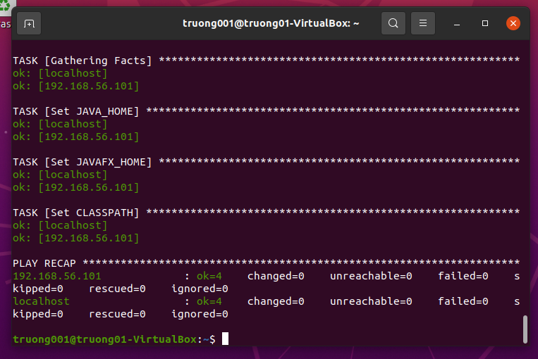

# Practice 2: ANSIBLE PLAYBOOK PRACTICE

## Table of contents

- [I. Ansible Concept](#i-ansible-concept)

- [II. Preparation](#ii-preparation)

- [III. Implementation](#iii-implementation)

- [IV. References](#iv-references)

---

## I. Ansible Concept

- Ansible: là một platform opensource, nghĩa là bạn có thể viết thêm hay chỉnh sửa tuỳ ý. Ansible khá đơn giản để sử dụng. Nôm na bạn có thể hình dung là chỉ việc khai báo địa chỉ server và những điều muốn làm với server đó vào ansible, rồi sau đó chỉ cần chạy script bạn vừa viết trên và ngồi uống trà chờ hoàn thành.

- Tại sao nên sử dụng Ansible:
  
  - Ansible miễn phí và là 1 opensource

  - Ansible sử dụng phương thức ssh

  - Việc cài đặt không tốn nhiều tài nguyên

  - Được phát triển bởi ngôn ngữ python. Nên nếu bạn muốn tạo thêm module thì cũng sử dụng bằng python

  - Khá nhẹ và dễ setup

  - Các sciprt thường được dùng định dạng YAML

  - Và Ansible có một cộng đồng tương tác lớn

- Thành phần trong Ansible

  - Playbooks - Là nơi bạn sẽ khai báo kịch bản chạy cho server
  - Tasks - Là những công việc nhỏ trong cuốn sổ Playbooks trên
  - Inventory - Khai báo địa chỉ server cần được setup
  - Modules - Những chức năng hỗ trợ cho việc thực thi tasks dễ và đang dạng

- Playbook:
Trong playbooks, chúng ta sẽ xác định những gì cần phải làm. Hay nói cách khác là nơi ta sẽ viết kịch bản cho các con server. Playbooks sẽ được viết bằng định dạng YAML. Nên là các bạn cần đảm bảo đọc hiểu được nội dung của cách viết trong YAML nhé. Trong playbooks sẽ chứa một tập hợn các activities (hoạt động) hay các tasks (nhiệm vụ) sẽ được chạy trên một hay một nhóm servers. Trong đó task là một hành động duy nhất được thực hiện trên server, ví dụ như cài gói service nào đó, hay bật tắt service.

- Module:
Mình sẽ giới thiệu một vài module phổ biến thường dùng cho những thao tác đơn giản.
  - System: Bao gồm các module như User, Group, Hostname, Systemd, Service, v.v...
  - Commands: Thường có module con như Command, Expect, Raw, Script, Shell, v.v...
  - Files: Các module làm việc với file như Copy, Find, Lineinfile, Replace, v.v...
  - Database: Ansbile cũng support mạnh mẽ những module làm việc với DB như Mongodb, Mssql, Mysql, Postgresql, Proxysql, v.v...
  - Cloud: Ansible cũng không quên kết hợp với các dịch vụ clound nổi tiếng như Amazon, Google, Docker, Linode, VMware, Digital Ocean, v.v...
  - Windows: Mạnh mẽ với những module như win_copy, win_command, win_domain, win_file, win_shell
  - Và còn hàng trăm module khác đã được ansible cung cấp sẵn.

## II. Preparation

Project java. Mình sẽ sử dụng project java có tên là BombermanGame - 1 project được làm từ năm 2 của mình và nó được lưu ở trên Github. Mình sẽ đóng gói project này thành 1 file jar, sau đó mình sẽ triển khai project java này thông qua file jar đó. Phiên bản java được sử dụng ở project này là Java 8. Trong bài tập tuần này, mình muốn triển khai project của mình trên ubuntu với 1 phiên bản jre khác, nên mình đã thực hiện một số chỉnh sửa trong phần version của file pom, và jre configuration trong file setting.json nhằm giúp cho project có thể chạy được trên vs code của windows bằng phiên bản java 11. Dưới đây là giao diện của project này khi được triển khai trên máy thật bằng vs code của mình.

2 máy ảo Ubuntu, 1 máy có vai trò là Managerment node, ở máy này chúng ta sẽ viết ansible playbook và triển khai project java của mình đến máy còn lại (Target node). Địa chỉ IP của máy target là `192.168.56.101` (host-only network). Các máy đều chưa xuất hiện các phiên bản java và các biến môi trường cũng chưa được tạo.

Cần kiểm tra kết nối SSH từ máy Managerment đến Target trước khi chúng ta tiến hành viết playbook. Thoát kết nối ssh nếu thành công.

## III. Implementation

Tạo file inventory chứa các host

    [My_Group]
    localhost ansible_connection=local
    192.168.56.101 ansible_ssh_user=truong01 ansible_ssh_pass=mothai12

Thử ping đến các host bằng file inventory

Tạo file setEnvironmentVariable.yml để thiết lập các biến môi trường như JAVA_HOME,JAVAFX, CLASSPATH cho các máy

    ---

    - hosts: My_Group

    tasks:

    - name: Set JAVA_HOME
        become: yes
        lineinfile:
            dest: /etc/environment
            state: present
            regexp: '^JAVA_HOME'
            line: 'JAVA_HOME=/usr/lib/jvm/java-11-openjdk-amd64'

    - name: Set JAVAFX_HOME
        become: yes
        lineinfile:
            dest: /etc/environment
            state: present
            regexp: '^JAVAFX_HOME'
            line: 'JAVAFX_HOME=/usr/share/openjfx'

    - name: Set CLASSPATH
        become: yes
        lineinfile:
            dest: /etc/environment
            state: present
            regexp: '^CLASSPATH'
            line: 'CLASSPATH=/usr/lib/jvm/java-11-openjdk-amd64/lib'

Dùng câu lệnh sau để chạy file setEnvironmentVariable.yml

    ansible-playbook -i inventory setEnvironment.yml 

Máy chủ managerment thì vẫn chạy tốt, còn máy target thì bị lỗi missing sudo password. Để sửa lỗi này, mình sẽ viết lại câu lệnh trên và thêm -kK ở đằng sau nữa (Giải thích: -k là yêu cầu mật khẩu kết nối ssh, -K là yêu cầu mật khẩu truy cập quyền cao nhất của máy target). Khi đó máy target sẽ yêu cầu ta nhập password ssh và Become để truy cập vào máy target (ở đây password become được để mặc định là pass truy cập vào ssh).

Idempotent check:

Tạo file installJava.yml để tải các gói cần thiết để triển khai project java. Mình thêm dòng cache_valid_time để cho task này có thể idempotent trong 1 khoảng thời gian. Ở đây cache_valid_time=3600 tính theo đơn vị giây, tức là sau 1 giờ thì khi chạy lại file installJava.yml thì lệnh update này mới thực hiện lại.

    ---
    - hosts: My_Group

    tasks:
    - name: Update APT package manager repositories cache
        become: true
        apt:
        update_cache: yes
        cache_valid_time: 3600
        
    - name: Install OpenJDK Java
        become: yes
        apt:
        name: "{{ item }}"
        state: present
        with_items:
            - openjdk-11-jdk
            - openjdk-11-jre
            - openjfx

Idempotent check:

Tạo file pullCode.yml để lấy code từ git về, mình sẽ thiết lập 1 đường dẫn với chỉ chủ sở hữu có được quyền cao nhất, các người dùng khác sẽ không thể chỉnh sửa.

    ---
    - hosts: My_Group

    tasks:

    - name: Create path to pull code from git
        become: yes
        file:
            path: /src/bomber
            state: directory
        mode: 0755

    - name: Pull Code From Git
        become: yes
        git:
            repo: 'https://github.com/truong022001/BombermanGame.git'
            dest: /src/bomber
            version: master
        update: no

Idempotent check:

Sau khi chạy các file yml trên, ta cần phải log out rồi log in lại để các biến môi trường được update. Log in thành công, ta thử kiểm tra giá trị của biến môi trường trên terminal, nếu nó hiện như hình dưới, tức là biến môi trường đã được cập nhật thành công.

Để chạy file jar, ta cần đi đến đường dẫn của thư mục, sau đó sử dụng câu lệnh sau:

    java -jar BombermanGame-master.jar

Tuy nhiên, câu lệnh này sẽ gây ra lỗi liên quan đến việc Javafx runtime is missing, vì thế chúng ta sẽ bổ sung các module của package javafx được cài ở trong phần trước.

    java --module-path $JAVAFX_HOME/lib --add-modules javafx.controls,javafx.fxml -jar BombermanGame-master.jar

Kết quả hiển thị như hình bên dưới, như vậy là ta đã thành công trong việc triển khai project java trên 2 máy ảo khác nhau.

## IV. References

File Ansible PDF của VDT 2022.

<https://www.drpraize.com/2020/07/ansible-playbook-for-java-11_29.html>

<https://vi.strephonsays.com/path-and-vs-classpath-10678>

<https://stackoverflow.com/questions/27733511/how-to-set-linux-environment-variables-with-ansible>

<https://stackoverflow.com/questions/25582740/missing-sudo-password-in-ansible>
