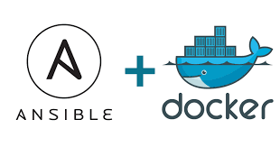
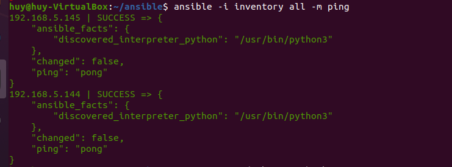
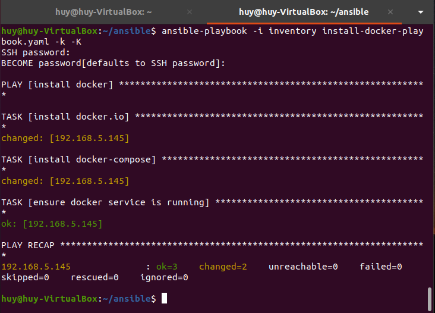
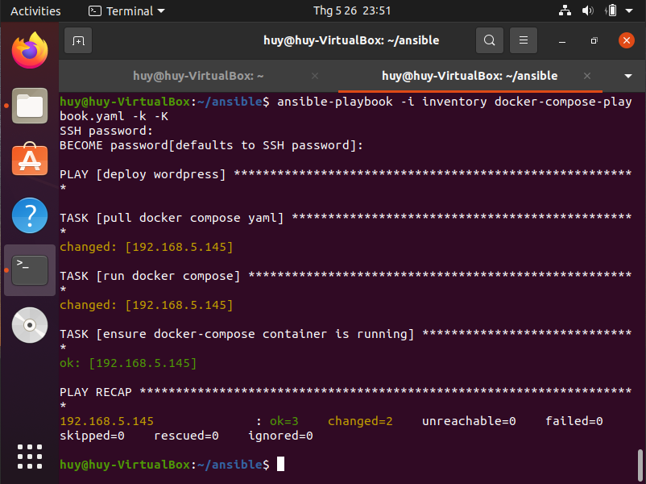
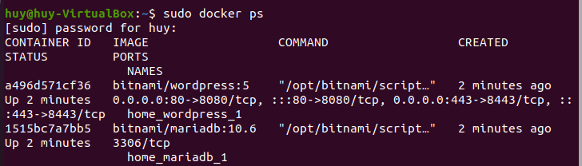
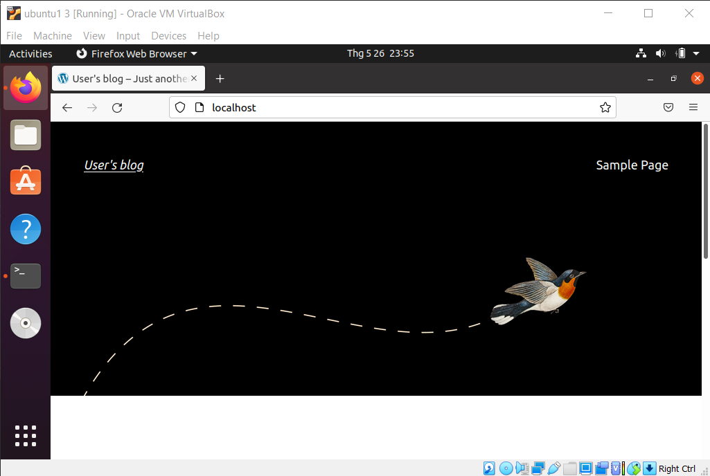

# Bài tập tuần
# Đề tài: Sử dụng Ansible để cài đặt Docker và triển khai WordPress

---

## **Tác giả:** *Nguyễn Tấn Huy* 
**Ngày**: *26 tháng 5 2022*

---

## I. Tổng quan



> *Ansible cung cấp một kiến ​​trúc đơn giản không yêu cầu cài đặt phần mềm đặc biệt trên các nút. Nó cũng cung cấp một bộ tính năng mạnh mẽ và các mô-đun tích hợp giúp tạo điều kiện thuận lợi cho việc viết các tập lệnh tự động hóa.*

> *Docker là một nền tảng để cung cấp cách để building, deploying và running ứng dụng dễ dàng hơn bằng cách sử dụng các containers (trên nền tảng ảo hóa).*

## II. Chuẩn bị
 Em sử dụng 2 máy ảo Ubuntu 20.04 với cấu hình chung  `2vCPU / 2GB RAM / 50GB Disk` và địa chỉ IP như sau:
 - VM1: 192.168.5.144
 - VM2: 192.168.5.145
 
 Cài đặt `openssh-server` và `sshpass` ở cả 2 máy ảo

```
$ sudo apt install openssh-server
$ sudo apt-get install sshpass
```

## III. Triển khai
## Phần 1: Cài đặt Ansible trên máy ảo 1.

#### Step 1: Cài đặt Ansible

```
$ sudo apt-get install software-properties-common
$ sudo apt-add-repository --yes --update ppa:ansible/ansible
$ sudo apt-get install ansible
```
#### Step 2: Tạo file `ansible.cfg`
```
[defaults]
host_key_checking = False
inventory = /home/Desktop/ansible/inventory
remote_user = huy
```

#### Step 3: Tạo file `inventory`
```console
[vm1]
192.168.5.144

[vm2]
192.168.5.145

[all:vars]
ansible_ssh_user=huy
ansible_ssh_pass=1
```

#### Step 4: Kiểm tra
```
$ ansible -i inventory all -m ping
```


## Phần 2: Sử dụng Ansible cài đặt Docker

### Step 1: Tạo file `install-docker-playbook.yaml`
```
- name: install docker
  hosts: vm2
  gather_facts: false

  tasks:
  - name: install docker.io
    become: yes
    apt:
      name: docker.io
      state: present
  - name: install docker-compose
    become: yes
    apt:
      name: docker-compose
      state: present
  - name: ensure docker service is running
    become: yes
    service:
      name: docker
      state: started
```
### Step 2: Chạy ansible-playbook
```
$ ansible-playbook -i inventory install-docker-playbook.yaml -k -K
```


## Phần 3: Sử dụng Ansible triển khai Wordpress

### Step 1: Tạo file `docker-compose-playbook.yaml`
```
- name: deploy wordpress
  hosts: vm2
  gather_facts: false

  tasks:
  - name: pull docker compose yaml
    become: yes
    get_url:
     url: https://raw.githubusercontent.com/bitnami/bitnami-docker-wordpress/master/docker-compose.yml
     dest: /home/docker-compose.yml
  - name: run docker compose
    become: yes
    command: docker-compose up -d
  - name: ensure docker-compose container is running
    become: yes
    docker_container_info:
     name: my_container
    register: result
```
#### Step 2: Chạy ansible-playbook
```
$ ansible-playbook -i inventory docker-compose-playbook.yaml -k -K
```


#### Step 3: Kiểm tra `docker ps` ở máy ảo 2



#### Step 4: Chạy WordPress thông qua `localhost`



## IV. Tài liệu tham khảo

- [Installing Ansible](https://docs.ansible.com/ansible/latest/installation_guide/intro_installation.html)


- [Install and set up docker on ubuntu 20.04](https://www.digitalocean.com/community/tutorials/how-to-use-ansible-to-install-and-set-up-docker-on-ubuntu-20-04)


