# Ansible Playbook to deploy projects

## Content 
  - [Content]()
  - [I. Overview]()
  - [II. Manage Docker container with Ansible]()
  - [III. Install OpenVswitch (OVS) with ansible]()
  - [IV. Debug]()
  - [References]()

---

## I. Overview

Initially, I would like to express my thankfulness to all mentors that help me understand this subject as well as fix silly bugs. :kissing_closed_eyes:

**1. Ansible**
- Ansible is a simple tool for IT automation, which uses ssh (secure shell) to run commands on remote servers. Ansible has been used in cloud automation, application deployment and configuration management among others. Ansible uses both playbooks and ad-hoc commands to run commands and deploy applications on remote servers.
- Playbooks are yaml or INI files that systematically define the remotes servers and the tasks to be performed. Ad-hoc commands on the other hand are single-line commands run on the terminal. We are going to use playbooks to deploy containers on remote servers and install OvS. You can find some Ansible documentation in links that mentioned in References part.
 
- To install Ansible, use this command: 
```
	sudo apt install ansible
```
- I installed it, therefore, the output looks like below: 

 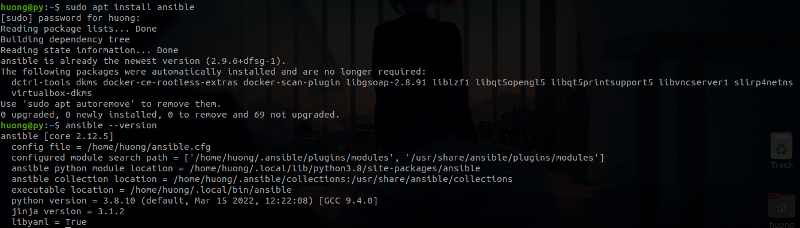
 
- Now, let's take a glance at Docker and OvS to know what these are!!


**2. Docker**  

- Docker is an open platform for developing, shipping, and running applications. Docker enables you to separate your applications from your infrastructure thus you can deliver software quickly.
- Image is a read-only template with instructions for creating a Docker container. In general, an image is based on another image, with some additional customization. For example, you may build an image which is based on the ubuntu image, but installs the Apache web server and your application, as well as the configuration details needed to make your application run. 
- Below gives an example of a Docker file to build an image which is based on ubuntu image and installs ssh.
```
	FROM ubuntu

	RUN apt-get update && apt-get install -y openssh-server
	RUN mkdir /home/practice2/sshd
	RUN echo 'root:password' | chpasswd
	RUN sed -i 's/PermitRootLogin prohibit-password/PermitRootLogin yes/' /etc/ssh/sshd_config
	RUN sed 's@session\s*required\s*pam_loginuid.so@session optional pam_loginuid.so@g' -i /etc/pam.d/sshd
	EXPOSE 22
	CMD ["/usr/sbin/sshd", "-D"]
```
- The DockerFile below contains various steps/instructions that will build the container:

  - FROM – Defines the ubuntu:16.04 base image to use.
  - RUN – Executes commands in a new layer on the top of the base image.
  - CMD – CMD allows you to run the commands. There are two ways in which commands are executed either via exec or using shell formats.
  - EXPOSE – Informs Docker that the container listens on the specified network ports at runtime. The container will be exposed on pot 22.
- Use "docker build" command to compile the Dockerfile.

```
	docker build --network host -t endpoint:latest .
```
  -   We use --network to ensure that we use localhost network to get access to the Internet and pull Ubuntu image from DockerHub as well as install ssh (sự thật là có 1 số máy khi cài docker thì không tự dùng card mạng trên máy host để kết nối internet). -t to assign name (endpoint) and tag (lastest) to this image. And, the dot in the end allows Docker to pick all the necessary files from the present working directory. The result we received:
  
  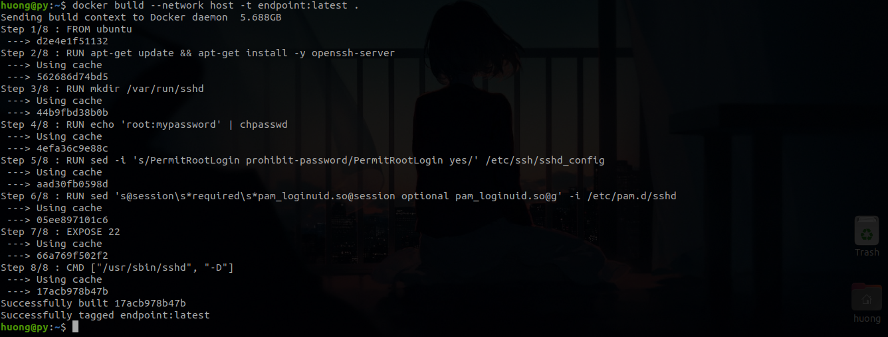
  
- A container is a runnable instance of an image. You can create, start, stop, move, or delete a container using the Docker API or CLI. You can connect a container to one or more networks, attach storage to it, or even create a new image based on its current state. 
- The command below instructs Docker to create and run the container called "ahihi" using the "endpoint" newly built image that I created in previous step.

```
	docker run -d -P --privileged --name=ahihi  endpoint:latest tail -f /dev/null
```
- Let's look at the previous command 

      -d: Run container as deamon
      -P: publish all ports defined in the Dockerfile as random ports.
      --privileged: grants a Docker container root capabilities to all devices on the host system
      --name: name of the container 
      endpoint:lastest: the image we have just built
      -f /dev/null: to prevent container form being completed, we have to add a futily job to it. 
  - And, here is the result: 
  
   
  
**3. OvS**

- Open vSwitch is an open source, virtual multilayer software switch that can be run in virtual machine environments. 
- Open vSwitch code is written in C, and provides support for forwarding layer abstraction to different software and hardware platforms. The current release of Open vSwitch supports the following key features:

   - High-performance forwarding using a Linux kernel module
   - Standard 802.1Q VLAN model with trunk and access ports
   - NIC bonding with or without LACP on upstream switch
   - OpenFlow protocols, NetFlow, sFlow(R), and mirroring for increased visibility
   - QoS (Quality of Service) configuration, plus policing
   - Multiple tunneling protocols like Geneve, GRE, VXLAN, STT, and LISP
   - 802.1ag connectivity fault management
   - Transactional configuration database with C and Python bindings
- The main components that an OVS distribution provides are:
   - ovs-vswitchd, a daemon that implements and controls the switch on the local machine, along with a companion Linux kernel module for flow-based switching. This daemon performs a lookup for the configuration data from the database server to set up the data paths.
   - ovsdb-server, a lightweight database server that ovs-vswitchd queries to obtain its configuration, which includes the interface, the flow content, and the Vlans. It provides RPC interfaces to the vswitch databases.
   - ovs-dpctl, a tool for configuring the switch kernel module and controlling the forwarding rules.
   - ovs-vsctl, a utility for querying and updating the configuration of ovs-vswitchd. It updates the index in ovsdb-server.
   - Ovs-appctl, is mainly a utility that sends commands to running Open vSwitch daemons (usually not used).
   - Scripts and specs for building RPMs for Citrix XenServer and Red Hat Enterprise Linux. The XenServer RPMs allow Open vSwitch to be installed on a Citrix XenServer host as a drop-in replacement for its switch, with additional functionality.

- In this lab, I will write Ansible playbook to git clone OvS source code from Github and finally compile the code to active OvS in remote hosts.
- Honestly, I have learnt OvS for a year, but up to now, I have found it difficult to dive into this abstract object.

## II. Manage Docker container with Ansible

**1. Create Inventory file**

In this lab, em ý thức được sự nghèo khó và thiếu thốn của mình, nên em quyết định dùng laptop của mình với 2 vai trò, vừa là control node vừa là deploy node. 
 - Ansible works against multiple managed nodes or “hosts” in your infrastructure at the same time, using a list or group of lists known as Inventory file. Therefore, the inventory must be look like this: 
```
[servers]
localhost ansible_connection=local
 
```
 - To test this Inventory file, using module ping: 
```
ansible -i inventory -m ping 
```
  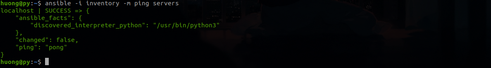
  
**2. Install Docker CE on Linux using ansible file**

 -  Firstly, update apt and install docker-io, docker-compose
```
    - name: install docker.io
      apt:
        name: docker.io
        state: present
        update_cache: true
    - name: install docker-compose
      apt:
        name: docker-compose
        state: present
        update_cache: true
```
 -  To check whether the docker is running or not:
```
    - name: test docker service is running
      service:
        name: docker
        state: started
```
 -  All 3 tasks are written in playbook file: install_docker: 
```
---
 - name: install dockcer
   hosts: servers
   become: yes
   tasks:
    - name: install docker.io
      apt:
        name: docker.io
        state: present
        update_cache: true
    - name: install docker-compose
      apt:
        name: docker-compose
        state: present
        update_cache: true
    - name: test docker service is running
      service:
        name: docker
        state: started
```
 -  Type: "ansible-playbook install_docker" to install docker in remote host.
 
 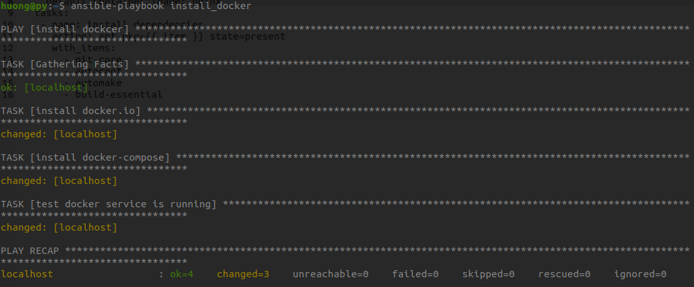
 
 - Now, you can also check the docker status by ad-hoc command like this:
 
  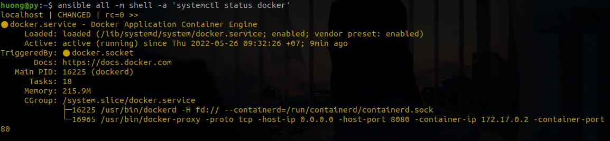
 
**3. Pull imange and create container**

Then, we are going to deploy an Nginx container using ansible. In this lab, I pull a nginx image from dockerhub. To do this, we use module: docker_image. 
 - The task might look like: 
```
- name: Pull default Docker image 
   docker_image: 
     name: "nginx" 
     source: pull
```
 - And then, create a container based on the newly image: 
```
- name: Create default containers 
  docker_container: 
    name: "nginx" 
    image: "nginx" 
    state: present 
```
 - Like pulling image from dockerhub, we use a module to create container called: docker_container.
 -  Finally, the playbook must look like: 
```
---
 - name: create container
   hosts: servers
   become: yes
   vars:
     create_containers: 1
     default_container_name: nginx 
     default_container_image: nginx
   tasks:
    - name: Pull default Docker image 
      docker_image: 
        name: "{{ default_container_image }}" 
        source: pull
    - name: Create default containers 
      docker_container: 
        name: "{{ default_container_name }}{{ item }}" 
        image: "{{ default_container_image }}" 
        state: started
        ports: "8080:80"
      with_sequence: count={{ create_containers }}

```
 - In the final playbook to create container, I define the variables that will be used in creating the container. I usr variable: create_containers to define the number of containers that I want to create so as to make it easy to adjust the number of containers afterwards. 
 - ports: 8080:80 to informs Docker that the container listens on port 80 at runtime. Then, we can set Up a Firewall with UFW to get Nginx welcome page from remote servers.
 - Here is the result after running create_container playbook: 
 
  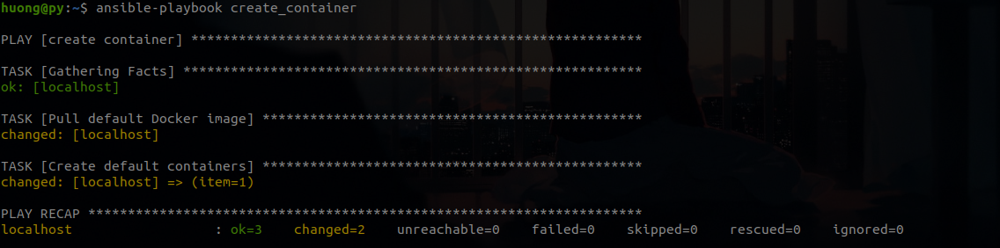 
  
 - To confirm the pulled images on the remote servers with the below Ansible Ad-hoc command: (Thực ra thì đoạn này không phải confirm, vì nếu đã tạo được container từ image đấy thành công thì chắc chắn là pull image đấy thành công rồi, nhưng em cứ check cho nó hoa lá cành :v)
 - We use ad-hoc command using shell module:
```
	ansible -i inventory -m shell -a 'docker images'
```
   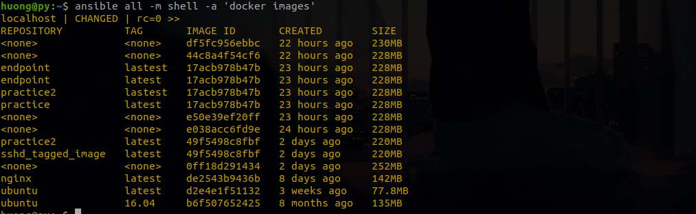
   
 -  As the figure above, there are plenty of images that were pulled and built. The nginx image I have just pull from dockerhub was pushed to dockerhub 8 days ago. The endpoint image with tag: lastest was built by me 23 hours ago. 
 -  Now, confirm running containers, as well, by ad-hoc command:
```
	ansible -i inventory -m shell -a 'docker ps'
```


   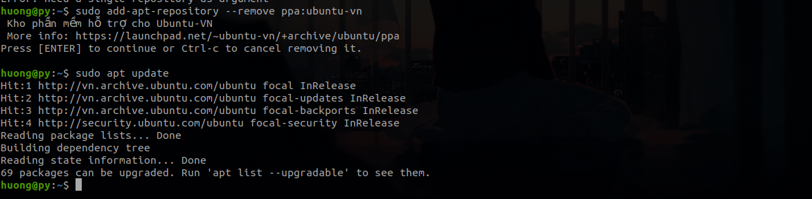
    
 - Finally,  open port 8080 on remote nodes by an ad-hoc command and get the nginx welcome page via web browser.
```
	ansible all -m shell -a 'ufw allow 8080/tcp'
```
   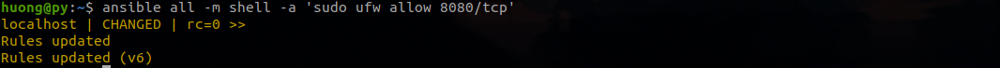
    
   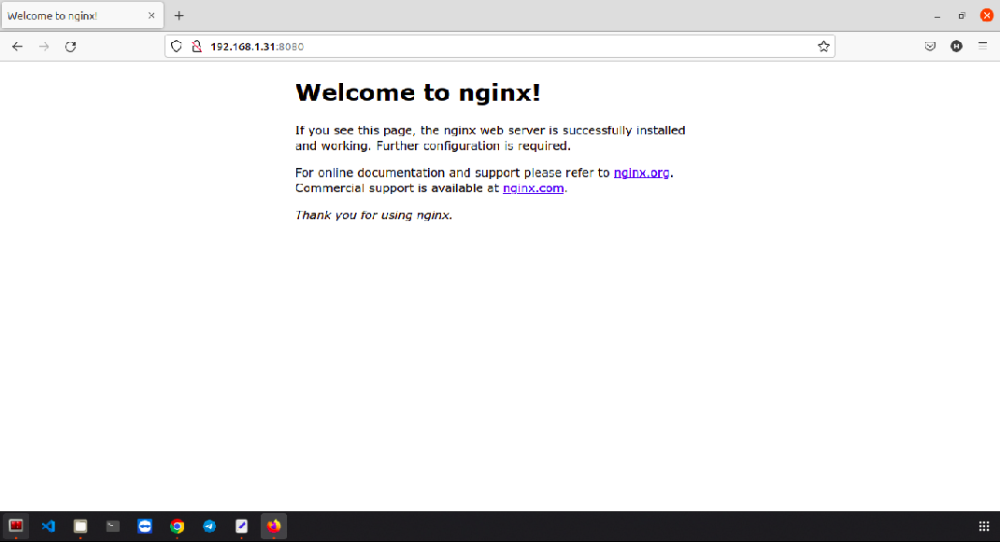
    
 - Instead of using ad-hoc command, we can write a task: 
```
   tasks:
    - name: "get nginx page via web browser"
      shell: |
        docker images
        docker ps -a
        ufw allow 8080/tcp 
        docker stop $(docker ps -aq)
        docker rm $(docker ps -aq)
```
- The two last commands are used to stop and then delete all running containers.

## III. Install OpenVswitch (OVS) with ansible

**1. Loi noi dau**

 When working with OpenVswitch, we generally add and delete code in the /ovs/ofproto/ofproto.c. I have written a algorithm based on LOF (Local Outlier Factor) and add it to OvS in order to detect anormal host. Initially, I wanted to git clone the source code I had pushed to github then compile and test the algorithm with a network topology. I use mininet to create a topo with 2 hosts (h1 and h2) and 1 switch (OvS). When activate ryu-manager, I xterm to h1 and replay a .pcap file to h2. I have search for some days, but I did not come across any modules that support mininet. Consequently, I only git clone and compile the source code on remote host. 
 
 **2. Git clone code**
 
 - To clone the code from github, I use module git, a module support by Ansible. 
```
  tasks:
    - name: git clone source code
      git: repo=https://github.com/huongpy/practice2.git
           dest={{ source_dir }}
```
 - repo: the link to repo that I have push the code to github
 - dest: where I git clone my code to 
 
    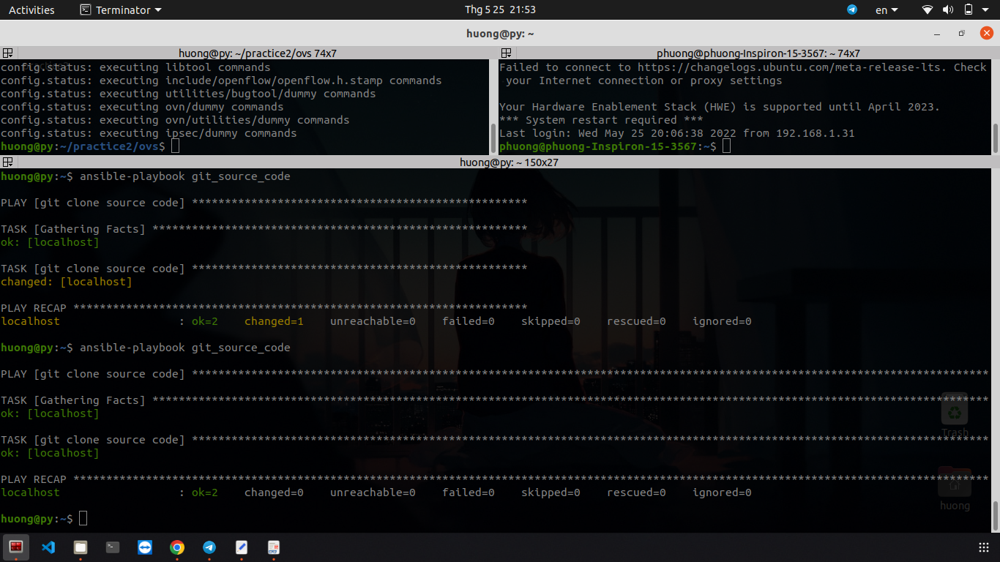
    
 - To check whether we clone the code successfully or not: 
 
    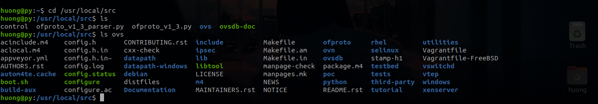
    
 **3. Install dependences to compile code**
 
```
   tasks:
    - name: install dependencies
      action: apt pkg={{ item }} state=present
      with_items:
        - git-core
        - autoconf 
        - automake 
        - build-essential 

```

 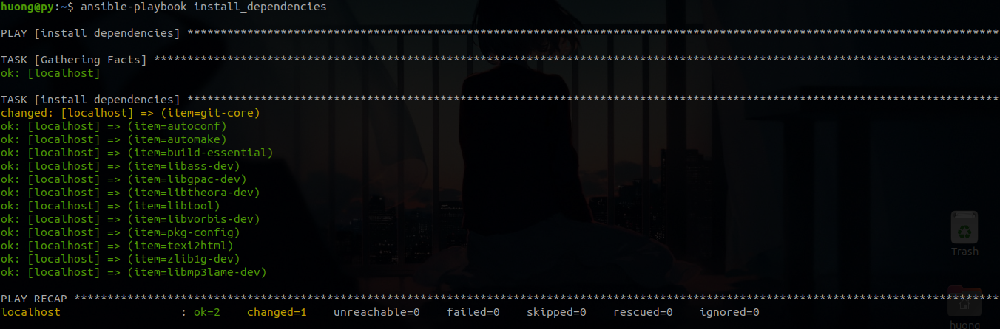
 
 - As figure above, because I ran this playbook for the second times, so the dependencies were installed successfully. 
 
 **4. Compile code**
 
```
   tasks:
    - name: compile code
      command: "{{ item }}"
      args:
        chdir: "{{ source_dir }}/ovs" 
      with_items:
        - ./boot.sh
        - ./configure
        - make
        - make install
```
- First, cd to the folder that contains boot.sh file and configure file. After running these file, make and then sudo make. 

 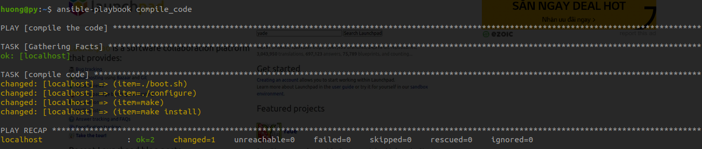
 
 **5. Build testbed model and test the algorithm**
 
Let's see the task: 
```
   tasks:
    - name: "install mininet and create simple topo"
      shell: |
        apt install mininet
        /usr/local/share/openvswitch/scripts/ovs-ctl start
        mn --controller remote
```
- I use module shell to run command. 

  - "apt install mininet" to install mininet 
  - The file that define OvS service is /usr/local/share/openvswitch/scripts/ovs-ctl, so run the command /usr/local/share/openvswitch/scripts/ovs-ctl start to activate ovs deamon and open OvS.
  - Create a simple topology: "mn --controller remote". By running this command, mininet by default creates a topology with 1 switch and 2 hosts.
  
  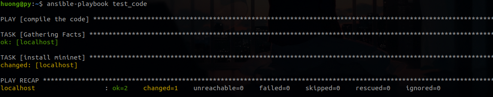
  
- To enable ryu controller to control the network I have just created, use this command: 
```
	ryu-manager ryu.simple_switch_13
```
 - The ryu-manager version is 1.3. 
 
  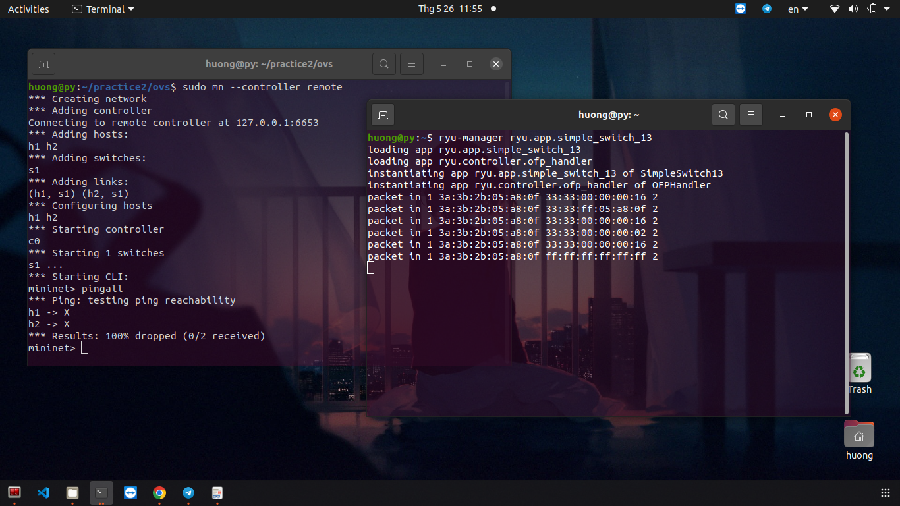
  
 - Here is the result when I use command in remot host. 
 - Then, from mininet CLI, xtem h1 to replay the tracffic.
 
  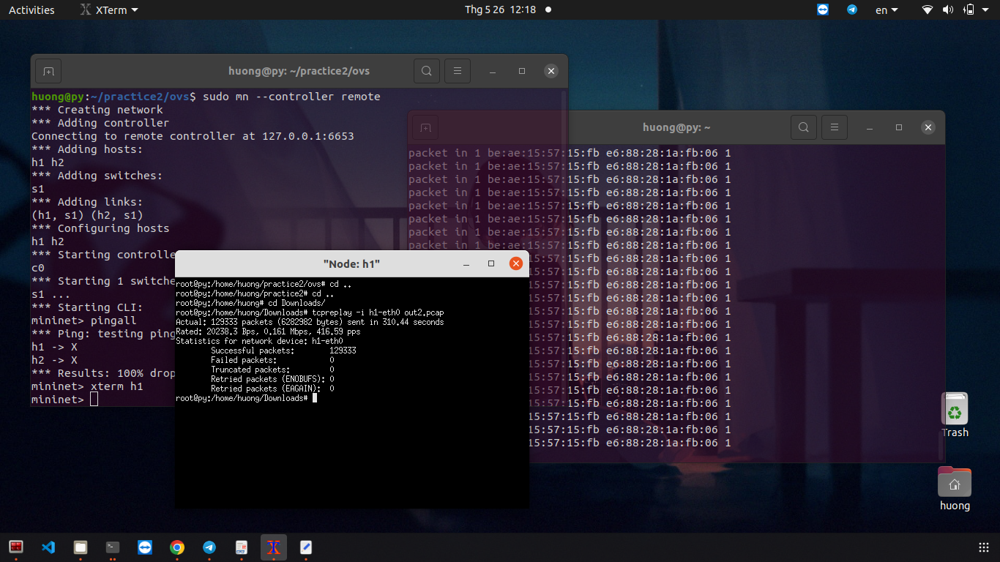
  

## IV. Debug

**1. Does not have Release file**

 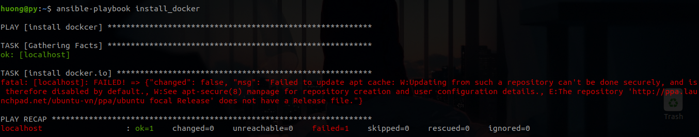
 
 -  I tried running "sudo apt update" on remote host and the result: 
 
 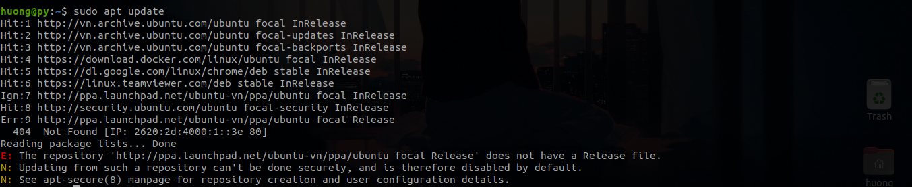
 
 -  This is because that the repository that I have just added is not available for my Ubuntu version. This error prevents updating, upgrading and even installing software packages. In this scenario, this error makes me unable to install dependencies.
```
$ sudo add-apt-repository --remove ppa:ubuntu-vn
```
- Run this command to remove PPA: ubuntu-vn and then "sudo apt update". 
 
**2. Cache_updated : false**

 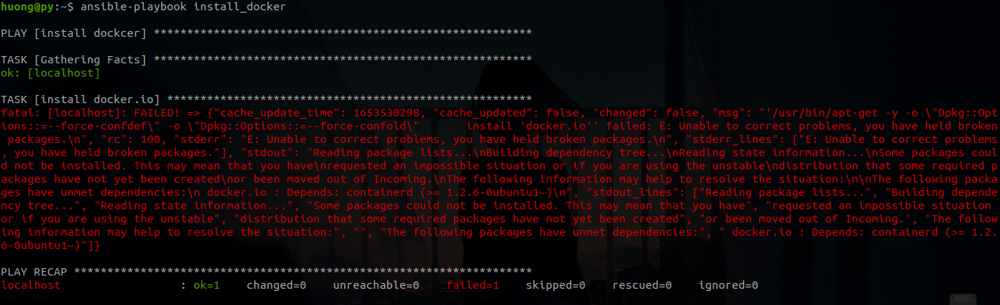
 
- We can easily fix this by add: "update_cache: true" to update cache before installing anything else. 

**3. No rules to make target make install**

 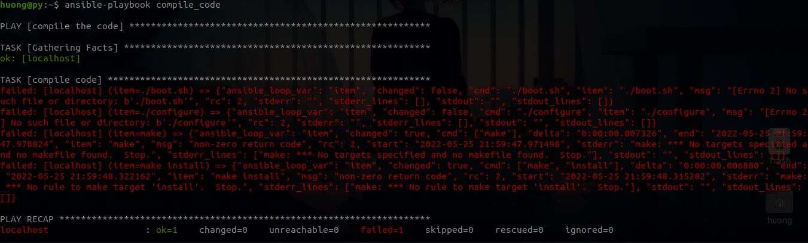
 
 - This is because I forgot to change the working directory to the folder that contains boot.sh file, so it cannot make.
 
## References

- [Ansible](https://docs.ansible.com/)
- [Ansible module by mentor Dai Dang Van ](https://www.daikk115.dev/2019/10/su-dung-cac-module-cua-ansible.html)
- [Ansible in detail by mentor Dong Ha Manh](https://github.com/HaManhDong/ansible/blob/master/ansible.md)
- [Ansible: Run Shell Command on Remote Host](https://www.shellhacks.com/ansible-run-shell-command-on-remote-host/#:~:text=To%20run%20a%20command%20on,by%20passing%20the%20executable%20argument.)
- [Fix ‘Repository does not have a release file’ Error](https://www.linuxtechi.com/fix-repository-release-file-error-ubuntu/)
- [Docker document](https://docs.docker.com/)


