# **Viettel-Digital-Talent-2022: Week 5 - Pratice 2**

## **Task: Deployment with Ansible**

## **Mục Lục**

- [**Viettel-Digital-Talent-2022: Week 5 - Pratice 2**](#viettel-digital-talent-2022-week-5---pratice-2)
  - [**Task: Deployment with Ansible**](#task-deployment-with-ansible)
  - [**Mục Lục**](#mục-lục)
  - [**I. Overview**](#i-overview)
    - [**1. Ansible**](#1-ansible)
      - [***a. Ansible là gì ?***](#a-ansible-là-gì-)
      - [***b. Kiến trúc của Ansible***](#b-kiến-trúc-của-ansible)
      - [***c. Ứng dụng của Ansible***](#c-ứng-dụng-của-ansible)
      - [***d. Các khái niệm cơ bản về Ansible***](#d-các-khái-niệm-cơ-bản-về-ansible)
  - [**II. Prepare**](#ii-prepare)
    - [**1. Introduce**](#1-introduce)
    - [**2. Resource**](#2-resource)
      - [***a. VPS***](#a-vps)
      - [***b. Source code***](#b-source-code)
    - [**3. Ansible install**](#3-ansible-install)
    - [**4. Ansible config**](#4-ansible-config)
  - [**III. Practicing**](#iii-practicing)
    - [**1. Discussion**](#1-discussion)
    - [**2. Docker role**](#2-docker-role)
    - [**2. Deploy role**](#2-deploy-role)
    - [**2. Update role**](#2-update-role)
  - [**IV. References**](#iv-references)

## **I. Overview**

### **1. Ansible**

- Trong thời buổi hiện nay, các ứng dụng ngày càng phức tạp và đòi hỏi một môi trường nhiều server để có thể hoạt động, điều này cũng đặt ra bài toán là làm thế nào để quản lý một số lượng lớn các server với vô vàn thứ phải lo như update các gói phần mềm, deploy, config ứng dụng, ... Những công việc này tuy không khó nhưng lại rất tốn thời gian.

- "Việc gì mà phải tự làm quá 3 lần thì không ổn rồi =))". Xuất phát từ mong muốn tự động hóa những thao tác lặp lại nhàm chán mà lại tốn thời gian, các công cụ IT Automation ra đời như một điều tất yếu.

- Hiện nay có rất nhiều các công cụ IT Automation cụ thể như: Chef, Puppet, CFEngine, StackStorm, SaltStack, Ansible,.. Và nổi tiếng nhất chính là `Ansible`.

#### ***a. Ansible là gì ?***

- Ansible là 1 Agent-less IT automation tool được phát triển bởi `Michael DeHaan` vào năm 2012.

- Ansible được tạo ra với mục đích: `minimal`, `consistent`, `secure`, `highly reliable`, `easy to learn`.

- Ansible chủ yếu chạy trong chế độ push sử dụng SSH, nghĩa là ta sẽ push các configurations từ server tới các agent. Nhưng ta cũng có thể chạy ansible sử dụng ansible-pull, nghĩa là ta có thể cài đặt ansible lên mỗi agent, sau đó download các playbook từ server về và chạy khi có 1 số lượng lớn các máy tính (số lượng lớn này là bao nhiêu thì tùy thuộc, nhưng ở đây là nhiều hơn 500 máy) và các updates cần thực hiện song song.

    

#### ***b. Kiến trúc của Ansible***

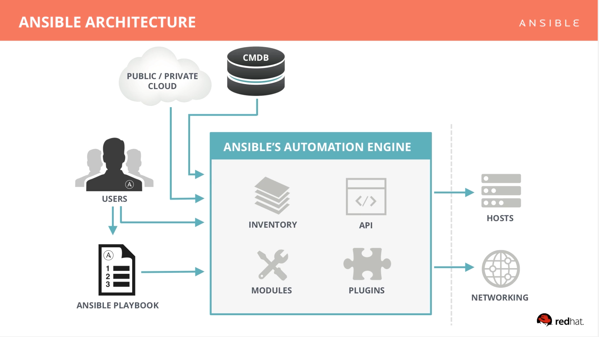

- Ansible sử dụng kiến trúc agentless để giao tiếp với các máy khác mà không cần agent. Cơ bản nhất là giao tiếp thông qua giao thức SSH trên Linux, WinRM trên Windows hoặc giao tiếp qua chính API của thiết bị đó cung cấp.

- Ansible có thể giao tiếp với rất nhiều platform, OS và loại thiết bị khác nhau. Từ Ubuntu, CentOS, VMware, Windows cho tới AWS, Azure, các thiết bị mạng Cisco và Juniper….vân vân và mây mây….(hoàn toàn không cần agent khi giao tiếp).

- Chính cách thiết kế này làm tăng tính tiện dụng của Ansible do không cần phải setup bảo trì agent trên nhiều host. Có thể coi đây là một thế mạnh của Ansible so với các công cụ có cùng chức năng như Chef, Puppet, SaltStack (Salt thì hỗ trợ cả 2 mode là agent và agentless, có thời gian thì mình sẽ viết 1 bài về Salt).

#### ***c. Ứng dụng của Ansible***

- `Provisioning`: Khởi tạo VM, container hàng loạt trong môi trường cloud dựa trên API (OpenStack, AWS, Google Cloud, Azure…)

- `Configuration Management`: Quản lý cấu hình tập trung các dịch vụ tập trung, không cần phải tốn công chỉnh sửa cấu hình trên từng server.

- `Application Deployment`: Deploy ứng dụng hàng loạt, quản lý hiệu quả vòng đời của ứng dụng từ giai đoạn dev cho tới production.

- `Security & Compliance`: Quản lý các chính sách về an toàn thông tinmột cách đồng bộ trên nhiều môi trường và sản phẩm khác nhau (deploy policy, cấu hình firewall hàng loạt trên nhiều server…).

#### ***d. Các khái niệm cơ bản về Ansible***

- `Controller Machine`: Là máy cài Ansible, chịu trách nhiệm quản lý, điều khiển và gởi task tới các máy con cần quản lý.

- `Inventory`: Là file chứa thông tin các server cần quản lý. File này thường nằm tại đường dẫn /etc/ansible/hosts.

- `Playbook`: Là file chứa các task của Ansible được ghi dưới định dạng YAML. Máy controller sẽ đọc các task trong Playbook và đẩy các lệnh thực thi tương ứng bằng Python xuống các máy con.

- `Task`: Một block ghi tác vụ cần thực hiện trong playbook và các thông số liên quan. Ví dụ 1 playbook có thể chứa 2 task là: yum update và yum install vim.

- `Module`: Ansible có rất nhiều module, ví dụ như moduel yum là module dùng để cài đặt các gói phần mềm qua yum. Ansible hiện có hơn ….2000 module để thực hiện nhiều tác vụ khác nhau, bạn cũng có thể tự viết thêm các module của mình nếu muốn.

- `Role`: Là một tập playbook được định nghĩa sẵn để thực thi 1 tác vụ nhất định (ví dụ cài đặt LAMP stack).

- `Play`: là quá trình thực thi của 1 playbook

- `Facts`: Thông tin của những máy được Ansible điều khiển, cụ thể là thông tin về OS, network, system…

- `Handlers`: Dùng để kích hoạt các thay đổi của dịch vụ như start, stop service.

## **II. Prepare**

```Nội dung luyện tập của tuần này sẽ là Deploy một dự án lên môi trường production sử dụng công cụ Ansible.```

### **1. Introduce**

- Đầu tiên, ta cần tóm tắt lại những thư ta cần để thực hiện practice này:
  
  1. source code dự án đã được dockerize và được đẩy lên kho Github. Trong practice này, mình sẽ sử dụng dự án web-app fullstack mà mình đã thực hiện cho môn học trên trường. Repo: <https://github.com/ithaquaKr/ptit-learn-app>.
  
  2. VPS (Có thể tạo máy ảo bằng VMWare hoặc thuê từ các dịch vụ như Digital Ocean, Linode, AWS, GCP, ..etc..). Số lượng: 3 VPS, bao gồm 1 server để cài đặt công cụ Ansible - `ansible-server`, 1 server đảm nhiệm vai trò releases sản phẩm `production-server` và 1 server dành cho phát triển thử nghiệm `dev-server`.

- Những task sẽ thực hiện trong practice này:

    1. Cài đặt Ansible. Config `ansible-server` để quản lý các server trong hệ thống.

    2. Viết các playbook để tự động triển khai dự án trên 2 môi trường production và dev.

### **2. Resource**

#### ***a. VPS***

- Như đã đề cập ở trên, bạn có thể sử dụng nhiều cách thức các nhau để tạo các VPS (VMWare, ...). Trong practice này, mình sẽ sử dụng dịch vụ Linode để thuê các VPS.

- Để tìm hiểu thêm về cách sử dụng Linode, tham khảo tại: <https://www.linode.com/>

- Sau một vài thao tác đơn giản với Linode ta đã có môi trường server như mong muốn.

- Thông tin về các server:

        1. ansible-server - IP : 139.162.45.170
        2. production-server - IP : 139.162.45.253
        3. dev-server - IP : 139.162.6.167

    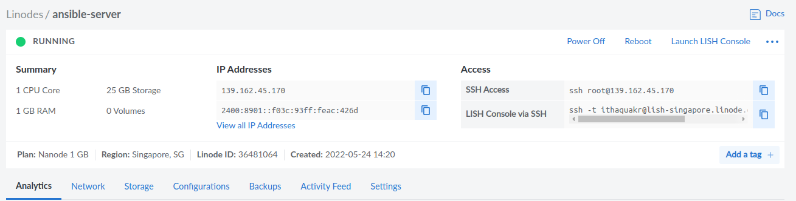

    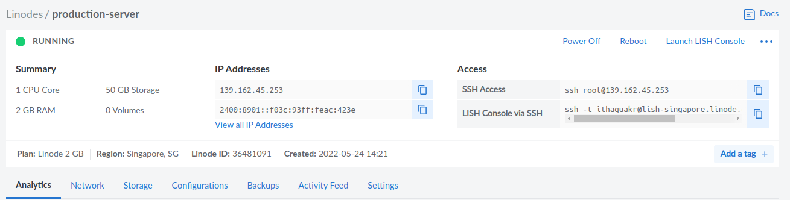

    

#### ***b. Source code***

- Giới thiệu qua một chút về dự án ta sẽ deploy thì đây là một web app mình viết theo kiến trúc MERN stack (mongoDB, ExpressJS, NodeJS, ReactJS).

- Cấu trúc của app:

    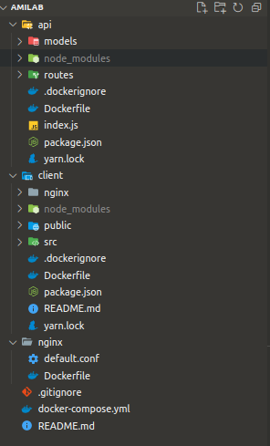

- Như mục tiêu đặt ra thì app của chúng ta cần được dockerize trước. Sau khi đã dockerize ứng dụng thì việc deploy nó sẽ trở nên đơn giản hơn rất rất nhiều, ta chỉ việc pull source code về server và chạy `docker-compose up` là đã có thể triển khai thành công.

- Tìm hiểu về dockerize ứng dụng có thể tham khảo series: <https://viblo.asia/s/series-hoc-docker-cicd-tu-co-ban-den-ap-dung-vao-thuc-te-jeZ103QgKWz> hoặc chờ đợi pratice tiếp theo về docker và docker-compose trong khóa viettel-train này của mình ^^.

### **3. Ansible install**

- Theo như mô hình đã thiết kế, ta sẽ thực hiện cài đặt Ansible lên `ansible-server`, có nhiều cách để cài đặt Ansible, trong practice này, ta sẽ sử dụng `pip`.

- **Trước khi bắt tay vào cài đặt Ansible, ta cần đảm bảo một số yêu cầu tối thiểu như cài đặt Python và SSH.**

- Các bước cài đặt Ansible:

  *1. Thực hiện SSH vào `ansible-server`*

      ssh root@139.162.45.170
  
  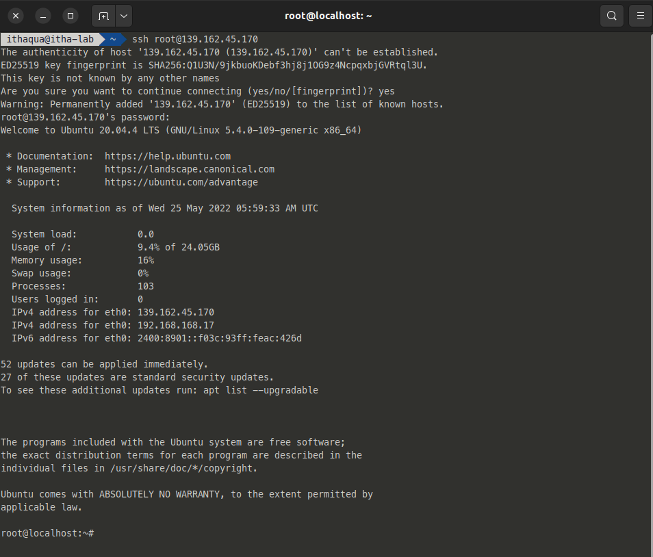

  *2. Kiểm tra các yêu cầu tối thiểu*

  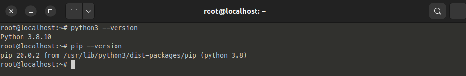

  *3. Cài đặt Ansible bằng `pip`*

      python3 -m pip install ansible
  
  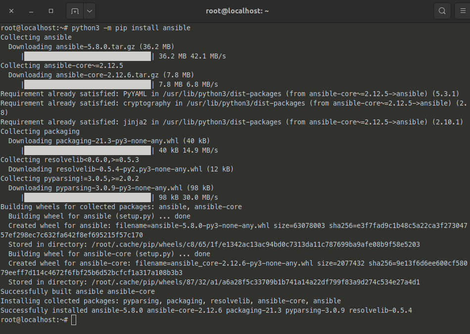

  *4. Kiểm tra kết quả*

      ansible --version
  
  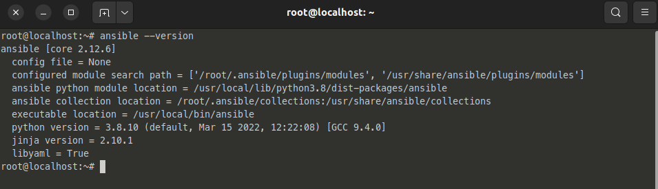

### **4. Ansible config**

*a. Ansible configuration & `sshpass` install*

- Do ở đây ta thực hiện kết nối giữa ansible server với các server còn lại thông qua user và password, nên ta cần cài gói `sshpass`.

      sudo apt install sshpass

- Tiếp đó, ta cần config để tắt host key checking khi thực hiện kết nối ssh. Do thư mục `/etc/ansible/ansible.cfg` chưa có sẵn, nên ta sẽ tạo nó, sau đó tạo file `ansible.cfg` có nội dung:

      [defaults]
      host_key_checking=False

  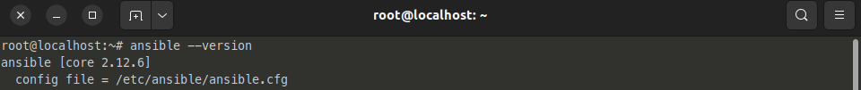

- Kiểm tra xem config đã được áp dụng hay chưa bằng cách check lại version

*b. Config `iventory`*

- Tạo thư mục làm việc `practice2`.

- Tạo iventory `hosts` để lưu remote hosts.

      [production]
      139.162.45.253
      [dev]
      139.162.6.167
      [all:vars]
      ansible_user=root
      ansible_password=Hali201

- Kiểm tra kết nối tới các host

      ansible -i hosts -m ping all

  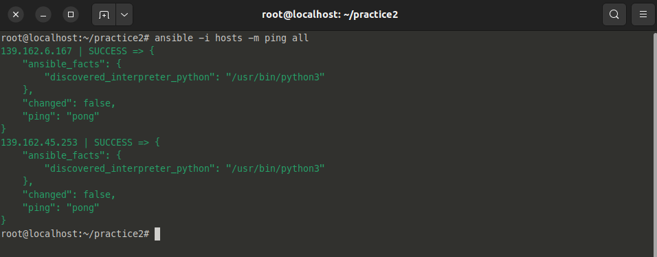

- Xong, vậy là đã hoàn thành công việc chuẩn bị, tiếp theo sẽ là viết các playbook để tự động hóa quá trình deploy dự án lên các môi trường đã chuẩn bị.

## **III. Practicing**

### **1. Discussion**

- Trong practice này, thay vì viết một vài playbook theo kiểu truyền thống, ta sẽ viết pro hơn một chút xíu, đó là dùng Ansible-roles. Những roles ta sẽ viết:

  1. Docker : Cài đặt docker, docker-compose.
  
  2. Deploy: thực hiện clone source từ github về và deploy code

  3. Update: Pull code từ repo trên github về khi có update và thực hiện update code.

  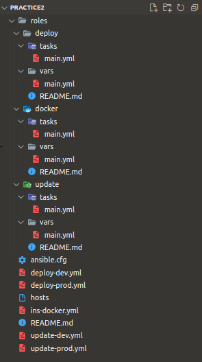

- Cấu trúc bên trong thư mục `practice2` sẽ như sau.

- *Chia sẻ một chút về cách mình viết các playbook thì mình tạo 1 repo trên github, clone về laptop cá nhân rồi viết bằng VScode (Vì có nhiều extension hỗ trợ check lỗi syntax cũng như sẽ dễ viết hơn nhiều so với việc viết trên terminal - =)) pro nào quá đỉnh thì có thể không quan trọng việc này nhưng nếu newbie thì có thể thử cách của mình). Viết playbook xong thì đẩy lên github, SSH vào server rồi clone playbook về thôi. ^^*

### **2. Docker role**

- Trong role này ta sẽ thực hiện cài đặt docker, docker-compose, cũng như chạy thử hello-world container để test.

  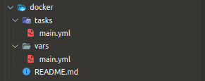

- `var/main.yml`  - Chứa thông tin các biến dùng trong role :

      ---
      # vars file for docker-on-ubuntu
      docker_dependencies:
        - ca-certificates
        - curl
        - gnupg
        - lsb-release
      docker_gpg_key: https://download.docker.com/linux/ubuntu/gpg
      docker_repo_path: https://download.docker.com/linux/ubuntu
      docker_repo_cmd: "deb {{ docker_repo_path }} {{ ansible_distribution_release }} test"
      docker_pkgs:
        - docker-ce
        - docker-ce-cli
        - containerd.io
      docker_compose_url: https://github.com/docker/compose/releases/download/v2.2.3/docker-compose-Linux-x86_64

- `tasks/main.yml` - chứa danh sách các task chính được thực thi trong role này:

      ---
      # tasks file for docker-on-ubuntu
      - name: install dependencies
        apt:
          name: "{{item}}"
          state: present
          update_cache: yes
        loop: "{{ docker_dependencies }}"

      - name: add GPG key
        apt_key:
          url: "{{ docker_gpg_key }}"
          state: present

      - name: add docker repository to apt
        apt_repository:
          repo: "{{ docker_repo_cmd }}"
          state: present

      - name: install docker
        apt:
          name: "{{ item }}"
          state: latest
          update_cache: yes
        loop: "{{ docker_pkgs }}"

      - name: install pip
        apt: 
          name: python3-pip
          state: latest
          update_cache: yes

      - name: Install Docker Module for Python
        pip:
          name: docker
          executable: pip3

      - name: Install Docker-Compose Module for Python
        pip:
          name: docker-compose
          executable: pip3

      - name: Starting & Enable docker.
        service:
          name: docker
          state: started
          enabled: yes

      - name: Ensure group "docker" exists
        group:
          name: docker
          state: present

      - name: adding user to docker group
        user:
          name: "{{ docker_user }}"
          groups: docker
          append: yes

      - name: Install docker-compose
        get_url:
          url: "{{ docker_compose_url }}"
          dest: /usr/local/bin/docker-compose
          mode: 'u+x,g+x'

      - name: Change file ownership, group and permissions
        file:
          path: /usr/local/bin/docker-compose
          owner: "{{ docker_user }}"
          group: "{{ docker_user }}"

      - name: Testing Docker by running Docker run hello=world
        command: docker run hello-world
        register: docker_test

      - debug: msg="{{ docker_test.stdout_lines }}"

- `ins-docker.yml` - playbook chính dùng để thực hiện role:

      ---
      - name: install & configure docker & docker-compose on Ubuntu
        hosts: all
        become: true
        vars:
          docker_user: root
        roles:
          - docker

- Role Docker này được thực hiện trên cả `production-server` và `dev-server`, vậy nên ta sẽ để  `hosts:  all`.

- Chạy playbook và kiểm tra kết quả:

      ansible-playbook -i hosts ins-docker.yml

  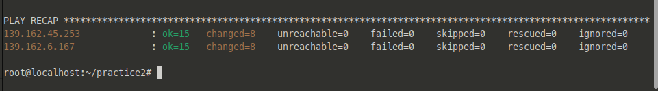

- SSH thử vào `production-server` để kiểm tra.

  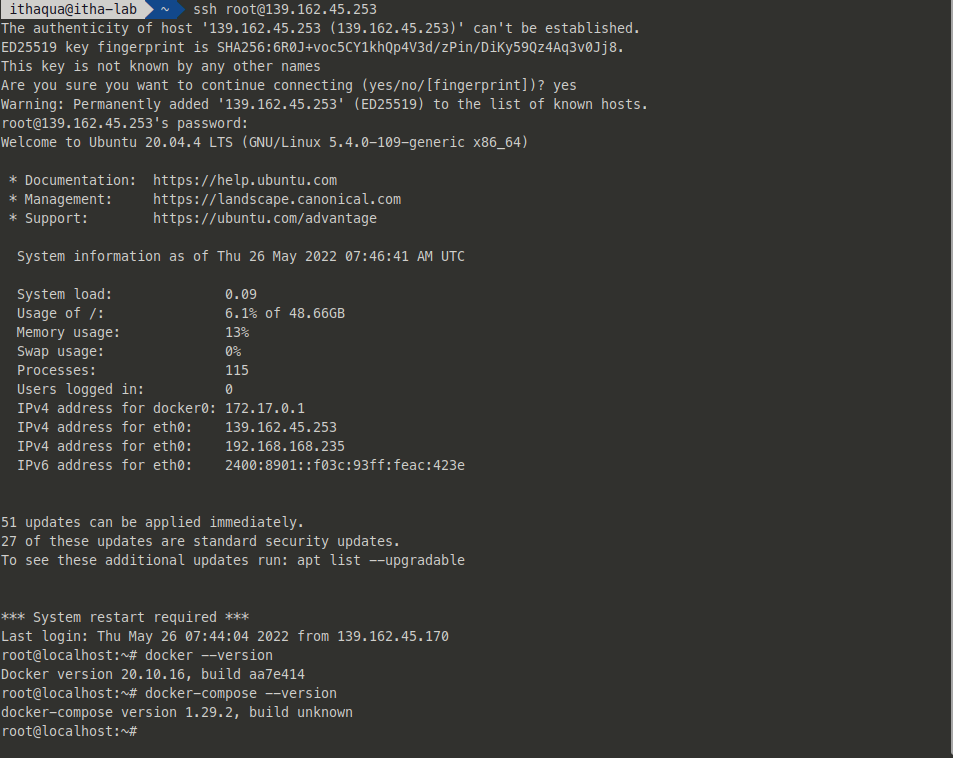

- Vậy là xong role đầu tiên, docker, docker-compose và các dependencies đã cài đặt thành công.

### **2. Deploy role**

- Trong role này, ta sẽ thực hiện clone source code từ Github và chạy docker-compose

- Như mô hình thiết lập ban đầu thì ta sẽ dựng 2 môi trường là `production` và `develop` (source code trên Github mình đã tách ra 2 branch khác nhau là `deploy-ansible` và `deploy-ansible-dev`).

- Cấu trúc role `deploy`:

  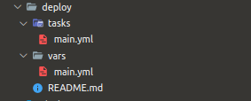

- `vars/main.yml`:

      github_repo: https://github.com/ithaquaKr/ptit-learn-app.git
      dest_dir: /home/ptit-learn-app
      docker_dir: /home/ptit-learn-app

- `tasks/main.yml`:

      ---
      - name: cloning repo
        git:
          repo: "{{ github_repo }}"
          version: "{{ github_branch | default('deploy-ansible') }}"
          dest: "{{ dest_dir }}"
          clone: yes
          update: yes

      - name: docker-compose app
        docker_compose:
          project_src: "{{ docker_dir }}"
          files:
            - docker-compose.yml

- `deploy-dev.yml` : Playbook deploy lên môi trường develop:

      ---
      - name: deploy dev server
        hosts: dev
        become: true
        vars:
          github_branch: deploy-ansible-dev
        roles:
          - deploy

- `deploy-prod.yml` : Playbook deploy lên môi trường production:

      ---
      - name: deploy production server
        hosts: production
        become: true
        vars:
          github_branch: deploy-ansible
        roles:
          - deploy

- Các playbook được viết dựa trên các module có sẵn từ Ansible, chi tiết về các module sử dụng có thể tìm đọc tại phần cuối của bài viết (REF).

- **Chạy playbook và kiểm tra:**

- Playbook production:

      ansible-playbook -i hosts deploy-prod.yml

  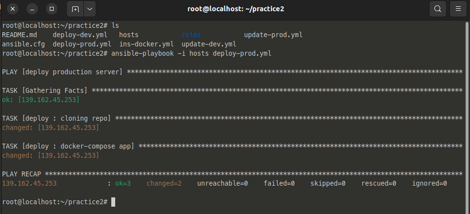

- Truy cập vào web-app ta đã deploy để test nào

      IP: 139.162.45.253:80

  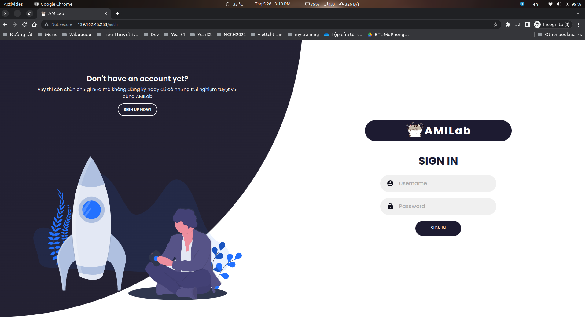

- Greate!~ Tiếp tục với develop server

- Playbook develop:

      ansible-playbook -i hosts deploy-dev.yml

  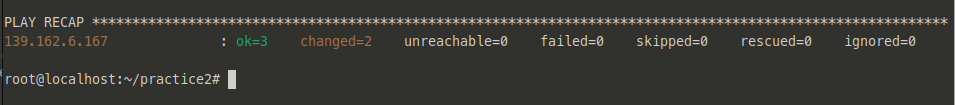

      IP: 139.162.6.167:80
  
  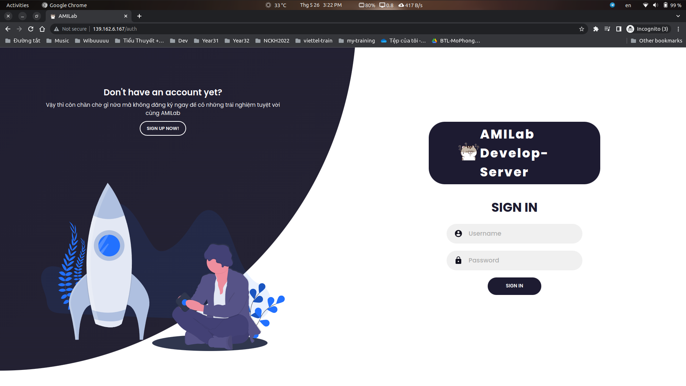

- Perfect~. Tiếp theo ta sẽ đi tạo role cuối cùng là `update`.

### **2. Update role**

- Role này thì gần tương tự với deploy role, ta sẽ update code trên server, xóa image cũ và thay bằng các image mới được build từ docker-compose.

- Cấu trúc update role:

  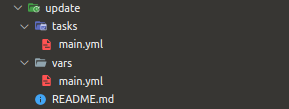

- `vars/main.yml` :

      github_repo: https://github.com/ithaquaKr/ptit-learn-app.git
      dest_dir: /home/ptit-learn-app
      docker_dir: /home/ptit-learn-app

- `tasks/main.yml` :

      ---
      - name: cloning repo
        git:
          repo: "{{ github_repo }}"
          version: "{{ github_branch | default('deploy-ansible') }}"
          dest: "{{ dest_dir }}"
          clone: yes
          update: yes

      - name: remove old image
        docker_compose:
          project_src: "{{ docker_dir }}"
          state: absent
          remove_images: all

      - name: docker-compose app
        docker_compose:
          project_src: "{{ docker_dir }}"
          files:
            - docker-compose.yml
          state: present
          build: yes

- Tiếp theo ta có các playbook để thực hiện update cho cả 2 môi trường production và develop.

- `update-dev.yml` :

      ---
      - name: Update code for dev server
        hosts: dev
        become: true
        vars:
          github_branch: deploy-ansible-dev
        roles:
          - update

- `update-prod.yml`:

      ---
      - name: Update code for production server
        hosts: production
        become: true
        vars:
          github_branch: deploy-ansible
        roles:
          - update

- Để kiểm tra update role, ta sẽ thử thêm một vài thay đổi nhỏ về `front-end` của source code develop, commit và push lên repo Github, rồi sau đó kiểm tra xem.

  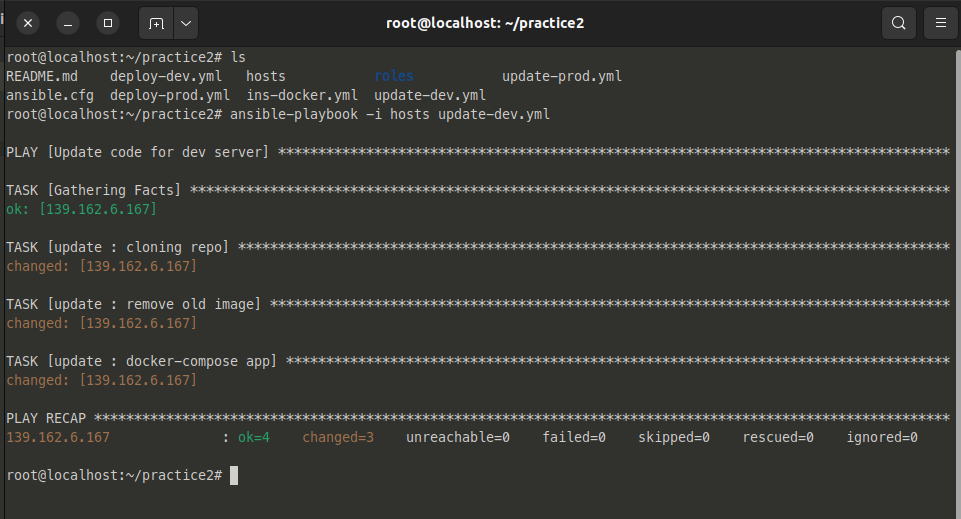

  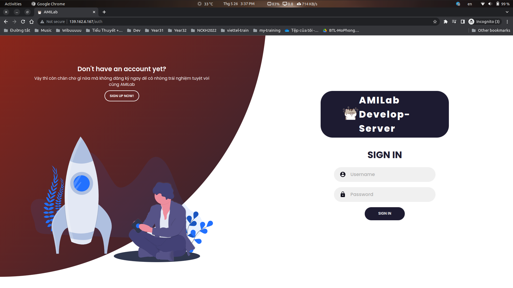

- Greate~! Mọi thứ đã hoạt động tốt.

## **IV. References**

- [1] <https://docs.ansible.com/ansible/latest/index.html>

- [2] <https://github.com/HaManhDong/ansible/blob/master/ansible.md>

- [3] <https://developwithpunit.com/ansible-roles-example-using-docker-configuration-2022/>

- [4] <https://cloudcraft.info/ansible-huong-dan-su-dung-va-quan-ly-role-trong-ansible/>

- [5] <https://docs.ansible.com/ansible/latest/collections/ansible/builtin/pip_module.html>

- [6] <https://docs.ansible.com/ansible/2.9/modules/docker_compose_module.html>

- [7] <https://docs.ansible.com/ansible/latest/collections/ansible/builtin/git_module.html>
