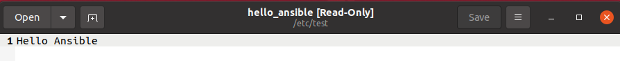
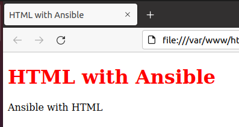

# Practice 2: Creating and executing Ansible Playbook
---
## **Table of Contents:**

### I. Overview
- #### 1. What is Ansible ?
- #### 2. Principles of Ansible
- #### 3. Ansible Architecture
- #### 4. Ansible Terminology

### II. Implementation

### III. References


---
### I.Overview

#### 1. What is Ansible ?


**Ansible** is an IT automation tool which can configure systems, deploy software, handle clooud provisioning and orchestrate other advanced IT tasks. 
- **Original author**: Michael DeHaan
- **Developer(s)**: Ansible Community / Ansible Inc. / Red Hat Inc
- **Initial release**: February 20, 2012
- **Repository**: [github.com/ansible/ansible](https://github.com/ansible/ansible)
- **Written in**: Python, PowerShell, Shell, Ruby
- **Operating system**: Linux, Unix-like, MacOS, Windows
- **License**: GNU General Public License v3.0 or later

#### 2. Principles of Ansible
- **Simple**: Get productive quickly
    - Simple setup process with a minimal learning curve
    - Describe infrastructure in a language that is both machine and human friendly
    - Tasks executed in order
- **Powerful**: Orchestration the app lifecycle
    - Manage machines quickly and in parallel
    - Configuration management
    - App deployment
    - Manage new remote machines instantly, without bootstrapping any software
- **Agentless**: More efficient & More secure
    - Uses OpenSSH & WinRM
    - Agentless architecture
    - Avoid custom-agents and additional open ports

#### 3. Ansible architecture
`Ansible` can support whatever actions you want to execute in a server. 


`Ansible` issues all commands from a central location to perform these tasks. `Ansible` work on push mode over ssh connection (push configurations to server over ssh connection)

#### 4. Ansible Terminology
- **Controller Machine**: Any machine with `Ansible` installed
- **Configuration**: Adjust settings in `Ansible`
- **Inventory**: A file that contains the hosts and groups of remote hosts
- **Ad-Hoc command**: Refers to running `Ansible` to perform some quick command and you don’t want to save for later or write a full playbook
- **Playbook**: Playbooks are Ansible's configuration, deployment and orchestration language
- **Task**: 
  - Playbooks exist to run tasks
  - Task are executed in order, one at a time, against all hosts matched by the host pattern before moving on to the next task
  - Hosts with failed tasks are taken out of the rotation for the entire playbook
- **Module**:
  - Modules are the units of work that `Ansible` ships out to remote machines
  - Take parameters and conditions to perform the action, and return JSON format data
  - Flexible to write the custom modules: can be written in any language as long as they output JSON
- **Role**: 
  - Roles are units of organization in `Ansible`
  - Roles are set of tasks and additional files for a certain role which allow you to break up the configurations

### II. Implementation
**Config Ansible**


**Create Inventory file**


**Create Host file**


**Ping between 2 hosts**


**Create template files**: 
   - template.j2
  

 
 
 
   - index.html.j2 

 
 
**Create a playbook**: 

```
--- 
name: playbook.yml
 - hosts: servers
   become: true
   become_method: sudo
   vars:
    server: Ubuntu
    version: 20.04
    name1: HTML with Ansible
    description: Ansible with HTML
   tasks:
    - name: create a new directory
      file: 
        path: "/etc/test"
        state: directory
    - name: Create and write "Hello Ansible" to a file
      shell: echo 'Hello Ansible' > /etc/test/hello_ansible
    - name: Upgrade apt packages
      become: true
      apt:
       force_apt_get: true
       upgrade: dist
    - name: Install Apache
      apt: 
       name: apache2 
       update_cache: true 
       state: latest
    - name: Install Nginx
      apt:
        name: nginx
        state: latest
    - name: Jinja 2 template
      template: 
       src: template.j2
       dest: /home/os/file.txt
    - name: HTML
      template: 
       src: index.html.j2
       dest: /var/www/html/index.html
       mode: 0775
    - name: Allow access to tcp port 80
      ufw:
        rule: allow
        port: '80'
        proto: tcp  
    - name: Copy file
      ansible.builtin.copy:
       src: /etc/test/hello_ansible
       dest: /home/os
       mode: '0644'
```

**Execute playbook**


> Successful

**Results**
 - **New directory**:
 
 
 
 - **Hello Ansible File**:
 >File located in /etc/test
 
 
 
 >File moved to /home/os
 
 

- **nghinx and apache installed**:


 - **Jinja 2 template**
 >j2 template changed to text file
 
 
 - **HTML**:
>j2 template changed to html file



- **Firewall Updated**:


### **III. REFERENCES**:

- [Ansible Documentation](https://docs.ansible.com/ansible/latest/index.html)

- [How to write Ansible Playbook](https://www.digitalocean.com/community/tutorial_series/how-to-write-ansible-playbooks)

