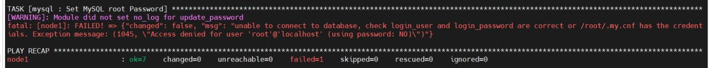
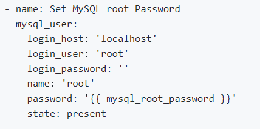
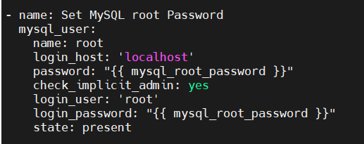

## How to Install and Set Up WordPress with Ansible on Ubuntu 20.04 Server            
----     
# Mục lục       
- [1. Tạo thư mục theo cấu trúc  ](#tao_thu_muc_theo_cau_truc)           
- [2. Tạo một file Inventory ](#tao_mot_file_Inventory)           
- [3. Tạo một Variable Ansible](#tao_mot_Variable_Ansible)         
- [4. Tạo một file Template Apache Virtual Host](#tao_mot_file_Template_Apache_Virtual_Host)       
- [5. Tạo một Playbook cho Apache, PHP, MySQL, WordPress và Firewall Role](#tao_mot_Playbook_cho_PHP_MySQL_WordPress_Firewall_Role)                
- [6. Tạo một Main Playbook](#tao_mot_Main_Playbook)               
- [7. Kiểm tra tại Node ](#kiem_tra_tai_node)    
- [8. Debugging](#debugging)            

## [Tài liệu tham khảo](#tai_lieu_tham_khao)     
----           

- ***Trước khi mọi người cài đặt các bước theo tài liệu này thì mọi người cần phải hiểu về `Ansible` như là: Controller Machine, Configuration, Inventory, Ad-Hoc Command, Playbook & Tasks, Module, Role, etc... cũng như cách `install` và `setup` cho VMs của bạn tại*** [đây](https://docs.ansible.com/ansible/latest/installation_guide/intro_installation.html)         
- Mọi người có thể tham khảo tài liệu tại [Ansible Documentation ](https://docs.ansible.com/ansible_community.html)       

**Note**    
- Ở bài này, chúng ta sử dụng `wp.example.com` để truy cập website thay vì chúng ta sử dụng địa chỉ IP để truy cập với IP server thông qua giao thức DNS ( Domain Name System ). (Tham khảo thêm tại [DNS là gì ?](https://www.fortinet.com/resources/cyberglossary/what-is-dns)  )
- Mục đích: sử dụng domain name để cho người dùng dễ sử dụng thay vì sử dụng địa chỉ IP để truy cập.        
- Yêu cầu: Mua Domain Name để có thể truy cập được vào `wordpress`.     

----     

<a name='tao_thu_muc_theo_cau_truc'></a>         

## 1. Tạo thư mục theo cấu trúc        

- Thực hiện Lệnh như sau:     
```     
$ mkdir ~/wordpresss    
$ cd ~/wordpress     
$ mkdir roles vars files     
$ cd roles      
$ mkdir -p apache/tasks php/tasks mysql/tasks wordpress/tasks firewall/tasks       
```    
```   
/root/wordpress/     
├── files   
├── roles  
│   ├── apache
│   │   └── tasks
│   ├── firewall
│   │   └── tasks
│   ├── mysql
│   │   └── tasks
│   ├── php
│   │   └── tasks
│   └── wordpress
│       └── tasks
└── vars

```  

<a name='tao_mot_file_Inventory'></a>     

## 2. Tạo một file Inventory        
- Mục đích: xác định `target` cho host của bạn      

```   
$ vi ~/wordpress/inventory.txt      
```    
- Nội dung file:          

```   
[host1]     
node1 ansible_host=172.16.130.140 ansible_user=root ansible_ssh_pass=1       
```     

- Trong đó:    
   - `ansible_host`: là địa chỉ IP trong remote host.             
   - `ansible_user`: User mà node Controller sử dụng để tương tác với các node còn lại thông qua dịch vụ SSH.          
   - `ansible_ssh_pass`: là password user mà node Controller sử dụng.             

<a name='tao_mot_Variable_Ansible'></a>    

## 3.  Tạo một Variable Ansible       

- Xác định một variable để lưu thông tin về những thứ phổ biến như là: `MySQL user, Apache host, Port, Password, PHP extensions, etc.`        

```     
$ vi ~/wordpress/vars/default.yml     
```     
- Nội dung file:     
```    
#PHP Settings   
php_modules: [ 'php', 'php-curl', 'php-gd', 'php-mbstring', 'php-xml', 'php-xmlrpc', 'php-soap', 'php-intl', 'php-zip' ]     

#MySQL Settings   
mysql_root_password: "your-root-password"    
mysql_db: "wpdb"   
mysql_user: "wpuser"   
mysql_password: "password"     

#HTTP Settings    
http_host: "wp.example.com"   
http_conf: "wp.example.com.conf"   
http_port: "80"       
```     
- Trong đó:   
   - `php_module`: hiện thị danh sách tất cả các module PHP được yêu cầu cho Wordpress.    
   - `mysql_root_password`: là mật khẩu MySQL cho user root bạn muốn thiết lập.   
   - `mysql_db`: là tên database của WordPress bạn muốn tạo.   
   - `mysql_password`: là password của user MySQL mà bạn muốn thiết lập.  
   - `http_host`: là tên FQDN (Fully Qualified Domain Name) của website WordPress.   
   - `http_conf`: là tên file configuration WordPress.   
   - `http_port`: là tên port của webserver Apache.   

<a name='tao_mot_file_Template_Apache_Virtual_Host'></a>      

## 4. Tạo một file Template Apache Virtual Host    

- Tạo một template [Jinja2](https://jinja.palletsprojects.com/en/2.10.x/) cho Apache VirtualHost configuration. Ansible sẽ copy file template này đến host đích.         

```   
vi ~/wordpress/files/apache.conf.j2         
```    
- Nội dung file:   
```    
<VirtualHost *:{{ http_port }}>
   ServerAdmin webmaster@localhost
   ServerName {{ http_host }}
   ServerAlias www.{{ http_host }}
   DocumentRoot /var/www/{{ http_host }}/wordpress  
   ErrorLog /var/log/apache2/error.log
   CustomLog /var/log/apache2/access.log combined

   <Directory /var/www/{{ http_host }}/wordpress>   
         Options -Indexes FollowSymLinks
         AllowOverride all
         Require all granted  
   </Directory>

   <IfModule mod_dir.c>
       DirectoryIndex index.php index.html index.cgi index.pl  index.xhtml index.htm
   </IfModule>

</VirtualHost>
```    

<a name='tao_mot_Playbook_cho_PHP_MySQL_WordPress_Firewall_Role'></a>   

## 5. Tạo một Playbook cho Apache, PHP, MySQL, WordPress và Firewall Role     

### 5.1 Tạo một Playbooks cho Apache Roles     

- Tạo một playbook cho `Apache Roles` để cài đặt và cấu hình Apache trong host đích. Bao gồm:      
   - Cài đặt gói Apache.   
   - Bắt đầu service Apache và cho phép khởi động khi boot.   
   - Tạo một thư mục root Apache web.    
   - Copy file Apache VirtualHost configuration template từ Ansible control machine đến Ansible host đích.          

``` 
vi ~/wordpress/roles/apache/tasks/main.yml        
```  

- Nội dung file:   
```   
---  
- name: Install latest version of Apache     
  apt: name=apache2 update_cache=yes state=latest   

- name: Start apache service  
  service: name=apache2 state=started enabled=yes   
  
- name: Create Apache Document Root  
  file:   
    path: "/var/www/{{ http_host }}"    
    state: directory   
    owner: "ansible"  
    group: "ansible"   
    mode: '0755'     
   
- name: Set up Apache VirtualHost    
  template:  
    src: "files/apache.conf.j2"  
    dest: "/etc/apache2/sites-avaiable/{{ http_conf }}"   
    owner: root   
    group: root  
    mode: u=rw,g=r,o=r    

```  

### 5.2 Tạo một playbook cho PHP role    
   
- Tạo file:     
```   
vi ~/wordpress/roles/php/tasks/main.yml    
```     

- Nội dung file:   
```      
# tasks file for PHP     
- name: Install PHP Extensions  
  apt: name={{ item }} update_cache=yes state=latest    
  loop: "{{ php_modules }}"    
```  

### 5.3 Tạo một playbook cho MySQL Role    
- Tasks:   
   - Cài đặt MySQL và package khác.   
   - Start dịch vụ MySQL và cho phép khởi động khi boot   
   - Cài MySQL root password   
   - Tạo database cho WordPress  
   - Tạo database user cho WordPress    

```   
vi ~/wordpress/roles/mysql/tasks/main.yml    
```      
- Nội dung file:   
```   
---  
# MySQL Configuration   
- name: Install MySQL Packages   
  apt: name={{ item }} update_cache=yes state=latest    
  loop: [ 'mysql-server', 'php-mysqlnd', 'python3-PyMySQL' ]     

- name: Start mysqld service   
  service:  
    name: mysql  
    state: started     
    enabled: yes       

- name: Set MySQL root Password   
  mysql_user:    
    login_host: 'localhost'   
    password: "{{ mysql_root_password }}"    
    check_implicit_admin: yes    
    login_user: 'root'   
    login_password: "{{ mysql_root_password }}"    
    state: present    

- name: Creates database for WordPress   
  mysql_db:    
    name: "{{ mysql_db }}"   
    state: present   
    login_user: root   
    login_password: "{{ mysql_root_password }}"     

- name: Create MySQL user for WordPress   
  mysql_user:   
    name: "{{ mysql_user }}"   
    password: "{{ mysql_password }}"   
    priv: "{{ mysql_db }}.*:ALL"    
    state: present   
    login_user: root  
    login_password: "{{ mysql_root_password }}"    

```  

### 5.4 Tạo một playbook cho WordPress Role   
- Tasks:   
  - Download và extract WordPress đến thư mục root web Apache.   
  - Cài ownership cho WordPress.   
  - Cài permission cho thư mục.  
  - Cài permission cho files.   
  - Rename WordPress sample configuration file.   
  - Xác định database đang cài trong file cấu hình WordPress.   
  - Khởi động dịch vụ Apache.       

```   
$ vi ~/wordpress/roles/wordpress/tasks/main.yml     
```   

- Nội dung file:    
```      
- name: Download and unpack latest WordPress
      unarchive:
        src: https://wordpress.org/latest.tar.gz
        dest: "/var/www/{{ http_host }}"
        remote_src: yes
        creates: "/var/www/{{ http_host }}/wordpress"
 
    - name: Set ownership
      file:
        path: "/var/www/{{ http_host }}"
        state: directory
        recurse: yes
        owner: ansible   
        group: ansible   
 
    - name: Set permissions for directories
      shell: "/usr/bin/find /var/www/{{ http_host }}/wordpress/ -type d -exec chmod 750 {} \\;"
 
    - name: Set permissions for files
      shell: "/usr/bin/find /var/www/{{ http_host }}/wordpress/ -type f -exec chmod 640 {} \\;"
 
    - name: Copy sample config file
      command: mv /var/www/{{ http_host }}/wordpress/wp-config-sample.php /var/www/{{ http_host }}/wordpress/wp-config.php creates=/var/www/{{ http_host }}/wordpress/wp-config.php
      become: yes
 
    - name: Update WordPress config file
      lineinfile:
        path: "/var/www/{{ http_host }}/wordpress/wp-config.php"
        regexp: "{{item.regexp}}"
        line: "{{item.line}}"
      with_items:
        - {'regexp': "define\\( 'DB_NAME', '(.)+' \\);", 'line': "define( 'DB_NAME', '{{mysql_db}}' );"}
        - {'regexp': "define\\( 'DB_USER', '(.)+' \\);", 'line': "define( 'DB_USER', '{{mysql_user}}' );"}
        - {'regexp': "define\\( 'DB_PASSWORD', '(.)+' \\);", 'line': "define( 'DB_PASSWORD', '{{mysql_password}}' );"}
     
    - name: Restart Apache service
      service: name=apache2 state=restarted
      become: yes
```   
### 5.5 Tạo một playbook cho Firewall Role   
- Tạo file:   
```   
$ vi ~/wordpress/roles/firewall/tasks/main.yml    
```    
- Nội dung file:   
```   
# UFW Configuration
- name: "UFW - Allow HTTP on port {{ http_port }}"
  ufw:
     rule: allow
     port: "{{ http_port }}"
     proto: tcp  
```      

<a name='tao_mot_Main_Playbook'></a>    

### 6. Tạo một Main Playbook   

- Tạo file:   
```   
$ vi ~/wordpress/playbook.yml        
```    
- Nội dung file:   
```     
---   
- hosts: node1   
  gathering facts: False  
  remote_user: root       
  become: true   
  vars_files:   
     - vars/default.yml   
  roles:   
     - apache  
     - php  
     - mysql  
     - wordpress   
     - firewall    
```      
  
- ***Sau khi đã cấu hình thành công thì bạn push lên github rồi bạn dùng câu lệnh dưới đây để clone source code về rồi chạy `Ansible Playbook`.***             
```     
git clone https://github.com/phupham1805/Viettel-Digital-Talent-Program-2022.git   
```  
- Chạy Ansible Playbook    
```   
$ cd Viettel-Digital-Talent-Program-2022/Practice-2/Pham_Dinh_Phu/WordPress/      
$ ansible-playbook -i inventory.txt playbook.yml    
```      
- Kết quả   
```    
PLAY [node1] ********************************************************************************************************************************************************

TASK [apache : Install latest version of Apache] ********************************************************************************************************************
ok: [node1]

TASK [apache : Start apache service] ********************************************************************************************************************************
ok: [node1]

TASK [apache : Create Apache Document Root] *************************************************************************************************************************
ok: [node1]

TASK [apache : Set up Apache VirtualHost] ***************************************************************************************************************************
ok: [node1]

TASK [php : Install PHP Extensions] *********************************************************************************************************************************
ok: [node1] => (item=php)
ok: [node1] => (item=php-curl)
ok: [node1] => (item=php-gd)
ok: [node1] => (item=php-mbstring)
ok: [node1] => (item=php-xml)
ok: [node1] => (item=php-xmlrpc)
ok: [node1] => (item=php-soap)
ok: [node1] => (item=php-intl)
ok: [node1] => (item=php-zip)

TASK [mysql : Install MySQL Packages] *******************************************************************************************************************************
ok: [node1] => (item=mysql-server)
ok: [node1] => (item=php-mysqlnd)
ok: [node1] => (item=python3-pymysql)

TASK [mysql : Ensure mysql is running and starts on boot] ***********************************************************************************************************
ok: [node1]

TASK [mysql : Set MySQL root Password] ******************************************************************************************************************************
[WARNING]: Module did not set no_log for update_password
ok: [node1]

TASK [mysql : Creates database for WordPress] ***********************************************************************************************************************
ok: [node1]

TASK [mysql : Create MySQL user for WordPress] **********************************************************************************************************************
[WARNING]: Module did not set no_log for update_********
ok: [node1]

TASK [wordpress : Download and unpack latest WordPress] *************************************************************************************************************
skipping: [node1]

TASK [wordpress : Set ownership] ************************************************************************************************************************************
ok: [node1]

TASK [wordpress : Set permissions for directories] ******************************************************************************************************************
changed: [node1]

TASK [wordpress : Set permissions for files] ************************************************************************************************************************
changed: [node1]

TASK [wordpress : Copy sample config file] **************************************************************************************************************************
ok: [node1]

TASK [wordpress : Update WordPress config file] *********************************************************************************************************************
ok: [node1] => (item={'regexp': "define\\( 'DB_NAME', '(.)+' \\);", 'line': "define( 'DB_NAME', 'wpdb' );"})
ok: [node1] => (item={'regexp': "define\\( 'DB_USER', '(.)+' \\);", 'line': "define( 'DB_USER', 'wpuser' );"})
ok: [node1] => (item={'regexp': "define\\( 'DB_PASSWORD', '(.)+' \\);", 'line': "define( 'DB_PASSWORD', 'password' );"})

TASK [wordpress : Restart Apache service] ***************************************************************************************************************************
changed: [node1]

TASK [firewall : UFW - Allow HTTP on port 80] ***********************************************************************************************************************
ok: [node1]

PLAY RECAP **********************************************************************************************************************************************************
node1                      : ok=17   changed=3    unreachable=0    failed=0    skipped=1    rescued=0    ignored=0

```        

<a name='kiem_tra_tai_node'></a>       

## 7. Kiểm tra tại Node     
- Đăng nhập mysql với user root thành công!  

```   
root@node1:~# mysql -u root -p
Enter password:
Welcome to the MySQL monitor.  Commands end with ; or \g.
Your MySQL connection id is 20
Server version: 8.0.29-0ubuntu0.20.04.3 (Ubuntu)

Copyright (c) 2000, 2022, Oracle and/or its affiliates.

Oracle is a registered trademark of Oracle Corporation and/or its
affiliates. Other names may be trademarks of their respective
owners.

Type 'help;' or '\h' for help. Type '\c' to clear the current input statement.

mysql>

```  

<a name='debugging'></a>    

## 8. Debugging    
   
- Lỗi này xảy ra khi bạn set MySQL root password.       

      

- Nếu các bạn xảy ra lỗi này thì có thể là do bạn đang set login_user và login_password không chính xác.   
- Việc này cần phải ssh đến máy cài mysql để có thể thay đổi lại password cho root.    
- Hãy thực hiện các bước sau đây để có thể change root password.           
```   
Steps to change the password when you have forgotten it         
# 1.Stop your server first        
sudo service mysql stop       

# 2.Start the database without loading the grant tables or enabling networking      
sudo mysqld_safe --skip-grant-tables --skip-networking &     

Process run in the backgroud, so you can continous to use your terminal and run mysql -u root (as root). 
It will not ask for a password     
If you get error like as below     

2018-02-12T08:57:39.826071Z mysqld_safe Directory '/var/run/mysqld' for UNIX
socket file don't exists.
mysql -u root
ERROR 2002 (HY000): Can't connect to local MySQL server through socket
'/var/run/mysqld/mysqld.sock' (2)
[1]+  Exit 1 

# 3.Make the MySQL service directory.
sudo mkdir /var/run/mysqld

# Give MySQL permission to work with the created directory
sudo chown mysql: /var/run/mysqld

# Start MySQL, without permission and network checking
sudo mysqld_safe --skip-grant-tables --skip-networking &

# Log in to your server without any password.
mysql -u root      

Run these commands   

FLUSH PRIVILEGES;

# Update the password for the root user:
ALTER USER 'root'@'localhost' IDENTIFIED BY 'new_password';   

EXIT;

# Kill the mysqld_safe mysql mysqld process    

killall -KILL mysql mysqld_safe mysqld       
sudo service mysql restart

# Now you can use your new password to log in to your server
mysql -u root -p        

# Take note for remote access. You should create a remote
# user and then grant all privileges to that remote user
```   
**Note**   
- Nhưng như vậy thì bạn lại no idempotent vì cứ mỗi lần bạn deploy lại playbook thì sẽ báo lỗi như trên.  
- Lý do: vì password của root MySQL đã thay đổi.      
- Cải thiện: thay đổi module trong task như sau để được idempotent         

     

----   
<a name='tai_lieu_tham_khao'></a>   

## Tài liệu tham khảo    
[1] https://linuxbuz.com/linuxhowto/how-to-install-wordpress-with-ansible   
[2] https://www.digitalocean.com/community/tutorials/how-to-use-ansible-to-install-and-set-up-wordpress-with-lamp-on-ubuntu-18-04