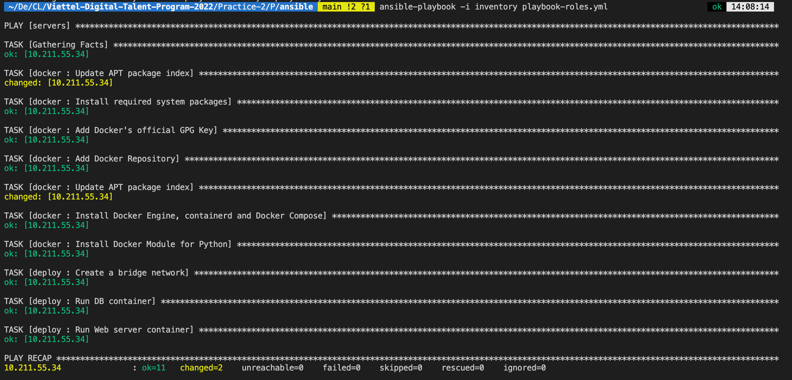

# TABLE OF CONTENT

- [TABLE OF CONTENT](#table-of-content)
- [1. Build project image](#1-build-project-image)
  - [1.1. Tổng quan về source code](#11-tổng-quan-về-source-code)
  - [1.2. Build web server image](#12-build-web-server-image)
  - [1.3. Build database image](#13-build-database-image)
- [2. Cài đặt và thiết lập Ansible, VM](#2-cài-đặt-và-thiết-lập-ansible-vm)
  - [2.1. Cài đặt máy ảo](#21-cài-đặt-máy-ảo)
  - [2.2. Cài đặt Ansible](#22-cài-đặt-ansible)
  - [2.3. Thiết lập public key để ssh vào VM](#23-thiết-lập-public-key-để-ssh-vào-vm)
  - [2.4. Configure Ansible](#24-configure-ansible)
  - [2.5. Cài đặt các module cần thiết để deloy project](#25-cài-đặt-các-module-cần-thiết-để-deloy-project)
  - [2.6. Working with inventory](#26-working-with-inventory)
- [3. Viết playbook deploy project](#3-viết-playbook-deploy-project)
  - [3.1. Viết tasks cài đặt Docker](#31-viết-tasks-cài-đặt-docker)
  - [3.2. Deploy project](#32-deploy-project)
  - [3.2.1. Tạo network](#321-tạo-network)
  - [3.2.2. Deploy database](#322-deploy-database)
  - [3.2.3. Deploy web server](#323-deploy-web-server)
- [4. Đánh giá tính Idempotent](#4-đánh-giá-tính-idempotent)
- [5. Kết luận](#5-kết-luận)
- [Tài liệu tham khảo](#tài-liệu-tham-khảo)

# 1. Build project image

## 1.1. Tổng quan về source code

Đây là một Web application đơn giản viết bằng Golang sử dụng gin và gorm framework, hiển thị đăng nhập và đăng xuất đơn giản ở front-end và một Restful API phân quyền người dùng, trao permission, tạo roles chưa được xây dựng front-end.

Link source code: https://github.com/anhphantq/vcs/tree/main/challenge2

## 1.2. Build web server image

Đầu tiên, ta tạo Dockerfile cho Web application

Ta sử dụng golang:1.16-alpine image để build image của app:

    FROM golang:1.16-alpine

Tạo môt directory để tiến hành thực hiện các câu lệnh trong directory đó:

    WORKDIR /app

Copy go.mod và go.sum vào /app (hai file này đóng vai trò lưu các dependencies của go, giống như package.json và package-lock.json trong NodeJS):

    COPY go.mod ./
    COPY go.sum ./

Chạy lệnh go mod download để download tất cả các Go dependencies (packages) cần thiết:

    RUN go mod download

Copy toàn bộ source code vào /app:

    COPY . ./

Chạy lệnh go build để build app từ source code:

    RUN go build -o /webapp

Sau khi đã build xong, go sẽ tạo ra 1 file executable là webapp (ở lệnh trên), ta chỉ cần chạy file đó để chạy ứng dụng, đồng thời expose cổng 8080:

    EXPOSE 8080
    CMD [ "/webapp" ]

Sau khi viết xong Dockerfile, tiến hành build image, với tag là web_server:

    docker build --tag web_server .

Tag lại image và push lên Docker Hub:

    docker tag web_server anhphantq/web_server:latest
    docker push anhphantq/web_server

## 1.3. Build database image

Docker file:

    FROM postgres:alpine

    ENV POSTGRES_PASSWORD Phananh272

    WORKDIR /backups

    COPY challenge2.tar ./

    COPY init_db.sh /docker-entrypoint-initdb.d/

Ở đây ta chỉ thêm file backup database vào để khi chạy container ta có thể backup lại database này mà không cần phải tạo database, tables mới cho web server có thể sử dụng.

Tiếp theo ta copy file init_db.sh vào docker-entrypoint-init.d/ (Postgresql Image: Initialization scripts) nhằm sử dụng file challenge2.tar để init các database (ta sử dụng psql và pg_resotre để restore):

    #init_db.sh
    #!/bin/bash

    psql -U postgres -c 'CREATE DATABASE challenge2;'

    pg_restore -U postgres --dbname=challenge2 --verbose /backups/challenge2.tar

Sau khi build thì ta chỉ cần push lên Docker Hub tương tự như trên. Kết quả sau khi push thành công:

# 2. Cài đặt và thiết lập Ansible, VM

## 2.1. Cài đặt máy ảo

OS: Ubuntu 20.04 ARM (Parallels)

VM có 1 NIC có địa chỉ IP 10.211.55.34 sử dụng shared-network (Parallels).

## 2.2. Cài đặt Ansible

    pip3 install ansible

## 2.3. Thiết lập public key để ssh vào VM

Do khi dùng mật khẩu bằng biến ansible_ssh_pass để ssh vào VM thì cần phải có sshpass, nhưng MacOS không hỗ trợ sshpass nên sẽ phải cài từ third party. Vì vậy, ta sẽ sử dụng public key để ssh vào VM đảm bảo an toàn.

Tạo ra cặp private/public key sử dụng thuật toán RSA（key sẽ được lưu tại ~/.ssh):

    ssh-keygen -t rsa

Copy public key vừa tạo được vào trong authorized_keys file của VM sử dụng ssh-copy-id:

    ssh-copy-id parallels@10.211.55.34

Bây giờ ta có thể ssh vào VM mà không cần nhập password.

## 2.4. Configure Ansible

Tạo file ansible.cfg:

    [defaults]
    host_key_checking = False

Ansible sẽ kiểm tra host key ở chế độ default, vì vậy ta sẽ disable chế độ này để dễ dàng thao tác hơn. Host_key_checking dùng để authenticate SSH server, tránh các dạng tấn công như server spoofing hoặc man-in-the-middle attacks.

Ngoài config này ta còn có thể có các config khác như fork (dùng để config số host thực hiện 1 task trong 1 lần) hoặc config inventory file,...

## 2.5. Cài đặt các module cần thiết để deloy project

Trong project này ta sử dụng collection community.docker để deploy project với các module để chạy container, tạo network,... , vì vậy ta sử dụng ansible-galaxy để cài collection này, trước hết kiểm tra xem đã có collection này chưa:

    ansible-galaxy collection list

Nếu chưa có ta tiến hành cài đặt:

    ansible-galaxy collection install community.docker

## 2.6. Working with inventory

Ở đây, ta sẽ sử dụng 1 host duy nhất để deploy là 10.211.55.34 (thuộc group servers), vì vậy ta sẽ viết file inventory như sau:

    [servers]
    10.211.55.34 ansible_user=parallels ansible_become_pass=Phananh272

Vì ta sử dụng public key nên không cần phải sử dụng ansible_ssh_pass. Vì playbook sẽ chưa các câu lệnh cần leo quyền nên ta phải cung cấp password để leo quyền bằng ansible_become_pass

Sau khi thiết lập xong ansible, ta có thể sử dụng module ping để kiếm tra xem các thiết lập đã thành công hay chưa:

    ansible -i inventory servers -m ping

Kết quả thành công:

# 3. Viết playbook deploy project

## 3.1. Viết tasks cài đặt Docker

Đầu tiên là update apt package index (task này sẽ không đảm bảo tính idempotent do index sẽ thay đổi thường xuyên):

    - name: Update APT package index
      apt:
        update_cache: yes
      become: yes

Tiếp tục sử dụng module apt để cài các packages cần thiết cho việc cài đặt Docker, module này có tính idempotent nếu để state ở default tức là ở chế độ present và update_cache là no (default):

    - name: Install required system packages
      apt:
        pkg:
          - ca-certificates
          - curl
          - gnupg
          - lsb-release
          - python3-pip
          - virtualenv
          - python3-setuptools
      become: yes

Sử dụng module apt_key để thêm Docker’s official GPG key (đảm bảo download package an toàn):

    - name: Add Docker's official GPG Key
      apt_key:
        url: https://download.docker.com/linux/ubuntu/gpg
        state: present
      become: yes

Tiếp theo, ta sử dụng module apt_repository để thêm Docker repository vào (ta sử dụng repo với distro là focal do OS là Ubuntu 20.04):

    - name: Add Docker Repository
      apt_repository:
        repo: deb https://download.docker.com/linux/ubuntu focal stable
        state: present
      become: yes

Update lại index:

    - name: Update APT package index
      apt:
        update_cache: yes
      become: yes

Cài đặt Docker Engine, containerd và Docker Compose:

    - name: Install Docker Engine, containerd and Docker Compose
      apt:
        pkg:
          - docker-ce
          - docker-ce-cli
          - containerd.io
          - docker-compose-plugin
      become: yes

Cài đặt Docker module cho Python để có thể sử dụng được các module Docker với ansible

    - name: Install Docker Module for Python
      pip:
        name: docker
      become: yes

## 3.2. Deploy project

## 3.2.1. Tạo network

Trước hết, ta sử dụng module community.docker.docker_network để tạo một bridge network có tên là web_net:

    - name: Create a brigde network
      community.docker.docker_network:
        name: web_net
      become: yes

## 3.2.2. Deploy database

Sử dụng module community.docker.docker_container để pull image và run container, với tên là web_db, image ta đã build từ trước và có network là web_net ta tạo ở trên, biến state sẽ để started đảm bảo present (nếu đã có container với tên, cấu hình như vậy tồn tại, nếu không thì mới tạo container mới) và sẽ chuyển trạng thái của container là running:

    - name: Run DB container
      community.docker.docker_container:
        name: web_db
        image: anhphantq/web_db
        networks:
          - name: web_net
        state: started
      become: yes

## 3.2.3. Deploy web server

Tương tự như, ta cũng sử dụng module community.docker.docker_container để chạy web server container, đồng thời public port 8080 container là port 80 của VM:

    - name: Run Web server container
      community.docker.docker_container:
        name: web_server
        image: anhphantq/web_server
        networks:
          - name: web_net
        state: started
        ports:
          - 80:8080
      become: yes

Như vậy, ta đã viết xong tất cả các task để deploy project. Giờ ta chỉ cần xử dụng ansible-playbook để deploy với file inventory ở bước [2.6](#26-working-with-inventory):

    ansible-playbook -i inventory playbook.yml

Do trong quá trình chạy, khi viết task nào thì ta chạy luôn task đó và các task trước đó để kiểm tra lại tính idempotent của từng module ansible nên khi hoàn thành playbook ta chạy lại lần cuối sẽ chỉ hiện 2 task changed (update index: không ảnh hưởng đến tính imdempotent toàn bộ playbook do nó chỉ update index chứ không cài đặt gì cả) còn tất cả các tasks còn lại đã ok (do có tính idempotent):

Sau khi deploy xong, ta có thể sử dụng địa chỉ IP của VM và dùng browser của máy chúng ta để truy cập vào Web app mà ta vừa deploy tại cổng 80:

Test tạo tài khoản và đăng nhập thành công:

# 4. Đánh giá tính Idempotent

Trong tất cả các task ở trên thì có 2 task update lại index cho package của ubuntu là không có tính Idempotent.

Sau khi chạy xong các task, ta chạy lại một lần nữa, thu được kết quả như sau:

Như vậy có 2 task update index không có tính idempotent. Và 11 task có tính idempotent.

# 5. Kết luận

Như vậy bằng việc sử dụng ansible, ta có thể deploy được các project trên các remote servers một cách dễ dàng bằng các module được cung cấp sẵn.

Tính idemponent cũng là một tính chất quan trọng của Ansible, nó đảm bảo được sự nhất quán, đồng bộ khi triển khai trên nhiều servers và có một web defined state với mỗi server.

Playbook viết đến hiện giờ còn khá đơn gian, nhưng khi trở nên phức tạp, ta cỏ thể tách thành các roles để ansible được tổ chức quy củ và dễ dàng viết hơn:

- Bước 1: tạo 2 roles như sau /roles/docker/tasks/main.yml và /roles/deploy/taks/main.yml
- Bước 2: Copy các task đã viết của 2 roles vào /tasks/main.yml
- Bước 3: Sửa lại playbook để include các roles như sau

        - hosts: servers
          become: true
          roles:
            - docker
            - deploy

Kết quả cho ra tương tự như trên:

(Roles và playbooks được lưu ở thư mục /ansible)

# Tài liệu tham khảo

- https://www.postgresqltutorial.com/
- https://akshayavb99.medium.com/automation-with-ansible-ansibles-idempotence-2c97d3081e6c
- https://galaxy.ansible.com/community/docker?extIdCarryOver=true&sc_cid=701f2000001OH7YAAW
- https://docs.docker.com/
