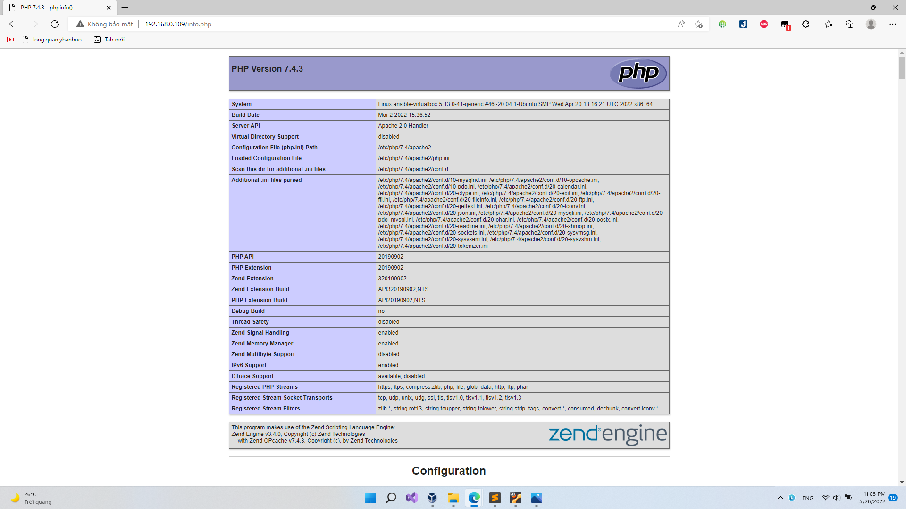

# PRACTICE-2 PRACTICES DOCUMENTATION
# DEPLOY PROJECT PHP WITH ANSIBLE

---

## **Author:** *Phung Hoang Long* 
**Date of issue**: *May 26th 2022*

---

# OVERVIEW

## 1. Need to know:

### LAMP Stack comprises the following open-source software applications.
- Linux – This is the operating system hosting the Applications.
- Apache – Apache HTTP is a free and open-source cross-platform web server.
- MySQL/MariaDB – Open Source relational database management system.
- PHP – Programming/Scripting Language used for developing Web applications.

### Ansible is an open-source software provisioning, configuration management, and application-deployment tool enabling infrastructure as code

### **Idempotent** The resource models are idempotent meaning change commands are not run unless needed, and Ansible will bring the system back to a desired state regardless of the actual state – rather than you having to tell it how to get to the state.

## 2. Prepare
- Ubuntu 20.04

- Desktop Hypervisor for running virtual machines (E.g: *Virtual Box, VM Workstation, etc*)

#### **Note:**
> *Virtual Box Workstation is **recommended** to use.*

- VM Network (Bridgr Adapter): `192.168.0.109`

# SETUP

## 1. Environment Preparations

In this guide, we shall be making use of Ansible playbooks and roles. These are some of the modules that make Ansible much easy to use.

- Install Ansible
```
$ sudo apt update
$ sudo apt install software-properties-common
$ sudo add-apt-repository --yes --update ppa:ansible/ansible
$ sudo apt install ansible
```

- Install sshpass
> SSH password-based login. User can specify `ssh` password in inventory file(s).
```
$ sudo apt-get install -y sshpass
```

## 2. Configure Ansible Playbook and Roles.

### Directory layout

```
├── inventory 						
├── lampstack.yml					
├── project.yml
├── roles
│   ├── apache
│   │   ├── files
│   │   │   ├── apache.conf.j2
│   │   │   └── info.php.j2
│   │   ├── handlers
│   │   │   └── main.yml
│   │   └── tasks
│   │       └── main.yml
│   ├── mariadb
│   │   └──tasks
│   │       └── main.yml
│	  └── project
│       └── tasks
│           └── main.yml
└── vars
    └── default.yml
```

### Config

#### ansible.cfg
```
[defaults]
inventory = /home/hoanglong/ansible/inventory
remote_user = hoanglong
host_key_checking = False

[privilege_escalation]
become = True
become_method = sudo
become_user = root
become_ask_pass = False

[ssh_connection]
pipelining=true
```
**Fields:**

- host_key_checking
> Prompting for confirmation of the key. (Default: true)
- pipelining
> Speed up Ansible

#### inventory
```
[lampstack]
192.168.0.109

[all:vars]
ansible_ssh_user = {{ your_user }}
ansible_ssh_pass = {{ your_password }}
ansible_become_pass = {{ your_password }}
```
**Test ping**
```
ansible all -m ping
```


#### vars/default.yaml
```
---
home_folder: "home/hoanglong"
www_folder: "/var/www"

mysql_root_password: "12345678"
app_user: "hoanglong"
http_host: "php-webserver"
http_conf: "php-webserver.conf"
http_port: "80"
disable_default: true

project_index_file: "index.php"
git_repo: "https://github.com/longph2710/deploy-php-project"
```

### Apache && Mariadb

#### Apache role

**Add the content below in the tasks/main.yaml file to install apache2 and PHP**
```
---
- name: Install prerequisites
  apt: name={{ item }} update_cache=yes state=latest force_apt_get=yes
  loop: [ 'aptitude' ]

#Apache Configuration
- name: Install Apache and PHP Packages
  apt: name={{ item }} update_cache=yes state=latest
  loop: [ 'apache2', 'php', 'php-mysql', 'libapache2-mod-php' ]

- name: Create document root
  file:
    path: "/var/www/{{ http_host }}"
    state: directory
    owner: "{{ app_user }}"
    mode: '0755'

- name: Set up Apache virtualhost
  template:
    src: "files/apache.conf.j2"
    dest: "/etc/apache2/sites-available/{{ http_conf }}"
    
- name: Enable new site
  shell: /usr/sbin/a2ensite {{ http_conf }}
  
- name: Disable default Apache site
  shell: /usr/sbin/a2dissite 000-default.conf
  when: disable_default
  notify: Reload Apache
# UFW Configuration
- name: "UFW - Allow HTTP on port {{ http_port }}"
  ufw:
    rule: allow
    port: "{{ http_port }}"
    proto: tcp

# PHP Info Page
- name: Sets Up PHP Info Page
  template:
    src: "files/info.php.j2"
    dest: "/var/www/{{ http_host }}/info.php"

- name: Reload Apache
  service:
    name: apache2
    state: reloaded

- name: Restart Apache
  service:
    name: apache2
    state: restarted
    
- name : Ensure Apache is running
  service:
    name: apache2
    state: started
```

**Add the following content in the handles/main.yaml for the Apache handlers**
```
---
- name: Reload Apache
  service:
    name: apache2
    state: reloaded

- name: Restart Apache
  service:
    name: apache2
    state: restarted
```

**Create apache.conf.j2 as the VirtualHost file**
```
<VirtualHost *:{{ http_port }}>
    ServerAdmin webmaster@localhost
    ServerName {{ http_host }}
    ServerAlias www.{{ http_host }}
    DocumentRoot /var/www/{{ http_host }}
    ErrorLog ${APACHE_LOG_DIR}/error.log
    CustomLog ${APACHE_LOG_DIR}/access.log combined

    <Directory /var/www/{{ http_host }}>
          Options -Indexes
    </Directory>

    <IfModule mod_dir.c>
        DirectoryIndex index.php index.html index.cgi index.pl  index.xhtml index.htm
    </IfModule>

</VirtualHost>
```

**Create info.php.j2 as PHP test file**
```
<?php
phpinfo();
```

#### Mariadb role

**Add the content below in the tasks/main.yaml file to install and config Mariadb**
```
---
- name: Install prerequisites
  apt: name={{ item }} update_cache=yes state=latest force_apt_get=yes
  loop: [ 'aptitude' ]

 #Install MariaDB server
- name: Install MariaDB Packages
  apt: name={{ item }} update_cache=yes state=latest
  loop: [ 'mariadb-server', 'python3-pymysql' ]

# Start MariaDB Service
- name: Start MariaDB service
  service:
    name: mariadb
    state: started
  become: true

MariaDB Configuration
- name: Sets the root password
  mysql_user:
    check_implicit_admin: yes
    name: root
    password: "{{ mysql_root_password }}"
    login_unix_socket: /var/run/mysqld/mysqld.sock

- name: Removes all anonymous user accounts
  mysql_user:
    name: ''
    host_all: yes
    state: absent
    login_user: root
    login_password: "{{ mysql_root_password }}"

- name: Removes the MySQL test database
  mysql_db:
    name: test
    state: absent
    login_user: root
    login_password: "{{ mysql_root_password }}"
```

#### Install and test

**Create lampstack.yaml to run configure lamp**
```
- name: configure lamp
  hosts: lampstack
  become: yes
  become_method: sudo
  vars_files:
    - vars/default.yaml
  roles:
    - apache
    - mariadb
```
**Run this command**
```
ansible-playbook -i inventory lampstack.yaml
```
> Result: ok=18 	changed=5


> PHP is install successfull



### Deploy Project (project role)

- Project is pushed to github.
- Using Ansible to clone project and deploy it into VM as a server.

#### Tasks
**Add the following code to main.yaml**
```
---
- name: Install git
  apt:
    name: git
    state: latest
    
- name: Create directory for cloning source code
  file:
    path: /{{ home_folder }}/repo
    state: directory
    
- name: Checkout project source code
  git:
    clone: yes
    update: yes
    repo: "{{ git_repo }}"
    dest: /{{ home_folder }}/repo
    force: yes
    accept_hostkey: yes
  
- name: Check if source code is uploaded
  shell: test -e /var/www/{{ http_host }}/{{project_index_file}} && echo -n yes || echo -n no
  register: uploaded
  changed_when: uploaded.stdout == 'exception'
  
- name: Copy source code to /var/www/{{ http_host }}
  shell: cp -r /{{ home_folder }}/repo/* /var/{{ http_host }}
  when: uploaded.stdout == 'no'
  
- name: Add name record
  lineinfile:
    path: /etc/hosts
    line:  "192.168.0.109 {{ http_host }}"

- name: Reload Apache
  service:
    name: apache2
    state: reloaded

- name: Restart Apache
  service:
    name: apache2
    state: restarted
    
- name : Ensure Apache is running
  service:
    name: apache2
    state: started
```

#### 

**Create project.yaml to run configure lamp**
```
- name: deploy project
  hosts: lampstack
  become: yes
  become_method: sudo
  vars_files:
    - vars/default.yaml
  roles:
    - project
```
**Run this command**
```
ansible-playbook -i inventory project.yaml
```
> Result: ok=9 	changed=2


> Access `192.168.0.109` to view website

