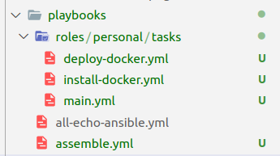

# **PRACTICE 2: Ansible**

## **TASK**: Deploy a project with Ansible

*Since this homework is about practicing Ansible, I will use a public Docker repository to alleviate the headache*

Here is the docker repository on hub.docker.com
<br></br>


### **Step 1: Create an inventory file**

```
[personal]
159.89.203.89
```
To avoid showing plaintext password in inventory file, do step 1.1
### **Step 1.1**: Create a public SSH key and add it to the VM

#### **Step 1.1.1**: Generate a public key

First, we change our directory to ~/.ssh

```
cd ~/.ssh
```
Run the following command to generate a key
```
ssh-keygen -t rsa
```
You will have to fill several questions

*Don't capture and show the screenshot as I did here*

Next, we copy the generated .pub file to the remote server with the following command:
```
ssh-copy-id -i <file_name>.pub <remote_user>@<remote_server>
```
Type in the password as usual, but from now on you won't have to type the password again while trying to SSH to the remote server. To finalize and make the SSH context persistent between sessions, add those 2 lines into ~/.bashrc file
```
eval "$(ssh-agent -s)"
ssh-add ~/.ssh/<file_name_only>
```

### **Step 2: Install Docker on remote hosts**

To run a docker image, of course we would have to install docker first. For reference to the manual steps, here is the [URL (DigitalOcean tutorial on installing Docker)](https://www.digitalocean.com/community/tutorials/how-to-use-ansible-to-install-and-set-up-docker-on-ubuntu-20-04)
<br>

From there, we know that there are 3 mandatory steps to install docker, which are:
### **Step 2.1**: Installing required packages

```
sudo apt update | sudo apt install apt-transport-https ca-certificates curl software-properties-common
```

Translating it to ansible playbook, we have a task:

```
  - name: Install required packages
    apt:
    pkg:
    - apt-transport-https 
    - ca-certificates 
    - curl 
    - software-properties-common
    - python3-pip
    update_cache: true
```
### **Step 2.2**: Add Docker GPG key
```
curl -fsSL https://download.docker.com/linux/ubuntu/gpg | sudo apt-key add -
```
Ansible corresponding task:
```
  - name: Add Docker GPG key
    apt_key:
    url: https://download.docker.com/linux/ubuntu/gpg
    state: present
```
### **Step 2.3**: Update apt and install docker-ce
```
sudo add-apt-repository "deb [arch=amd64] https://download.docker.com/linux/ubuntu focal stable" |
sudo apt install docker-ce
```
Ansible corresponding task:
```
  - name: Update apt and install docker-ce 
    apt:
    name: docker-ce
    state: latest
    update_cache: true
```
Finally, to check docker service status and run docker without sudo, run the command:
```
sudo systemctl status docker | sudo usermod -aG docker ${USER}
```
Translating to ansible (with become:true):
```
- name: Show docker info
    command:
    cmd: systemctl status docker
    register: shell_result
- debug:
    var: shell_result.stdout_lines
- name: Run docker without sudo 
    shell: |
    usermod -aG docker root 
```
Output of the debug command in playbook file:


Task list to install docker:
```
- name: Install required packages
  apt:
    pkg:
    - apt-transport-https 
    - ca-certificates 
    - curl 
    - software-properties-common
    - python3-pip
    update_cache: true
- name: Add Docker GPG key
  apt_key:
    url: https://download.docker.com/linux/ubuntu/gpg
    state: present
- name: Update apt and install docker-ce 
  apt:
    name: docker-ce
    state: latest
    update_cache: true
- name: Show docker info
  command:
    cmd: systemctl status docker
  register: shell_result
- debug:
    var: shell_result.stdout_lines
- name: Run docker without sudo 
  shell: |
    usermod -aG docker root 
```

### **Step 3: Deploy a Docker project with Ansible**

After installing Docker, we're now able to pull an image and run it in the remote server

### **Step 3.1**: Pull image from Docker Hub
To pull the image above, we use:
```
docker pull haitranquangofficial/graduation:parser
```
In Ansible:
```
- name: Pull image
  command:
    cmd: docker pull haitranquangofficial/graduation:parser
```

### **Step 3.2**: Run image (in detached mode)
```
docker run -d haitranquangofficial/graduation:parser
```
In Ansible:
```
- name: Run image
  command:
    cmd: docker run -d haitranquangofficial/graduation:parser
  register: shell_result
- debug:
    var: shell_result.stdout_lines
```

Task list to deploy:
```
- name: Pull image
  command:
    cmd: docker pull haitranquangofficial/graduation:parser
- name: Run image
  command:
    cmd: docker run -d haitranquangofficial/graduation:parser
  register: shell_result
- debug:
    var: shell_result.stdout_lines
```

### **Step 4: Assemble playbooks together**

### **Step 4.1**: Define a role

For reference, here is the document about [roles in Ansible](https://docs.ansible.com/ansible/latest/user_guide/playbooks_reuse_roles.html)

Create a set of folder: roles/*rolename*/tasks

For my case, I will only use tasks folder.

Add two yml files of step 3 and 2 to that folder, and create a new file called main.yml with content like below:
```
- include_tasks: install-docker.yml
- include_tasks: deploy-docker.yml
```
=> When *rolename* is used, all tasks from install-docker.yml and deploy-docker.yml will be triggered
### **Step 4.2**: Create final playbook

Create a playbook, for my case it is called "assemble.yml" with the relative location like below:



Content of assemble.yml:
```
- hosts: personal
  become: true
  roles:
    - personal
```
As I mention above, all the tasks of role personal will be triggered, meaning all tasks from deploy-docker and install-docker

### **Step 5**: Run playbook

Run the playbook with the following command:
```
ansible-playbook -i <path_to_inventory> <path_to_playbook>
```
[Expected output](https://paste.opendev.org/raw/b0gQziAC5xzuYbFE4tK5/)

Test the result by ssh into the remote server and run:
```
docker ps
```
Result:

To test whether the application can be accessed from outside, run this command from your local machine:
```
telnet <ipaddress> <port>
```
Expected output:


