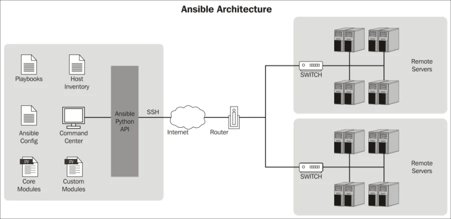
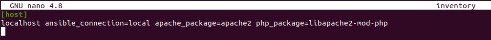
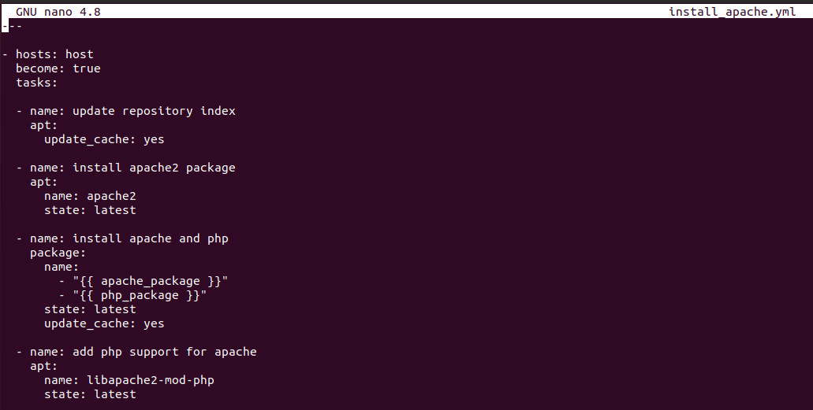
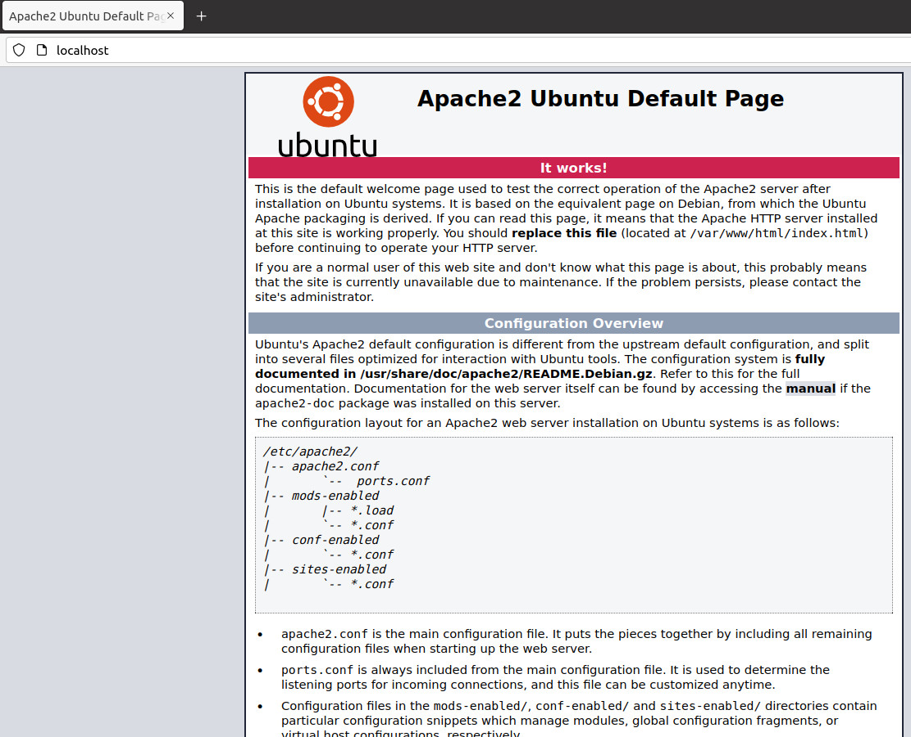
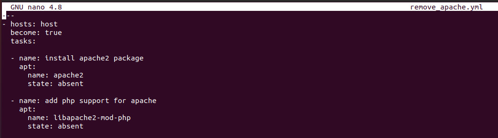
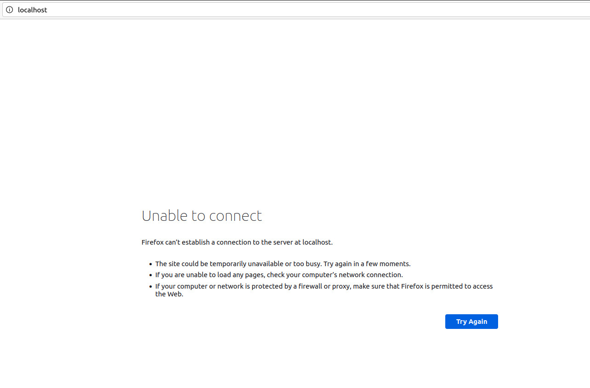

# PLAYBOOK

---

# **Table of Contents:**

## [I. Overview](#**I.-OVERVIEW**)

- ### [A. Ansible](#**A.-`Ansible`**)

- ### [B. Playbook](#**B.-`Playbook`**)

## [II. Step-by-step](#III.-STEP-BY-STEP)

- ### [Install Ansible]
- ### [Create an inventory file with following contents:]
- ### [A. Install apache]
- ### [B. Remove apache]

## [III. References](#III.-REFERENCES)

# **I. OVERVIEW**:
## **A. Ansible**: 
### **1. Ansible :**

- Ansible is a automation tool that allows you to create groups of machines, describe how these machines should be configured or what actions should be taken on them.
- Ansible issues all commands from a central location to perform these tasks.
- Ansible work on push mode over ssh connection.

### **2. Principles of Ansible:**


### **3. How Ansible Works?:**



### **4. Ansible Terminology:**

● Controller Machine
● Configuration
● Inventory
● Ad-Hoc command
● Playbook & Task
● Module
● Role

## **B. Playbook**: 

- Playbooks are Ansible's configuration, deployment and orchestration language.
- At basic level, playbooks contain the tasks to manage configurations of and deployments to remote machines
- At the advanced level:
	+ Using to rolling updates services with zero downtime
	+ Delegation: perform a task on one host with reference to other hosts
- Playbook must have at least one play, and may have many plays.

# **III. STEP-BY-STEP**:

## 1. Install Ansible

```
$ sudo pip install ansible

```

## 2. Create an inventory file with following contents:

```
$ nano inventory
```


## **A. Install apache**

### 3. Writing Playbook:
- Create a playbook file named install_apache.yml with following contents:
```
$ nano install_apache.yml
```
 

### 4. Run playbook:
```
$ ansible-playbook --ask-become-pass -i inventory install_apache.yml
```
 

- Result:
 

## **B. Remove apache**:
### 3. Writing Playbook:
- Create a playbook file named uninstall_apache.yml with following contents:
```
$ nano remove_apache.yml
```
 

### 4. Run playbook:
```
$ ansible-playbook --ask-become-pass -i inventory remove_apache.yml
```
 

- Result:


# **IV. REFERENCES**:

- https://viblo.asia/p/phan-1-tim-hieu-ve-ansible-4dbZNxv85YM
- https://viblo.asia/p/phan-2-tim-hieu-ve-ansible-YWOZry8rKQ0
- Getting started with Ansible by Learn Linux TV


---
