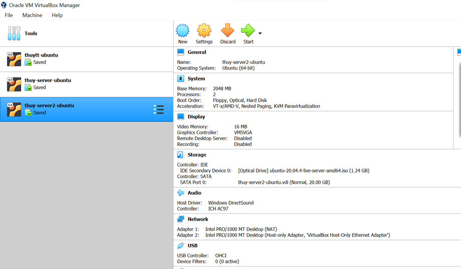
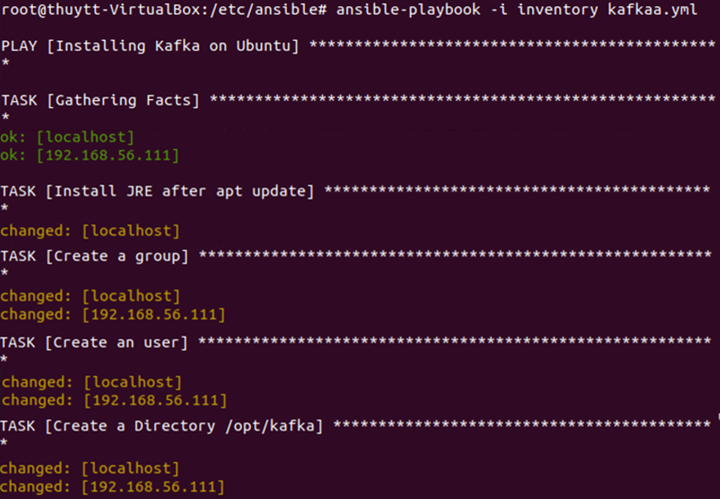
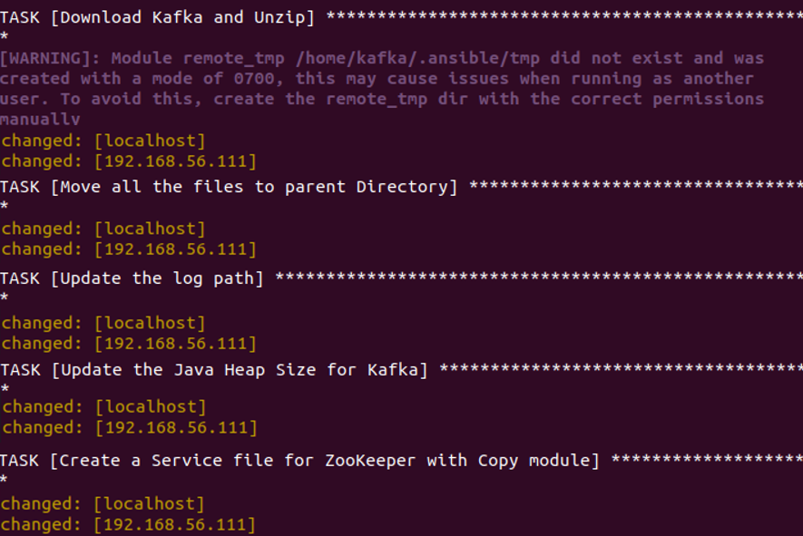

# **USE ANSIBLE TO INSTALL KAFKA ON UBUNTU**
Hi this is me trying to present how to write a playbook in ansible to install KAFKA on Ubuntu from the normal procedure
# Content
##### I/ Knowledge base

##### 1.1 Ansible
##### 1.1.1 Install ansible on ubuntu
##### 1.1.2 Ansible efficient architecture
##### 1.2 Kafka 
##### 1.3 Zookeeper

##### II/ Install and configure Kafka using ansible (step by step)

##### 2.1 Hardware requirement
##### 2.2 Install Ansible
##### 2.3 Inventory file
##### 2.4 Ping two hosts in group servers
##### 2.5 Ansible playbooks
##### 2.5.1 Module
##### 2.5.2 Name and variable
##### 2.5.3 Tasks

##### III/ Cheking the installation
##### IV/ Debug
##### V/ References

# **I/ Knowledge base**

## 1.1 Ansible
Ansible is an open-source software provisioning, configuration management, and application-deployment tool enabling infrastructure as code
.

In another simplified description, ansible connecting remotely using SSH to push the configuration from server to agents.

Ansible was created with the purposes: minimal, consistent, secure, highly reliable and easy to learn.

### 1.1.1 Install ansible on ubuntu

Guide to install ansible on Ubuntu version 20.04.

    $ sudo apt-get install software-properties-common

    $ sudo apt-add-repository -y ppa:ansible/ansible
 
    $ sudo apt-get install -y ansible

### 1.1.2 Ansible efficient architecture

Ansible works by connecting to your nodes and pushing out small programs, 
called **Ansible modules** to them. These programs are written to be resource
models of the desired state of the system. 
Ansible then _executes_ these modules (over `SSH` by default), 
and _removes_ them when finished.

 ## 1.2 Kafka
    
 Apache Kafka is an open-source distributed event streaming platform used by thousands of companies for high-performance data pipelines, streaming analytics, data integration, and mission-critical applications.
 
  

 Here are the three main functions Kafka will provide to users:

   Publish and subscribe to the streams of Record (data flow).
   
   The ability to store streams of record in order of created Record.
   
   The ability to handle stream of record in real time
 
 ##### *Why should we use Kafka?*
 
 _Benefits that make you consider using Kafka:_

- _*Expansion*_: Kafka's model allows your data to be distributed on multiple servers and help you expand the extended server when it is no longer suitable.

- _*Fast*_: With the processing of separating data streams, so the latency is very low, making speed faster.

- _*Error and durability*_: Your data packages can be copied and distributed on many different servers. Therefore, when an incident occurs, your data is less error and more durable.
 
 
   
 ## 1.3 Zookeeper
 
 Zookeeper is a top-level software developed by Apache that acts as a centralized service and is used to maintain naming and configuration data and to provide flexible and robust synchronization within distributed systems.
 
 
 
 #### Why is Zookeeper necessary for Apache Kafka?
 
 ##### *Controller election*
 
The controller is one of the most important broking entity in a Kafka ecosystem. 

If a node by some reason is shutting down, it’s the controller’s responsibility to tell all the replicas to act as partition leaders in order to fulfill the duties of the partition leaders on the node that is about to fail. So, whenever a node shuts down, a new controller can be elected and it can also be made sure that at any given time, there is only one controller and all the follower nodes have agreed on that.

##### *Configuration Of Topics*

The configuration regarding all the topics including the list of existing topics, the number of partitions for each topic, the location of all the replicas, etc.

##### *Access control lists*
Access control lists or ACLs for all the topics are also maintained within Zookeeper.

##### *Membership of the cluster*
Zookeeper also maintains a list of all the brokers that are functioning at any given moment and are a part of the cluster.
 
 _Note:  you can’t run Kafka services without first installing Zookeeper. However, Zookeeper is already installed and configured for your CloudKarafka cluster._
 
 # 2. Install and configure Kafka using ansible (step by step)
 
## 2.1 Hardware requirement
 
 In this project, I'm gonna install kafka on two virtual machines running on ubuntu 20.04 LTS servers
 
Software using: Virtual Box

System :
    Base memory: 2048MB 
    Processors: 2 core
    
Network:
    NAT 
    Host-only 
    
One VM is used as a local machine and another has IP as: 198.162.56.111

   

## 2.2 Install Ansible

Using the following command:

    $ sudo apt-get install software-properties-common

    $ sudo apt-add-repository -y ppa:ansible/ansible
 
    $ sudo apt-get install -y ansible
    
## 2.3 Inventory file

I created the inventory file as below:
       
       $ cd /etc/ansible
       $ vim inventory
       [servers]
       localhost ansible_connection=local
       198.162.56.111 ansible_ssh_user=root ansible_ssh_pass=1
       
## 2.4 Ping two hosts in group servers

   

## 2.5 Ansible playbook

### 2.5.1 Modules 
There are some modules that I use in this playbook

•	apt – to install packages in ubuntu

•	group – to create a user group

•	user – to create a user

•	file – to create installation directory

•	unarchive – to download and extract the zip distribution of Kafka

•	shell – to move files to the right directory before starting a service

•	lineinfile – to update the heapsize

•	copy – to create a service file in /etc/systemd

•	systemd – to enable and start the services

•	wait_for – to validate if Kafka and Zookeeper is up and running and the port is open

### 2.5.2 Name and variables
  Create the playbook which was written in yaml.
  
      $vim kafkaa.yml
  
  Let start with the beginning of playbook.
  
     ---
     - name: Installing Kafka on Ubuntu
       hosts: servers
       vars: 
          - installation_dir : /opt/kafka

The installation direction was used as a variable and the playbook apply for all machine in group _servers_

### 2.5.3 Task
#### Step 1: Install Java 

The Kafka is written on Java and Scala and also required jre 1.7 and above to run it

_1.1 Update and upgrade packages_
 
 Normal command:
              
    $ sudo apt-get update

 Convert to ansible-playbook task:

    - name: Update and upgrade apt packages
      become: true
      apt:
        upgrade: yes
        update_cache: yes
        cache_valid_time: 86400 #about one day

_1.2 Install JRE after apt update_
Normal Command: 
      
    $sudo apt-get install default-jre

Convert to to ansible-playbook task:

    tasks:
        - name: Install JRE after apt update
          become: yes
          apt:
            name: 
              - default-jre
            state: present
            update_cache: yes
        
#### Step 2: Create a service user for kafka

As Kafka is a network application so create a non-root sudo use for Kafka minimizes the risk for machine system.

##### 2.1 Create a group user
Command:
    
    $ sudo groupadd kafka 
    
Convert to to ansible-playbook task:

    - name: Create a group 
          become: yes
          group:
            name: kafka
            state: present

##### 2.2 Create user name kafka and add to group 

Command

    $ sudo adduser kafka
    $ sudo adduser kafka sudo

Convert to to ansible-playbook task:

    - name: Create an user 
      become: yes
      user:
        name: kafka
        state: present
        group: kafka

#### Step 3: Download Apache Kafka

Command

    $ mkdir /opt/kafka
    
Convert to to ansible-playbook task:

    - name: Create a Directory /opt/kafka
      become: yes
      file:
        path: "{{installation_dir}}"
        state: directory
        mode: 0755
        owner: kafka
        group: kafka
  
        
You need to download the Kafka binaries using Curl

    $ curl "https://downloads.apache.org/kafka/2.6.2/kafka_2.13-2.6.2.tgz" -o /opt/kafka

    $ tar -xvzf ~/Downloads/kafka.tgz --strip 1
–strip 1 is used to ensure that the archived data is extracted in ~/kafka/.
   
Convert to to ansible-playbook task:   
   
    - name: Download Kafka and Unzip 
          become: yes
          become_user: kafka
          unarchive:
            src: https://dlcdn.apache.org/kafka/3.1.0/kafka_2.13-3.1.0.tgz
            dest: "{{installation_dir}}"
            mode: 0755
            remote_src: yes

    - name: Move all the files to parent Directory
      become: yes
      become_user: kafka
      shell:
        mv {{installation_dir}}/kafka_*/* {{installation_dir}}/.

#### Step 4: Configuring Kafka Server

The default behavior of Kafka prevents you from deleting a topic. Messages can be published to a Kafka topic, which is a category, group, or feed name. You must edit the configuration file to change this.
The server.properties file specifies Kafka’s configuration options.

Command

    $ vim ~/kafka/config/server.properties
    
Add a setting that allows us to delete Kafka topics first. Add the following to the file’s bottom:
    
    delete.topic.enable = true

Now change the directory for storing logs:

    log.dirs=/home/kafka/logs

Now you need to Save and Close the file. 
Convert to to ansible-playbook task:
   
    - name: Update the log path
      become: yes
      become_user: kafka
      replace:
        path: "{{installation_dir}}/config/server.properties"
        regexp: 'log.dirs=(.+)'
        replace: 'log.dirs={{installation_dir}}/logs'
        backup: yes

    - name: Update the Java Heap Size for Kafka
      become: yes
      become_user: kafka
      replace:
        path: "{{installation_dir}}/bin/kafka-server-start.sh"
        regexp: 'export KAFKA_HEAP_OPTS=(".+")'
        replace: 'export KAFKA_HEAP_OPTS="-Xmx520M -Xms520M"'
        backup: yes
    
#### Step 5: Setting Up Kafka Systemd Unit Files

In this step, you need to create systemd unit files for the Kafka and Zookeeper service. This will help to manage Kafka services to start/stop using the systemctl command.
##### 5.1 Systemd unit files for Zookeeper
Create systemd unit file for Zookeeper with below command:

       $ sudo vim/etc/systemd/system/zookeeper.service

Next, you need to add the below content:
      
    [Unit]      
     Requires=network.target remote-fs.target
     After=network.target remote-fs.target    
    [Service]
    Type=simple
    User=kafka
    ExecStart=/home/kafka/kafka/bin/zookeeper-server-start.sh /home/kafka/kafka/config/zookeeper.properties
    ExecStop=/home/kafka/kafka/bin/zookeeper-server-stop.sh
    Restart=on-abnormal
    
    [Install]
    WantedBy=multi-user.target
    Convert to yml form
        - name: Create a Service file for ZooKeeper with Copy module
          become: yes
          copy:
            dest: /etc/systemd/system/zookeeper.service
            content: |
              [Unit]
              Requires=network.target remote-fs.target
              After=network.target remote-fs.target
    
              [Service]
              Type=simple
              User=kafka
              ExecStart={{installation_dir}}/bin/zookeeper-server-start.sh {{installation_dir}}/config/zookeeper.properties
              ExecStop={{installation_dir}}/bin/zookeeper-server-stop.sh
              Restart=on-abnormal
    
              [Install]
              WantedBy=multi-user.target
            mode: 0755

Save this file and then close it.
 
 Convert to playbook:
 
     - name: Create a Service file for ZooKeeper with Copy module
          become: yes
          copy:
            dest: /etc/systemd/system/zookeeper.service
            content: |
              [Unit]
              Requires=network.target remote-fs.target
              After=network.target remote-fs.target
              [Service]
              Type=simple
              User=kafka
              ExecStart={{installation_dir}}/bin/zookeeper-server-start.sh {{installation_dir}}/config/zookeeper.properties
              ExecStop={{installation_dir}}/bin/zookeeper-server-stop.sh
              Restart=on-abnormal
              [Install]
              WantedBy=multi-user.target
            mode: 0755
      
 ##### 5.2  Systemd unit files for Kafka
 Then you need to create a Kafka systemd unit file using the following command snippet:

    $ sudo vim /etc/systemd/system/kafka.service

Now, you need to enter the following unit definition into the file:
    
    [Unit]
    Requires=zookeeper.service
    After=zookeeper.service
    
    [Service]
    Type=simple
    User=kafka
    ExecStart=/bin/sh -c '/home/kafka/kafka/bin/kafka-server-start.sh /home/kafka/kafka/config/server.properties > /home/kafka/kafka/kafka.log 2>&1'
    ExecStop=/home/kafka/kafka/bin/kafka-server-stop.sh
    Restart=on-abnormal
    
    [Install]
    WantedBy=multi-user.target
This unit file is dependent on zookeeper.service, as specified in the [Unit] section. 
This will ensure that zookeeper is started when the Kafka service is launched.

The [Service] line specifies that systemd should start and stop the service using the kafka-server-start.sh and Kafka-server-stop.sh shell files.
 
 It also indicates that if Kafka exits abnormally, it should be restarted.
 
 Convert to to ansible-playbook task:
      
    - name: Create a Service file for Kafka with Copy module
      become: yes
      copy:
        dest: /etc/systemd/system/kafka.service
        content: |
          [Unit]
          Requires=zookeeper.service
          After=zookeeper.service

          [Service]
          Type=simple
          User=kafka
          ExecStart=/bin/sh -c '{{installation_dir}}/bin/kafka-server-start.sh {{installation_dir}}/config/server.properties > {{installation_dir}}/kafkaservice.log 2>&1'
          ExecStop={{installation_dir}}/bin/kafka-server-stop.sh
          Restart=on-abnormal

          [Install]
          WantedBy=multi-user.target
 
       mode: 0755

### Step 6: Start Kafka
After you’ve defined the units, use the following command to start Kafka:
    
    $ sudo systemctl start kafka
    $ sudo systemctl enable zookeeper
    $ sudo systemctl enable kafka

Convert to to ansible-playbook task:

    - name: Start Services
      tags: startservices
      become: yes
      systemd:
        name: '{{item}}'
        state: started
        enabled: yes
      with_items:
        - "kafka"
        - "zookeeper"
        
#### Step 7: Testing installation

    - name: Validating if zookeeper is up and listening on port 2181
      wait_for:
        host: localhost
        port: 2181
        delay: 10
        timeout: 30
        state: started
        msg: "Zookeeper not seem to be running"

    - name: Validating if Kafka is up and listening on port 2181
      wait_for:
        host: localhost
        port: 9092
        delay: 10
        timeout: 30
        state: started
        msg: "Zookeeper not seem to be running"
#### Step 8: Run playbook
Command:
    
    $ ansible-playbook -i inventory kafkaa.yml

The example output as below:

 
 
   

## III. Checking the installation

Ok! That the end of installation. Now, Im gonna SSH into the server and check the status of Kafka and zookeeper
Check if kafka files are existed.
Command:

    $ cd /opt/kafka
    $ ls -rlt
    
The output example

 
   
  
Checking kafka and zookeeper status
Command:

    $netstat -anlp|grep -i 2181
    $netstat -anlp|grep -i 9092
  
The output  

 
   
   
    $ systemctl status kafka
    $ systemctl status zookeeper
    
The output

 
 
  
    

Also, I tried to create a new topic and publish/consume messages using the Kafka built-in scripts.
 
  
  
   

As you can see, it works fine

## IV. Debug
##### _Ansible provisioning ERROR! Using a SSH password instead of a key is not possible_

 

Solution: Config sshd.file to allow ssh root login

First let login as root user to make change the config file

    $ sudo su

    $ vim /etc/ssh/sshd_config
    
 Add the following lines to the config file:
 
    PermitRootLogin yes
    PasswordAuthentication yes
    
 Restart SSH service:
    
    $ sudo systemctl restart ssh
    
 ## V. References
 - [Ansible](https://docs.ansible.com/)
 - [Debug](https://stackoverflow.com/questions/42462435/ansible-provisioning-error-using-a-ssh-password-instead-of-a-key-is-not-possibl)
 - [Documentation for Ansible 2 (2.4)- Mentor Dong](https://github.com/HaManhDong/ansible/blob/master/ansible.md)
 - [Steps to Install Kafka on Ubuntu 20.04: 8 Easy Steps](https://hevodata.com/blog/how-to-install-kafka-on-ubuntu/)
