# Using Ansible to deploy Prometheus, Grafana and Node Exporter


Author: **Vo Minh Thien Long**

----        
## Table of contents     
[I. Prerequisites knowledge](#knowledge)
- [1. Ansible](#ansible)
- [2. Prometheus](#prometheus)
- [3. Node Exporter](#node-exporter)           
- [4. Grafana](#grafana)   

[II. Prerequisites system](#system)
- [1. Monitoring machine](#monitoring-machine)
- [2. Node machines](#node-machines)

[III. First set up](#setup)   
- [1. Install Ansible](#install-ansible)  
- [2. Configure Ansible](#configure-ansible)  
- [3. Create `host` inventory](#host-inventory)  
- [4. Create playbook](#create-playbook)  
- [5. Deploy](#deploy)

[IV. Applied Ansible Roles](#roles)
- [1. Overview](#roles-overview)
- [2. Ansible Galaxy](#ansible-galaxy)
- [3. Role `common`](#role-common)
- [4. Role `prometheus`](#role-prometheus)
- [5. Role `grafana`](#role-grafana)
- [6. Role `node-exporter`](#role-node-exporter)
- [7. Deploy](#roles-deploy)

[V. Applied `jinja2` template](#encountered-errors)
- [1. Overview](#jinja2-overview)
- [2. Role `common`](#jinja2-common)
- [3. Role `prometheus`](#jinja2-prometheus)
- [4. Role `grafana`](#jinja2-grafana)
- [5. Role `node-exporter`](#jinja2-node-exporter)
- [6. Deploy](#jinja2-deploy)

[VI. References](#references)

---- 

## I. Prerequisites knowledge 
<a name='knowledge'></a> 

### 1. Ansible
<a name='ansible'></a> 

#### 1.1. Overview

**Ansible** is an `open-source` software **provisioning**, **configuration 
management**, and **application-deployment** tool enabling 
**infrastructure as code**. 

- Original author: **Michael DeHaan**
- Developer(s): Ansible Community / Ansible Inc. / **Red Hat Inc** (since October 2015)
- Initial release: **February 20, 2012**
- Written in: **Python, PowerShell, Shell, Ruby**
- Operating system: **Linux, Unix-like, MacOS, Windows**

<div align="center">
  
</div>

<div align="center">
  <i>Ansible logo.</i>
</div>

#### 1.2. Architecture

Ansible works by connecting to your nodes and pushing out small programs, 
called **Ansible modules** to them. These programs are written to be resource
models of the desired state of the system. 
Ansible then _executes_ these modules (over `SSH` by default), 
and _removes_ them when finished.

<div align="center">
  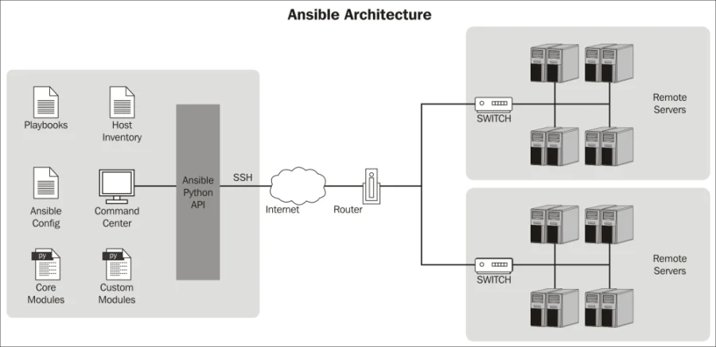
</div>

<div align="center">
  <i>Ansible architecture.</i>
</div>

#### 1.3. Glossary

**Modules**

- Modules are the units of work that Ansible ships out to remote machines.
- Modules can be implemented in any language, including Perl, Bash, Ruby or Python. 
- Modules just have to return JSON. 
- Once modules are executed on remote machines, they are removed, so no long running daemons are used. 


**Host**

- A host is simply a remote machine that Ansible manages. 
- They can have individual variables assigned to them, and can also be organized in groups. 

**Playbooks**

- Playbooks are the language by which Ansible **orchestrates**, **configures**, **administers**, or **deploys systems**. 

**Inventory**

- A file (by default, Ansible uses a simple **INI** format) that describes Hosts and Groups 
in Ansible. 
- Inventory can also be provided via an Inventory Script.

**Roles**

- Roles are units of organization in Ansible. 
- Assigning a role to a group of hosts. 
- A role may include applying certain variable values, certain tasks, and certain handlers. 

**Task**

- Playbooks exist to run tasks. 
- Tasks combine an action (a module and its arguments) with a name. 
- Handlers are also tasks, but they are a special kind of task that do not run unless they are notified by name when a task reports an underlying change on a remote system.

### 2. Prometheus
<a name='prometheus'></a> 

**Prometheus** is an` open-source` **systems monitoring** and **alerting toolkit**. Prometheus collects and 
stores its metrics as time series data, i.e. metrics information is stored with the 
timestamp at which it was recorded, alongside optional key-value pairs called labels.

<div align="center">
  
</div>

<div align="center">
  <i>Prometheus logo.</i>
</div>

### 3. Node Exporter
<a name='node-exporter'></a> 

**Node Exporter** is a _Prometheus Exporter_ can **fetch statistics** from an application in the format 
used by that system, **convert those statistics** into `metrics` that Prometheus can utilize, 
and then expose them on a Prometheus-friendly URL. 

**Node Exporter** measures multiples `metrics` such as:

|   <!-- -->  | <!-- -->                                 |                                                                          
|-------------|------------------------------------------|
| **Memory**  | RAM Total, RAM Used, RAM Cache, RAM Free |
| **Disk**    | Disk Space, IOPS, Mounts                 |
| **CPU**     | CPU Load, CPU Memory Disk                | 
| **Network** | Network traffic, TCP flow, Connections   |

### 4. Grafana
<a name='grafana'></a> 

**Grafana** is a _multi-platform_ `open source` **analytics** and **interactive visualization** web application.
It provides charts, graphs, and alerts for the web when connected to supported data sources. 

**Grafana** is divided into a _front end_ and _back end_, written in `TypeScript` and `Go`, respectively.

As a visualization tool, **Grafana** is a popular component in **monitoring stacks**, 
often used in combination with time series databases such as  `Prometheus` and other data sources. 

<div align="center">
  
</div>

<div align="center">
  <i>Grafana logo.</i>
</div>

## II. Prerequisites system
<a name='system'></a> 

In this practice, I will use my current Virtual machine as a Host machine for
monitoring 2 other ECs devices.

### 1. Monitoring machine
<a name='monitoring-machine'></a>

In this practice, I use **Ubuntu** `20.04` (LTS version **Focal**) in my virtual machine.
You can check my previous practice to know how to create a virtual machine by Parallels Desktop
for device with chip `ARM64`.

<div align="center">
  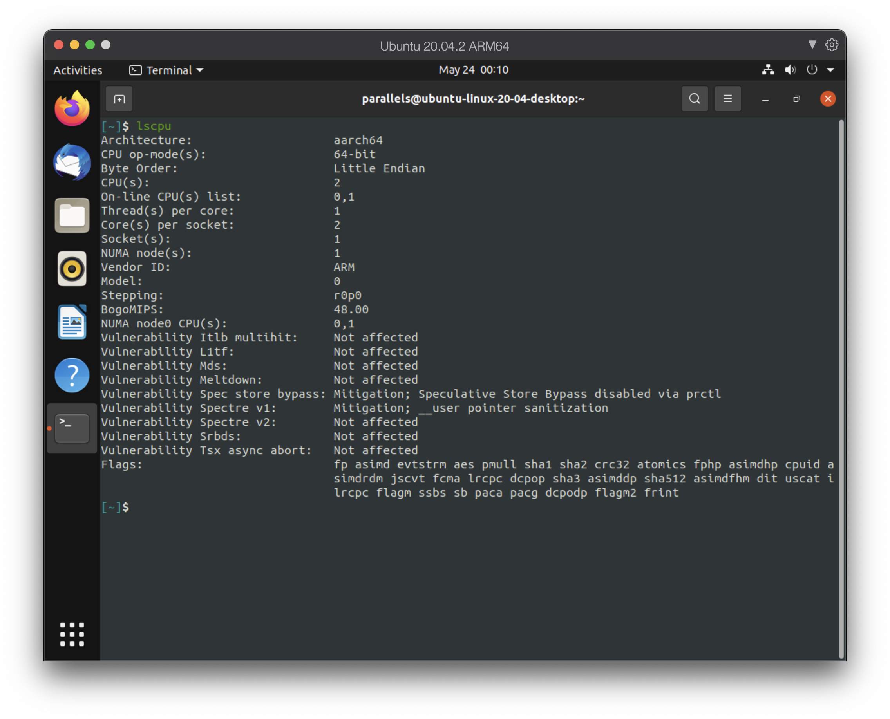
</div>

<div align="center">
  <i>Monitoring machine's system.</i>
</div>

### 2. Node machines
<a name='node-machines'></a> 

In this practice, I will create 2 virtual machines using **EC2** (Elastic Compute Cloud) 
of **AWS** (Amazon Web Services). They also use **Ubuntu** `20.04`, similar to our
host machine.

Because this practice is not related to using **EC2** or **AWS**, so I won't talk about how
to do it here. But of course you can check this 
[article](https://medium.com/nerd-for-tech/how-to-create-a-ubuntu-20-04-server-on-aws-ec2-elastic-cloud-computing-5b423b5bf635) 
to know how to create **EC2** instances.

<div align="center">
  
</div>

<div align="center">
  <i>EC2 logo.</i>
</div>

And because we will need to get the `node_exporter` **metrics** from port `9100`, so ypu need
to change the **Inbound rules** to allow access our **EC2** instances in port `9100`. By default,
it only allows traffic to port `22` - for **SSH**.

Here is the [article](https://docs.aws.amazon.com/AWSEC2/latest/UserGuide/authorizing-access-to-an-instance.html) where you can find how to change the **Inbound rules** for **EC2** instance.

Then I will use **SSH** to connect with my 2 instances to check.

<div align="center">
  
</div>

<div align="center">
  <i>Node machine's system 1.</i>
</div>

<div align="center">
  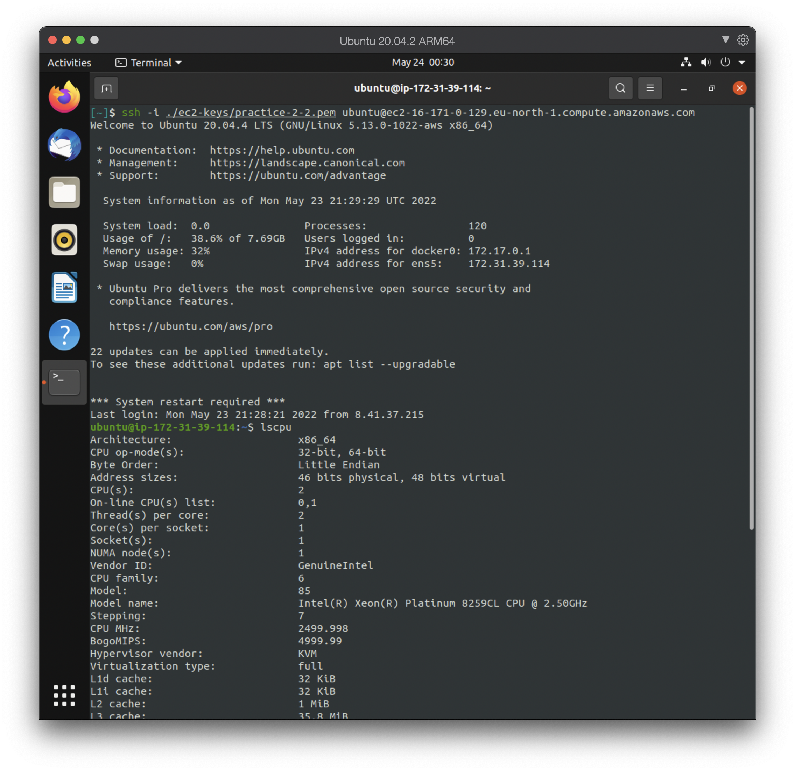
</div>

<div align="center">
  <i>Node machine's system 2.</i>
</div>

**Note:** I only have 3 notes for you.
- You can install `.pem` **only 1 time**, so please keep it in a safe place.
- I didn't include my `.pem` file in this repository for security reason, so when you want to
run my Ansible project, you have to create your all instances.
- Don't forget to change the **Inbound rules**, if you don't later you will not able to
get the `node_exporter` metrics.


<a name='references'></a>

## III. First set up
<a name='setup'></a> 

### 1. Install Ansible
<a name='install-ansible'></a>

First, refresh your system’s package index with:
```shell
sudo apt update
```

Then we install `software-properties-common`. This software provides an abstraction of 
the used **apt repositories**. It allows you to easily _manage_ your distribution and _independent_ 
software vendor software sources.

```shell
sudo apt install software-properties-common
```

Then we use `add-apt-repository` to add the **Ubuntu PPA** (Personal Package Archive):
```shell
sudo add-apt-repository --yes --update ppa:ansible/ansible
```

Finally, you can install the Ansible software with:
```shell
sudo apt install ansible
```

### 2. Configure Ansible
<a name='configure-ansible'></a>

I will create a `ansible.cfg` file in our current working directory (`./ansible.cfg`). Our
Ansible configuration file uses **INI** format.

By default, using `ansible.cfg` in working directory has the **second-highest priority** 
in searching order, just after using environment variable `ANSIBLE_CONFIG`. In my opinion, 
using `./ansible.cfg` is the easiest way to set up the configuration for each project independently.
This is also **recommended** by Ansible to avoid _security rinks_.

Final configuration in `./ansible.cfg`:

```ini
[defaults]
host_key_checking = False
interpreter_python = /usr/bin/python3
```

- `[defaults]` is the section that we want to configurate.
- Setting `host_key_checking` to **False** to avoid _host key checking_ by the underlying tools 
Ansible uses to connect to the host. This will prevent some unexpected problems when we use 
**SSH** connection with private key files.

- `interpreter_python` uses to set up the path to the Python interpreter. By default, it will `auto` 
find the path, but it may lead to some wrong path, or some path that is **deprecated**, and will _not be
supported_ in later version of Ansible.

  
### 3. Create `host` inventory
<a name='host-inventory'></a>

In this inventory, I will divide into 2 groups: `monitor` and `nodes`.

**1/ Monitoring:** Our control machine - `monitor`.

In here I will set the control host is `localhost` - which is the name of our control machine.

And the connection type `ansible_connection` to the host I will set it to `local`. The `local`
connection is the non-SSH connection type used to deploy the playbook to the control 
machine itself.

```ini
[monitor]
localhost ansible_connection=local
```

**2/ Node:** Our 2 EC2 instance - `nodes`.

Our 2 remote hosts are:

- ec2-13-51-200-49.eu-north-1.compute.amazonaws.com
- ec2-16-171-0-129.eu-north-1.compute.amazonaws.com

The `ansible_ssh_user` is the **SSH** username to use - which by default of EC2 is **ubuntu**.

And the `ansible_ssh_private_key_file` is the path to the private key file used by **SSH**. In this practice,
this is 2 file **practice-2-1.pem** and **practice-2-1.pem**.
  
```ini
[nodes]
ec2-13-51-200-49.eu-north-1.compute.amazonaws.com ansible_user=ubuntu ansible_ssh_private_key_file=./practice-2-1.pem
ec2-16-171-0-129.eu-north-1.compute.amazonaws.com ansible_user=ubuntu ansible_ssh_private_key_file=./practice-2-2.pem
```

Final inventory in `./host`:

```ini
[monitor]
localhost ansible_connection=local

[nodes]
ec2-13-51-200-49.eu-north-1.compute.amazonaws.com ansible_ssh_user=ubuntu ansible_ssh_private_key_file=./practice-2-1.pem
ec2-16-171-0-129.eu-north-1.compute.amazonaws.com ansible_ssh_user=ubuntu ansible_ssh_private_key_file=./practice-2-2.pem
```

### 4. Create playbook
<a name='create-playbook'></a>

Before creating the playbook, we need to come up with our deployment plan:

1/ Install **Docker** for all groups.

2/ Install **Prometheus** (using Docker) for `monitor`.

3/ Install **Grafana** (using Docker) for `monitor`.

4/ Install **Node Exporter** (using Docker) for `nodes`.

**Note:** Because we need to install a lot of packages, so for every task we will set
`become: yes` in order to execute tasks with _root privileges_.

---

Now, we will create tasks for each of those:

#### 4.1. Install Docker

Because these task will apply for all group, so I will set `host: all`.

First, install `aptitude`a tool for interfacing with the Linux package manager, and installing the required system packages. 

We will use module `apt` - an **idempotent** module, which is an Ansible module to
manage _apt_ package:
- `name` is the package name (it can be a list, but here we only have **aptitude**).
- `state` the desired package state, and **latest** ensures that the latest version is installed. 
- `update_cache` set to **true** to run `apt-get update` before the operation.


```yaml
- name: Install aptitude
  apt:
    name: aptitude
    state: latest
    update_cache: true
```

Next, we will use `apt` again to install required system packages. In this task,
we will use `name` as the list of package names.

```yaml
- name: Install required system packages
  apt:
    name:
      - apt-transport-https
      - ca-certificates
      - curl
      - software-properties-common
      - python3-pip
      - virtualenv
      - python3-setuptools
    state: latest
    update_cache: true
```

The Docker GPG key is added to verify the download, the official repository is added as a new package source. 
To do this, we will use `apt_key`, a built-in Ansible module to add _apt_ key by `url` (URL to retrieve key). 

Difference from `apt` module, `state` parameter here is used to ensure the key is **present** 
(added).

```yaml
- name: Add Docker GPG apt Key
  apt_key:
    url: https://download.docker.com/linux/ubuntu/gpg
    state: present
```

Then we will install the latest version of Docker from the official repository. Because I am using
**Ubuntu** `20.04` - **Ubuntu Focal**, so will install the stable version `focal`.

```yaml
- name: Add Docker Repository
  apt_repository:
    repo: deb https://download.docker.com/linux/ubuntu focal stable
    state: present
```

We continue using `apt` to install `docker-ce`.

```yaml
- name: Update apt and install docker-ce
  apt:
    name: docker-ce
    state: latest
    update_cache: true
```

Finally, we will use `pip` to install the module for Python.

```yaml
- name: Install Docker Module for Python
  pip:
    name: docker
```

All the above tasks are **idempotent**.

#### 4.2. Install Prometheus

Because these task will apply for only `monitor` group, so I will set `host: monitor`.

First, use `docker_image` module to pull the image `prom/prometheus:latest`.
We use  `name` for the image name and `source` parameter to pull the image from a registry.
```yaml
- name: Pull Prometheus Docker image
  docker_image:
    name: prom/prometheus:latest
    source: pull
```

Then we create a `./prometheus.yml` file for **Prometheus** configuration. I am not going into detail with **Prometheus**, so I just
briefly explain:
- `scrape_interval`: we will get the `metrics` every 15 seconds.
- `job`: we have 2 jobs here `promethues` to monitor our **Prometheus** instance and  `node`
to monitor 2 EC2 instances.
- `targets`: is the place we can get the `metrics`.

```yaml
global:
  scrape_interval: 15s

scrape_configs:
- job_name: prometheus
  static_configs:
  - targets: 
    - localhost:9090
    
- job_name: node
  static_configs:
  - targets: 
    - ec2-13-51-200-49.eu-north-1.compute.amazonaws.com:9100
    - ec2-16-171-0-129.eu-north-1.compute.amazonaws.com:9100
```

Then we copy our `promethus.yml` file to temporary directory **/tmp** for later use. `copy` is a
built-in Ansible module, so it also is a **idempotent** module.

```yaml
- name: Copy prometheus.yml file to /tmp
  copy:
    src: prometheus.yml
    dest: /tmp
```

Finally, create and run the **Prometheus** container by `docker_container` module.
- `name` is the container name, here I set it is **prometheus**.
- `image` is the image name, which is our recent pulled image **prom/prometheus:latest**.
- `restart_policy` to set the container restart policy, equivalent with `restart_policy` in `docker-compose`.
- `volumes`  is list of volumes to mount within the container, here you only mount our **prometheus.yml** file.
- `ports` is list of volumes to mount within the container (here we use Prometheusdefault port `9090`).

```yaml
- name: Run Prometheus Docker image
  docker_container:
    name: prometheus
    image: prom/prometheus:latest
    restart_policy: unless-stopped
    volumes: /tmp/prometheus.yml:/etc/prometheus/prometheus.yml
    ports:
    - "9090:9090"
```

All the above tasks are **idempotent**.

#### 4.3. Install Grafana

Because these task will apply for only `monitor` group, so we can continue using `host: monitor`.

Pull Grafana image.

```yaml
- name: Pull Grafana Docker image
  docker_image:
    name: grafana/grafana-enterprise:latest 
    source: pull
```

Run the container Grafana.

```yaml
- name: Run Grafana Docker image
  docker_container:
    name: grafana
    image: grafana/grafana-enterprise:latest
    restart_policy: unless-stopped
    ports:
    - "3000:3000"
```

All the above tasks are **idempotent**.

#### 4.4. Install Node Exporter

Because these task will apply for only `nodes` group, so I will set `host: nodes`.

Pull Node Exporter image.

```yaml
- name: Pull Node Exporter Docker image
  docker_image:
    name: prom/node-exporter:latest
    source: pull
```

Run the container Node Exporter.

```yaml
- name: Run Node Exporter Docker image
  docker_container:
    name: node-exporter
    image: prom/node-exporter:latest
    restart_policy: unless-stopped
    ports: 
    - "9100:9100"
```

All the above tasks are **idempotent**.

### 5. Deploy
<a name='deploy'></a>

#### 5.1.  Using Ad-hoc command ping to all hosts

```shell
ansible -i hosts all -m ping
```

<div align="center">
  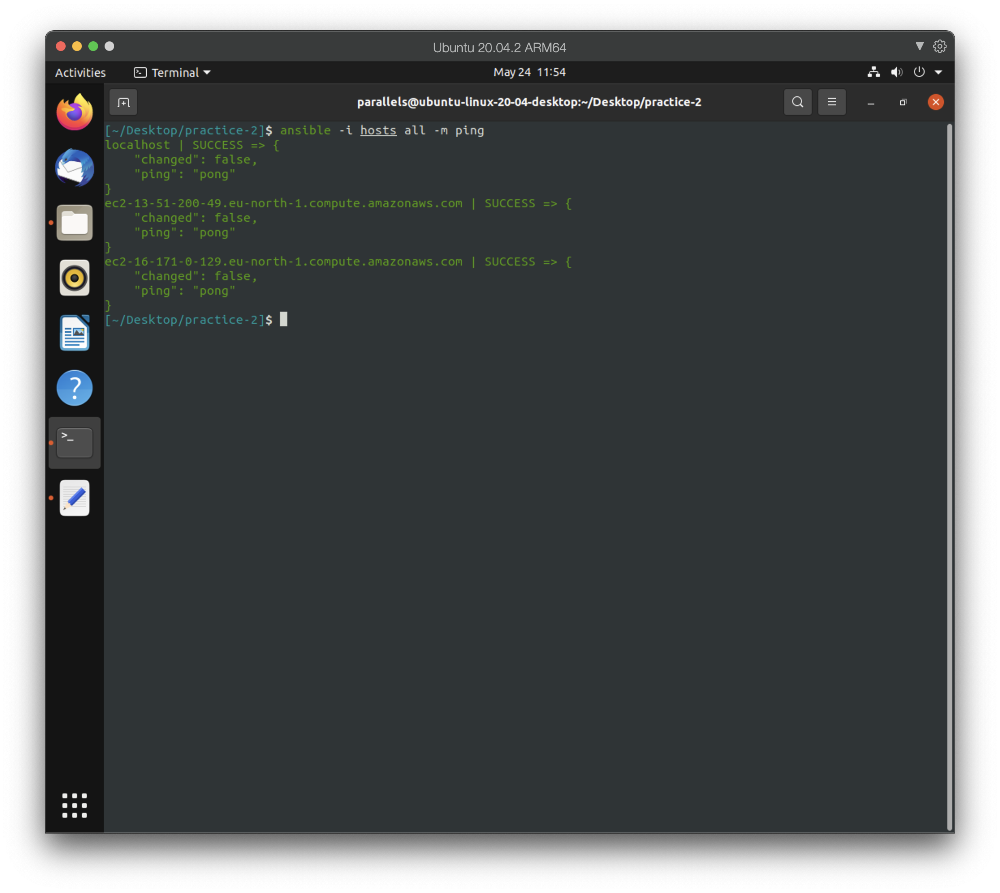
</div>

<div align="center">
  <i>Ad-hoc command ping.</i>
</div>

#### 5.2. Run our playbook

Here is our final `./playbook.yml` file:

```yaml
---
- hosts: all
  tasks:
  - name: Install aptitude
    apt:
      name: aptitude
      state: latest
      update_cache: true

  - name: Install required system packages
    apt:
      name:
        - apt-transport-https
        - ca-certificates
        - curl
        - software-properties-common
        - python3-pip
        - virtualenv
        - python3-setuptools
      state: latest
      update_cache: true

  - name: Add Docker GPG apt Key
    apt_key:
      url: https://download.docker.com/linux/ubuntu/gpg
      state: present

  - name: Add Docker Repository
    apt_repository:
      repo: deb https://download.docker.com/linux/ubuntu focal stable
      state: present

  - name: Update apt and install docker-ce
    apt:
      name: docker-ce
      state: latest
      update_cache: true

  - name: Install Docker Module for Python
    pip:
      name: docker
      
- hosts: monitor
  tasks:
  - name: Pull Prometheus Docker image
    docker_image:
      name: prom/prometheus:latest
      source: pull
    
  - name: Copy prometheus.yml file to /tmp
    copy:
      src: prometheus.yml
      dest: /tmp
    
  - name: Run Prometheus Docker image
    docker_container:
      name: prometheus
      image: prom/prometheus:latest
      restart_policy: unless-stopped
      volumes: /tmp/prometheus.yml:/etc/prometheus/prometheus.yml
      ports:
      - "9090:9090"

  - name: Pull Grafana Docker image
    docker_image:
      name: grafana/grafana-enterprise
      source: pull
    
  - name: Run Grafana Docker image
    docker_container:
      name: grafana
      image: grafana/grafana-enterprise
      restart_policy: unless-stopped
      ports:
      - "3000:3000"
    
- hosts: nodes
  tasks:
  - name: Pull Node Exporter Docker image
    docker_image:
      name: prom/node-exporter:latest
      source: pull
    
  - name: Run Node Exporter Docker image
    docker_container:
      name: node-exporter
      image: prom/node-exporter:latest
      restart_policy: unless-stopped
      ports: 
      - "9100:9100"
```

Run `playbook.yml` using the command:

```shell
ansible-playbook -i hosts  playbook.yml
```

<div align="center">
  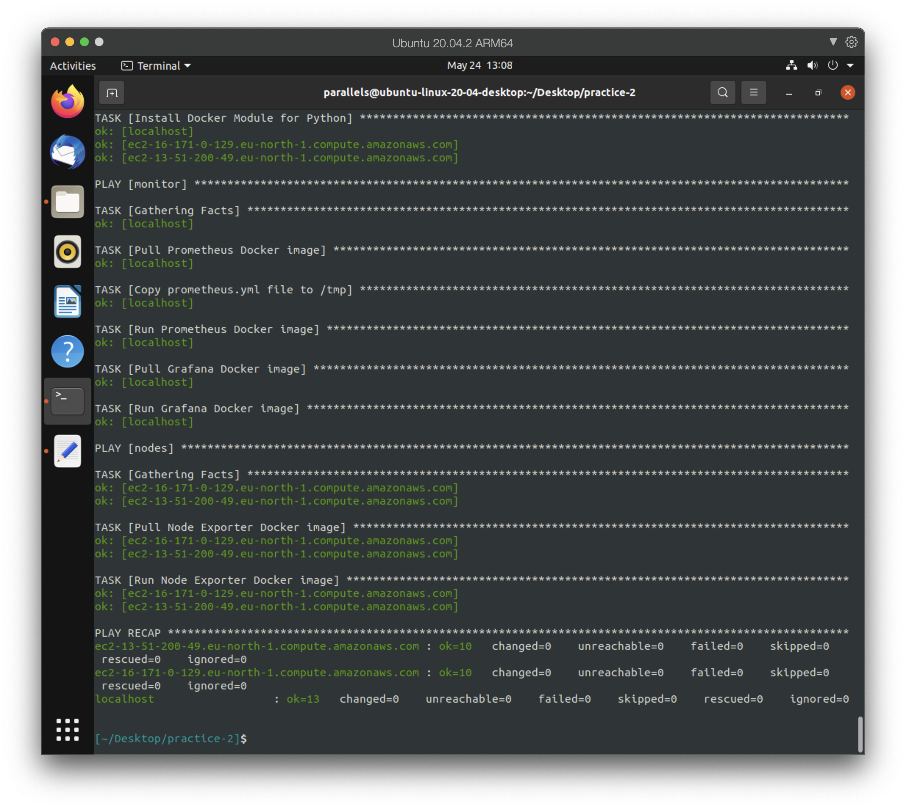
</div>

<div align="center">
  <i>Run Ansible playbook.</i>
</div>

#### 5.3. Using Prometheus

Go to URL: `localhost:9090` to use **Prometheus**. You can use this [website](https://prometheus.io/docs/introduction/overview/) to learn how to
use **Prometheus**.

<div align="center">
  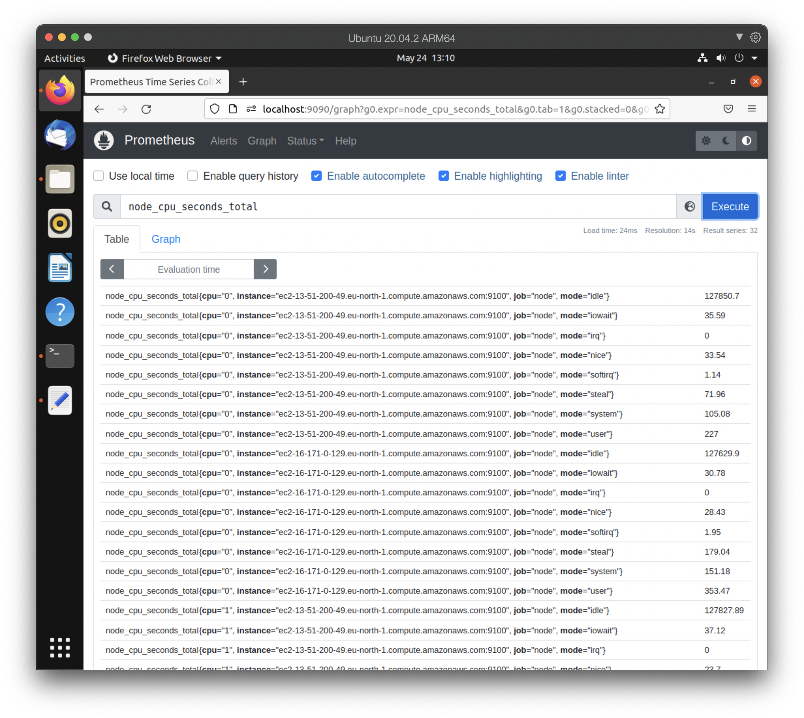
</div>

<div align="center">
  <i>Execute an expression in Prometheus.</i>
</div>

Go to `Status` > `Targets` to check status of the targets.

<div align="center">
  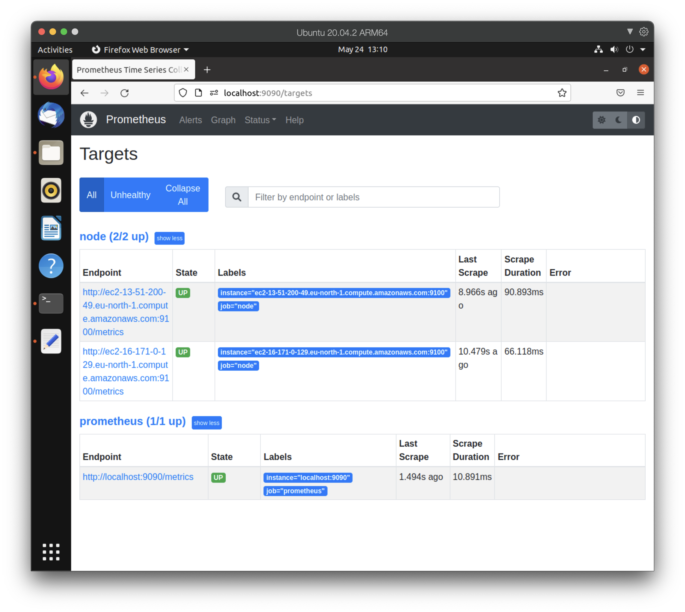
</div>

<div align="center">
  <i>Check targets status in Prometheus.</i>
</div>

#### 5.4. Using Grafana

Go to URL: `localhost:3000` to use **Grafana**. After that, login with default username `admin` and
default password `admin`. Then change it to your new password.

<div align="center">
  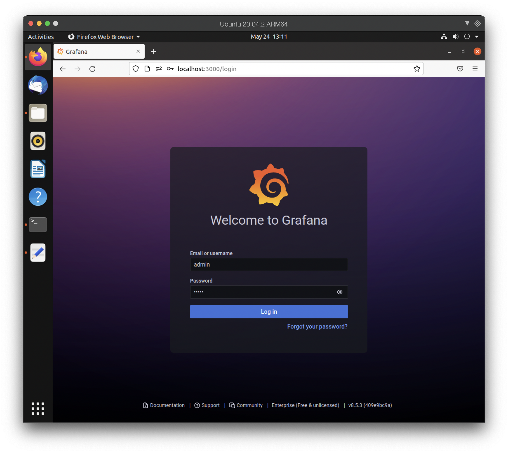
</div>

<div align="center">
  <i>Login and set new password.</i>
</div>

Then, add a **Prometheus** data source to **Grafana**. Check this [article](https://grafana.com/docs/grafana/latest/datasources/add-a-data-source/)
to know how to do it.

After adding **Data sources**, we will use dashboard [Node Exporter Full](https://grafana.com/grafana/dashboards/1860). You
can follow this [article](https://grafana.com/docs/grafana/latest/dashboards/export-import/) 
to know how to import a dashboard into **Grafana**.

<div align="center">
  
</div>

<div align="center">
  <i>Node Exporter dashboard for 13.51.200.49.</i>
</div>

<div align="center">
  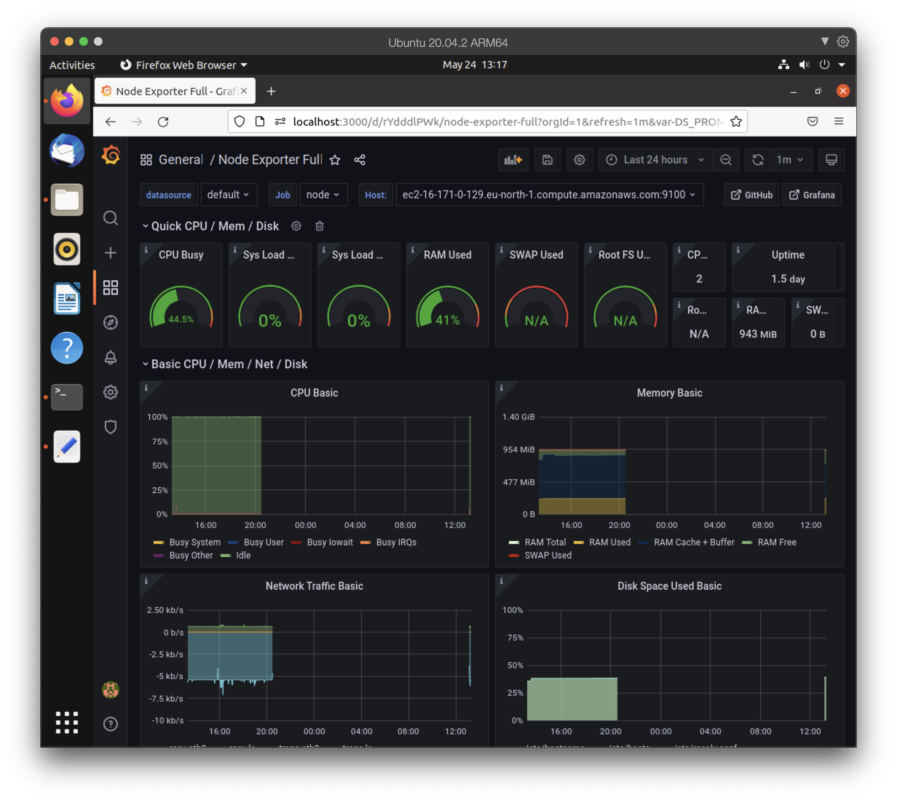
</div>

<div align="center">
  <i>Node Exporter for 16.171.0.129.</i>
</div>

## Applied Ansible Roles
<a name='roles'></a>

### 1. Overview
<a name='roles-overview'></a>

Although we successfully deploy, but using Ansible in this way isn't a good habit.
If you keep everything in a single playbook, when we want to add more task, or more group,
it will be very hard to manipulate.

**Ansible Roles** are a way to group multiple tasks together into one container to do the 
automation in very effective manner with clean directory structures.

- Allow you to break up the configurations.
- Can be easily reuse the code.
- Can be easily modify and will reduce the syntax errors.

### 2. Ansible Galaxy
<a name='ansible-galaxy'></a>

**Ansible Galaxy** is a utility which lets you generate role scaffolding. The concept of an Ansible role is simple; it is a group of **variables**, **tasks**, **files**, and **handlers** stored 
in a standardised file structure. The difficult part is to recall the directory structure, but there is help.

The `ansible-galaxy` command has a sub-command that will create a directory skeleton for our role.

```shell
ansible-galaxy init <ROLE_NAME>
```

Use this command, we will have a basic structure of a Role as below:

<div align="center">
  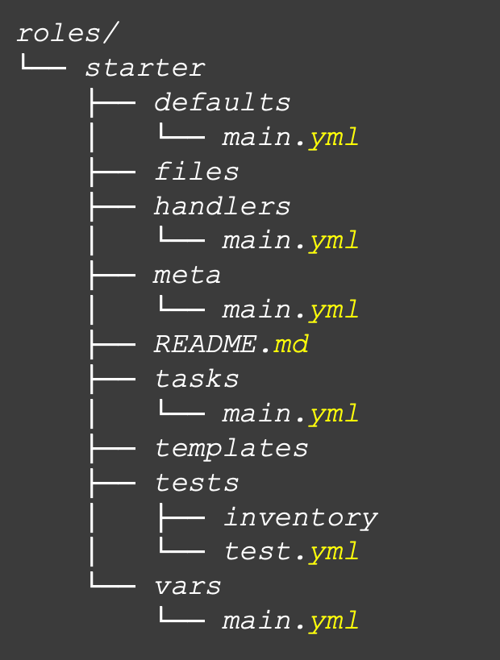
</div>

<div align="center">
  <i>Roles directory structure.</i>
</div>

- **defaults**: default properties/vars;
- **files**: static files to be copied to nodes;
- **handlers**: actions to take on events;
- **meta**: role meta data;
- **tasks**: action to take, using modules;
- **templates**: files generated dynamically;
- **tests**: ansible test;
- **vars**: role specific vars.

We will use a directory name `roles`, which contains all of our roles.

### 3. Role `common`
<a name='role-common'></a>

I defined `common` role is the role which 2 groups `monitor` and `nodes` use. This role
will install Docker for the machine.

```shell
ansible-galaxy init roles/common
```

Change the `roles/common/tasks/main.yml` to:

```yaml
---
- name: Install aptitude
  apt:
    name: aptitude
    state: latest
    update_cache: true

- name: Install required system packages
  apt:
    pkg:
      - apt-transport-https
      - ca-certificates
      - curl
      - software-properties-common
      - python3-pip
      - virtualenv
      - python3-setuptools
    state: latest
    update_cache: true

- name: Add Docker GPG apt Key
  apt_key:
    url: https://download.docker.com/linux/ubuntu/gpg
    state: present

- name: Add Docker Repository
  apt_repository:
    repo: deb https://download.docker.com/linux/ubuntu focal stable
    state: present

- name: Update apt and install docker-ce
  apt:
    name: docker-ce
    state: latest
    update_cache: true

- name: Install Docker Module for Python
  pip:
    name: docker
```

### 4. Role `prometheus`
<a name='role-prometheus'></a>

I defined `prometheus` role is the role group `monitor` uses to install **Prometheus** by Docker.


```shell
ansible-galaxy init roles/prometheus
```

Change the `roles/prometheus/tasks/main.yml` to:

```yaml
---
- name: Pull Prometheus Docker image
  docker_image:
    name: prom/prometheus:latest
    source: pull
    
- name: Copy prometheus.yml file to /tmp
  copy:
    src: prometheus.yml
    dest: /tmp
    
- name: Run Prometheus Docker image
  docker_container:
    name: prometheus
    image: prom/prometheus:latest
    restart_policy: unless-stopped
    volumes: /tmp/prometheus.yml:/etc/prometheus/prometheus.yml
    ports:
    - "9090:9090"
```

Then we insert the file `prometheus.yml` to path `roles/prometheus/files`. As I wrote in the above
section, `files` directory uses to store static file, in this case it its `prometheus.yml`.

When we use `copy` module, its source directory is `/files`.

### 5. Role `grafana`
<a name='role-grafana'></a>

I defined `grafana` role is the role group `monitor` uses to install **Grafana** by Docker.


```shell
ansible-galaxy init roles/grafana
```

Change the `roles/grafana/tasks/main.yml` to:

```yaml
---
- name: Pull Grafana Docker image
  docker_image:
    name: grafana/grafana-enterprise:latest
    source: pull
    
- name: Run Grafana Docker image
  docker_container:
    name: grafana
    image: grafana/grafana-enterprise:latest
    restart_policy: unless-stopped
    ports:
    - "3000:3000"
```

### 5. Role `node-exporter`
<a name='role-node-exporter'></a>

I defined `node-exporter` role is the role group `nodes` uses to install **Node Exporter** by Docker.


```shell
ansible-galaxy init roles/node-exporter
```

Change the `roles/node-exporter/tasks/main.yml` to:

```yaml
---
- name: Pull Node Exporter Docker image
  docker_image:
    name: prom/node-exporter:latest
    source: pull
    
- name: Run Node Exporter Docker image
  docker_container:
    name: node-exporter
    image: prom/node-exporter:latest
    restart_policy: unless-stopped
    ports: 
    - "9100:9100"
```

### 6. Deploy
<a name='roles-deploy'></a>

Change our `playbook.yml`, because now we are using roles here:

```yaml
- name: install docker
  hosts: all
  become: yes
  roles:
  - common

- name: install monitoring stack
  hosts: monitor
  become: yes
  roles:
  - prometheus
  - grafana

- name: install node-exporter
  hosts: nodes
  become: yes
  roles:
  - node-exporter
```

You can see that, I apply role `common` to all group, `grafana` with `prometheus` for `monitor`,
and `node-exporter` for `nodes`. 

**Note:** Please remember to assign them `become: yes`.

```yaml
---
- hosts: all
  tasks:
  - name: Install aptitude
    apt:
      name: aptitude
      state: latest
      update_cache: true

  - name: Install required system packages
    apt:
      name:
        - apt-transport-https
        - ca-certificates
        - curl
        - software-properties-common
        - python3-pip
        - virtualenv
        - python3-setuptools
      state: latest
      update_cache: true

  - name: Add Docker GPG apt Key
    apt_key:
      url: https://download.docker.com/linux/ubuntu/gpg
      state: present

  - name: Add Docker Repository
    apt_repository:
      repo: deb https://download.docker.com/linux/ubuntu focal stable
      state: present

  - name: Update apt and install docker-ce
    apt:
      name: docker-ce
      state: latest
      update_cache: true

  - name: Install Docker Module for Python
    pip:
      name: docker
      
- hosts: monitor
  tasks:
  - name: Pull Prometheus Docker image
    docker_image:
      name: prom/prometheus:latest
      source: pull
    
  - name: Copy prometheus.yml file to /tmp
    copy:
      src: prometheus.yml
      dest: /tmp
    
  - name: Run Prometheus Docker image
    docker_container:
      name: prometheus
      image: prom/prometheus:latest
      restart_policy: unless-stopped
      volumes: /tmp/prometheus.yml:/etc/prometheus/prometheus.yml
      ports:
      - "9090:9090"

  - name: Pull Grafana Docker image
    docker_image:
      name: grafana/grafana-enterprise
      source: pull
    
  - name: Run Grafana Docker image
    docker_container:
      name: grafana
      image: grafana/grafana-enterprise
      restart_policy: unless-stopped
      ports:
      - "3000:3000"
    
- hosts: nodes
  tasks:
  - name: Pull Node Exporter Docker image
    docker_image:
      name: prom/node-exporter:latest
      source: pull
    
  - name: Run Node Exporter Docker image
    docker_container:
      name: node-exporter
      image: prom/node-exporter:latest
      restart_policy: unless-stopped
      ports: 
      - "9100:9100"
```

Run `playbook.yml` using the command:

```shell
ansible-playbook -i hosts  playbook.yml
```

<div align="center">
  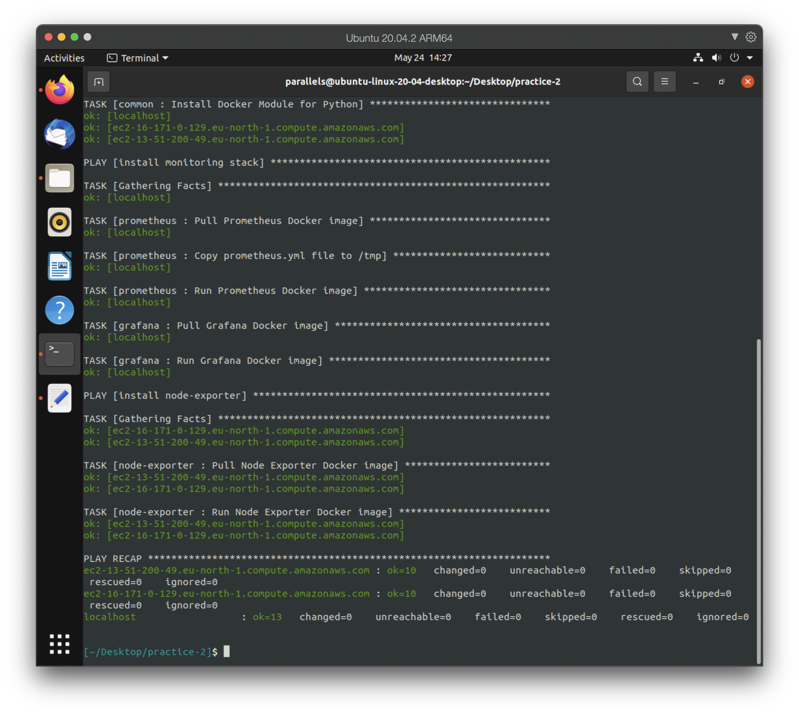
</div>

<div align="center">
  <i>Run Ansible playbook.</i>
</div>

Congratulation, you have successfully deployed our project using **Roles**. However, there are stil
a lot of other feature that we can use from **Roles**. We just only break them out into a smaller
filer for easy manipulate, but didn't use all the power of **Roles**.

Template is one of these (remember, just **one of these**, there still a lots). In Ansible,
we will use `jinja2` to format.  Let's move to the next section to apply `jinja2` template 
into our project.

## V. Applied `jinja2` template
<a name='jinja2'></a>


### 1. Overview
<a name='jinja2-overview'></a>

If we don't use templating, when you change a keyword, you have to change it
in every file that contains this keyword. For example, I want to change my OS from `linux` to
`mac`. So for every task that depend on OS, we have to change from `linux` to `mac`.


Ansible uses `jinja2` templating to enable` dynamic expressions` and access to **variables** and **facts**. 
You can use templating with the template module. For example, you can create a template for 
a configuration file, then deploy that configuration file to multiple environments and supply 
the correct data (IP address, hostname, version) for each environment.

### 2. Role `common`
<a name='jinja2-common'></a>

Now we are going to applied  `jinja2` to our `tasks/main.yml`:

```yaml
---
- name: Install aptitude
  apt:
    name: aptitude
    state: latest
    update_cache: true

- name: Install required system packages
  apt:
    pkg:
      - apt-transport-https
      - ca-certificates
      - curl
      - software-properties-common
      - python3-pip
      - virtualenv
      - python3-setuptools
    state: latest
    update_cache: true

- name: Add Docker GPG apt Key
  apt_key:
    url: https://download.docker.com/{{ os.name }}/{{ os.distro }}/gpg
    state: present

- name: Add Docker Repository 
  apt_repository:
    repo: deb https://download.docker.com/{{ os.name }}/{{ os.distro }} {{ os.version }} stable
    state: present

- name: Update apt and install docker-ce
  apt:
    name: docker-ce
    state: latest
    update_cache: true

- name: Install Docker Module for Python
  pip:
    name: docker
```

And set the value for it in `defaults/main.yml`:

```yaml
---
os:
 name: linux
 distro: ubuntu
 version: focal
```

Now, instead of hardcode the **operating system** in every place, you can be just simple change it
in `defaults/main.yml`.

### 3. Role `prometheus`
<a name='jinja2-prometheus'></a>

Because we use templating now, so instead of using `copy` module, we will use `template` module
to copy our `prometheus.yml` file to temporary directory `/tmp`.

Our new `tasks/main.yml`:

```yaml
---
- name: Pull Prometheus Docker image prom/prometheus:{{ version }}
  docker_image:
    name: prom/prometheus:{{ version }}
    source: pull
    
- name: Create file /tmp/prometheus.yml from template
  template:
    src: prometheus.yml.j2
    dest: /tmp/prometheus.yml
    
- name: Run Prometheus Docker image prom/prometheus:{{ version }}
  docker_container:
    name: prometheus
    image: prom/prometheus:{{ version }}
    restart_policy: unless-stopped
    volumes: /tmp/prometheus.yml:/etc/prometheus/prometheus.yml
    ports:
    - "9090:9090"
```

Then we will use `jinja2` to configurate `prometheus.yml`. I will create
a template file in `/templates/prometheus.yml.j2`:

```yaml
#jinja2: lstrip_blocks: "True"
---
global:
  scrape_interval: {{ scrape_interval }}

scrape_configs:
- job_name: prometheus
  static_configs:
  - targets:

    - {{ server }}:9090


- job_name: node
  static_configs:
  - targets:

    - {{ server }}:9100

```

`groups` is the default variable of Ansible Jinja2, which is the list of host in a specify host,
so we don't have to declare them. By using `group`, when we add more hosts to our `nodes` group,
it will automatically change the file `prometheus.yml`. We don't have to do anything.

We just have to set the value of `version` and 
`scrape_interval` in `defaults/main.yml`:

```yaml
---
version: latest
scrape_interval: 15s
```

### 4. Role `grafana`
<a name='jinja2-grafana'></a>

Applied  `jinja2` to our `tasks/main.yml`:

```yaml
---
- name: Pull Grafana Docker image grafana/grafana-enterprise:{{ version }}
  docker_image:
    name: grafana/grafana-enterprise:{{ version }}
    source: pull
    
- name: Run Grafana Docker image grafana/grafana-enterprise:{{ version }}
  docker_container:
    name: grafana
    image: grafana/grafana-enterprise:{{ version }}
    restart_policy: unless-stopped
    ports:
    - "3000:3000"
```

And set the value for it in `defaults/main.yml`:

```yaml
---
version: latest
```

### 5. Role `node-exporter`
<a name='jinja2-node-exporter'></a>

Applied  `jinja2` to our `tasks/main.yml`:

```yaml
---
- name: Pull Node Exporter Docker image prom/node-exporter:latest:{{ version }}
  docker_image:
    name: prom/node-exporter:{{ version }}
    source: pull
    
- name: Run Node Exporter Docker image prom/node-exporter:latest:{{ version }}
  docker_container:
    name: node-exporter
    image: prom/node-exporter:latest:{{ version }}
    restart_policy: unless-stopped
    ports: 
    - "9100:9100"
```

And set the value for it in `defaults/main.yml`:

```yaml
---
version: latest
```

### 6. Deploy
<a name='jinja2-deploy'></a>

Run `playbook.yml` using the command:

```shell
ansible-playbook -i hosts  playbook.yml
```

<div align="center">
  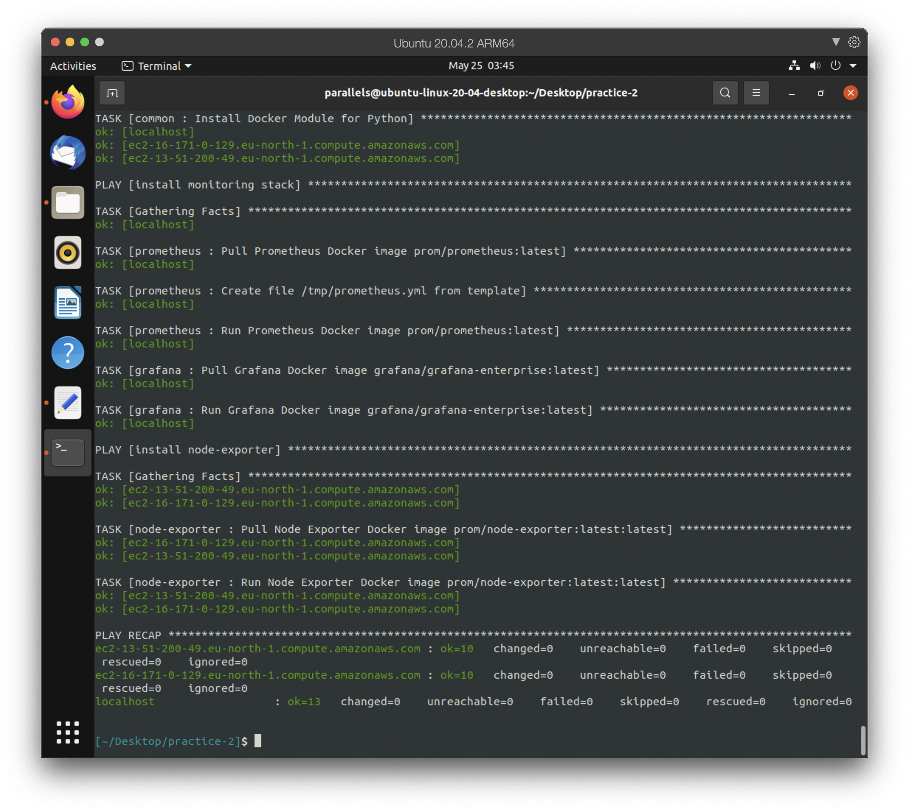
</div>

<div align="center">
  <i>Run Ansible playbook.</i>
</div>

We have successfully built an Ansible project to deploy Prometheus, Grafana and Node Exporter.
We have improved our project from a single long, hard-coding playbook into an easily manipulate
and extendable project.

We also applied templating into our project using `jinja2`. Our project now is better than before
alots.

## VI. References

[1] [Ansible website](https://www.ansible.com/)

[2] [Prometheus website](https://prometheus.io/)

[3] [Grafana website](https://grafana.com/)

[4] [Install Ansible](https://www.digitalocean.com/community/tutorials/how-to-install-and-configure-ansible-on-ubuntu-20-04)

[5] [Install Docker by Ansible](https://www.digitalocean.com/community/tutorials/how-to-use-ansible-to-install-and-set-up-docker-on-ubuntu-20-04)

[6] [Ansible Galaxy website](https://galaxy.ansible.com/)

[7] [Example Ansible](https://github.com/ansible/ansible-examples)
