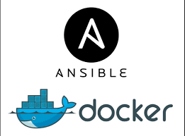
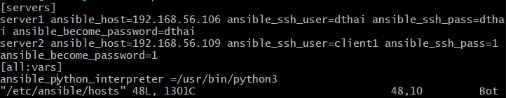
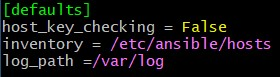
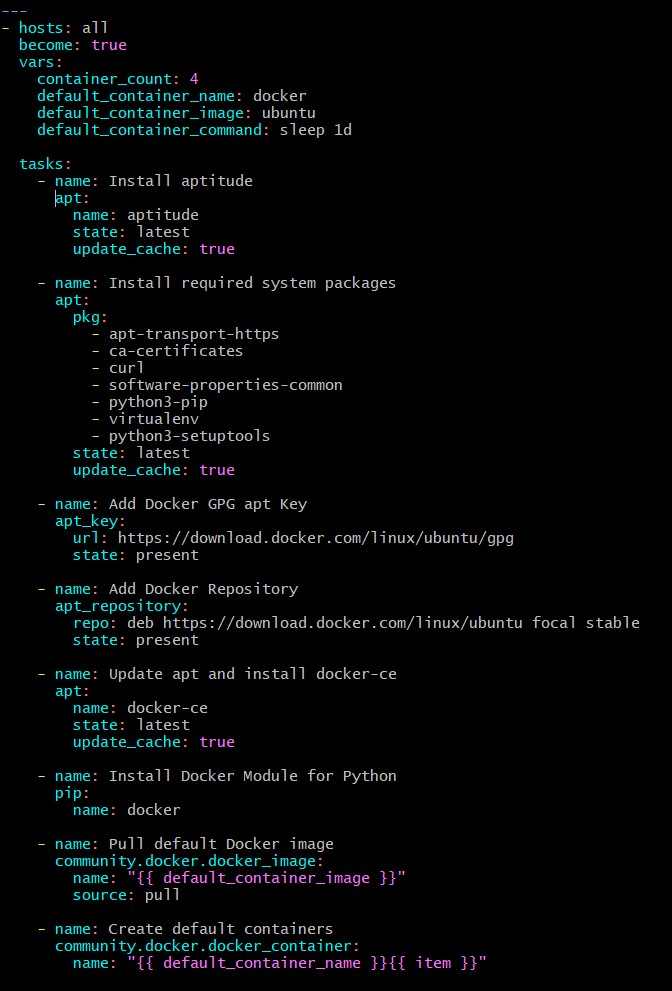
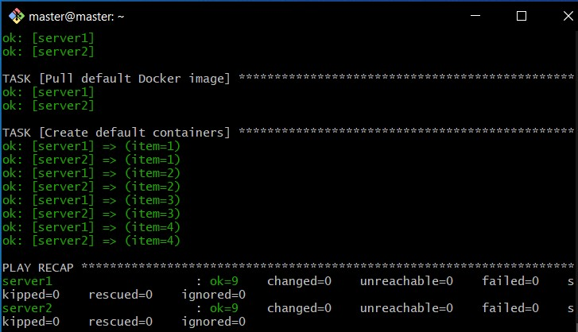
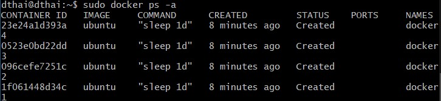

# **USE ANSIBLE TO INSTALL AND SETUP DOCKER**



> *Ansible cung cấp một kiến ​​trúc đơn giản không yêu cầu cài đặt phần mềm đặc biệt trên các nút. Nó cũng cung cấp một bộ tính năng mạnh mẽ và các mô-đun tích hợp giúp tạo điều kiện thuận lợi cho việc viết các tập lệnh tự động hóa.*

> *Docker là một ứng dụng giúp đơn giản hóa quá trình quản lý vùng chứa, các quá trình tách biệt tài nguyên hoạt động theo cách tương tự như máy ảo, nhưng di động hơn, thân thiện với tài nguyên hơn và phụ thuộc nhiều hơn vào hệ điều hành máy chủ.*
## **Table of Contents**
### [I.Prerequitsite](#**I.-Prerequitsite**#)
### [II.Step by step](#**II.-Stepbystep#)
- #### [1.Step 1 — Preparing your Playbook](#**step1**#)
- #### [2.Step 2 — Adding Packages Installation Tasks to your Playbook](#**step2**#)
- #### [3.Step 3 — Adding Docker Installation Tasks to your Playbook](#**step3**#)
- #### [4.Step 4 — Adding Docker Image and Container](#**step4**#) 
- #### [5.Step 5 — Reviewing your Complete Playbook](#**step5**#)
- #### [6.Step 6 — Running your Playbook](#**step6**#)
### [III. Debug](#**debug**#)
### [IV. Reference](#**Ref**#)

---

## **I.Prerequisite**
- **One Ansible control node:**  máy Ubuntu 20.04 được cài đặt và cấu hình Ansible để kết nối với các máy chủ Ansible bằng SSH keys
    - #### Step1: Installing `Ansible`

        ```
        sudo apt update
        sudo apt install ansible -y
        ```
    - #### Step2: Setting Up the Inventory File

        ```
        sudo vim /etc/ansible/hosts
        ```

        

    - #### Step3: Configure Ansible.cfg

        ```
        sudo vim Ansible.cfg
        ```

        

- **One or more Ansible Hosts:** một hoặc nhiều máy chủ Ubuntu 20.04 từ xa :
    - **server1** `192.168.56.106`
    - **server2** `192.168.56.109`
## **II. Step by step**
### **1.Step 1 — Preparing your Playbook**
File `playbook.yml` là nơi được xác định tất cả các `task` của bạn. `Task` là hành động nhỏ nhất mà bạn có thể tự động hóa bằng cách sử dụng `playbook Ansible`. Đầu tiên chúng ta tạo file playbook :

```
vim playbook.yml
```
*File `playbook.yml` bắt đầu:*
```
- hosts: all
  become: true
  vars:
    container_count: 4
    default_container_name: docker
    default_container_image: ubuntu
    default_container_command: sleep 1
```
Hầu hết các files `playbook.yml` sẽ bắt đầu bằng những khai báo tương tự như thế này. `hosts` khai báo máy chủ nào mà  Ansible sẽ điều khiển tiêu với `playbook` này. `become :true` tất cả các lệnh sẽ được thực hiện với các đặc quyền `root`.

`vars` cho phép bạn lưu trữ dữ liệu trong các biến. Nếu bạn quyết định thay đổi những điều này trong tương lai, bạn sẽ chỉ phải chỉnh sửa những dòng này trong file của mình. Dưới đây là giải thích ngắn gọn về từng biến:

- `container_count`: Số lượng container tạo.
- `default_container_name`: Tên container mặc định.
- `default_container_image`: Docker image mặc định được sử dụng khi tạo container.
- `default_container_command`: Lệnh mặc định để chạy trên container.
### **2.Step 2 — Adding Packages Installation Tasks to your Playbook**
Thêm các `tasks` đầu tiên của bạn là cài đặt `aptitude`, một công cụ để giao tiếp với trình quản lý gói Linux và cài đặt các gói hệ thống cần thiết. Ansible sẽ đảm bảo các gói này luôn được cài đặt trên máy chủ của bạn:

```
tasks:

    - name: Install aptitude
      apt:
        name: aptitude
        state: latest
        update_cache: true

    - name: Install required system packages
      apt:
        pkg:
          - apt-transport-https
          - ca-certificates
          - curl
          - software-properties-common
          - python3-pip
          - virtualenv
          - python3-setuptools
        state: latest
        update_cache: true
```

Tại đây, bạn đang sử dụng `apt` 1 *`module`* Ansible để hướng dẫn Ansible cài đặt các gói. Các *`module`* trong Ansible là các phím tắt để thực thi các hoạt động mà nếu không bạn sẽ phải chạy dưới dạng các lệnh `bash` thô.

### **3.Step 3 — Adding Docker Installation Tasks to your Playbook**
`tasks` của bạn sẽ cài đặt phiên bản Docker mới nhất từ ​​kho lưu trữ chính thức. `Docker GPG key` được thêm vào để xác minh tải xuống, `repository` chính thức được thêm làm `package source` mới và Docker sẽ được cài đặt. Ngoài ra, module `Docker` cho Python cũng sẽ được cài đặt:

```
- name: Add Docker GPG apt Key
      apt_key:
        url: https://download.docker.com/linux/ubuntu/gpg
        state: present

- name: Add Docker Repository
      apt_repository:
        repo: deb https://download.docker.com/linux/ubuntu focal stable
        state: present

- name: Update apt and install docker-ce
      apt:
        name: docker-ce
        state: latest
        update_cache: true

- name: Install Docker Module for Python
      pip:
        name: docker
```
Bạn sẽ thấy rằng các `module` Ansible tích hợp sẵn `apt_key` và `apt_repository` trước tiên được trỏ đến các URL, sau đó có nhiệm vụ đảm bảo chúng có mặt `state: present`. Điều này cho phép cài đặt phiên bản Docker mới nhất, cùng với việc sử dụng `pip` để cài đặt `module` cho Python.

### **4.Step 4 — Adding Docker Image and Container Tasks to your Playbook**
Việc tạo các `Docker containers` của bạn bắt đầu ở đây với việc `pull Docker image`. Theo mặc định, những `images` này đến từ `Docker Hub`. Sử dụng `images`, `containers` sẽ được tạo theo các thông số kỹ thuật là các `vars` được khai báo ở đầu của `playbook.yml` :

```
- name: Pull default Docker image
      community.docker.docker_image:
        name: "{{ default_container_image }}"
        source: pull

- name: Create default containers
      community.docker.docker_container:
        name: "{{ default_container_name }}{{ item }}"
        image: "{{ default_container_image }}"
        command: "{{ default_container_command }}"
        state: present
      with_sequence: count={{ container_count }}
```
- `docker_image` được sử dụng để `pull Docker image` mà bạn muốn sử dụng làm cơ sở cho `containers` của mình.

- `docker_container` cho phép bạn chỉ định các chi tiết cụ thể của `containers` mà bạn tạo, cùng với lệnh bạn muốn chuyển cho chúng.

- `with_sequence` là cách **Ansible** để tạo một vòng lặp và trong trường hợp này, nó sẽ lặp lại việc tạo `containers` của bạn theo số lượng bạn đã chỉ định. Đây là một vòng lặp đếm cơ bản, vì vậy biến `item` ở đây cung cấp một số thể hiện sự lặp lại của vòng lặp hiện tại. Số này được sử dụng ở đây để đặt tên cho `containers` của bạn.
### **5.Step 5 — Reviewing your Complete Playbook**
```
---
- hosts: all
  become: true
  vars:
    container_count: 4
    default_container_name: docker
    default_container_image: ubuntu
    default_container_command: sleep 1d

  tasks:
    - name: Install aptitude
      apt:
        name: aptitude
        state: latest
        update_cache: true

    - name: Install required system packages
      apt:
        pkg:
          - apt-transport-https
          - ca-certificates
          - curl
          - software-properties-common
          - python3-pip
          - virtualenv
          - python3-setuptools
        state: latest
        update_cache: true

    - name: Add Docker GPG apt Key
      apt_key:
        url: https://download.docker.com/linux/ubuntu/gpg
        state: present

    - name: Add Docker Repository
      apt_repository:
        repo: deb https://download.docker.com/linux/ubuntu focal stable
        state: present

    - name: Update apt and install docker-ce
      apt:
        name: docker-ce
        state: latest
        update_cache: true

    - name: Install Docker Module for Python
      pip:
        name: docker

    - name: Pull default Docker image
      community.docker.docker_image:
        name: "{{ default_container_image }}"
        source: pull

    - name: Create default containers
      community.docker.docker_container:
        name: "{{ default_container_name }}{{ item }}"
        image: "{{ default_container_image }}"
        command: "{{ default_container_command }}"
        state: present
      with_sequence: count={{ container_count }}

```
**`playbook.yml`** sau khi hoàn thiện sẽ có dạng như sau :
      
###  **6.Step 6 — Running your Playbook**
Để thực thi `playbook.yml` chỉ trên server1, kết nối với tư cách sammy, bạn có thể sử dụng lệnh sau:
```
ansible-playbook playbook.yml -l server1 -u master 
```
Với tất cả server chúng ta có:
```
ansible-playbook playbook.yml -u master 
```
Cờ `-l` chỉ định máy chủ của bạn và cờ `-u` chỉ định người dùng nào sẽ đăng nhập vào máy chủ từ xa. Bạn sẽ nhận được kết quả tương tự như sau:
    

**Note**
> Để biết thêm thông tin về cách chạy **`Ansible playbooks`**, bạn có thể tham khảo [**How to Use Ansible: A Reference Guide**](https://www.digitalocean.com/community/cheatsheets/how-to-use-ansible-cheat-sheet-guide) 


Đăng nhập vào máy chủ từ xa:
```
ssh dthai@192.168.56.109
```
Liệt kê các `Docker containers` đã tạo trên máy chủ từ xa:
```
sudo docker ps -a
```


## **III.Debug**
**`WARNING`**: IPv4 forwarding is disabled. Networking will not work.
>Giải pháp:
>Thêm vào files `/etc/sysctl.conf` dòng:
```
net.ipv4.ip_forward=1
```
>Hoặc thêm tasks vào `playbook`:
```
- name : Change IPv4 status
  lineinfile:
    dest: /etc/sysctl.conf
    line: "net.ipv4.ip_forward=1"
```
## **IV.Reference**
**https://www.digitalocean.com/community/tutorials/how-to-use-ansible-to-install-and-set-up-docker-on-ubuntu-20-04**