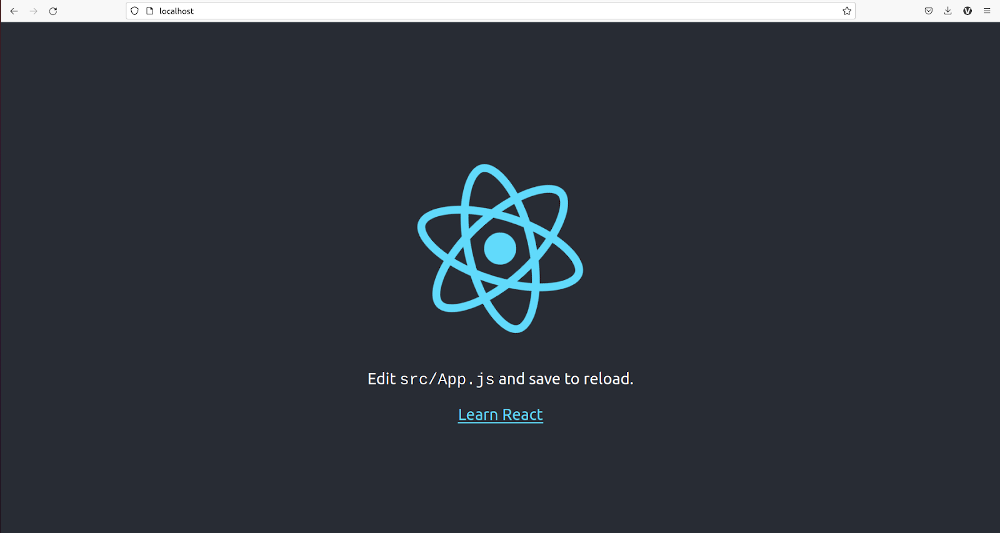
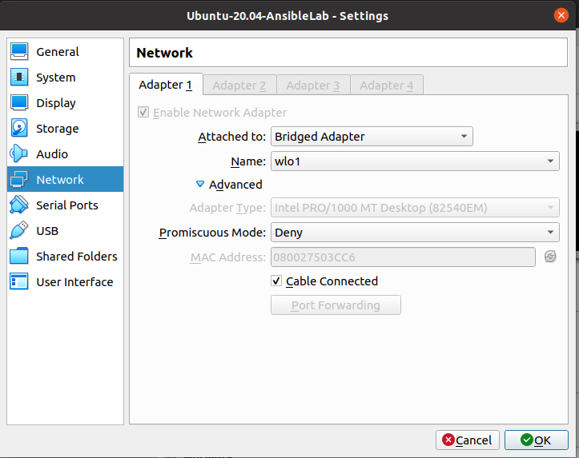
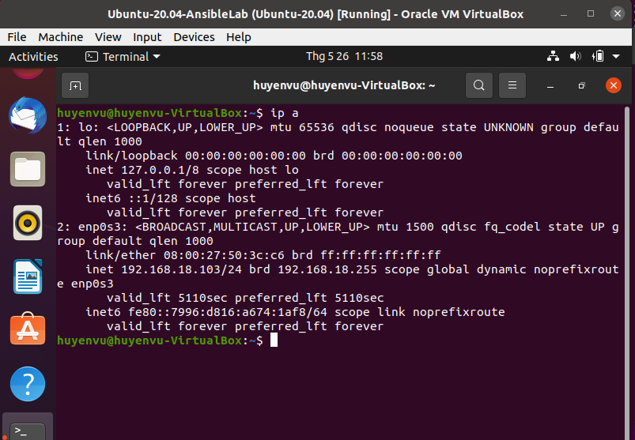
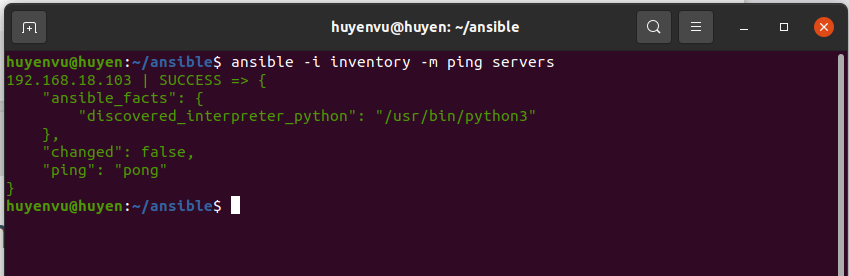
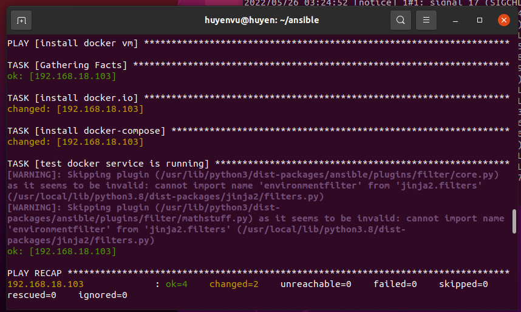
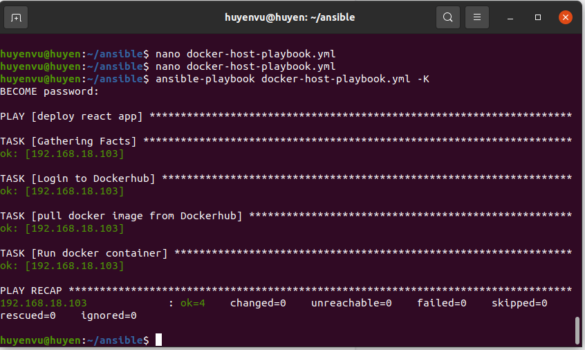
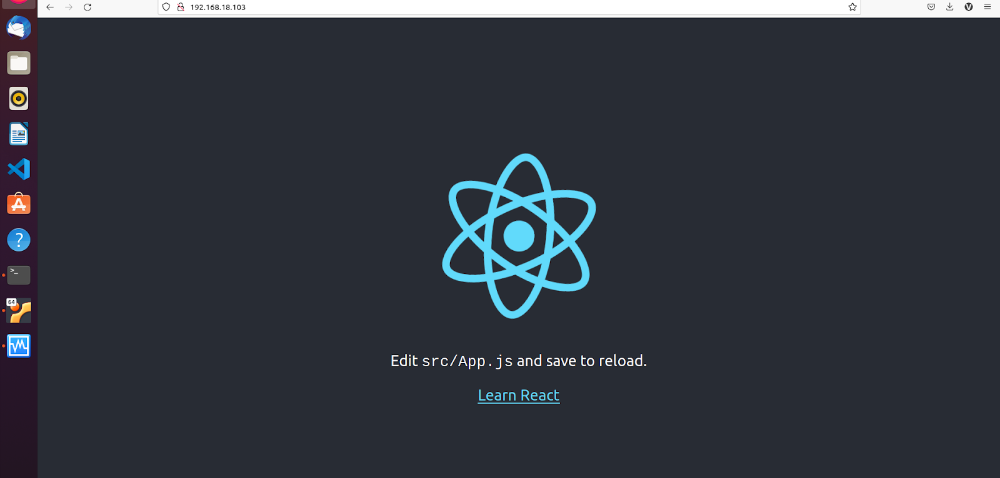
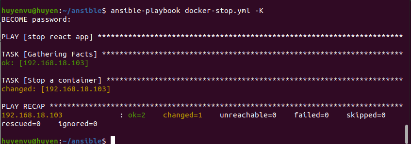
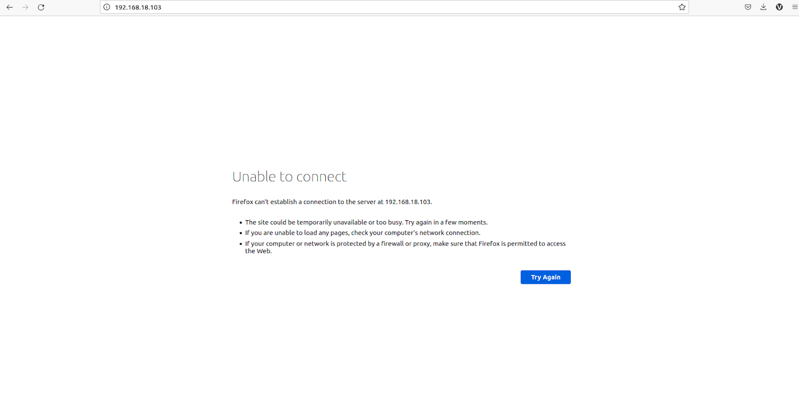

- [**Deploy React App in Docker using Ansible**](#--deploy-react-app-in-docker-using-ansible--)
  * [**1. Set up project**](#--1-set-up-project--)
    + [*1.1 Build React App with nginx*](#-11-build-react-app-with-nginx-)
    + [*1.2 Dockerize React App*](#-12-dockerize-react-app-)
  * [**2. Set up Controller**](#--2-set-up-controller--)
    + [*2.1 Chuẩn bị*](#-21-chu-n-b--)
    + [*2.2 Cài đặt ansible và ssh server*](#-22-c-i---t-ansible-v--ssh-server-)
  * [**3. Practice**](#--3-practice--)
    + [*3.1 Install Docker on VM using Ansible*](#-31-install-docker-on-vm-using-ansible-)
    + [*3.2 Deploy*](#-32-deploy-)
    
# **Deploy React App in Docker using Ansible**

## **1. Set up project**

### *1.1 Build React App with nginx* 

* Yêu cầu

    - Máy đã cài sẵn `Nodejs`, `nginx` và `Docker`.
    - Có kiến thức về dự án ReactJS, nginx, cách sử dụng `Docker` để build và đẩy image lên Dockerhub

* Chúng ta sử dụng tool `Create-React-App` để khởi tạo một dự án React như sau:

    ```
    npx create-react-app my-app
    ```

    Sau khi init sau, ta có cấu trúc thư mục dự án như sau:

    ```
    ├── package.json
    ├── node_modules
    ├── public
    │   ├── ...
    │   └── robots.txt
    ├── README.md
    ├── src
    │   ├── ...
    │   └── App.js
    └── package-lock.json
    ```

* Sử dụng nginx (máy đã cài sẵn nginx)

    > Nginx là một web server mã nguồn mở, sử dụng kiến trúc hướng sự kiện, bất đồng bộ và có khả năng mở rộng. Ban đầu nginx có vai trò là web server, nhưng hiện nay các tính năng mở rộng như reverse proxy server, HTTP cache, cân bằng tải (load balancer) cũng được sử dụng phổ biến.

    Tạo file `nginx/nginx.conf` trong thư mục của project với nội dung:

    ```
    server {
        listen 80;

        location / {
            root /usr/share/nginx/html;
            index index.html index.htm;
        
            try_files $uri /index.html;
        }
    }
    ```
    
    Tham khảo thêm [Tại đây](https://www.digitalocean.com/community/tutorials/how-to-deploy-a-react-application-with-nginx-on-ubuntu-20-04)

### *1.2 Dockerize React App*

* `Dockerfile`
    
    Tạo file `Dockerfile` trong thư mục dự án với nội dung:

    ```
    # Stage1 - build react app

    FROM node:14-alpine AS builder
    ENV NODE_ENV production
    # Add a work directory
    WORKDIR /app
    # Cache and install dependencies
    COPY package.json .
    COPY package-lock.json .
    RUN npm install --production
    # Copy app files
    COPY . .
    # Build the app
    RUN npm run-script build

    # Stage 2: build the final image and copy the react build files
    FROM nginx:1.21.0-alpine as production
    ENV NODE_ENV production
    #copy built assets from builder
    COPY --from=builder /app/build /usr/share/nginx/html
    # Add nginx.conf
    COPY nginx/nginx.conf /etc/nginx/sites-enabled/default
    #expose port
    EXPOSE 80
    #start nginx
    CMD ["nginx", "-g", "daemon off;"]
    ```

* `dockerignore`

    Để ignore các file chúng ta không muốn copy vào trong image, từ đó giúp cho giảm kích thước của image tối đa, thêm file `dockerignore` với nội dung như sau:

    ```
    **/node_modules
    **/npm-debug.log
    build
    ``` 
* Build docker image

    ```
    sudo docker build -t huyenvu2101/first-repo:latest . 
    ```

* Run docker image 

    ```
    sudo docker run -it -p 80:80 huyenvu2101/first-repo:latest
    ```

    Kiểm tra lại kết quả: truy cập [http://localhost:80](http://localhost:80)

    

* Push image lên Docker hub

    ```
    sudo docker push huyenvu2101/first-repo:latest
    ```

## **2. Set up Controller**

### *2.1 Chuẩn bị*

* Ubuntu 20.04 đã cài python3

*  Ubuntu VM

    Tạo VM Ubuntu 20.04 trong VirtualBox, vào `settings` -> `Network` -> `Adapter 1` và chọn như sau:

    

    Lấy địa chỉ IP của VM sử dụng câu lệnh như sau:

    

### *2.2 Cài đặt ansible và ssh server*

* Cài đặt ansible 

    ```
    sudo pip install ansible
    ```

* Cài đặt SSH server

    ```
    sudo apt-get install openssh-server
    ```

    Kiểm tra xem ssh server đã chạy chưa:

    ```
    sudo systemctl status ssh
    ```

    Nếu không sử dụng các câu lệnh sau để start server:

    ```
    sudo systemctl enable ssh
    sudo systemctl start ssh
    ```

    Cấu hình firewall và mở port 22:

    ```
    sudo ufw allow ssh
    ```

    Cài đặt `sshpass`:

    ```
    sudo apt install -y sshpass
    ```

* Tạo file `ansible.cfg` với nội dung:

    ```
    [defaults]
    host_key_checking=False
    pipelining=True
    inventory=./inventory
    log_path=./log/
    forks=100
    ```
* Tạo file `inventory` có nội dung như sau:

    ```
    [servers]
    192.168.18.103 ansible_ssh_user=huyenvu ansible_ssh_pass=Ubuntu01
    ```

* Thử ping tới group `servers`:

    

## **3. Practice**

### *3.1 Install Docker on VM using Ansible*

* Tạo file `docker-vm-playbook.yml` với nội dung như sau:
    ```
    - name: install docker vm
    hosts: servers

    tasks:
    - name: install docker.io
        become: yes
        apt:
        name: docker.io
        state: present
    - name: install docker-compose
        become: yes
        apt:
        name: docker-compose
        state: present
    - name: test docker service is running
        become: yes
        service:
        name: docker
        state: started
    ```

* Chạy `docker-vm-playbook.yml`:

    ```
    ansible-playbook -i inventory docker-vm-playbook.yml -K
    ``` 

    Kết quả:
    

### *3.2 Deploy*

* Tạo file `docker-host-playbook.yml` với nội dung:

    ```
    - name: deploy react app
    hosts: servers

    tasks:
    - name: Login to Dockerhub
        become: yes
        docker_login:
        username: huyenvu2101
        password: <your-password>
        email: vhuyen2101@gmail.com

    - name: pull docker image from Dockerhub
        become: yes
        docker_image:
        name: huyenvu2101/first-repo
        tag: latest
        source: pull

    - name: Run docker container
        become: yes
        docker_container:
            name: ReactApp
        image: huyenvu2101/first-repo:latest
        state: started
        exposed_ports:
        - "80"
        ports:
        - "80:80"
            volumes:
            - /data
    ```

* Chạy playbook với câu lệnh:

    ```
    ansible-playbook docker-host-playbook.yml -K
    ```

    Kết quả:

    

    Kiểm tra lại bằng cách truy cập [http:192.168.18.103:80](http:192.168.18.103:80):

    

* Viết thêm file `docker-stop.yml` để stop container:

    ```
    - name: stop react app
    hosts: servers

    tasks:
    - name: Stop a container
        become: yes
        docker_container:
        name: ReactApp
        state: stopped
    ```
* Để stop, dùng lệnh:

    ```
    ansible-playbook docker-stop.yml -K
    ```

    

    