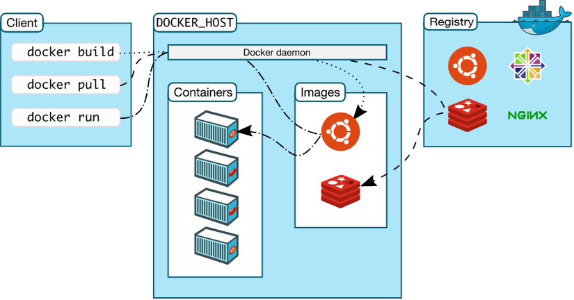
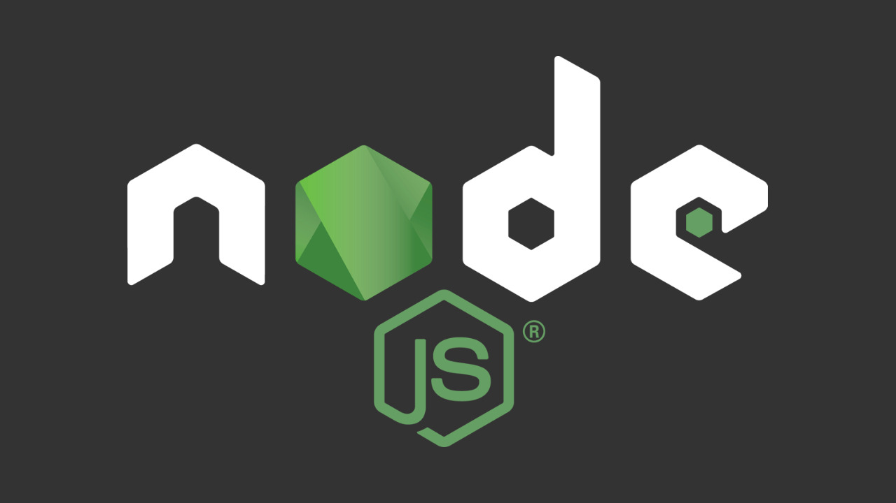
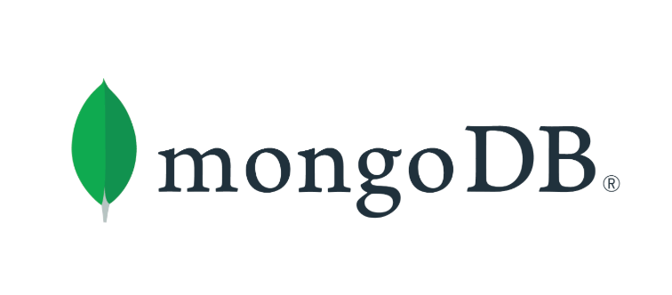
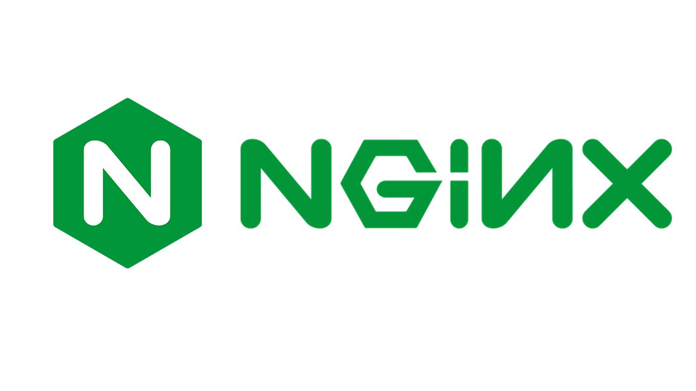
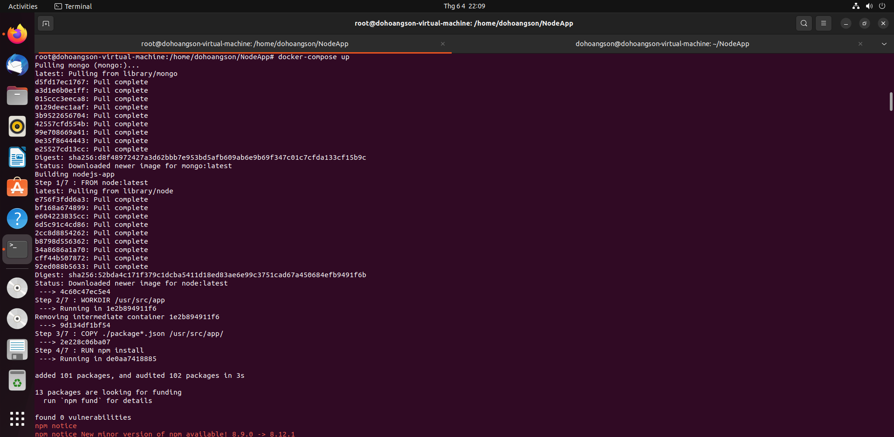
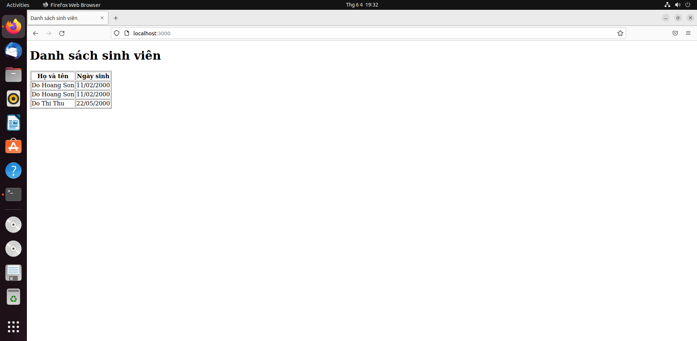

#  **Set up a three-tier web application using docker-compose.**
##  **Table of Contents**
[**I. Requirements**]()
[**II. Software**]()
- [**1. Docker**]()
- [**2. Node.js**]()
- [**3. MongoDB**]()
- [**4. Nginx**]()

[**III. Step-by-step**]()
- [**1. Install Docker**]()
- [**2. Install Docker Compose**]()
- [**3. Deploy**]()
[**IV. References**]()
##  **I. Requirements**
**Operating System**: Ubuntu Server (Ubuntu Server 22.04 is used in below practices).

**Desktop Hypervisor**: Oracle Virtualbox (Oracle Virtualbox 6.1.34 is used in below practices).
##  **II. Software**
###  **1. Docker**
**Docker** is a set of platform as a service (PaaS) products that use OS-level virtualization to deliver software in packages called containers. The service has both free and premium tiers. The software that hosts the containers is called **Docker Engine**. It was first started in 2013 and is developed by Docker, Inc.
The Docker software as a service offering consists of three components:

-   **Software:**  The Docker daemon, called  `dockerd`, is a persistent process that manages Docker containers and handles container objects. The daemon listens for requests sent via the Docker Engine API. The Docker client program, called  `docker`, provides a command-line interface (CLI), that allows users to interact with Docker daemons.
-   **Objects:**  Docker objects are various entities used to assemble an application in Docker. The main classes of Docker objects are images, containers, and services.
    -   A Docker container is a standardized, encapsulated environment that runs applications.  A container is managed using the Docker API or CLI.
    -   A Docker image is a read-only template used to build containers. Images are used to store and ship applications.
    -   A Docker service allows containers to be scaled across multiple Docker daemons. The result is known as a  _swarm_, a set of cooperating daemons that communicate through the Docker API.
-   **Registries:**  A Docker registry is a repository for Docker images. Docker clients connect to registries to download ("pull") images for use or upload ("push") images that they have built. Registries can be public or private. Two main public registries are Docker Hub and Docker Cloud. Docker Hub is the default registry where Docker looks for images. Docker registries also allow the creation of notifications based on events.
<div align="center">
  
</div>
<div align="center">
  <i>Docker Architecture</i>
</div>

**Note:**

`ARG` vs `ENV`

`ARG`: ARG values are not available after the image is built. A running container won’t have access to an ARG variable value.

`ENV`: ENV is mainly meant to provide default values for your future environment variables. Running dockerized applications can access environment variables.

`COPY` vs `ADD`

`COPY`: COPY is a docker file command that copies files from a local source location to a destination in the Docker container. It only has only one assigned function. Its role is to duplicate files/directories in a specified location in their existing format. If you want to avoid backward compatibility, you should use the COPY command.

`ADD`: ADD command is used to copy files/directories into a Docker image. It can also copy files from a URL. ADD command is used to download an external file and copy it to the wanted destination.

`CMD` vs `ENTRYPOINT`

 `ENTRYPOINT`: specifies a command that will always be executed when the container starts.
 
`CMD` : specifies arguments that will be fed to the  `ENTRYPOINT` or for executing an ad-hoc command in a container. `CMD` will be overridden when running the container with alternative arguments.

###  **2. Node.js**
**Node.js**  is an open-source, cross-platform, back-end JavaScript runtime environment that runs on the V8 engine and executes JavaScript code outside a web browser. Node.js lets developers use JavaScript to write command line tools and for server-side scripting—running scripts server-side to produce dynamic web page content before the page is sent to the user's web browser. Consequently, Node.js represents a "JavaScript everywhere" paradigm, unifying web-application development around a single programming language, rather than different languages for server-side and client-side scripts.

Node.js has an event-driven architecture  capable of asynchronous I/O. These design choices aim to optimize throughput and scalability in web applications with many input/output operations, as well as for real-time Web applications (e.g., real-time communication programs and browser games.
<div align="center">
  
</div>
<div align="center">
  <i>Node.js Logo</i>
</div>

###  **3. MongoDB**
**MongoDB** is a source-available cross-platform document-oriented database program. Classified as a NoSQL database program, MongoDB uses JSON-like documents with optional schemas. MongoDB is developed by MongoDB Inc. and licensed under the Server Side Public License (SSPL).
<div align="center">
  
</div>
<div align="center">
  <i>MongoDB Logo</i>
</div>

###  **4. Nginx**
**Nginx**, stylized as **NGIИX**, is a web server that can also be used as a reverse proxy, load balancer, mail proxy and HTTP cache. The software was created by Igor Sysoev and publicly released in 2004. Nginx is free and open-source software, released under the terms of the 2-clause BSD license. A large fraction of web servers use Nginx, often as a load balancer.
<div align="center">
  
</div>
<div align="center">
  <i>Ngnix Logo</i>
</div>

##  **III. Step-by-step**
###  **1. Install Docker**
- Update existing packages
```
sudo apt update && sudo apt upgrade -y
```
- Install prerequisite packages
```
sudo apt install python3-dev libffi-dev gcc libssl-dev
```
- Add the GPG key from the official Docker repository
```
curl -fsSL https://download.docker.com/linux/ubuntu/gpg | sudo apt-key add -
```
- Add the official docker repository to APT sources
```
sudo add-apt-repository \ "deb [arch=amd64] https://download.docker.com/linux/ubuntu $(lsb_release -cs) stable"
```
- Update the Ubuntu package list
```
sudo apt update
```
- Verify the docker repository
```
apt-cache policy docker-ce
```
- Install the Docker community edition
```
sudo apt install docker-ce
```
- Check the status of the installation with the following command. If the  **service**  status returns active (running), Docker is successfully installed and active on the system
```
sudo systemctl status docker
```
###  **2. Install Docker Compose**
- Install the current stable release of Docker Compose
```
sudo curl -L "https://github.com/docker/compose/releases/download/1.27.4/docker-compose-$(uname -s)-$(uname -m)"  -o /usr/local/bin/docker-compose
```
- Apply executable permissions for the downloaded binary
```
sudo chmod +x /usr/local/bin/docker-compose
```
- Verify the Docker Compose installation.
```
docker-compose --version
```
###  **3. Deploy**
- We are going to run these two containers and a MongoDB database container using docker-compose. The source code is available on [GitHub](https://github.com/nhok8t1/NodeApp).
For this demonstration, we are going to use this folder structure:
```
|
+---nginx
|    +--default.conf
|    +--dockerfile
+---nodedocker_app
|    +--models
|		+--Item.js
|    +--views
|		+--index.ejs
|    +--index.js
|    +--package.json
|    +--package-json.lock
|    +--dockerfile
+--.dockerignore
+--.gitignore
+--docker-compose.yml
```
- nginx: has configuration file and its Dockerfile
- nodedocker_app: has source code and its Dockerfile
- .gitignore: specifies intentionally untracked files that Git should ignore
- .dockerignore: it allows you to specify a pattern for files and folders that should be ignored by the Docker client when generating a **build context**

Here is `nginx` dockerfile. It pulls image and copies `default.conf` to configuration directory of `nginx`
```
FROM nginx:1.22.0-alpine
COPY ./default.conf /etc/nginx/conf.d/
``` 
Here is `node` dockerfile. It pulls image, setup working directory for any instructions that follow it in the Dockerfile, copy json package, install dependencies, copy source code to container directory, expose port 3000 to run Express app (**Express.js**, or simply **Express**, is a back end web application framework for Node.js, released as free and open-source software under the MIT License.), execute `node index.js` to run this app.
```
FROM node:latest
WORKDIR /usr/src/app
COPY ./package*.json /usr/src/app/
RUN npm install
COPY ./ /usr/src/app/
EXPOSE 3000
CMD [ "node", "index.js" ]
```
Here is `docker-compose.yml` file.
```
version: '3'
services:
	nodejs-app:
		build:
			context: ./nodedocker_app
		container_name: nodejsserver
		hostname: nodejsserver
		ports:
			- "3000:3000"
		networks:
			- example-net
		depends_on:
			- mongo
	mongo:
		container_name: mongo
		image: mongo
		volumes:
			- ./data:/data/db
		ports:
			- "27017:27017"
		environment:
			- MONGO_INITDB_DATABASE=nhok8t1
		networks:
			- example-net
	nginx:
		build:
			context: ./nginx
		container_name: nginx
		hostname: nginx
	ports:
		- "80:80"
	depends_on:
		- nodejs-app
	networks:
		- example-net
networks:
	example-net:
```
We have three services here. We will look at these one by one:

`nodejs-app`: Build image follow the specified directory, setup container name and hostname, mapping the container port to the host port, setup network and compose after service `mongo` is installed.

`mongo`: Setup container name, pull image from public repository, setup MongoDB data volume, mapping port, setup network and create database.

`nginx`: Build image follow the specified directory, setup container name and hostname, mapping the container port to the host port, setup network.
Network configuration is default.
Now that we have the `docker-compose.yml` done. We clone it from GitHub and run it:
```
git clone https://github.com/nhok8t1/NodeApp
cd NodeApp
docker-compose up
```
<div align="center">
  
</div>
<div align="center">
  <i>docker-compose</i>
</div>

After running, three containers are up. Now, we can add record to database. Using the docker **exec** command, we can access the terminal of the MongoDB container. As the container runs in a detached mode, we will use the Docker interactive terminal to establish the connection.
```
sudo docker exec -it mongodb bash
mongo
```
Switch the database (I used this database in source code)
```
use nhok8t1
```
We add some records
```
db.items.insertMany([{name: "Do Hoang Son", date: "11/02/2000"}, {name: "Do Thi Thu", origin: "22/05/2000"}])
```
If we now browse to `http://localhost:3000` we will see:
<div align="center">
  
</div>
<div align="center">
  <i>localhost:3000</i>
</div>

##  **III. References**
- [Docker](https://en.wikipedia.org/wiki/Docker_(software))
- [Node.js](https://en.wikipedia.org/wiki/Node.js)
- [MongoDB](https://en.wikipedia.org/wiki/MongoDB)
- [Nginx](https://en.wikipedia.org/wiki/Nginx)
- [Install Docker and Configure MongoDB](https://www.bmc.com/blogs/mongodb-docker-container)
- [Dockerizing a Node.js, Express, MongoDB App with NGINX Reverse Proxy using Docker Compose](https://www.youtube.com/watch?v=4zUQEkDdNR0)
