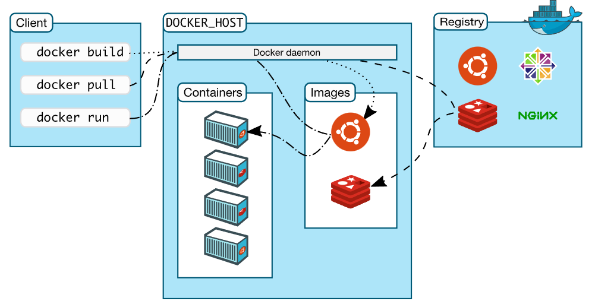
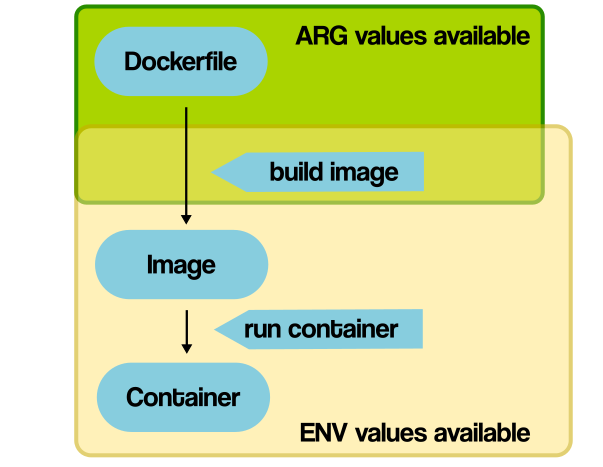
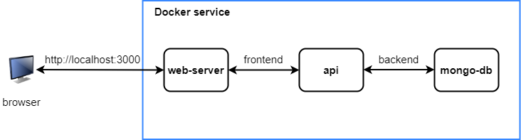
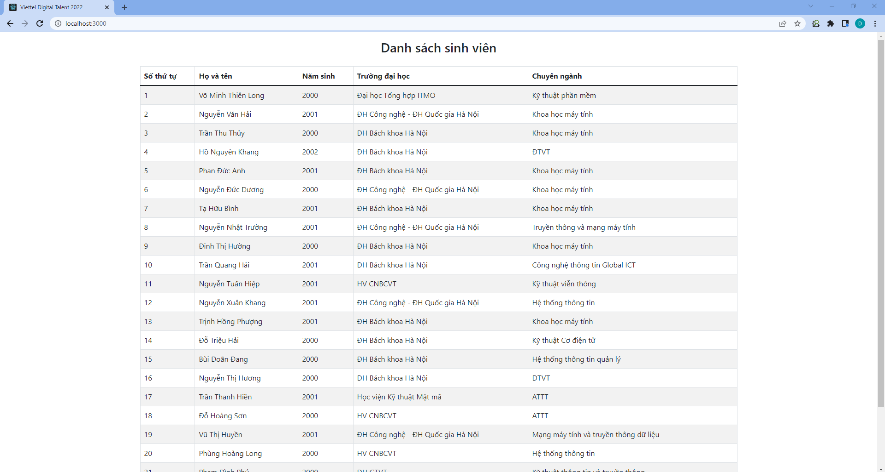
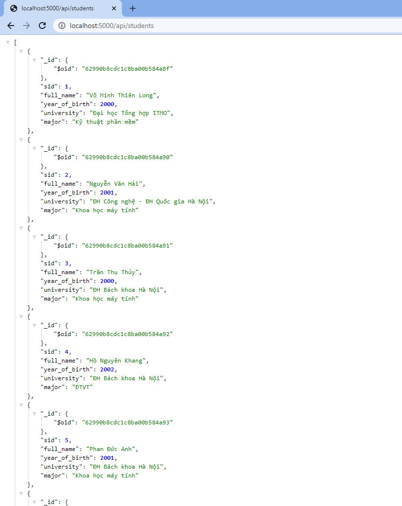
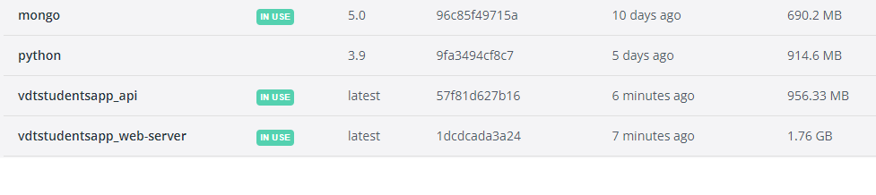
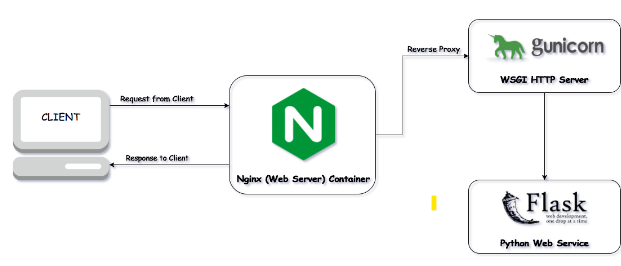
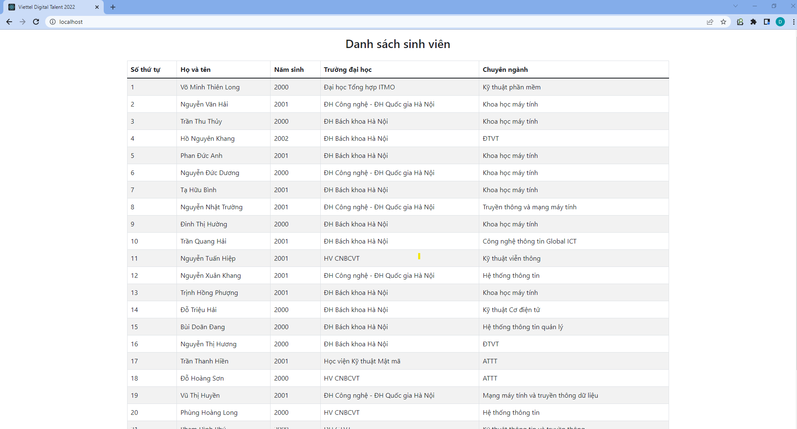
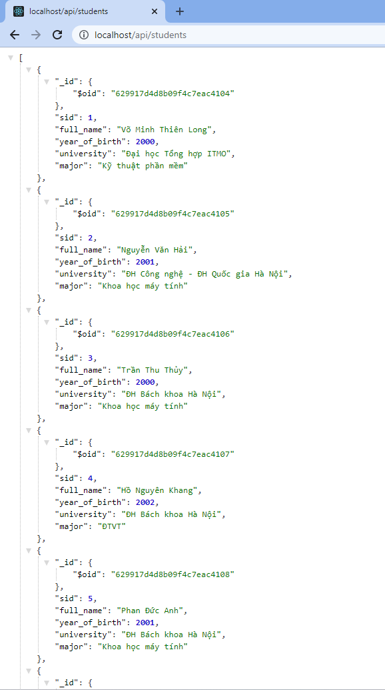
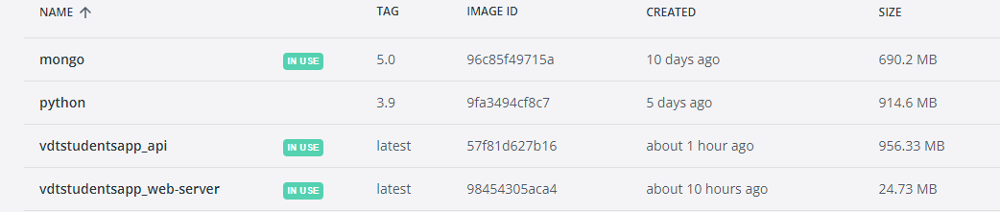

# **Viettel Digital Talent - Practice 3: Set up a three-tier web application that displays the course attendees’ information on the browser using docker-compose.**

## **Table of Contents**

- [I. Prerequisites knowledge](#overview)   
    - [1. Docker](#Docker)
        - [a. Overview](#docker-overview)
        - [b. Docker architecture](#docker-architecture)
        - [c. Docker instructions](#docker-instructions)
        - [d. Discriminate docker instructions](#docker-instructions-discriminate)
    - [2. Docker Compose](#docker-compose)
    - [3. Three-tier web application](#three-tier)
    - [4. Flask](#flask)
    - [5. ReactJS](#reactjs)
    - [6. MongoDB](#mongodb)
    - [7. Nginx](#nginx)
    - [8. Guvicorn](#guvicorn)
- [II. Step-by-step](#steps)
   - [1. Install Docker](#docker-install)            
   - [2. Install Docker Compose](#docker-compose-install)    
   - [3. Install Docker Compose](#docker-compose-install)    
   - [4. Set up development environment](#dev-setup)    
   - [5. Set up production environment](#prod-setup)    
- [References](#refs)             
----  

## I. Prerequisites knowledge
<a name='overview'></a >      

### 1. Docker 
<a name='Docker'></a > 

#### a. Overview
<a name='docker-overview'></a > 

Docker is an open platform for developing, shipping, and running applications. Docker enables you to separate your applications from your infrastructure so you can deliver software quickly. With Docker, you can manage your infrastructure in the same ways you manage your applications. By taking advantage of Docker’s methodologies for shipping, testing, and deploying code quickly, you can significantly reduce the delay between writing code and running it in production.

Docker provides the ability to package and run an application in a loosely isolated environment called a container. The isolation and security allows you to run many containers simultaneously on a given host. Containers are lightweight and contain everything needed to run the application, so you do not need to rely on what is currently installed on the host. You can easily share containers while you work, and be sure that everyone you share with gets the same container that works in the same way.

#### b. Docker architecture
<a name='docker-architecture'></a > 

Docker uses a client-server architecture. The Docker client talks to the Docker daemon, which does the heavy lifting of building, running, and distributing your Docker containers. The Docker client and daemon can run on the same system, or you can connect a Docker client to a remote Docker daemon. The Docker client and daemon communicate using a REST API, over UNIX sockets or a network interface. Another Docker client is Docker Compose, that lets you work with applications consisting of a set of containers.

<div align="center">
  
</div>

<div align="center">
  <i>Docker architecture.</i>
</div>

### Docker objects

#### Images
An image is a read-only template with instructions for creating a Docker container. Often, an image is based on another image, with some additional customization.

#### Containers
A container is a runnable instance of an image. By default, a container is relatively well isolated from other containers and its host machine.

#### c. Docker instructions
<a name='docker-instructions'></a > 

### `FROM` instruction

The `FROM` instruction initializes a new build stage and sets the Base Image for subsequent instructions. Therefore, a valid `Dockerfile` must start with a `FROM` instruction.

```Dockerfile
FROM [--platform=<platform>] <image> [AS <name>]
```

The optional `--platform` flag can be used to specify the platform of the image in case FROM references a multi-platform image. For example, `linux/amd64`, `linux/arm64`, or `windows/amd64`. By default, the target platform of the build request is used.

### `RUN` instruction
The `RUN` instruction will execute any commands in a new layer on top of the current image and commit the results. The resulting committed image will be used for the next step in the `Dockerfile`.

`RUN` has 2 forms:

```Dockerfile
RUN <command>
``` 
 (shell form, the command is run in a shell, which by default is /bin/sh -c on Linux or cmd /S /C on Windows)

```Dockerfile
RUN ["executable", "param1", "param2"]
 ```
 (exec form)

 ### `ENTRYPOINT` instruction
An `ENTRYPOINT` allows you to configure a container that will run as an executable. `ENTRYPOINT` has two forms:
 - The exec form, which is the preferred form:
```Dockerfile
ENTRYPOINT ["executable", "param1", "param2"]
```

- The shell form:
```Dockerfile
ENTRYPOINT command param1 param2
```
### `CMD` instruction
The main purpose of a `CMD` is to provide defaults for an executing container. These defaults can include an executable, or they can omit the executable, in which case you must specify an `ENTRYPOINT` instruction as well.

The `CMD` instruction has three forms:
```Dockerfile
CMD ["executable","param1","param2"] 
```

(exec form, this is the preferred form)
```Dockerfile
CMD ["param1","param2"]
```
(as default parameters to ENTRYPOINT)
```Dockerfile
CMD command param1 param2 
```
(shell form)

**Note**: There can only be one `CMD` instruction in a Dockerfile. If you list more than one `CMD` then only the last `CMD` will take effect.

### `EXPOSE` instruction
The `EXPOSE` instruction informs Docker that the container listens on the specified network ports at runtime. You can specify whether the port listens on TCP or UDP, and the default is TCP if the protocol is not specified.

```Dockerfile
EXPOSE <port> [<port>/<protocol>...]
```

The `EXPOSE` instruction does not actually publish the port. It functions as a type of documentation between the person who builds the image and the person who runs the container, about which ports are intended to be published. To actually publish the port when running the container, use the -p flag on docker run to publish and map one or more ports, or the -P flag to publish all exposed ports and map them to high-order ports.

### `ENV` instruction

The `ENV` instruction sets the environment variable `<key>` to the value `<value>`. This value will be in the environment for all subsequent instructions in the build stage and can be replaced inline in many as well. The value will be interpreted for other environment variables, so quote characters will be removed if they are not escaped. Like command line parsing, quotes and backslashes can be used to include spaces within values.

```Dockerfile
ENV <key>=<value> ...
```

### `ADD` instruction
The ADD instruction copies new files, directories or remote file URLs from <src> and adds them to the filesystem of the image at the path <dest>.

ADD has two forms:

```Dockerfile
ADD [--chown=<user>:<group>] <src>... <dest>
ADD [--chown=<user>:<group>] ["<src>",... "<dest>"]
```

### `COPY` instruction
The COPY instruction copies new files or directories from <src> and adds them to the filesystem of the container at the path <dest>.

COPY has two forms:

```Dockerfile
COPY [--chown=<user>:<group>] <src>... <dest>
COPY [--chown=<user>:<group>] ["<src>",... "<dest>"]
```


 ####  For more details about Dockerfile instructions, please visit [this tutorial](https://docs.docker.com/engine/reference/builder/)

#### d. Discriminate docker instructions
<a name='docker-instructions-discriminate'></a > 

### - `ARG` vs `ENV`

- For the similarity, both `ARG` and `ENV` help you define variables. 

- For the difference is the scopes:
    - `ENV` is mainly meant to provide default values for your future environment variables after an image is built. 
    - `ARG` values are not available after the image is built. A running container won’t have the access to an `ARG` variable value.
<div align="center">
  
</div>

<div align="center">
  <i>Comparing the scope of ENV and ARG.</i>
</div>

### - `COPY` vs `ADD`

 - For similarity, both `ADD` and `COPY` let you copy files from source location to a destination in a Docker image. 

 - But for the difference :
    - `COPY` takes in a src and destination. but it only lets you copy in a local or directory from your host (the machine-building the Docker image) into the Docker image itself. Therefore, if all you want is copying local files to your Docker image, always use COPY because it’s more explicit:

```Dockerfile
COPY <src> <dest>
 ```

- Meanwhile, `ADD` also do the function copying too, but it also supports 2 other sources:
  - `ADD` can accept a remote URL for its source argument. The `COPY`, on the other hand, can only accept local files. 
  - `ADD` directive will automatically extract tar files into the image file system. But note that the auto-expansion only occurs when the source file is local to the host system. 


### - `CMD` vs `ENTRYPOINT`

 - For the similarity, noth `CMD` and not `ENTRYPOINT` are using to define a program we want to execute when we do the `docker run`.  

- For the difference:

    - `CMD` defines default commands and/or parameters for a container.  It should be used when you need a default command which users can easily override. If a Dockerfile has multiple CMDs, it only applies the instructions from the last one.

    - `ENTRYPOINT` is preferred when you want to define a container with a specific executable. You cannot override an ENTRYPOINT when starting a container unless you add the `--entrypoint` flag. You cannot override the `ENTRYPOINT` instruction by adding command-line parameters to the docker run command. By opting for this instruction, you imply that the container is specifically built for such use.

    - You can combine `ENTRYPOINT` with `CMD` when you need a container with a specified executable and a default parameter that can be modified easily.

Let take an example here. I got an Dockerfile to test the `CMD` :

```Dockerfile
FROM ubuntu
RUN apt-get update
CMD ["echo", "Hello Duc Duong"]
```

Now to build an image from this Dockerfile, run:

```
docker build -t test-cmd ./test-ENTRYPOINT/
```

And we got the result like this:

```
REPOSITORY   TAG       IMAGE ID       CREATED              SIZE
test-cmd     latest    836b12140e12   About a minute ago   112MB
```
As there is no command-line argument, the container will run the default CMD instruction and display the "Hello Duc Duong" message:
```
PS D:\Learning\ViettelDigitalTalent\Practice\VDTStudentsApp\test-CMD> docker run test-cmd  
Hello Duc Duong
```
However, if you add an argument when starting a container, it overrides the CMD instruction:
```
PS D:\Learning\ViettelDigitalTalent\Practice\VDTStudentsApp\test-CMD> docker run test-cmd hostname
faae44d1c098
```

This is because Docker will run the container and the hostname command instead of the CMD’s echo command.

### Now let try the `ENTRYPOINT`, I got a similar task in this Dockerfile but using the `ENTRYPOINT`:

```Dockerfile
FROM ubuntu
RUN apt-get update
ENTRYPOINT ["echo", "Hello Duc Duong"]
```
Now let's build an image from this file:

```
docker build -t test-entrypoint ./test-ENTRYPOINT/
```
And we got the result:
```
PS D:\Learning\ViettelDigitalTalent\Practice\VDTStudentsApp> docker images
REPOSITORY        TAG       IMAGE ID       CREATED          SIZE
test-cmd          latest    836b12140e12   13 minutes ago   112MB
test-entrypoint   latest    836b12140e12   13 minutes ago   112MB
```

- Now let’s run it without adding any command-line parameters:
```
PS D:\Learning\ViettelDigitalTalent\Practice\VDTStudentsApp> docker run test-cmd hostname
faae44d1c098
```
- And we got the result:
```
PS D:\Learning\ViettelDigitalTalent\Practice\VDTStudentsApp> docker run test-entrypoint  
Hello Duc Duong
```

- Now let’s run it with a parameter:
```
PS D:\Learning\ViettelDigitalTalent\Practice\VDTStudentsApp> docker run test-entrypoint hello        
Hello Duc Duong hello
```

As you see, Docker did not override the initial instruction of echoing Hello World. It added the new parameter to the existing command.

### 2. Docker Compose
<a name='docker-compose'></a > 

Compose is a tool for defining and running multi-container Docker applications. With Compose, you use a YAML file to configure your application’s services. Then, with a single command, you create and start all the services from your configuration

Using Compose is basically a three-step process:

- Define your app’s environment with a Dockerfile so it can be reproduced anywhere.

- Define the services that make up your app in docker-compose.yml so they can be run together in an isolated environment.

- Run docker compose up and the Docker compose command starts and runs your entire app. You can alternatively run docker-compose up using the docker-compose binary.

### 3. Three-tier web application
<a name='#three-tier'></a > 

Three-tier architecture is a well-established software application architecture that organizes applications into three logical and physical computing tiers: the presentation tier, or user interface; the application tier, where data is processed; and the data tier, where the data associated with the application is stored and managed. 

<div align="center">
  
</div>

<div align="center">
  <i>Three-tier architecture.</i>
</div>

### Presentation tier

The presentation tier is the user interface and communication layer of the application, where the end user interacts with the application. Its main purpose is to display information to and collect information from the user. This top-level tier can run on a web browser, as desktop application, or a graphical user interface (GUI), for example. Web presentation tiers are usually developed using HTML, CSS and JavaScript. Desktop applications can be written in a variety of languages depending on the platform.

### Application tier (Logic tier)

The application tier, also known as the logic tier or middle tier, is the heart of the application. In this tier, information collected in the presentation tier is processed - sometimes against other information in the data tier - using business logic, a specific set of business rules. The application tier can also add, delete or modify data in the data tier.

The application tier is typically developed using Python, Java, Perl, PHP or Ruby, and communicates with the data tier using API calls. 

### Data tier

The data tier, sometimes called database tier, data access tier or back-end, is where the information processed by the application is stored and managed. This can be a relational database management system such as PostgreSQL, MySQL, MariaDB, Oracle, DB2, Informix or Microsoft SQL Server, or in a NoSQL Database server such as Cassandra, CouchDB or MongoDB. 

In a three-tier application, all communication goes through the application tier. The presentation tier and the data tier cannot communicate directly with one another.

### 4. Flask
<a name='#flask'></a > 

Flask is a Python web framework. Flask provides you with tools, libraries and technologies that allow you to build a web application.

Flask is part of the categories of the micro-framework. Micro-framework are normally framework with little to no dependencies to external libraries. This has pros and cons. Pros would be that the framework is light, there are little dependency to update and watch for security bugs, cons is that some time you will have to do more work by yourself or increase yourself the list of dependencies by adding plugins. 

In the practice, **Flask** is using for the `Application tier`.

### 5. ReactJS
<a name='#reactjs'></a > 

**React** is a library for building composable user interfaces. It encourages the creation of reusable UI components, which present data that changes over time. Lots of people use **React** as the V in MVC. React abstracts away the DOM from you, offering a simpler programming model and better performance. **React** can also render on the server using Node, and it can power native apps using **React** Native. **React** implements one-way reactive data flow, which reduces the boilerplate and is easier to reason about than traditional data binding.

<div align="center">
  
</div>

<div align="center">
  <i>React logo.</i>
</div>


React Features:
 - JSX: JSX is JavaScript syntax extension. It isn't necessary to use **JSX** in **React** development, but it is recommended.
- Components: React is all about components. You need to think of everything as a component. This will help you maintain the code when working on larger scale projects.

- Unidirectional data flow and Flux: **React** implements one-way data flow which makes it easy to reason about your app. Flux is a pattern that helps keeping your data unidirectional.
.
- License: **React** is licensed under the Facebook Inc. Documentation is licensed under CC BY 4.0.

In the practice, **React** is served for the `Presentation tier`.

### 6. MongoDB
<a name='#mongodb'></a > 

MongoDB is a cross-platform, document oriented database that provides, high performance, high availability, and easy scalability. MongoDB works on concept of collection and document.

<div align="center">
  
</div>

<div align="center">
  <i>MongoDB logo.</i>
</div>

### Database
Database is a physical container for collections. Each database gets its own set of files on the file system. A single MongoDB server typically has multiple databases.

### Collection
Collection is a group of MongoDB documents. It is the equivalent of an RDBMS table. A collection exists within a single database. Collections do not enforce a schema. Documents within a collection can have different fields. Typically, all documents in a collection are of similar or related purpose.

### Document
A document is a set of key-value pairs. Documents have dynamic schema. Dynamic schema means that documents in the same collection do not need to have the same set of fields or structure, and common fields in a collection's documents may hold different types of data.

In the practice, **MongoDB** is using for the `Data tier`.

### 7. Nginx
<a name='#nginx'></a > 

NGINX is open source software for web serving, reverse proxying, caching, load balancing, media streaming, and more. It started out as a web server designed for maximum performance and stability. In addition to its HTTP server capabilities, NGINX can also function as a proxy server for email (IMAP, POP3, and SMTP) and a reverse proxy and load balancer for HTTP, TCP, and UDP servers.

<div align="center">
  
</div>

<div align="center">
  <i>Nginx logo.</i>
</div>

### 8. Guvicorn
<a name='#guvicorn'></a > 

Gunicorn 'Green Unicorn' is a Python WSGI HTTP Server for UNIX. It's a pre-fork worker model. The Gunicorn server is broadly compatible with various web frameworks, simply implemented, light on server resources, and fairly speedy.

As described in PEP3333, the Python Web Server Gateway Interface (WSGI) is a way to make sure that web servers and python web applications can talk to each other. 
<div align="center">
  
</div>

<div align="center">
  <i>Guvicorn logo.</i>
</div>


## II. Step-by-step 
<a name='steps'></a >      

### 1. Install Docker
<a name='docker-install'></a >   

Before going into this practice, please make sure that you have already installed and downloaded `Docker`. If you do not have Docker on your computer, please follow these tutorials belows to install and download `Docker`. Make sure that you follow the right one depends on your operating system:

   - [Install Docker Desktop on Mac](https://docs.docker.com/desktop/mac/install/) 
   - [Install Docker Desktop on Windows](https://docs.docker.com/desktop/windows/install/)
   - [Install Docker Desktop on Linux](https://docs.docker.com/desktop/linux/install/)

### 2. Install Docker Compose
<a name='docker-compose-install'></a >  

In order to install `Docker Compose`, please follow [this instruction](https://docs.docker.com/compose/install/). Note that on desktop systems like Docker Desktop for Mac and Windows, `Docker Compose` is included as part of those desktop installs so you don't have to install `Docker Compose` seperately. 

### 4. Set up development environment
<a name='dev-setup'></a > 

- As we are going to develop and dockerizing an three-tier web application, using `Docker Compose` is really helpful as it allows you to configure your application’s services. The infrastructure can be defined in a single file and built with a single command. In this step, we're going to set up the `docker-compose.yml` file.

- The `docker-compose.yml` file below defines the application infrastructure as individual services:

```yml
version: '3.7'
services:
  web-server:
    container_name: web-server-dev
    build:
        context: ./frontend
        dockerfile: Dockerfile
    tty: true 
    ports:
        - "3000:3000"
    volumes:
        - ./frontend:/app 
        - /app/node_modules
    networks:
        - frontend

  mongodb:
    image: mongo:5.0
    container_name: mongodb-dev
    restart: unless-stopped
    command: mongod --auth
    environment:
        MONGO_INITDB_ROOT_USERNAME: "ducduongn"
        MONGO_INITDB_ROOT_PASSWORD: "password"
        MONGO_INITDB_DATABASE: student-db
        MONGODB_DATA_DIR: /data/db
    volumes:
        - mongodbdata:/data/db
        - ./mongo-init.js:/docker-entrypoint-initdb.d/mongo-init.js
    networks:
        - backend

  api:
        container_name: app-api-dev
        build: 
            context: ./backend
            dockerfile: Dockerfile
        environment:
            MONGODB_HOST: mongodb
            MONGODB_USERNAME: "apiuser"
            MONGODB_PASSWORD: "apipassword"
            MONGODB_DBNAME : "student-db"
            MONGODB_AUTH_SOURCE : "student-db"
            
        volumes:
            - appdata:/var/www/
        depends_on: 
            - mongodb
        networks:
            - frontend
            - backend                    

networks:
   frontend:
      driver: bridge
   backend:
      driver: bridge
volumes:
   mongodbdata:
      driver: local
   appdata:
      driver: local      
```

- As you can see, there are 3 services are defined in the `docker-compose.yml` file which are: 
   - web-server (Presentation tier)
   - api (Application tier)
   - mongodb (Data tier)

- Each service will listen to other service through a network. There are 2 networks which are defined in this file: 

```yml
...
networks:
   frontend:
      driver: bridge
   backend:
      driver: bridge
...
```
- As you can see, the `webserver` service is connected to `api` service through the `frontend` network, while the `api` service is connected to `mongodb` service through `backend` network.


<div align="center">
  
</div>

<div align="center">
  <i>Example of docker network.</i>
</div>

- Now we're going into details of each services in this architecture :p.

#### a) mongodb service
```yml
...
mongodb:
    image: mongo:5.0
    container_name: mongodb-dev
    restart: unless-stopped
    command: mongod --auth
    environment:
        MONGO_INITDB_ROOT_USERNAME: "ducduongn"
        MONGO_INITDB_ROOT_PASSWORD: "password"
        MONGO_INITDB_DATABASE: student-db
        MONGODB_DATA_DIR: /data/db
    volumes:
        - mongodbdata:/data/db
        - ./mongo-init.js:/docker-entrypoint-initdb.d/mongo-init.js
    networks:
        - backend
...        
```
- `image` defines the base image `mongo:5.0`. 
- `container_name` define the name of the container after being built
- `restart` define the policy which restarts a container irrespective of the exit code but will stop restarting when the service is stopped or removed.

- `command` define the command that will be executed when the container is started. In this service, command `mongod --auth` will enable security in `MongoDB`.

- `environment` defines the environment variables:
   - `MONGO_INITDB_ROOT_USERNAME` and `MONGO_INITDB_ROOT_PASSWORD` create a root user with the given credentials
   - `MONGO_INITDB_DATABASE` create an database (collection in `MongoDB`) when the container is started. 

   - `MONGODB_DATA_DIR` defined the directory where data will be stored. MongoDB stores its data in /data/db by default, therefore the data in the /data/db folder will be written to the named volume mongodbdata for persistence. 

- `networks` tells docker to create a user-defined bridge network called `backend`. Containers connected to this network will be able to access this container.

- `volumes` property copy the `mongo-init.js` file to `docker-entrypoint-initdb.d`directory in the container. Then it will be executed once the database student-db is created. The `mongo-init.js` has the following content:

```javascript
db.createUser(
    {
        user: 'apiuser',
        pwd: 'apipassword',
        roles: [
            {
                role: 'readWrite',
                db: 'student-db'
            }]
    })

db.createCollection('student');

db.student.insertMany([
  {
    sid: parseInt(1),
    full_name: "Võ Minh Thiên Long",
    year_of_birth: 2000,
    university: "Đại học Tổng hợp ITMO",
    major: "Kỹ thuật phần mềm"
  },
  {
    sid: 2,
    full_name: "Nguyễn Văn Hải",
    year_of_birth: 2001,
    university: "ĐH Công nghệ - ĐH Quốc gia Hà Nội",
    major: "Khoa học máy tính"
  },
   ...
]);    
```
- As it is never advisable to use the root user to access the database in an application. Therefore, the first task is to create an non-root user which is `apiuser` with password: `apipassword`. This user has the readWrite role in the database. The second task is creating an collection named `student` to store the data of students. Then the final task is insert the datasourse representing the list of students. This datasource is in json type.

### b) api services
```yml
...
 api:
        container_name: app-api-dev
        build: 
            context: ./backend
            dockerfile: Dockerfile
        environment:
            MONGODB_USERNAME: "apiuser"
            MONGODB_PASSWORD: "apipassword"
            MONGODB_DBNAME : "student-db"
            MONGODB_AUTH_SOURCE : "student-db"
            
        volumes:
            - appdata:/var/www/
        depends_on: 
            - mongodb
        networks:
            - frontend
            - backend   
...        
```
- `build` property tells docker to build the api image using the Dockerfile located in the backend directory
- `environment` property contains the environment variables that are passed to the container: 
   - `MONGODB_USERNAME` and `MONGODB_PASSWORD` defines the username and password which is created in the `mongo-init.js` file. 
   - `MONGODB_DBNAME` refers to the collection which is also created in the `mongo-init.js` file.
   - `MONGODB_AUTH_SOURCE` property makes sure that this user has the authentication in the collection `student-db`.

- `volumes` property defines the volumes which the service is using. In this case the volume appdata is mounted inside the container at the /var/www directory.
- `depends_on` makes sure that the `api` service only runs if the `mongodb` service is running.
- `network` property specifies `frontend` and `backend` as the networks the `api` service will have access to.

#### Dockerfile
- Next, we are going to build a Dockerfile for this `api` service. 

```Dockerfile
FROM python:3.9

EXPOSE 5000

# Keeps Python from generating .pyc files in the container
ENV PYTHONDONTWRITEBYTECODE 1

# Turns off buffering for easier container logging
ENV PYTHONUNBUFFERED 1

# Install pip requirements
COPY requirements.txt .
RUN python -m pip install -r requirements.txt

#Define the working directory
WORKDIR /app

#Add Flask app to working directory
ADD . /app

# Start the Gunicorn server listening on port 5000
CMD ["gunicorn", "--bind", "0.0.0.0:5000", "app:app"]
```

### c) web-server service

- On the development environment, I am not using Nginx on the `web-server` but on the production environment to see the difference. 

```yml
...
web-server:
    container_name: web-server-dev
    build:
        context: ./frontend
        dockerfile: Dockerfile
    tty: true 
    ports:
        - "3000:3000"
    volumes:
        - ./frontend:/app 
        - /app/node_modules
    networks:
        - frontend    
...        
```
- The `build` property tells docker to build the api image using the Dockerfile located in the backend directory
- `ports` property defined the exposed ports of this service. The format n:m simply maps the containers port m to the host’s port n, thereby exposing the application to the host. Our node app is running on port 3000 inside the container
- `tty` tells Docker to allocate a virtual terminal session within the container. This is commonly used with the -i (or --interactive) option, which keeps STDIN open even if running in detached mode (more about that later)
- `volumes` in `web-server` service define 2 volumes. The 1st one is to mount the `frontend` directory into the `/app` in the container. The 2nd one is to define a directory to save the dependencies of the ReactJs application. 

#### Dockerfile
- Next, we are going to build a Dockerfile for this `web-server` service. 
```Dockerfile
# Pull latest official node image
FROM node:latest

# Expose ports
EXPOSE 3000
EXPOSE 35729

# Set working directory
WORKDIR /app

# Add /app/node_modules/.bin to environment variables
ENV PATH /app/node_modules/.bin:$PATH

# Copy package files and install app dependencies
COPY package.json /app/package.json
COPY package-lock.json /app/package-lock.json
RUN npm install
RUN npm install react-scripts -g

# Add React app to working directory
ADD . /app

# Start the ReactJs app
CMD ["npm", "start"]
```

## Deploy
Great! Now we have already defined all the services in the docker-compose.yml file. Let's head into deployment. 

- To deploy using docker-compose, run in background mode (with -d option):
```
docker-compose up -d
```

- Result: 

<div align="center">
  
</div>

<div align="center">
  <i>Docker containers.</i>
</div>

- Now let's test the application!

### Test ReactJS Application
- We can see that the ReactJS application is running on the port 3000:


<div align="center">
  
</div>

<div align="center">
  <i>Application run on port 3000.</i>
</div>

### Test Flask API
- We can see that the Flask API is running on the port 5000:

<div align="center">
  
</div>

<div align="center">
  <i>API run on port 5000.</i>
</div>

### Review
- Next we are going to look into the sized of images created from the containers: 

<div align="center">
  
</div>

<div align="center">
  <i>Docker images in development.</i>
</div>

- As we can see, the `mongo` image is the base image so we can't not optimize its size. 
- The `vdtstudentsapp_api` is created from the base image `python` with 42MB size bigger. This increasing size is from the package from Python Flask.
- The images `vdtstudentsapp_web-server` has the highest size as the ReactJs needs to install a lot of heavy dependencies. So our task is to minimize the size of this image. Now we are going to use Nginx to solve this problem ;) .

### 5. Set up production environment
<a name='prod-setup'></a > 

- Firstly, we are going to create a new docker-compose file for production. This file's name is `docker-compose-prod.yml`: 

```yml
version: '3.7'
services:
  web-server:
    container_name: web-server-prod
    build:
        context: ./frontend
        dockerfile: Dockerfile-prod
    tty: true 
    ports:
        - "80:80"
    volumes:
        - ./frontend:/app 
        - /app/node_modules
    networks:
        - frontend

  mongodb:
    image: mongo:5.0
    container_name: mongodb
    restart: unless-stopped
    command: mongod --auth
    ports:
        - "27017:27017"
    environment:
        MONGO_INITDB_ROOT_USERNAME: "ducduongn"
        MONGO_INITDB_ROOT_PASSWORD: "password"
        MONGO_INITDB_DATABASE: student-db
        MONGODB_DATA_DIR: /data/db
    volumes:
        - mongodbdata:/data/db
        - ./mongo-init.js:/docker-entrypoint-initdb.d/mongo-init.js
    networks:
        - backend

  api:
        container_name: app-api
        build: 
            context: ./backend
            dockerfile: Dockerfile
        ports:
            - "5000:5000"
        environment:
            MONGODB_HOST: mongodb
            MONGODB_USERNAME: "apiuser"
            MONGODB_PASSWORD: "apipassword"
            MONGODB_DBNAME : "student-db"
            MONGODB_AUTH_SOURCE : "student-db"
            
        volumes:
            - appdata:/var/www/
        depends_on: 
            - mongodb
        networks:
            - frontend
            - backend                    

networks:
   frontend:
      driver: bridge
   backend:
      driver: bridge
volumes:
   mongodbdata:
      driver: local
   appdata:
      driver: local      
```

- As you can see, there is not much difference between the new and the old docker-compose file, except for the `web-server` service: 
```yml
...
web-server:
    container_name: web-server-prod
    build:
        context: ./frontend
        dockerfile: Dockerfile-prod
    tty: true 
    ports:
        - "80:80"
    volumes:
        - ./frontend:/app 
        - /app/node_modules
    networks:
        - frontend
...
```
- Now the `dockerfile` properties is changed to the new `Dockerfile-prod `file. Also the port of this service is changed to 80. 

- Now let's look into the `Dockerfile-prod `file:

```Dockerfile
# Create image based on node image
FROM node:latest as build

# Set working directory
WORKDIR /app
ADD . /app

# Add /app/node_modules/.bin to environment variables
ENV PATH /app/node_modules/.bin:$PATH

# Install all app dependencies
COPY package.json /app/package.json
RUN npm install
RUN npm install react-scripts -g

# Build the app
RUN npm run build

# Create image based on nginx and deploy React app
FROM nginx:1.22.0-alpine

COPY --from=build /app/build /usr/share/nginx/html

# Remove the default.conf to reduce the size of the resulting image
RUN rm /etc/nginx/conf.d/default.conf

# Copy the nginx.conf web server configuration inside of the container
COPY nginx.conf /etc/nginx/conf.d

EXPOSE 80

# Start the Nginx server.
CMD ["nginx", "-g", "daemon off;"]
```

- Next, we need to configure Nginx as a reverse proxy to forward requests to Gunicorn on :5000. A reverse proxy server is used to direct client requests to the appropriate back-end server. It provides an additional layer of abstraction and control to ensure the smooth flow of network traffic between clients and servers.

- In this practice, we are going to build our React app for production and deploy it using Nginx and Gunicorn in order to run both the React app and api on the same port.

- To run the application on Nginx server we need to create an Nginx config file nginx.conf in the /frontend folder

```
upstream app_api {
    server api:5000;
}

server {
    listen 80;
    server_name localhost;
    
    location /api {
        proxy_pass http://app_api;
        proxy_set_header X-Forwarded-For $proxy_add_x_forwarded_for;
        proxy_set_header Host $host;
        proxy_redirect off;
    }
    
    location / {
        root   /usr/share/nginx/html;
        index  index.html index.html;
        try_files $uri $uri/ /index.html;
    }
    
}
```

- In the 1st `location` line, we define that all calls to /api will be rerouted by reverse proxy to port 5000  which is our FlaskAPI.

- In the 2nd `location` line, Nginx will direct all calls to the `/` route to index.html in /usr/share/nginx/html, where our React app resides.

Here is the full architecture of all services in this practice:

<div align="center">
  
</div>

<div align="center">
  <i>Full architecture.</i>
</div>

## Deploy
Now let's move to the final part is depoying! 

- To deploy using the `docker-compose-prod` file, run:

```
docker-compose -f docker-compose-prod.yml up --build -d
```

- Now the React app can be accessed at http://localhost:80 and the Flask API on the same port at http://localhost:80/api/students.


<div align="center">
  
</div>

<div align="center">
  <i>Application run on port 80.</i>
</div>

<div align="center">
  
</div>

<div align="center">
  <i>API run on port 80.</i>
</div>

- Finally, let's have a look at the size of the images in the production environment:

<div align="center">
  
</div>

<div align="center">
  <i>Docker images in production.</i>
</div>

- As you can see, the size of the `vdtstudentsapp_web-server` now reduced to only 24.73MB, which is much much smaller than the size 1.76GB on the development environment. The reason for this is that Nginx only host with the html, js and css files without install any other dependencies. Therefore, the total size of the image after being built is much smaller and good for optimization.

## References
<a name='refs'></a >      

[1] https://www.digitalocean.com/community/tutorials/how-to-set-up-flask-with-mongodb-and-docker
 
[2] https://www.ibm.com/cloud/learn/three-tier-architecture

[3] https://docs.docker.com/engine/reference/builder/

[4] http://nginx.org/en/docs/http/ngx_http_core_module.html#client_max_body_size

[5] https://docs.docker.com/get-started/overview/

[6] https://vsupalov.com/docker-arg-vs-env/

[7] https://www.tutorialspoint.com/mongodb/mongodb_overview.htm#:~:text=MongoDB%20is%20a%20cross%2Dplatform,concept%20of%20collection%20and%20document.

[8] https://vsupalov.com/docker-arg-vs-env/