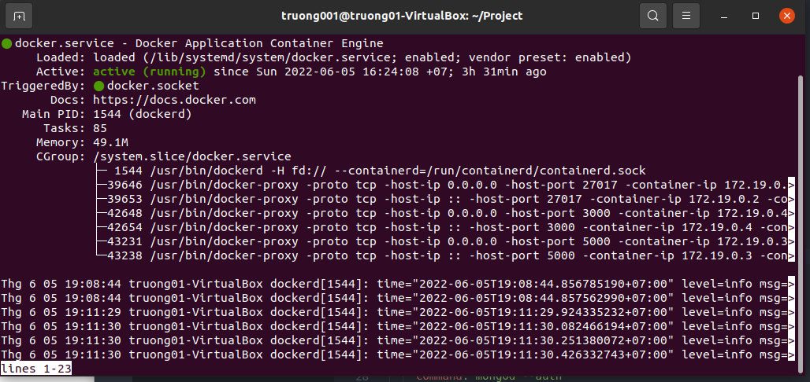
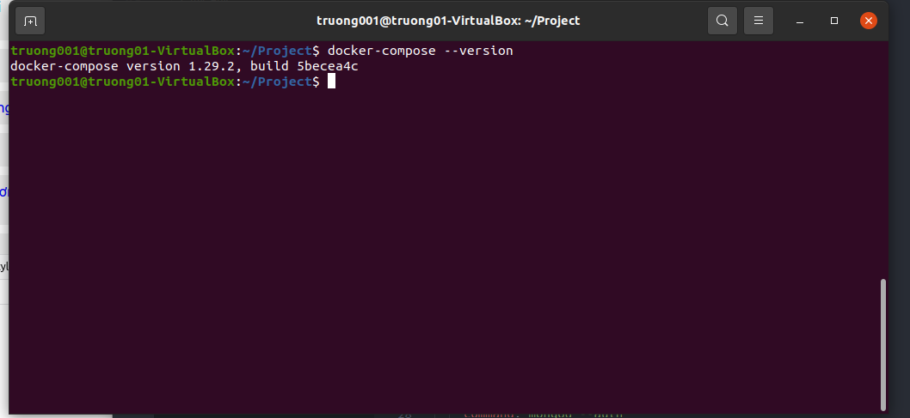
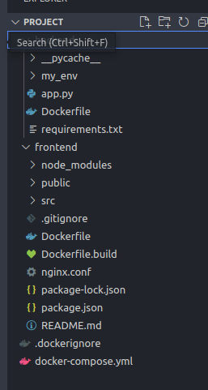
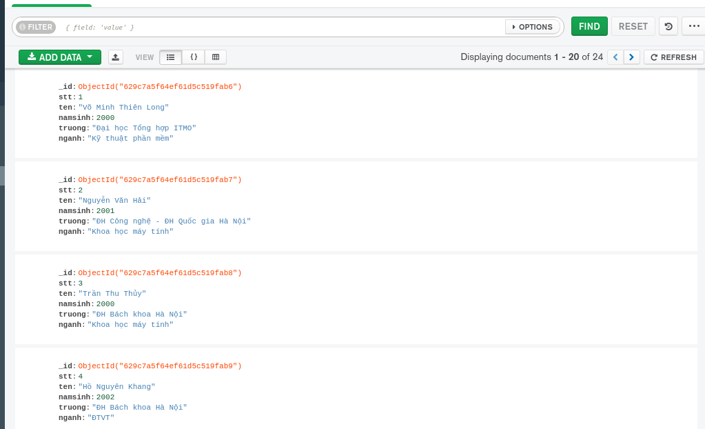
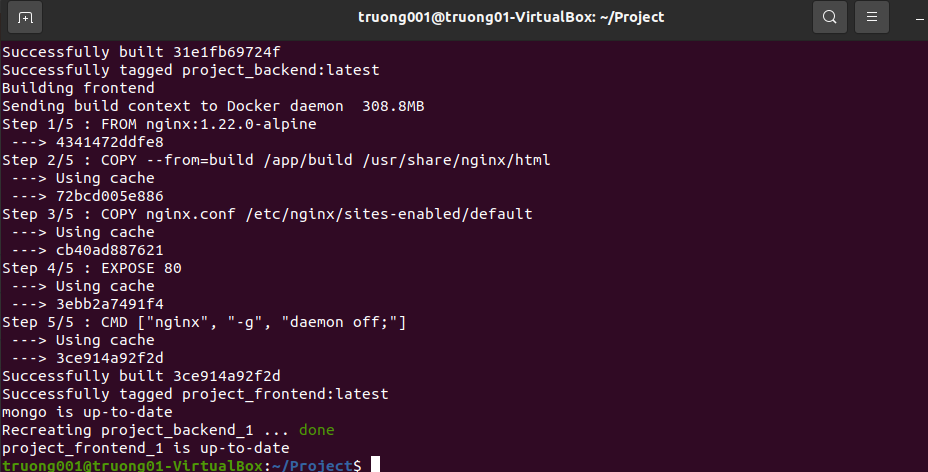
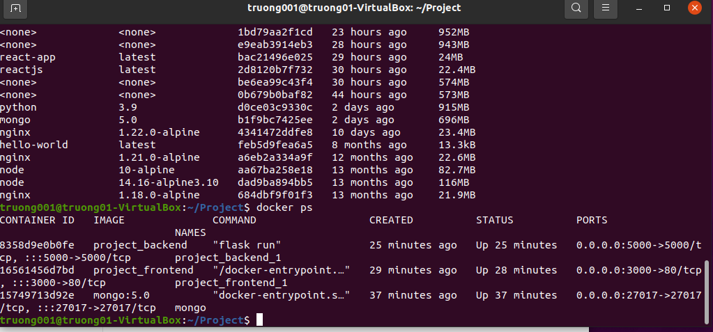
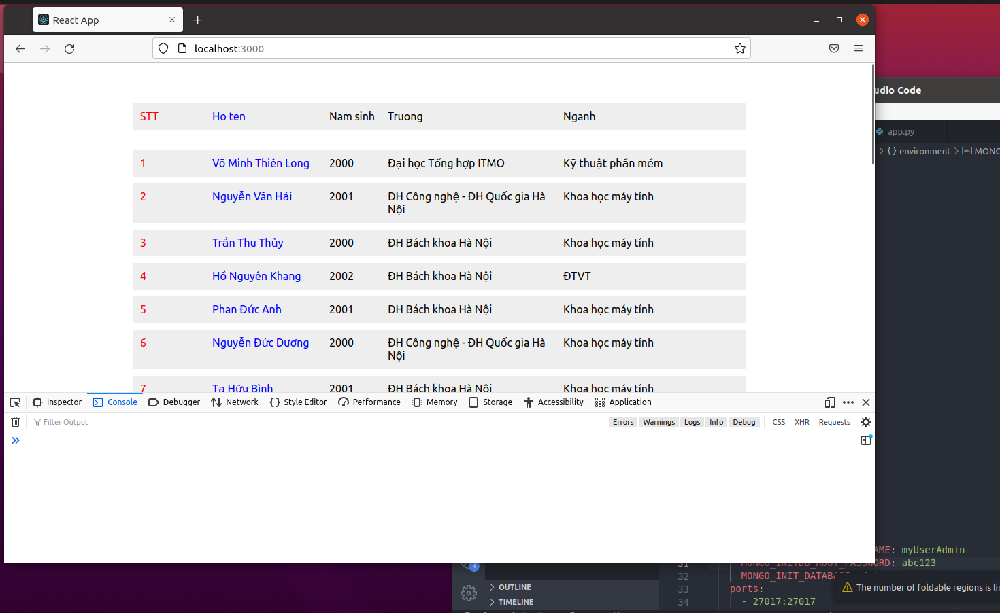

# PRACTICE 3: USING DOCKER-COMPOSE TO BUILD WEB APPLICATION

## Table of contents

- [I. Docker Concept](#i-docker-concept)

- [II. Preparation](#ii-preparation)

- [III. Implementation](#iii-implementation)

- [IV. Answer Question](#iv-answer-question)

- [V. References](#v-references)

---

## I. Docker Concept

- Docker là một nền tảng cho developers và system admin để develop, deploy và run application với container. Nó cho phép tạo các môi trường độc lập và tách biệt để khởi chạy và phát triển ứng dụng và môi trường này được gọi là container. Khi cần deploy lên bất kỳ server nào chỉ cần run container của Docker thì application của bạn sẽ được khởi chạy ngay lập tức.

- Lợi ích của Docker

  - Không như máy ảo Docker start và stop chỉ trong vài giây.

  - Bạn có thể khởi chạy container trên mỗi hệ thống mà bạn muốn.

  - Container có thể build và loại bỏ nhanh hơn máy ảo.

  - Dễ dàng thiết lập môi trường làm việc. Chỉ cần config 1 lần duy nhất và không bao giờ phải cài đặt lại các dependencies. Nếu bạn thay đổi máy hoặc có người mới tham gia vào project thì bạn chỉ cần lấy config đó và đưa cho họ.
  - Nó giữ cho work-space của bạn sạch sẽ hơn khi bạn xóa môi trường mà ảnh hưởng đến các phần khác.

- Dockerfile

  - Dockerfile là file config cho Docker để build ra image. Nó dùng một image cơ bản để xây dựng lớp image ban đầu. Một số image cơ bản: python, unbutu and alpine. Sau đó nếu có các lớp bổ sung thì nó được xếp chồng lên lớp cơ bản. Cuối cùng một lớp mỏng có thể được xếp chồng lên nhau trên các lớp khác trước đó.

  - Các config :

    - FROM — chỉ định image gốc: python, unbutu, alpine…
    - LABEL — cung cấp metadata cho image. Có thể sử dụng để add thông tin maintainer. Để xem các label của images, dùng lệnh docker inspect.
    - ENV — thiết lập một biến môi trường.
    - RUN — Có thể tạo một lệnh khi build image. Được sử dụng để cài đặt các package vào container.
    - COPY — Sao chép các file và thư mục vào container.
    - ADD — Sao chép các file và thư mục vào container.
    - CMD — Cung cấp một lệnh và đối số cho container thực thi. Các tham số có thể được ghi đè và chỉ có một CMD.
    - WORKDIR — Thiết lập thư mục đang làm việc cho các chỉ thị khác như: RUN, CMD, ENTRYPOINT, COPY, ADD,…
    - ARG — Định nghĩa giá trị biến được dùng trong lúc build image.
    - ENTRYPOINT — cung cấp lệnh và đối số cho một container thực thi.
    - EXPOSE — khai báo port lắng nghe của image.
    - VOLUME — tạo một điểm gắn thư mục để truy cập và lưu trữ data.

- Docker compose: Docker compose là công cụ dùng để định nghĩa và run multi-container cho Docker application. Với compose bạn sử dụng file YAML để config các services cho application của bạn. Sau đó dùng command để create và run từ những config đó. Sử dụng cũng khá đơn giản chỉ với ba bước:
  - Khai báo app’s environment trong Dockerfile.
  - Khai báo các services cần thiết để chạy application trong file docker-compose.yml.
  - Run docker-compose up để start và run app.

## II. Preparation

- Chạy các lệnh để cài đặt Docker:

        sudo apt update
        sudo apt install apt-transport-https ca-certificates curl software-properties-common
        curl -fsSL https://download.docker.com/linux/ubuntu/gpg | sudo apt-key add -
        sudo add-apt-repository "deb [arch=amd64] https://download.docker.com/linux/ubuntu bionic stable"
        sudo apt update
        apt-cache policy docker-ce
        sudo apt install docker-ce

- Sau khi cài đặt, bạn có thể cho user hiện tại thuộc group docker, để khi gõ lệnh không cần xin quyền sudo. Logout sau đó login lại để có hiệu lực.

        sudo usermod -aG docker $USER

- Kiểm tra trạng thái cài đặt của Docker

- Ngoài ra khi sử dụng đến thành phần docker-compose thì bạn cài thêm

            sudo curl -L "https://github.com/docker/compose/releases/download/1.29.2/docker-compose-$(uname -s)-$(uname -m)" -o /usr/local/bin/docker-compose
            sudo chmod +x /usr/local/bin/docker-compose
            docker–compose --version

- Kiểm tra version của docker compose

- Và dự án được sử dụng trong bài tập lần này sẽ là 1 chiếc Web hiển thị thông tin các sinh viên tham dự VDT2022 được tạo bằng framework React.
- Cấu trúc thư mục dự án như sau:

## III. Implementation

### 1. Frontend

Trước tiên chúng ta cần tạo 1 file Dockerize.build để xây dựng môi trường bằng cách đưa code trong app vào trong folder "app" để xây dựng các dependencies từ file package.json

    FROM node:14.16-alpine3.10 AS build
    WORKDIR /app
    COPY package*.json ./
    RUN npm install
    COPY . .
    RUN npm run build

Tiến hành chạy file .build

    docker build -f Dockerfile.build -t build .

Tiếp theo, chúng ta sẽ sử dụng image nginx để xây dựng nginx server và triển khai ứng dụng của mình trên server đó.

    FROM nginx:1.22.0-alpine
    COPY --from=build /app/build /usr/share/nginx/html
    COPY nginx.conf /etc/nginx/sites-enabled/default
    EXPOSE 80
    CMD ["nginx", "-g", "daemon off;"]

Chúng ta cần tạo 1 file nginx.conf để đưa nó vào trong container

    server {
    listen 80;
    server_name  localhost;
    location / {
    
        root /usr/share/nginx/html;
        index index.html index.htm;
        try_files $uri /index.html;
    }

}

### 2. Backend

File requirements.txt để python cài đặt những module cần thiết để triển khai

    flask==2.1.2
    flask-cors
    pymongo==4.1.1

Tạo file app.py

    from flask import Flask
    from flask import request
    from pymongo import MongoClient
    from flask_cors import CORS
    from bson.json_util import dumps

    client = MongoClient(
            host='mongo',
            port=27017,
            username='myUserAdmin',
            password='abc123',
            authSource="admin"
    )
    db = client["datasource"]

    app = Flask(__name__)
    CORS(app)

    @app.route("/get_all", methods = ['GET'])
    def get_all():
        try:
            users = db["member"].find()
            return dumps(users)
        except:
            return "Error"

    if __name__ == "__main__":
        app.run(debug=True, host='0.0.0.0', port=5000) 

Dockerfile để build backend

    FROM python:3.9
    WORKDIR /code
    COPY requirements.txt requirements.txt 

    RUN pip install --upgrade pip \
        pip install --no-cache-dir -r requirements.txt
    COPY app.py .
    ENV FLASK_APP=app
    ENV FLASK_RUN_HOST=0.0.0.0 
    EXPOSE 5000
    CMD ["flask","run"]

### 3. Database MongoDB

Trong phần này chúng ta sẽ build image với tài khoản và mật khẩu truy cập là 'myUserAdmin' và 'abc123' rồi sau đó import file .json vào MongoDB. Có thể sử dụng MongoDBCompass hoặc mongosh đều được.

### 4. Docker-compose

Trước khi ghi docker-compose thì cần tạo 1 file là .dockerignore. File này tuy không quan trọng nhưng nó giúp tăng hiệu suất build.

    /node_modules

    /build

    .git

    *.md

    .gitignore

Viết file docker-compose.yml để chạy:

    version: '3'
    networks:
    web-server:
        name: web-server
    services:
    frontend:
        build: frontend
        ports:
        - 3000:80
        depends_on:
        - backend
        networks:
        - web-server

    backend:
        build: backend
        hostname: localhost
        ports: 
        - 5000:5000
        depends_on:
        - mongo
        networks:
        - web-server
    mongo:
        image: mongo:5.0
        container_name: mongo
        restart: unless-stopped
        command: mongod --auth
        environment:
        MONGO_INITDB_ROOT_USERNAME: myUserAdmin
        MONGO_INITDB_ROOT_PASSWORD: abc123
        MONGO_INIT_DATABASE: datasource
        ports:
        - 27017:27017
        networks:
        - web-server

Chạy file docker-compose.yml:

    docker-compose up --build -d

Hình ảnh build thành công sau n lần chỉnh sửa (nên sẽ có những container nó ghi up-to-date)

Kiểm tra trạng thái hoạt động của Docker image

Kiểm tra kết quả tại localhost:3000

## IV. Answer Question

### ARG vs ENV

ARG còn được gọi là biến build-time(chỉ hoạt động trong quá trình build images). Chúng chỉ khả dụng kể từ thời điểm chúng được 'công bố' trong Dockerfile trong câu lệnh ARG cho đến khi image được tạo. Khi chạy container, chúng ta không thể truy cập giá trị của các biến ARG

Các biến ENV cũng có sẵn trong quá trình xây dựng, ngay khi bạn khai báo chúng với một command của ENV. Tuy nhiên, không giống như ARG, khi build xong image, các container chạy image có thể truy cập giá trị ENV này. Các container chạy từ image có thể ghi đè giá trị của ENV.

### COPY vs ADD

Chỉ thị ADD sẽ copy file, thư mục từ vị trí thư mục đang build trên local client hoặc remote files URL và thêm chúng vào filesystem của image.

COPY cũng giống như ADD nhưng không hỗ trợ download các remote file URL từ nguồn web

### CMD vs ENTRYPOINT

CMD thực hiện lệnh mặc định khi chúng ta khởi tạo container từ image, lệnh mặc định này có thể được ghi đè từ dòng lệnh khi khởi tại container.

ENTRYPOINT khá giống CMD đều dùng để chạy khi khởi tạo container, nhưng ENTRYPOINT không thể ghi đè từ dòng lệnh khi khi khởi tại container.

## V. Reference

- [Dockerized React App](https://dzone.com/articles/how-to-dockerize-reactjs-app?fbclid=IwAR32d4kCyg1VwIxbG9xWH-EW3V444wtetbseQ8A8rynee-X-T6SW1M2mDK4)
- [Install Docker-compose](https://phoenixnap.com/kb/install-docker-compose-on-ubuntu-20-04)
- [Docker document](https://docs.docker.com/)
- [Building & Deploying Dockerized Flask + MongoDB Application](https://www.youtube.com/watch?v=RuaKvPq0Fzo)
