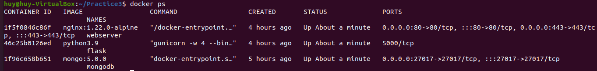
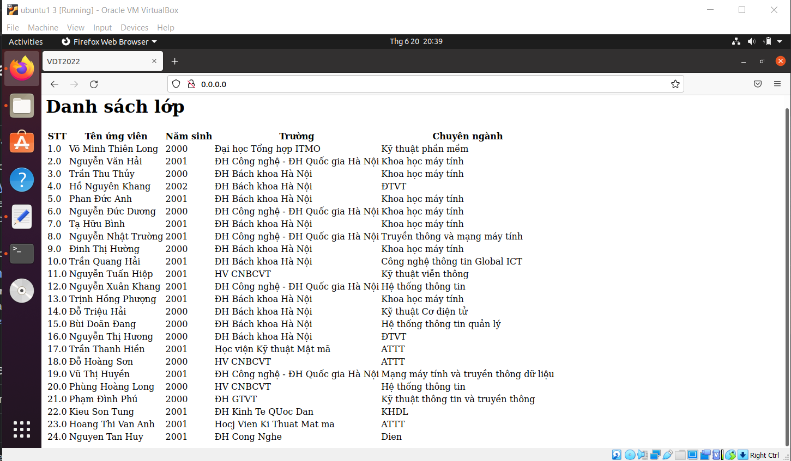

# Bài tập 3
# Đề tài: docker, docker-compose

---

## **Tác giả:** *Nguyễn Tấn Huy* 

---

## **Mục Lục**
## **I. Tổng Quan**
### **1. Containerization**
### **2. Docker**
### **3. Docker-compose**
## **II. Practicing 1**
### **1. ARG vs ENV**
### **2. COPY vs ADD**
### **3. CMD vs ENTRYPOINT**
## **III. Practicing 2**
### **1. Cài đặt docker và docker-compose**
### **2. Cấu hình Nginx**
### **3. Viết file docker-compose.yml**
### **4. Tạo database**
### **5. Tạo file cần chạy app**
### **6. Chạy docker-compose và kiểm tra kết quả**
## **VI. Reference**

---

## **I. Tổng Quan**

### **1. Containerization**
- Containerization là giải pháp ảo hoá, tự động hóa thế hệ mới kế tiếp sau Hypervisor Virtualization, được các hãng công nghệ hàng đầu thế giới như Google, Facebook, Amazon áp dụng rộng rãi, đem lại hiệu quả đột phá với các ưu điểm vượt trội về tốc độ triển khai, khả năng mở rộng, tính an toàn và trải nghiệm người dùng.

### **2. Docker**

- Docker là một nền tảng để cung cấp cách để building, deploying và running ứng dụng dễ dàng hơn bằng cách sử dụng các containers (Trên nền tảng ảo hóa). Ban đầu Docker được viết bằng Python nhưng hiện tại đã chuyển sang Golang.


- So sánh Docker với Virtual Machine:
    - Docker: Dùng chung kernel, chạy độc lập trên Host OS và có thể chạy trên bất kì hệ điều hành nào cũng như cloud. Khởi động và làm cho ứng dụng sẵn sàng chạy trong 500ms, mang lại tính khả thi cao cho những dự án cần sự mở rộng nhanh.
    - Virtual Machine : Cần thêm một Guest OS cho nên sẽ tốn tài nguyên hơn và làm chậm máy thật khi sử dụng. Thời gian khởi động trung bình là 20s có thể lên đến hàng phút, thay đổi phụ thuộc vào tốc độ của ổ đĩa.

- Một số khái niệm cơ bản:

  - **Docker Engine:** là thành phần chính của Docker, như một công cụ để đóng gói ứng dụng

  - **Docker Hub:** là một “github for docker images”. Trên DockerHub có hàng ngàn public images được tạo bởi cộng đồng cho phép bạn dễ dàng tìm thấy những image mà bạn cần. Và chỉ cần pull về và sử dụng với một số config mà bạn mong muốn.

  - **Images:** là một khuôn mẫu để tạo một container. Thường thì image sẽ dựa trên 1 image có sẵn với những tùy chỉnh thêm. Ví dụ bạn build 1 image dựa trên image Centos mẫu có sẵn để chạy Nginx và những tùy chỉnh, cấu hình để ứng dụng web của bạn có thể chạy được. Bạn có thể tự build một image riêng cho mình hoặc sử dụng những image được chia sẽ từ cộng đồng Docker Hub. Một image sẽ được build dựa trên những chỉ dẫn của Dockerfile.

  - **Container:** là một instance của một image. Bạn có thể create, start, stop, move or delete container dựa trên Docker API hoặc Docker CLI.

  - **Docker Client:** là một công cụ giúp người dùng giao tiếp với Docker host.

  - **Docker Daemon:** lắng nghe các yêu cầu từ Docker Client để quản lý các đối tượng như Container, Image, Network và Volumes thông qua REST API. Các Docker Daemon cũng giao tiếp với nhau để quản lý các Docker Service.

  - **Dockerfile:** là một tập tin bao gồm các chỉ dẫn để build một image .

  - **Volumes:** là phần dữ liệu được tạo ra khi container được khởi tạo.

### **3. Docker-compose**

- Docker Compose là một công cụ dùng để định nghĩa và chạy các chương trình Docker sử dụng nhiều container (multi-container). Với Docker Compose, chúng ta sử dụng một file YAML để thiết lập các service cần thiết cho chương trình. Cuối cùng, với một câu lệnh, chúng ta sẽ create và start tất cả service từ các thiết lập đó.


- Những lợi ích khi sử dụng Compose:

- **Tạo ra nhiều môi trường độc lập (isolated environments) trong một host:** Compose cô lập môi trường của các project để đảm bảo chúng không bị xung đột lẫn nhau, cũng như dễ dàng tạo những bản sao của một môi trường nào đó.

- **Chỉ tạo lại các container đã thay đổi:** Compose sẽ nhận biết được các service chưa thay đổi và sử dụng lại các container tương ứng với service đó.

- **Điều chỉnh các biến sử dụng cho các môi trường:** Compose sử dụng các biến trong Compose file cho các môi trường. Vì vậy với môi trường hay người dùng khác nhau, có thể điều chỉnh các biến khi sử dụng Compose để thiết lập các service.

## **II. Bài Tập 1**

- *What are the differences between these instruction?*

  - ARG vs ENV

  - COPY vs ADD

  - CMD vs ENTRYPOINT

### **1. ARG vs ENV**

- `ARG`: Chỉ khả dụng trong quá trình build image (Như trong câu lệnh RUN), không khả dụng sau khi image đã được tạo ra và các container được khởi động từ nó.

- `ENV`: Là các giá trị ENV có sẵn trong container, nhưng cũng có các lệnh RUN được chạy trong quá trình Docker build, bắt đầu xuất hiện và khả năng dùng từ dòng lệnh mà chúng được khai báo. Nếu đặt biến môi trường trong các container trung gian bằng cách sử dụng bash (`RUN export VARI = 5 &&`), thì nó sẽ không tồn tại trong các command tiếp theo.
### **2. COPY vs ADD**

- `COPY` và `ADD` cả hai đều là chỉ dẫn lệnh trong Dockerfile và có mục đích tương tự nhau. Chúng cho phép copy files từ một vị trí được khai báo tới một Docker image.

  - `COPY` lấy giá trị là src và destination. Nó chỉ cho phép bạn copy một local file hoặc trực tiếp từ local host (máy thực hiện building Docker image) tới chính bản thân của Docker image.
    ```
    COPY [--chown=<user>:<group>] <src>... <dest>	       
    COPY [--chown=<user>:<group>] ["<src>",... "<dest>"]
    ```
  - `ADD` cũng cho phép bạn thực hiện giống như COPY nhưng còn hỗ trợ cả 2 loại source khác. Thứ nhất, bạn có thể sử dụng URL thay thế cho một local file/ đường dẫn. Thứ hai, bạn có thể thục hiện giải nén một file tar từ source một cách trực tiếp đến destination.
     ```
    ADD [--chown=<user>:<group>] <src>... <dest>
    ADD [--chown=<user>:<group>] ["<src>",... "<dest>"]
    ```

- Trong hầu hết các trường hợp, nếu bạn sử dụng một URL, bạn sẽ download một file zip và thực hiện sử dụng chỉ dẫn lệnh `RUN` để xử lý nó. Tuy nhiên, bạn cũng có thể sử dụng chỉ dẫn `RUN` với curl để thay thế cho chỉ dẫn `ADD`. Tuy nhiên, nên gộp các chỉ dẫn lệnh RUN xử lý một mục đích lại để giảm kích thước của Docker Image.

- Trường hợp sử dụng hợp lệ của `ADD` là khi bạn muốn thực hiện giải nén một local tar file tới một đường dẫn khai báo trong Docker Image. Điều này là chính xác với những gì Alpine Image thực hiện với ADD rootfs.tar.gz /.

- Nếu bạn thực hiện copy local files tới Docker image thì hãy thường xuyên sử dụng `COPY` bởi vì nó tường minh hơn so với `ADD`.

### **3. CMD vs ENTRYPOINT**
  
- `CMD` thực hiện lệnh mặc định khi chúng ta khởi tạo container từ image, lệnh mặc định này có thể được ghi đè từ dòng lệnh khi khởi tại container.

  - `CMD` cho phép ta set default command.
  - Cú Pháp:
  ```
  CMD ["executable", "param1", "param2"]   (exec form)
		 CMD ["param1", "param2"]  (đặt các tham số mặc định cho ENTRYPOINT ở dạng exec form)
		 CMD command param1 param2   (shell form)
    ```

- `ENTRYPOINT` khá giống CMD đều dùng để chạy khi khởi tạo container, nhưng `ENTRYPOINT` không thể ghi đè từ dòng lệnh khi khi khởi tại container.
  - Lệnh `ENTRYPOINT` cho phép ta cấu hình container sẽ chạy dưới dạng thực thi. Nó tương tự như `CMD` vì cũng cho phép ta chỉ định một lệnh với các tham số. 
  - Cú Pháp:
  ```
  - ENTRYPOINT ["executable", "param1", "param2"] (exec form)
		- ENTRYPOINT command param1 param2 (shell form)
  ```

## **II. Bài Tập 2**
- *Set up a three-tier web application that displays the course attendees' information on the browser using docker-compose.*

- *Base images*
  
  - *nginx:1.22.0-alpine*
  
  - *python:3.9*
  
  - *mongo:5.0*

### **1. Cài đặt docker và docker-compose**
Hướng dẫn [Cài Đặt Docker và Docker-compose](https://thuanbui.me/huong-dan-cai-dat-docker-docker-compose-tren-ubuntu-20-04/)

### **2. Cấu hình Nginx**

Tạo file nginx
```
mkdir nginx
```
Tạo Dockerfile

```
FROM nginx:1.22.0-alpine


COPY conf.d/app.conf /etc/nginx/conf.d/app.conf

EXPOSE 80 443

CMD ["nginx", "-g", "daemon off;"]
```
Tạo file app.conf
```
nano app.conf
```
File app.conf
```
upstream app_server {
    server flask:5000;
}

server {
    listen 80;
    server_name _;
    error_log  /var/log/nginx/error.log;
    access_log /var/log/nginx/access.log;
    client_max_body_size 64M;

    location / {
        try_files $uri @proxy_to_app;
    }

    location @proxy_to_app {
        gzip_static on;

        proxy_set_header X-Forwarded-For $proxy_add_x_forwarded_for;
        proxy_set_header X-Forwarded-Proto $scheme;
        proxy_set_header Host $http_host;
        proxy_buffering off;
        proxy_redirect off;
        proxy_pass http://app_server;
    }
}
```
### **3. Viết file docker-compose.yml**

- Tạo thư mục chứa project và tạo file docker-compose.yml
```
mkdir ~/Practice3
cd Practice3
sudo nano docker-compose.yml
```
- Nội dung file docker-compose.yml
```
version: '3'
services:

  flask:
    build:
      context: app
      dockerfile: Dockerfile
    container_name: flask
    restart: unless-stopped
    image: python3.9
    environment:
      APP_ENV: "prod"
      APP_DEBUG: "False"
      APP_PORT: 5000
    volumes:
      - appdata:/var/www
    depends_on:
      - mongodb
    networks:
      - frontend
      - backend

  mongodb:
    image: mongo:5.0.0
    container_name: mongodb
    restart: unless-stopped
    hostname: test_mongodb
    environment:
      - MONGO_INITDB_DATABASE=flaskdb
      - MONGO_INITDB_ROOT_USERNAME=root
      - MONGO_INITDB_ROOT_PASSWORD=pass
    volumes:
      - ./init-db.js:/docker-entrypoint-initdb.d/init-db.js:ro
    ports:
      - 27017:27017
    networks:
      - backend

  webserver:
    build:
      context: nginx
      dockerfile: Dockerfile
    image: nginx:1.22.0-alpine
    container_name: webserver
    restart: unless-stopped
    environment:
      APP_ENV: "prod"
      APP_NAME: "webserver"
      APP_DEBUG: "true"
      SERVICE_NAME: "webserver"
    ports:
      - "80:80"
      - "443:443"
    volumes:
      - nginxdata:/var/log/nginx
    depends_on:
      - flask
    networks:
      - frontend

networks:
  frontend:
    driver: bridge
  backend:
    driver: bridge

volumes:
  appdata:
    driver: local
  nginxdata:
    driver: local

```
### **4. Tạo database**
 Tạo file json để thêm danh sách lớp

 ```
 nano init-db.js
 ```
 Thêm database
 ```
 db = db.getSiblingDB("flaskdb");
db.student.drop();

db.student.insertMany([
{ "STT" : 1, "Tên ứng viên" : "Võ Minh Thiên Long", "Năm sinh" : "2000", "Trường" : "Đại học Tổng hợp ITMO", "Chuyên ngành" : "Kỹ thuật phần mềm" },
{ "STT" : 2, "Tên ứng viên" : "Nguyễn Văn Hải", "Năm sinh" : "2001", "Trường" : "ĐH Công nghệ - ĐH Quốc gia Hà Nội", "Chuyên ngành" : "Khoa học máy tính" },
{ "STT" : 3, "Tên ứng viên" : "Trần Thu Thủy", "Năm sinh" : "2000", "Trường" : "ĐH Bách khoa Hà Nội", "Chuyên ngành" : "Khoa học máy tính" },
{ "STT" : 4, "Tên ứng viên" : "Hồ Nguyên Khang", "Năm sinh" : "2002", "Trường" : "ĐH Bách khoa Hà Nội", "Chuyên ngành" : "ĐTVT" },
{ "STT" : 5, "Tên ứng viên" : "Phan Đức Anh", "Năm sinh" : "2001", "Trường" : "ĐH Bách khoa Hà Nội", "Chuyên ngành" : "Khoa học máy tính" },
{ "STT" : 6, "Tên ứng viên" : "Nguyễn Đức Dương", "Năm sinh" : "2000", "Trường" : "ĐH Công nghệ - ĐH Quốc gia Hà Nội", "Chuyên ngành" : "Khoa học máy tính" },
{ "STT" : 7, "Tên ứng viên" : "Tạ Hữu Bình", "Năm sinh" : "2001", "Trường" : "ĐH Bách khoa Hà Nội", "Chuyên ngành" : "Khoa học máy tính" },
{ "STT" : 8, "Tên ứng viên" : "Nguyễn Nhật Trường", "Năm sinh" : "2001", "Trường" : "ĐH Công nghệ - ĐH Quốc gia Hà Nội", "Chuyên ngành" : "Truyền thông và mạng máy tính" },
{ "STT" : 9, "Tên ứng viên" : "Đinh Thị Hường", "Năm sinh" : "2000", "Trường" : "ĐH Bách khoa Hà Nội", "Chuyên ngành" : "Khoa học máy tính" },
{ "STT" : 10, "Tên ứng viên" : "Trần Quang Hải", "Năm sinh" : "2001", "Trường" : "ĐH Bách khoa Hà Nội", "Chuyên ngành" : "Công nghệ thông tin Global ICT" },
{ "STT" : 11, "Tên ứng viên" : "Nguyễn Tuấn Hiệp", "Năm sinh" : "2001", "Trường" : "HV CNBCVT", "Chuyên ngành" : "Kỹ thuật viễn thông" },
{ "STT" : 12, "Tên ứng viên" : "Nguyễn Xuân Khang", "Năm sinh" : "2001", "Trường" : "ĐH Công nghệ - ĐH Quốc gia Hà Nội", "Chuyên ngành" : "Hệ thống thông tin" },
{ "STT" : 13, "Tên ứng viên" : "Trịnh Hồng Phượng", "Năm sinh" : "2001", "Trường" : "ĐH Bách khoa Hà Nội", "Chuyên ngành" : "Khoa học máy tính" },
{ "STT" : 14, "Tên ứng viên" : "Đỗ Triệu Hải", "Năm sinh" : "2000", "Trường" : "ĐH Bách khoa Hà Nội", "Chuyên ngành" : "Kỹ thuật Cơ điện tử" },
{ "STT" : 15, "Tên ứng viên" : "Bùi Doãn Đang", "Năm sinh" : "2000", "Trường" : "ĐH Bách khoa Hà Nội", "Chuyên ngành" : "Hệ thống thông tin quản lý" },
{ "STT" : 16, "Tên ứng viên" : "Nguyễn Thị Hương", "Năm sinh" : "2000", "Trường" : "ĐH Bách khoa Hà Nội", "Chuyên ngành" : "ĐTVT" },
{ "STT" : 17, "Tên ứng viên" : "Trần Thanh Hiền", "Năm sinh" : "2001", "Trường" : "Học viện Kỹ thuật Mật mã", "Chuyên ngành" : "ATTT" },
{ "STT" : 18, "Tên ứng viên" : "Đỗ Hoàng Sơn", "Năm sinh" : "2000", "Trường" : "HV CNBCVT", "Chuyên ngành" : "ATTT" },
{ "STT" : 19, "Tên ứng viên" : "Vũ Thị Huyền", "Năm sinh" : "2001", "Trường" : "ĐH Công nghệ - ĐH Quốc gia Hà Nội", "Chuyên ngành" : "Mạng máy tính và truyền thông dữ liệu" },
{ "STT" : 20, "Tên ứng viên" : "Phùng Hoàng Long", "Năm sinh" : "2000", "Trường" : "HV CNBCVT", "Chuyên ngành" : "Hệ thống thông tin" },
{ "STT" : 21, "Tên ứng viên" : "Phạm Đình Phú", "Năm sinh" : "2000", "Trường" : "ĐH GTVT", "Chuyên ngành" : "Kỹ thuật thông tin và truyền thông" },
{ "STT" : 22, "Tên ứng viên" : "Kieu Son Tung", "Năm sinh" : "2001", "Trường" : "ĐH Kinh Te QUoc Dan", "Chuyên ngành" : "KHDL" },
{ "STT" : 23, "Tên ứng viên" : "Hoang Thi Van Anh", "Năm sinh" : "2001", "Trường" : " Hocj Vien Ki Thuat Mat ma", "Chuyên ngành" : "ATTT" },
{ "STT" : 24, "Tên ứng viên" : "Nguyen Tan Huy", "Năm sinh" : "2001", "Trường" : "ĐH Cong Nghe", "Chuyên ngành" : "Dien" },
]);
 ```

### **5. Tạo file cần chạy app:**
Tạo file requirements.txt
```
nano app/requirements.txt
```
Nội dung
```
flask
pymongo
```
Tạo file app.py với nội dung:
```
from flask import Flask, render_template
from pymongo import MongoClient
application = Flask(__name__)


def get_db():
    client = MongoClient(host='test_mongodb',
                         port=27017, 
                         username='huy', 
                         password='1',
                        authSource="admin")
    db = client.flaskdb
    return db

@application.route('/')
def get_stored_student():
    db=""
    try:
        db = get_db()
        _student = db.student.find()
        return render_template('index.html', todos= _student)
    except:
        pass
    finally:
        if type(db)==MongoClient:
            db.close()


if __name__ == "__main__":
    application.run(host='0.0.0.0', port=5000)

```
Tạo Dockerfile
```
FROM python:3.9

WORKDIR /var/www

COPY . /var/www

RUN pip install --no-cache-dir -r requirements.txt
RUN pip install gunicorn


EXPOSE 5000

CMD [ "gunicorn", "-w", "4", "--bind", "0.0.0.0:5000", "wsgi"]
```
Tạo file wsgi.py
```
from app import application
if __name__ == "__main__":
  application.run()
```
Tạo file index.html
```
<!DOCTYPE html>
<html lang="en">
<head>
    <meta charset="UTF-8">
    <title>FlaskApp</title>
    <style>
        .todo {
            padding: 20px;
            margin: 10px;
            background-color: #eee;
        }
    </style>
</head>
<body>
    <h1>Danh sách lớp</h1>
    <table>
        <tr><td>STT</td><td>Tên ứng viên</td><td>Năm sinh</td><td>Trường</td><td>Chuyên ngành</td></tr>
        
        <tr><td> {{ todo['STT'] }} </td><td> {{ todo['Tên ứng viên']}} </td><td> {{ todo['Năm sinh']}} </td><td> {{ todo['Trường']}} </td><td> {{ todo['Chuyên ngành']}} </td></tr>
            <!--<p>{{ todo['STT'] }} <i>{{ todo['Tên ứng viên']}}</i> <i>{{ todo['Năm sinh']}}</i> <i>{{ todo['Trường']}}</i> <i>{{ todo['Chuyên ngành']}}</i></p> -->
        
    </table>
    </div>
```
Tạo file wsgi.py để chạy Gunicorn
```
from app import application
if __name__ == "__main__":
  application.run()
```
### **6. Chạy docker-compose và kiểm tra kết quả**

```
docker-compose up -d
```

- Kiểm tra hoạt động:
```
docker ps
```

- Kết quả: 



## **IV. Reference**
- [How To Set Up Flask with MongoDB and Docker](https://www.digitalocean.com/community/tutorials/how-to-set-up-flask-with-mongodb-and-docker)

- [Install and set up docker on ubuntu 20.04](https://www.digitalocean.com/community/tutorials/how-to-use-ansible-to-install-and-set-up-docker-on-ubuntu-20-04)