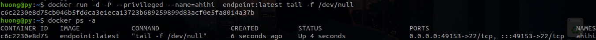
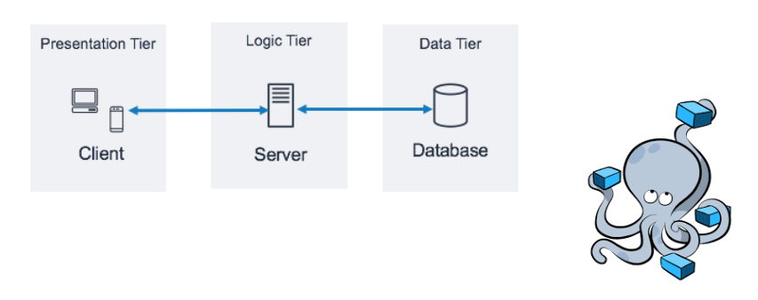
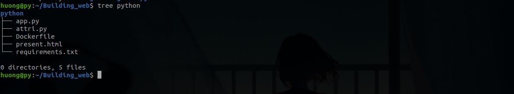
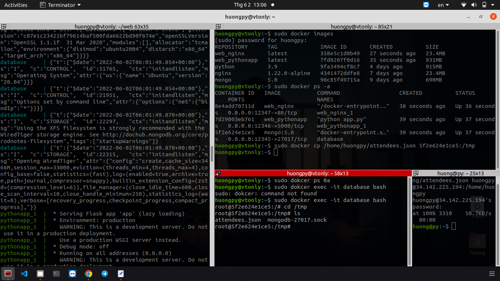
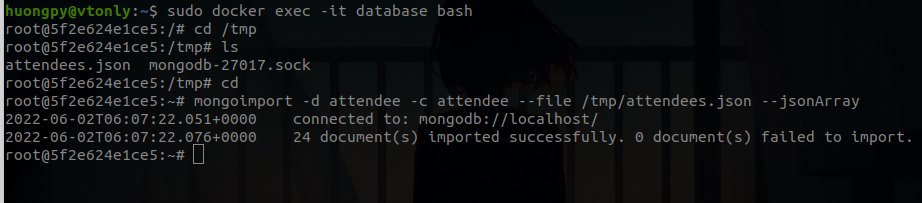
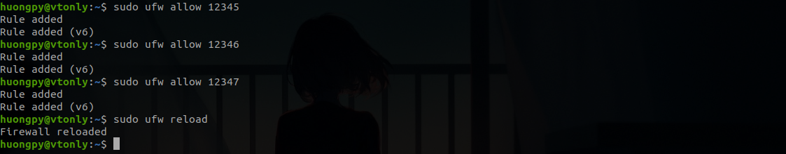
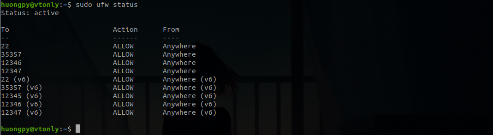
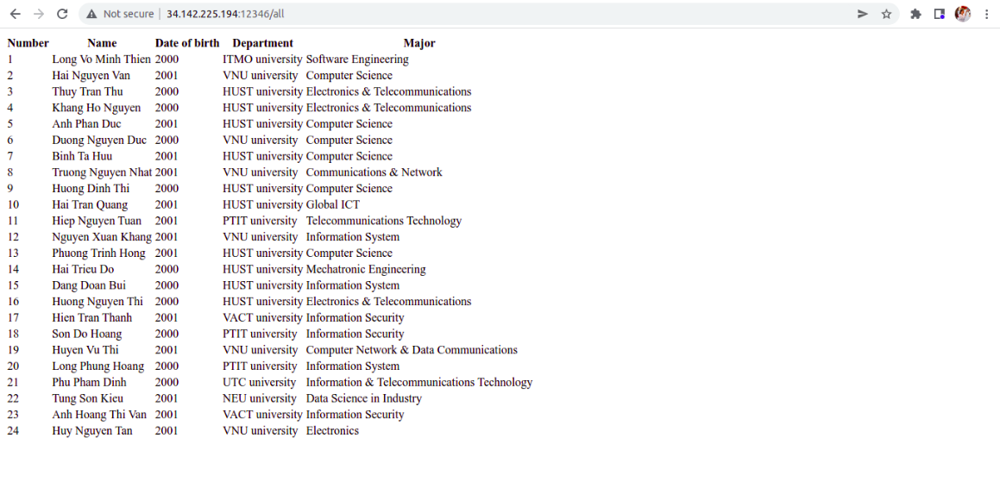

# Using Docker compose to build a 3-tiers web application

## Content 
  - [Content]()
  - [I. Overview]()
  - [II. Configuration to create 3 tiers]()
  - [III. Docker compose up ]()
  - [References]()

---

## I. Overview

Initially, I would like to express my thankfulness to all mentors and other attendees that help me understand this subject as well as fix silly bugs. :kissing_closed_eyes:

**1. Docker**  

- Docker is an open platform for developing, shipping, and running applications. Docker enables you to separate your applications from your infrastructure thus you can deliver software quickly.
- Image is a read-only template with instructions for creating a Docker container. In general, an image is based on another image, with some additional customization. For example, you may build an image which is based on the ubuntu image, but installs the Apache web server and your application, as well as the configuration details needed to make your application run. 
- Below gives an example of a Docker file to build an image which is based on ubuntu image and installs ssh.
```
	FROM ubuntu

	RUN apt-get update && apt-get install -y openssh-server
	RUN mkdir /home/practice2/sshd
	RUN echo 'root:password' | chpasswd
	RUN sed -i 's/PermitRootLogin prohibit-password/PermitRootLogin yes/' /etc/ssh/sshd_config
	RUN sed 's@session\s*required\s*pam_loginuid.so@session optional pam_loginuid.so@g' -i /etc/pam.d/sshd
	EXPOSE 22
	CMD ["/usr/sbin/sshd", "-D"]
```
- The DockerFile below contains various steps/instructions that will build the container:

  - FROM – Defines the ubuntu base image to use.
  - RUN – Executes commands in a new layer on the top of the base image.
  - CMD – CMD allows you to run the commands. There are two ways in which commands are executed either via exec or using shell formats.
  - EXPOSE – Informs Docker that the container listens on the specified network ports at runtime. The container will be exposed on port 22.
- Use "docker build" command to compile the Dockerfile.

```
	docker build --network host -t endpoint:latest .
```

  -   We use --network to ensure that we use localhost network to get access to the Internet and pull Ubuntu image from DockerHub as well as install ssh (1 số máy khi cài docker thì không tự dùng card mạng trên máy host để kết nối internet). -t to assign name (endpoint) and tag (lastest) to this image. And, the dot in the end allows Docker to pick all the necessary files from the present working directory. The result we received:
  
  
  
- A container is a runnable instance of an image. You can create, start, stop, move, or delete a container using the Docker API or CLI. You can connect a container to one or more networks, attach storage to it, or even create a new image based on its current state. 
- The command below instructs Docker to create and run the container called "ahihi" using the "endpoint" newly built image that I created in previous step.

```
	docker run -d -P --privileged --name=ahihi  endpoint:latest tail -f /dev/null
```
- Let's look at the previous command 

      -d: Run container as deamon
      -P: publish all ports defined in the Dockerfile as random ports.
      --privileged: grants a Docker container root capabilities to all devices on the host system
      --name: name of the container 
      endpoint:lastest: the image we have just built
      -f /dev/null: to prevent container form being completed, we have to add a futily job to it. 
  - And, here is the result: 
  
   
  
**2. Docker compose**

- Docker Compose is an orchestration tool for container-based applications, comprised of, or reliant on, multiple, loosely connected services. Unlike cluster-based orchestration tools, like Kubernetes or Swarm, Docker Compose is designed to orchestrate on a single Docker host. This provides a software developer with a significant benefit; the ability to better mimic a complete application environment, when developing their service or application. Additionally, because of the light nature of containers, and the orchestration capabilities inherent in Docker Compose, it enables developers to be more productive, as they iterate through a code-build-test cycle.
- A developer defines the components or dependencies of an application, and their configuration, using YAML syntax, in a file usually called docker-compose.yml. The service components, as they’re called, can then be manipulated individually, or collectively, through Docker Compose’s rich command line interface (CLI).

**3. Three-tiers web application**

- A 3-tier application architecture is a modular client-server architecture that consists of a presentation tier, an application tier and a data tier. The data tier stores information, the application tier handles logic and the presentation tier is a graphical user interface (GUI) that communicates with the other two tiers. The three tiers are logical, not physical, and may or may not run on the same physical server.

   
   
- Presentation tier: This tier, which is built with HTML5, cascading style sheets (CSS) and JavaScript, is deployed to a computing device through a web browser or a web-based application. The presentation tier communicates with the other tiers through application program interface (API) calls.
- Application tier: The application tier, which may also be referred to as the logic tier, is written in a programming language such as Java and contains the business logic that supports the application's core functions.
- Data tier: The data tier consists of a database and a program for managing read and write access to a database. This tier may also be referred to as the storage tier and can be hosted on-premises or in the cloud. Popular database systems for managing read/write access include MySQL, PostgreSQL, Microsoft SQL Server and MongoDB.

- I would like to be candid that this is the first time I have learnt about how to build a web application. Therefore, I build a web app as expeditious as possible. :disappointed:
- In this lab, I use: 
  - nginx:1.22.0-alpine as based image to build a container to listen to Python app.
  - python:3.9 plays a role as locgic tier.
  - mongo:5.0 consists of a database (class attendees that will be present on the browser later).
  
## II. Step by step

**1. Presentation tier**
-  First, I create a nginx configuration file, which consists of essential configuration that allows a container listen to python app.
- This file begins with four directives:
  - user
  - worker_processes
  - error_log
  - pid
```
user nginx;

worker_processes 1;

error_log /var/log/nginx/error.log warn;

pid /var/run/nginx.pid;

events {

. . .

}

http {

. . .

}
```
- The http block includes directives for web traffic handling, which are generally known as universal . That’s because they get passed on to each website configuration served by NGINX.
```
http {
    include       /etc/nginx/mime.types;
    default_type  application/octet-stream;

    log_format  main  '$remote_addr - $remote_user [$time_local] "$request" '
                      '$status $body_bytes_sent "$http_referer" '
                      '"$http_user_agent" "$http_x_forwarded_for"';

    access_log  /dev/stdout main;
    access_log off;
    keepalive_timeout 65;
    keepalive_requests 100000;
    tcp_nopush on;
    tcp_nodelay on;

```
- Below is my server block. The listen directive informs NGINX of the hostname/IP and TCP port, so it recognizes where it must listen for HTTP connections. In my case, the listen port is 80.

```
server 
{

	listen 80 default_server;

	listen [::]:80 default_server;
	proxy_pass_header Server;
}
```
- Next, location block. NGINX’s location setting helps us set up the way in which NGINX responds to requests for resources inside the server. Location directives apply to requests for certain folders and files.
```
location 
{
	proxy_set_header Host $host;
	proxy_set_header X-Real-IP $remote_addr;
	proxy_pass http://python:5000/;
}
```
- Since we have a nginx configuration file, we only to write a Dockerfile to set up these configuration. 
```
FROM nginx:1.22.0-alpine
COPY nginx.conf /etc/nginx/nginx.conf
```
- In this Dockerfile, we pull nginx:1.22.0-alpine from Dockerhub as it is my requirement. :sweat_smile: 
- Then, copy the previously created configuration file to the directory that contains default nginx.conf file.

**2. Logic tier**

- Database configuration: This file defines attributes of mongo database. 
```

config = 
{
    'db': 'attendee',
    'host': 'mongodb',
    'port': 27017
}

def get_config():
    return config
```
- Create a app.py file: 
```
import config
from flask import jsonify, render_template, request, Flask
from flask_mongoengine import MongoEngine
app = Flask(__name__)
app.config['MONGODB_SETTINGS'] = config.get_config() # gets attributes of mongo database
db = MongoEngine()
db.init_app(app)

# Define a class
class Attendee(db.Document):
    number = db.IntField()
    name = db.StringField()
    yob = db.StringField()
    major = db.StringField()
    university = db.StringField()

# Define http request in URL. When a GET request  is sent to app_url/all, it returns funtion below (function: all)
@app.route('/all', methods=['GET'])
def all():
    attendees= list(Attendee.objects.all())
    attendees.sort(key=lambda x: x.number)
    return render_template('present.html', attendees=attendees) # html file to present, you can see the present html file in my folder.

if __name__ == '__main__':
    app.run(host='0.0.0.0', port=5000)
```
- Write a Dockerfileto build container.
```
FROM python:3.9
RUN mkdir /python
WORKDIR /python
COPY ./requirements.txt requirements.txt
RUN pip install --no-cache-dir -r requirements.txt

COPY . .
ENTRYPOINT [ "python", "app.py" ]
EXPOSE 5000
```
- Here is my working directory: 

   
   
- In this Dockerfile, I use RUN, CMD and ENTRYPOINT. Let me show you how different they are: 
  - RUN: allows you to install your application and packages required for it. It executes any commands on top of the current image and creates a new layer by committing the results. Often you will find multiple RUN instructions in a Dockerfile.
  - CMD: allows you to set a default command, which will be executed only when you run container without specifying a command. If Docker container runs with a command, the default command will be ignored. If Dockerfile has more than one CMD instruction, all but last CMD instructions are ignored.
  - ENTRYPOINT: allows you to configure a container that will run as an executable. It looks similar to CMD, because it also allows you to specify a command with parameters. The difference is ENTRYPOINT command and parameters are not ignored when Docker container runs with command line parameters. (There is a way to ignore ENTTRYPOINT, but it is unlikely that you will do it.)
- ENV and ARG: ENV is for future running containers. ARG for building your Docker image. 
- COPY and ADD: 
  - COPY is a docker file command that copies files from a local source location to a destination in the Docker container.
  - ADD command is used to copy files/directories into a Docker image.
-  Lastly, the required libraries is list in the requirements.txt
```
Jinja2
flask
flask_mongoengine
dnspython
```
**3. Data tier**

 - I convert datasource.xlsx file, which contains attendee's information to json type and lately, import it to mongodb. 
 

## III. Docker Compose up

- The last task is write docker-compose.yml file to create containers.
```
version: '3.0' # mine only support version 2.2 to 3.0

services:
  python:
    build: python/
    ports:
      - 12346:5000
  nginx:
    build: nginx/
    restart: always
    ports:
      - 12347:80
    depends_on:
      - python
  mongodb:
    image: mongo:5.0
    container_name: mongo
    ports:
      - 12345:27017
```
- By settup firewall in port 12345, 12346, 12347 we can get access to mongo:5.0, python app and nginx on localhost.
- After writing the docker-compose.yml file, to create containers, run " docker-compose up".
- To verifify the created images and containers, type: "docker images" and "docker ps -a" in your terminal.
    
    
- Now, we import database to mongodb. First, copy attendees.json file to mongo container:
```
docker cp /home/huongpy/Building_web/mongo/attendees.json<container-name-or-id>:/tmp
```

   
    
- Now login to mongo container to check nao:
```
docker exec -it bash
```
    
    
- Import database to mogo server: 
```
mongoimport -d <db-name> -c <c-name> --file /tmp/attendees.json
```
- You can import database in localhost by this command:
```
docker exec <container-name-or-id> mongoimport -d <db-name> -c <c-name> --file /tmp/attendees.json
```
- Finally, set up firewall and rejoice =))

    
    
    
    
        

## References

- [Docker compose example](https://docs.docker.com/compose/gettingstarted/)
- [Execute mongoimport on a Docker Container](https://stackoverflow.com/questions/49895447/i-want-to-execute-mongoimport-on-a-docker-container)
- [Three Tier Architecture in Docker](https://mundanecode.com/posts/three-tier-architecture-in-docker/)
- [Docker compose specification](https://docs.docker.com/compose/compose-file/)
- [Docker document](https://docs.docker.com/)


